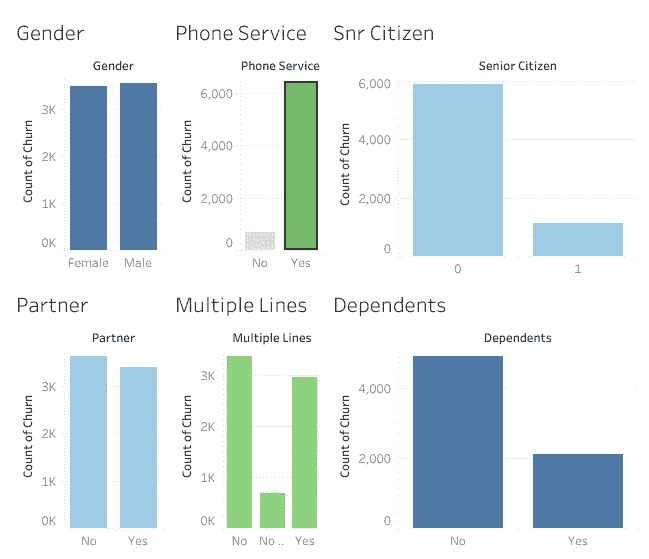
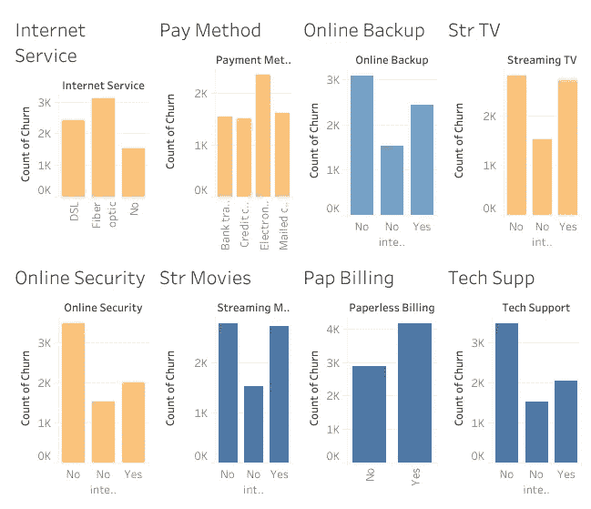
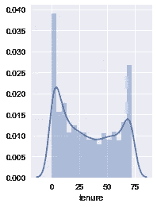
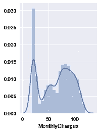

# 电信客户流失预测

> 原文：<https://towardsdatascience.com/telco-customer-churn-prediction-72f5cbfb8964?source=collection_archive---------8----------------------->

## 为流失预测建立机器学习模型


Photo by [Carlos Muza](https://unsplash.com/@kmuza?utm_source=unsplash&utm_medium=referral&utm_content=creditCopyText) on [Unsplash](https://unsplash.com/s/photos/data?utm_source=unsplash&utm_medium=referral&utm_content=creditCopyText)

客户流失，也称为客户流失，发生在客户停止与公司做生意或停止使用公司的服务时。通过了解和监控流失率，公司能够确定他们的客户保持成功率，并确定改进策略。我们将使用机器学习模型来理解准确的客户行为和属性，这些行为和属性标志着客户流失的风险和时机。

**了解我们的数据集:**

我们将使用 Kaggle 的电信客户流失数据集。原始数据集包含 7043 个条目。所有条目都有几个特征和一列说明客户是否搅拌过。
为了更好地理解数据，我们将首先把它加载到 pandas 中，并在一些非常基本的命令的帮助下探索它。

```
import numpy as np
import pandas as pd
from sklearn.preprocessing import MinMaxScaler
from sklearn.cluster import KMeans
import matplotlib.pyplot as plt 
import seaborn as sns%matplotlib inline
from sklearn.model_selection import train_test_split#Loading the data
df = pd.read_csv(r’...Churn\telco_customer.csv’) df.info() <class ‘pandas.core.frame.DataFrame’> 
RangeIndex: 7043 entries, 0 to 7042 
Data columns (total 21 columns): 
customerID 7043 non-null object 
gender 7043 non-null object 
SeniorCitizen 7043 non-null int64 
Partner 7043 non-null object
Dependents 7043 non-null object
tenure 7043 non-null int64 
PhoneService 7043 non-null object 
MultipleLines 7043 non-null object 
InternetService 7043 non-null object 
OnlineSecurity 7043 non-null object 
OnlineBackup 7043 non-null object 
DeviceProtection 7043 non-null object 
TechSupport 7043 non-null object 
StreamingTV 7043 non-null object 
StreamingMovies 7043 non-null object 
Contract 7043 non-null object 
PaperlessBilling 7043 non-null object 
PaymentMethod 7043 non-null object 
MonthlyCharges 7043 non-null float64 
TotalCharges 7043 non-null object 
Churn 7043 non-null object 
dtypes: float64(1), int64(2), object(18) memory usage: 1.1+ MB
```

df.info()为我们提供了每一列的详细信息。我们可以看到我们的数据分为三种类型；

*   对象:对象格式意味着变量是分类的。我们数据集中的分类变量包括:客户 ID、性别、合作伙伴、家属、电话服务、多条线路、互联网服务、在线安全、在线备份、设备保护、技术支持、流媒体电视、流媒体电影、合同、无纸化账单、支付方式、总费用和客户流失。
*   int64:代表整数变量。老年公民和终身职位都是这种格式。
*   float64:表示包含一些小数值的变量。它们也是数字变量。在我们的数据集中，这种格式只有一个变量，即每月费用。

**探索性数据分析**

本节的目标是熟悉我们的数据。我们将进行双变量分析。这是分析数据的最简单的形式，我们检查每个变量与流失率的关系。对于分类特征，我们可以使用频率表或柱状图来计算特定变量中每个类别的数量。对于数字特征，概率密度图可用于查看变量的分布。

分类变量的所有可视化将在 tableau public 中完成。



从上面的柱状图可以得出以下推论:

男性和女性的流失率几乎相等。

老年人的流失率更高。

拥有电话服务的客户流失率更高。

与没有合作伙伴&家属的客户相比，有合作伙伴和家属的客户流失率较低。

与其他支付方式相比，使用电子支付方式的客户流失率更高。

没有互联网服务的客户流失率较低。

光纤互联网服务的流失率要高得多。没有 OnlineSecurity、OnlineBackup 和 TechSupport 等服务的客户在过去的一个月里离开了该平台。

现在让我们看看数字变量。

```
plt.figure(1), plt.subplot(121), sns.distplot(df['tenure']);
plt.figure(1), plt.subplot(121), sns.distplot(df['MonthlyCharges']);
plt.figure(1), plt.subplot(121), sns.distplot(df['TotalCharges']);
```



**资料准备&特色工程:**

这部分是机器学习的基础部分。如果这一部分做得不好，我们的模型就不会工作。在这一节中，我们将通过删除不相关的数据、处理丢失的值以及将变量转换为适当的数据类型来清理数据集。

处理无关数据和缺失值

在我们的数据集中，我们可以看到我们的模型不需要客户 ID，所以我们删除了变量。我们不需要处理缺失值，因为该数据集中没有缺失值。

```
df.drop([‘customerID’], axis=1, inplace=True)
```

将分类数据转换为数字数据

机器学习只处理数值。因此，我们需要将我们的分类值转换成数值。通过使用熊猫函数“get_dummies()”，我们可以用“gender_Female”和“gender_Male”替换性别列。我们将使用 df.info()向我们展示哪些是分类的，哪些是数字的。

```
df.info()<class ‘pandas.core.frame.DataFrame’> 
RangeIndex: 7043 entries, 0 to 7042
Data columns (total 21 columns): customerID 7043 non-null object 
gender 7043 non-null object 
SeniorCitizen 7043 non-null int64 
Partner 7043 non-null object 
Dependents 7043 non-null object 
tenure 7043 non-null int64 
PhoneService 7043 non-null object
MultipleLines 7043 non-null object
InternetService 7043 non-null object 
OnlineSecurity 7043 non-null object 
OnlineBackup 7043 non-null object 
DeviceProtection 7043 non-null object 
TechSupport 7043 non-null object 
StreamingTV 7043 non-null object 
StreamingMovies 7043 non-null object 
Contract 7043 non-null object 
PaperlessBilling 7043 non-null object 
PaymentMethod 7043 non-null object 
MonthlyCharges 7043 non-null float64 
TotalCharges 7043 non-null object 
Churn 7043 non-null object 
dtypes: float64(1), int64(2), object(18) memory usage: 1.1+ MB
```

从上面的结果中，我们可以看到数据类型为 object 的变量需要转换为 numerical。

```
df = pd.get_dummies(df, columns = [‘gender’, ‘Partner’,   ‘Dependents’,’PhoneService’,’MultipleLines’,’InternetService’,
‘OnlineSecurity’,’OnlineBackup’,’DeviceProtection’,’TechSupport’,’StreamingTV’,‘StreamingMovies’,’Contract’,’PaperlessBilling’,’PaymentMethod’,’Churn’], drop_first = True)
```

使用 df.info()来检查我们所有的变量是否都被转换为适当的数据类型是明智的。在这一步之后，我注意到 total charges 仍然有一个 object 数据类型。因此，我将使用 pd.numeric()函数将其转换为浮点数。

```
df[‘TotalCharges’] = pd.to_numeric(df.TotalCharges, errors = ‘coerce’)
df.drop([‘TotalCharges’], axis = 1, inplace = True)
```

分割数据集。

首先我们的模型需要被训练，其次我们的模型需要被测试。因此，最好有两个不同的数据集。至于现在我们只有一个，相应拆分数据是很常见的。x 是自变量的数据，Y 是因变量的数据。测试大小变量决定了数据的分割比例。在 80 的训练/ 20 的测试比例中这样做是很常见的。

```
df[‘Churn_Yes’] = df[‘Churn_Yes’].astype(int)
Y = df[“Churn_Yes”].values
X = df.drop(labels = [“Churn_Yes”],axis = 1)
# Create Train & Test Data
from sklearn.model_selection import train_test_split
X_train, X_test, y_train, y_test = train_test_split(X, Y, test_size=0.2, random_state=101)
```

# 逻辑回归和模型测试

让我们制作第一个模型来预测目标变量。我们将从用于预测二元结果的逻辑回归开始。

我们将使用 scikit-learn (sklearn)来制作不同的模型，这是 Python 的一个开源库。它是最有效的工具之一，包含许多可用于 Python 建模的内置函数。

```
from sklearn.linear_model import LogisticRegression
model = LogisticRegression()
result = model.fit(X_train, y_train)
```

数据集分为训练和验证两部分。让我们从 sklearn 导入 LogisticRegression 和 accuracy_score 并拟合逻辑回归模型。

```
from sklearn import metrics
prediction_test = model.predict(X_test)# Print the prediction accuracy
print (metrics.accuracy_score(y_test, prediction_test))
```

0.800567778566

因此，我们的预测几乎 81%准确，也就是说，我们已经正确识别了 80%的流失率。因此，为了减少流失并及时采取正确的预防措施，我们想知道哪些独立变量对我们的预测结果影响最大。因此，我们将模型中的系数设置为零，并查看每个变量的权重。

```
 weights = pd.Series(model.coef_[0],
 index=X.columns.values)
weights.sort_values(ascending = False)
```

结果如下:

```
InternetService_Fiber optic 0.800533 
PaperlessBilling_Yes 0.417392 
PaymentMethod_Electronic check 0.293135 
StreamingTV_Yes 0.267554 
MultipleLines_Yes 0.253773 
SeniorCitizen 0.247112 
StreamingMovies_Yes 0.197304 
MultipleLines_No phone service 0.120019 
PaymentMethod_Mailed check 0.019744 
gender_Male 0.018991 
MonthlyCharges 0.004611 
Partner_Yes 0.000535 
DeviceProtection_Yes -0.021993 
tenure -0.035615 
StreamingTV_No internet service -0.095143 
TechSupport_No internet service -0.095143 
DeviceProtection_No internet service -0.095143 
StreamingMovies_No internet service -0.095143 
OnlineBackup_No internet service -0.095143 
OnlineSecurity_No internet service -0.095143 
InternetService_No -0.095143 
PaymentMethod_Credit card (automatic) -0.156123 
Dependents_Yes -0.182597 
OnlineBackup_Yes -0.190353 
OnlineSecurity_Yes -0.335387 
TechSupport_Yes -0.337772 
PhoneService_Yes -0.551735 
Contract_One year -0.591394 
Contract_Two year -1.257341 
dtype: float64
```

可以观察到，一些变量与我们预测的变量成正相关，而一些变量则成负相关。负值的客户表明他们不太可能流失，而正值的客户表明他们可能流失。这些

我写的大部分内容都让我忙于自己的创业公司 analyx。
期待听到你的经历:)