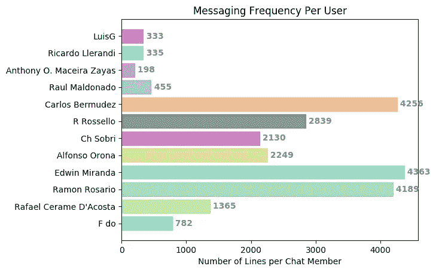

# Python 中的远程门户分析

> 原文：<https://towardsdatascience.com/telegramgate-analysis-in-python-457d4a36164e?source=collection_archive---------18----------------------->

## [深度分析](https://medium.com/towards-data-science/in-depth-analysis/home)

## 处理 889 页聊天信息

Photo by [Alex George](https://unsplash.com/@lgeorge210?utm_source=medium&utm_medium=referral) on [Unsplash](https://unsplash.com?utm_source=medium&utm_medium=referral)

2019 年 7 月 13 日，889 页的电报聊天组对话被泄露，其中包括波多黎各总督里卡多·罗塞罗和其他 11 人，一些现任政府雇员和其他人。这段聊天从 2018 年 11 月 30 日持续到 2019 年 1 月 20 日，在世界各地的波多黎各人中引起了极大的愤慨，抗议随之而来。这种情况被命名为 telegramgate，基于性质类似的[水门事件](https://en.wikipedia.org/wiki/Watergate_scandal)。

当我通过其他人对脸书和新闻的解释了解到这一事件以及州长所做的声明时，我认为我最好亲自阅读 PDF，看看这些声明的背景是什么，以及我是否认为它们确实值得愤怒(它们确实如此)。当我发现这份文件长达 889 页时，我的第一个想法是…

I can’t even read all my emails, you think I am reading 889 pages of chat conversations?

我决定用 Python 做一个项目来分析 telegramgate 的对话。我将在这里用第一人称复数描述我遵循的过程。

本文中讨论的代码可以在我的 GitHub 帐户中的一个名为`analyze_telegramgate`的存储库中找到:

 [## meramos/analyze_telegramgate

### 波多黎各总督里基·罗塞罗和他的政府同事之间的电报信息的 NLP 分析…

github.com](https://github.com/meramos/analyze_telegramgate) 

# 开发要求

我们在 Ubuntu 中使用了 Python 3 和 Jupyter Notebook。使用了以下软件包:

*   [Tika](https://pypi.org/project/tika/) :允许您在 Python 中使用 [Apache Tika](https://tika.apache.org/) 。Tika 是一个用 Java 开发的工具包，它可以从各种不同的文件格式中检测和提取元数据和文本。我们使用它是为了从 Telegramgate PDF 文件中提取文本。通过在计算机终端上运行`pip3 install tika`来安装它。
*   [Re](https://docs.python.org/3/library/re.html) :该模块提供正则表达式匹配的操作。这个模块是 Python 自带的。我们在预处理中使用它来识别和删除与对话无关或不重要的数据，如时间戳和链接。默认情况下，Python 附带了它。
*   [PDFKit](https://github.com/JazzCore/python-pdfkit) :允许您从不同来源创建 PDF 文件，包括 HTML。我们用它创建了一个 telegramgate PDF 文件的节略版本。通过运行`pip3 install pdfkit`安装这个包。您还必须安装`wkhtmltopdf`以便从 HTML 文件创建 PDF。在 Ubuntu 操作系统中，你可以通过运行`sudo apt-get install wkhtmltopdf`来安装它。

# 预处理

处理文本时，了解原始文档结构、了解某些部分的含义以及它们与文档内容的相关性非常重要。

为了处理文档，我们首先使用 Tika 读取它，然后使用正则表达式删除文本中各种不重要的部分。

## 阅读 PDF

首先，我们使用 Tika 阅读 telegramgate PDF 文档(你可以在这里下载)，并预览前 200 个字符。

## 清洁 PDF

我们注意到文档中有很多新行，所以我们使用字符串方法`.strip()`删除它们，现在`pdf_content`的前 399 个字符如下所示:

[注意到行“lComo se col6 eso？”是对《Como se coló eso》的误读。Tika 错误地读了一些颠倒的标点符号和重音字母，例如，它读为“as 6”和“as f”。我们在本文中没有提出解决方法。]

日期“1/20/2019”和文本“Telegram Web”出现在每一页的开头，这很可能意味着电报对话是在那个日期下载的，即 2019 年 1 月 20 日。在每一页的末尾都有一个[电报 URL](https://web.telegram.org/#/im?p=s1209505337_15413785455230905639) 和你在 PDF 所有页面中的页面。我们可以使用页码来跟踪 PDF 中出现消息的页面，所以我们应该保留它。但是应该去掉每页顶部的日期和文本“Telegram Web”以及底部的链接，这对分析没有用。

测试正则表达式的一个好地方是 https://regex101.com/。

有各种与任何消息都不一致的时间戳。
我们将假设消息发送的时间对分析不重要，因此将被删除。

学习`pdf_content`的时候，你可能会注意到有很多两个字母的缩写。从查看 PDF，你可以告诉很多这两个字母的缩写对应的聊天成员没有个人资料图片。这些首字母缩略词对文档的分析没有用，但是我们不应该试图删除它们，直到我们知道谁是参与聊天的成员。我们将在下一节“组织内容”中删除它们，在这一节中，我们将确定谁是管理员聊天成员。

## 从 PDF 的内容创建列表

在这些步骤之后，我们无法从纯文本中删除更多的字符串，所以我们通过用新行分隔字符串来从`pdf_content`中创建一个列表，并开始提取信息。

现在我们准备组织数据。

# 组织内容

为了组织/构建 PDF 中的信息，我们决定识别聊天成员以及每个成员发送了哪些消息。

我们可以使用文本格式来自动识别聊天中出现的所有成员，但我们无法读取包含格式的 PDF 文档(我们使用 [Tika CLI](https://tika.apache.org/1.5/gettingstarted.html) 和标签 xml 和 html 读取它，但都没有保留 PDF 的原始格式)。

因此，我们必须满足自动识别管理员和手动识别其他成员的要求(请随意评论我们可以从 PDF 中自动检索非管理员聊天成员的方式)。

## 识别管理聊天成员

当检查 PDF 的纯文本时，我们注意到包含管理员用户名的行包含术语“admin”。我们隔离包含这个术语的行，以便识别聊天中的管理员用户。

现在，我们通过删除文本“admin”及其后面的文本来清除这些结果。

有些管理员用户是重复的，区别仅在于文本“via@gif”。我们删除了包含这段文字的内容，因为这些内容是多余的。

当检查结果列表时，您会发现有两个元素很可能是输入错误(Tika 误读了用户名)。这些元素是“Fdo”和“R Russello”。我们删除了这些元素，得到了管理员聊天成员的最终列表。

被误读的用户名仍然存在于文档中。我们用正确的拼写替换它们。

该聊天组共有 8 名管理员成员。管理成员如下:

*   [**Ch Sobri**](https://www.linkedin.com/in/christian-sobrino-vega-538142135/)(Christian Sobrino):他是波多黎各财政机构和金融咨询局(AAFAF)的执行董事。2019 年 7 月 13 日，在聊天信息被泄露后，他辞去了在波多黎各政府的各种职务([来源](https://www.elnuevodia.com/noticias/locales/nota/christiansobrinorenunciaatodossuscargos-2505312/))。
*   卡洛斯·贝尔穆德斯:他是州长的通讯顾问。2019 年 7 月 13 日退出。他是聊天内容泄露后第一个退出的聊天群成员([来源](https://www.elnuevodia.com/noticias/locales/nota/carlosbermudezrenunciaasupuestocomoasesordelgobernadorydelacomisionadaresidente-2505305/))。
*   拉斐尔·塞拉米·德·阿科斯塔 :也是州长的通讯顾问。他不再与政府保持任何合同。
*   [**埃德温·米兰达**](https://www.linkedin.com/in/edwinmiranda/):KOI 的首席执行官。州长的公关和亲密合作者。
*   福·多(埃利亚斯·桑切斯·西方特):前总督在金融监督和管理委员会的代表。
*   [**拉蒙·罗萨里奥**](https://www.linkedin.com/in/ramon-r-b033a2178/) :前公共事务和公共政策秘书(2017 年 1 月至 2018 年 12 月)。在泄露消息的时间范围内，他并没有为政府工作。
*   **R 罗塞罗**(里卡多罗塞罗):波多黎各总督，2017 年 1 月 2 日至今。
*   [**Alfonso Orona**](https://www.linkedin.com/in/alfonso-orona-42270386/) :前任法律顾问(2017 年 1 月至 2019 年 2 月担任 La Fortaleza 首席法律官)。

## 识别非管理员聊天成员

根据 PDF 的第一行，上面写着“WRF 12 名成员”，这个聊天组一共有 12 名成员。这意味着群组中有 4 个非管理员聊天成员。浏览 PDF 后，我们发现剩下的 4 个聊天成员是:

*   劳尔·马尔多纳多
*   安东尼·马塞拉·扎亚斯
*   里卡多·列兰迪
*   路易斯格

不幸的是，我们无法在 Python 脚本中提取这些信息。我们将把这些用户名和管理员用户名一起添加到一个总聊天成员的综合列表中。

这不是欺骗…

## 删除两个字母的用户名缩写

现在我们知道了谁是聊天成员，我们可以删除与一些没有个人资料照片的聊天成员相关的两个字母的缩写。我们为用户建立所有可能的缩写。

现在我们有了潜在的首字母缩略词，我们搜索`pdf_lines`中的哪些元素只包含其中一个首字母缩略词，并删除那些行。

## 组织

现在来吃肉！

我们创建一个字典列表(我们称之为`conversation`)，其中每个字典元素都有以下键:

*   `message`:聊天中发送的消息。
*   `chat_member`:发送消息的聊天成员。
*   `date`:发送信息的日期(周、月、日、年)。
*   `page_number`:PDF 中显示消息的页面。

我们使用包含聊天成员用户名的行作为谁发送了哪条消息的指示器。这些行不包括在最终列表中，因为它们不是对话的一部分。

# 设想

随着数据的清理和组织，我们可以创建一些可视化来展示数据洞察力。

我们决定创建一个水平条形图，其中每个条形对应一个聊天组成员，条形的长度代表一个聊天成员发送的消息数量。

我们选择了不同的颜色，所以我们随机生成颜色，并为每个聊天成员分配不同的颜色。

如果您正在运行此代码，并且您不喜欢生成的颜色，请随意重新运行代码并创建不同的颜色，或者手动为每个用户定义您想要的颜色。

我们获得每个聊天成员的消息数量，并将它们存储到一个字典中，其中的关键字是用户名，值是消息数。

我们使用 matplotlib 绘制条形图。

下面是生成的图表:

从图中我们可以看到埃德温·米兰达发送的信息最多。这可能是因为他在聊天群里分享了很多新闻文章并对其进行了评论，从 PDF 中可以看出这一点。

# 简略电报门

我们决定创建一个简短的 telegramgate PDF 文档，看看该文档可以缩短多少，以及聊天内容是否可以以更清晰、更直接的格式显示。生成的 PDF 不包含图像或 gif，也不能区分共享帖子和书面帖子。

为了创建 PDF，我们首先使用变量`conversation`中的内容创建一个 HTML 格式的字符串。我们写下页码、在前面部分中为可视化生成的颜色中的用户名，以及用户发送的消息。我们没有写邮件发送的日期。创建 HTML 字符串后，我们将它保存到本地文件夹中的一个文件中，命名为“telegramgate _ abridged.html”。然后我们使用 PDFkit Python 库从 HTML 文件创建 PDF 文件，我们将结果保存到“telegramgate _ abridged.pdf”。

生成的 PDF 有 654 页长，而原始文档有 899 页。这意味着新的 PDF 比原来少了 245 页。

我们选择对用户名进行颜色编码，以便于区分是谁写的消息。当用户名具有相同的长度和颜色时，它们可以在视觉上融合在一起。如果您希望创建不带彩色用户名的 PDF，您可以通过删除添加在 for 循环中的`font`标签来实现。

你可以在这里访问这个脚本[生成的 PDF。](https://github.com/meramos/analyze_telegramgate/blob/master/telegramgate_abridged.pdf)

# 结论

在本文中，我们用 Python 做了以下工作:

*   使用 Tika 阅读 telegramgate PDF 文档
*   通过删除与聊天内容无关的文本来清理数据，我们通过使用各种定制的正则表达式来识别这些文本
*   通过将 PDF 内容存储在字典数组中来组织 PDF 内容，其中每个字典包含要发送的邮件、发送邮件的用户、邮件出现的页面以及邮件发送的日期
*   从 PDF 内容中检索和可视化见解
*   创建了一个 telegramgate PDF 的节略版(用户名以颜色区分)，长达 654 页(比原始文档少 245 页)

通过这个练习，我们证明了我们可以通过编程来学习 telegramgate 文档。这一点很重要，因为在阅读文档时，我们对内容的解释会因我们的核心信念而异。我们也可能将某些言论归咎于错误的人。我们需要一种方法来排除分析文档时的人为偏见。

可以在文本中进行更复杂的分析，例如内容文本摘要、文本分类和情感分析。

从劳尔·马尔多纳多的儿子在他的推特账户上发表的一份声明中，暗示聊天组中存在超过 889 页的对话，这可能最终会被披露([来源](https://www.elnuevodia.com/noticias/locales/nota/raulmaldonadohijodejaentreverqueelchatdetelegramsobrepasalas889paginas-2505692/))。我们可以使用这里开发的代码来分析新内容。

您是否有任何想法可以从 Telegramgate 文档中提取更多见解?Leave them in a comment below!

# 参考资料

## Resources for telegramgate information:

1.  [Telegramgate PDF: 889 页](https://assets.documentcloud.org/documents/6192552/Chat.pdf)
2.  [#TelegramGate: Leaks From a Private Group Chat Leave Rosselló Administration Exposed](https://www.latinorebels.com/2019/07/09/telegramgate/)
3.  下一篇 : 新的一天:Christian Sobrino 辞去所有职务
4.  [新的一天:卡洛斯·贝穆德斯辞去州长和驻地专员的顾问职务](https://www.elnuevodia.com/noticias/locales/nota/carlosbermudezrenunciaasupuestocomoasesordelgobernadorydelacomisionadaresidente-2505305/)
5.  下一篇 : 新的一天:Rafael Cerame 确认他没有与政府签订任何合同
6.  新的一天:劳尔·马尔多纳多儿子透露,电报聊天超过 889 页
7.  下一篇 : Telemundo:ElíasSánchez 声称他们对他进行了抹黑
8.  [LinkedIn: Christian Sobrino Vega](https://www.linkedin.com/in/christian-sobrino-vega-538142135/)
9.  [LinkedIn: Rafael Cerame](https://www.linkedin.com/in/rafael-cerame-10b606b/)
10.  [LinkedIn: 埃德温·米兰达](https://www.linkedin.com/in/edwinmiranda/)
11.  [LinkedIn: Ramon R.(T21 )](https://www.linkedin.com/in/ramon-r-b033a2178/)
12.  [LinkedIn: Alfonso Orona](https://www.linkedin.com/in/alfonso-orona-42270386/)

## 技术资源:

1.  阿帕奇·提卡(Apache Tika) T25
2.  [PyPI: Tika library](https://pypi.org/project/tika/)
3.  正则表达式 101 (T29)
4.  [GitHub: Python-PDFKit](https://github.com/JazzCore/python-pdfkit)
5.  [Stackoverflow:在 Python 中生成随机的十六进制颜色](https://stackoverflow.com/questions/13998901/generating-a-random-hex-color-in-python)
6.  [PythonSpot: Matplotlib 条形图](https://pythonspot.com/matplotlib-bar-chart/)
7.  [Stackoverflow:如何用 pyplot.barh()显示每个条形上条形的值？](https://stackoverflow.com/questions/30228069/how-to-display-the-value-of-the-bar-on-each-bar-with-pyplot-barh)
8.  [Stackoverflow:为什么我的 xlabel 在我的 matplotlib 剧情中被切断了？](https://stackoverflow.com/questions/6774086/why-is-my-xlabel-cut-off-in-my-matplotlib-plot)