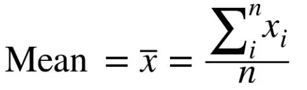
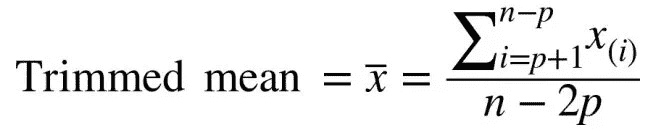
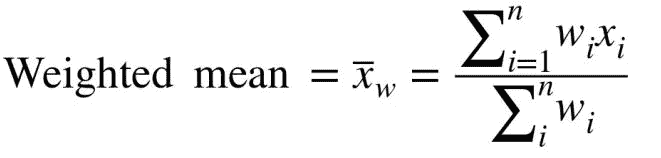
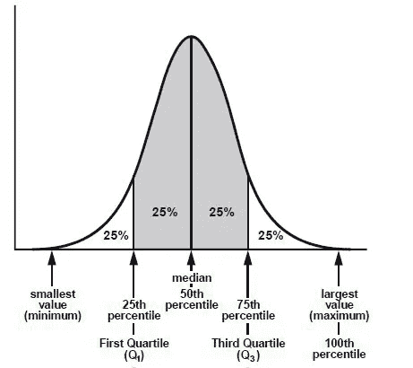
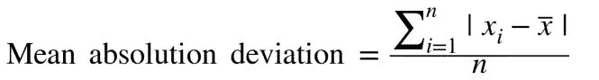
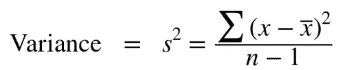
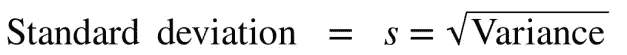

# 用数字讲述描述性统计的全部故事！

> 原文：<https://towardsdatascience.com/telling-the-full-story-of-descriptive-statistics-with-numbers-c91ce1c66e09?source=collection_archive---------15----------------------->

From Pinterest

统计可以证明任何事情，甚至是事实！所以真正理解它至关重要。统计学处理大量数据的收集、分析、解释和呈现。描述性统计与总结我们收集的分析信息的方法有关。描述性统计可以通过图形分析(如柱状图、饼状图等)和/或数字分析(本文一定会涉及)来实现。所以回到讲述我们的故事，为了有一个真实的叙述，我们必须谈论两个措施；

1.  集中趋势的度量
2.  可变性的度量

这篇文章触及了这些度量的各种估计，并强调了它们对**异常值**的稳健性(即敏感性)。在对这些估计的直觉进行适当解释后，将使用“python 编程”执行实施。如果这些概念一开始有点难以理解，尝试两次或更多次，这样你的误解就有统计学意义了！😀。

一些术语的快速定义将使我们扬帆起航:

*   异常值:具有非常低或非常高的值的观察值，这些值往往与其他值存在异常的距离。异常值可能是由于测量中的可变性(包括进一步的调查)或它可能表明实验误差(可能需要从数据集中排除)。
*   分配:某物在一群人之间分配或在一个地区传播的方式。
*   顺序统计:基于从最小到最大排序的数据值的度量。

***注意:本文中要考虑的这些措施都是通过 python 实现的。我选择使用一种依赖于“numpy”的方法，所以所有的技术在某种程度上都是一致的。使用的代码和数据集的链接可以在这里*******找到，代码嵌入在文末供参考。****

*让我们深入研究上面概述的两个措施，好吗？*

**

*From Pinterest*

1.  ***集中趋势的度量**:集中趋势的度量是代表数据集中心点的汇总统计，这很重要，因为一个变量可能有数千个不同的值，我们希望估计我们的大部分数据位于何处。这些度量表示分布中大多数值的位置(即分布的中心)，您也可以将其视为数据围绕中间值聚集的趋势。我们将在本文中介绍的一些中心位置估计包括*

*   *平均*
*   *修整平均值*
*   *加权平均数*
*   *中位数*
*   *加权中位数*
*   *方式*

**

*Photo by [Hasan Albari](https://www.pexels.com/@hasanalbari?utm_content=attributionCopyText&utm_medium=referral&utm_source=pexels) from [Pexels](https://www.pexels.com/photo/close-up-photo-of-dart-pins-on-dartboard-1424745/?utm_content=attributionCopyText&utm_medium=referral&utm_source=pexels)*

***Mean** :这是对中心位置最基本的估计，也称为平均值。这是算术平均值，意味着它是所有值的总和除以值的个数。平均值的计算需要数据集中的所有值，因此值的任何变化都会影响平均值的计算。因此容易受到极高或极低的值(异常值)的影响。它在数学上表示为*

**

***修整平均值**:这是平均值的一种变体，它是一种在计算平均值之前去除最大值和最小值的一小部分(称为截断)的平均方法。移除指定的异常值观察值后，使用标准算术平均公式计算出修整后的平均值。这有助于消除极值(异常值)的影响。它在数学上表示为*

**

***加权平均值**:这是平均值的一种变化，计算方法是将每个数据值乘以一个权重，然后除以权重之和。当我们发现简单意味着我们使用相等的权重，那么为什么你会低估或高估一个变量呢？当一些值高度可变并可能导致低准确性时，可能会考虑变量的权重不足，而后者可能会在特定群体代表性不足时发生，因此我们在分析中采用权重过高的方法来捕捉它们的重要性。它在数学上表示为*

**

***Median**:Median 是在有序统计中将数据集分成两半的中间值。如果有偶数个数据，中间值实际上并不在数据集中，而是将排序后的数据分为上下两半的两个值的平均值。中位数对异常值是稳健的。*

***加权中值:**出于同样的原因，我们使用“加权平均值”，可以计算加权中值。这仅仅是当相关的权重被应用于排序的数据时。代替中间数，加权中值是一个值，使得排序列表的下半部分和上半部分的权重之和相等。加权平均值对异常值也是稳健的。*

***模式**:模式是数据集中出现频率较高的值。如果没有值重复，则数据没有模式，这通常出现在连续值中(但是您可以通过定位概率分布图上的最大值来找到连续数据的模式)，这就是为什么模式用于分类数据，而通常不用于数值数据。*

*2.分散程度的衡量:集中趋势的衡量只是故事的一部分，它总结了我们收集的信息以供分析。离差的度量简单地描述了数据集在中心位置的分散程度，显示了值是如何紧密聚集或分散的。它也被称为可变性的度量。因此，我们需要比集中趋势更多的信息来充分讲述描述性统计的全部故事。我们将在本文中介绍的一些中心位置估计包括:*

*   *范围*
*   *四分位间距*
*   *平均绝对偏差*
*   *差异*
*   *标准偏差*
*   *中位数绝对偏差*

**

*Photo by [Jason Hogan](https://unsplash.com/@jasonhogan?utm_source=medium&utm_medium=referral) on [Unsplash](https://unsplash.com?utm_source=medium&utm_medium=referral)*

***范围**:数据集中最大值和最小值之差。这个范围很容易理解，也很容易计算，但并没有真正给出可变性的印象。此外，值得注意的是，由于其计算考虑了极值，因此对异常值不具有鲁棒性。*

***四分位距**:为了充分理解这一点，我们必须谈谈数据分割。数据分段就是将订单统计数据分成相等的部分。通常，我们有三种相互关联的细分类型；*

*I .百分位数(将数据集分成 100 等份)*

*二。十分位数(将数据集分成 10 等份)*

*三。四分位数(将数据集分成 4 等份)*

*现在回到四分位数范围，正如我们已经知道的，它将数据集分成四个相等的部分。让我们直观地看看这种分割*

**

*对于该图，可以观察到，顺序统计的分布被分成四个相等的部分，分别包含 25%的数据集。从图中还可以看出，第二个四分位数(Q2)相当于第 50 个百分位数，这都意味着数据集的中间值(即中位数)。*

*四分位数范围就是第三个四分位数和第一个四分位数之间的差值。*

***平均绝对偏差:**在我们深入研究这个问题之前，有必要真正理解“偏差”的真正含义。偏差仅仅是观察值和中心趋势度量的估计值(无论是平均值、中值等)之间的差异，描述了观察值如何偏离中心。*

*所以，平均绝对偏差是偏离平均值的绝对值。事实上，偏差的总和等于零(因为负值抵消了正值)。最终值为零说明不了什么！所以取偏差的绝对值会得到一个非零的答案，我们可以用它来描述分布的离差。*

*它在数学上可以表示为*

**

***方差:**在这里，我们仍然使用偏离平均值的值，如“平均绝对偏差”中突出显示的，但是在方差中，我们不取这些偏差的绝对值，而是取其平方。这归功于这样一个事实:在统计学中，平方值比绝对值更方便。因此，方差是与平均值偏差的平方和除以 n-1，其中 n 是数据值的数量。它在数学上可以表示为*

**

*****标准偏差:**从方差中可以看出，对偏差求平方将导致巨大的单位为平方的最终结果，因此为了补偿这一点，开发了标准偏差。想象一下，处理' $ '可能真的会令人困惑，但标准偏差更容易解释，因为它与原始数据集的比例相同。标准差是方差的平方根。它在数学上可以表示为***

******

*****中位数绝对偏差(MAD):** 到目前为止，除了 IQR 之外，我们考虑的所有离差度量都包含了所有用于计算的值，因此容易受到异常值的影响。中值绝对偏差是对变异性的稳健估计，因为它处理的是中值。中位数绝对偏差是偏离中位数的绝对值。它在数学上可以表示为***

******

*****代码*****

***总之，我们已经看到了人物、场景、情节、冲突和解决方案，讲述了描述性统计的故事，并强调了关于异常值鲁棒性的各种措施，以及如何通过 python 实现。***

# *****感谢阅读！🙌*****