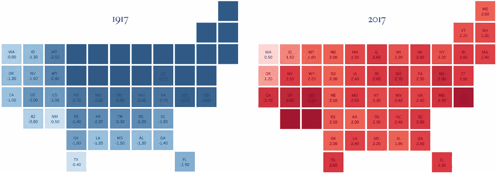

# 过去 100 多年的温度

> 原文：<https://towardsdatascience.com/temperatures-over-the-last-100-years-80da88ec75c3?source=collection_archive---------11----------------------->

Readings: °F different from long-term average

他的可视化探索了美国过去 100 多年的气温变化。尽管美国无疑正在变暖，但各州之间和每年之间仍存在显著差异。在上面的可视化地图中，每个数据都显示为某一年某个州的平均温度与该州过去 118 年的平均温度之差。深蓝色表示今年比平均气温低得多，而深红色表示今年比平均气温高得多。下面的视频显示了 1900 年至 2017 年美国大陆气温平均值的偏差。

也许从这种形象化中最容易发现的是缺乏一个清晰的趋势。是的，在 20 世纪 90 年代，越来越多的州开始被染成深红色，但是凉爽的年代并没有消失。1998 年创下了美国有史以来最热的一年的记录，然后这个记录在 2006 年、2012 年、2015 年、2016 年和 2017 年被超过。然而，在此期间的其他年份，如 2008 年、2009 年、2013 年和 2014 年，平均气温仅略高于长期平均水平。同样，每年在州一级也很难确定一个明确的趋势。没有明显的相关性表明一个州异常温暖的一年预示着下一年同样的州也会变暖。这方面唯一明确的趋势是，温暖或凉爽的年份往往影响地区，而不是独立的国家。例如，阿拉巴马州的年平均温度远低于平均温度，很可能密苏里州和佐治亚州也记录了低于平均温度的温度。

尽管如此，这种可视化所揭示的一些趋势仍然令人不安。在过去的 20 年里，美国每年的气温都高于平均水平。自 1900 年以来，已经有 20 年超过 90%的州气温高于平均水平，其中 16 个州是自 1990 年以来。美国大陆的每个州都有 10 年高于平均温度的记录——其中 9 次发生在过去的 20 年里。如果这 10 个异常年份随机分布在 1900-2017 年期间，那么这 10 年中有 9 年会在过去 20 年中着陆的概率约为 6000 万分之一。

在全国平均气温异常高的年份，大多数州的气温也高于平均气温，这往往是事实。这意味着，近年来出现的全国平均气温偏高，通常是集体高温的结果，而不是几个异常州造成的平均值。

当然，这种可视化忽略了一些重要的趋势。一个显著的例子是一年内的温度峰值。气候变化的一个显著影响是极端和不稳定天气模式的增加。比方说俄勒冈州在某一年夏天记录了极高的温度，然后在冬天记录了极低的温度。夏季的高温可能会在全州范围内引发毁灭性的野火，冬季的冰冻可能会大大增加能源使用量并影响旅行。在这个想象中，那些极端将会消失，那一年将会被记录为平淡无奇。

[**点击此处查看完整互动数据可视化**](https://public.tableau.com/views/Visualization_15615021804530/Visualization?:embed=y&:display_count=yes&:origin=viz_share_link)

*这些数据是从国家海洋和大气管理局的国家环境信息中心收集的。*