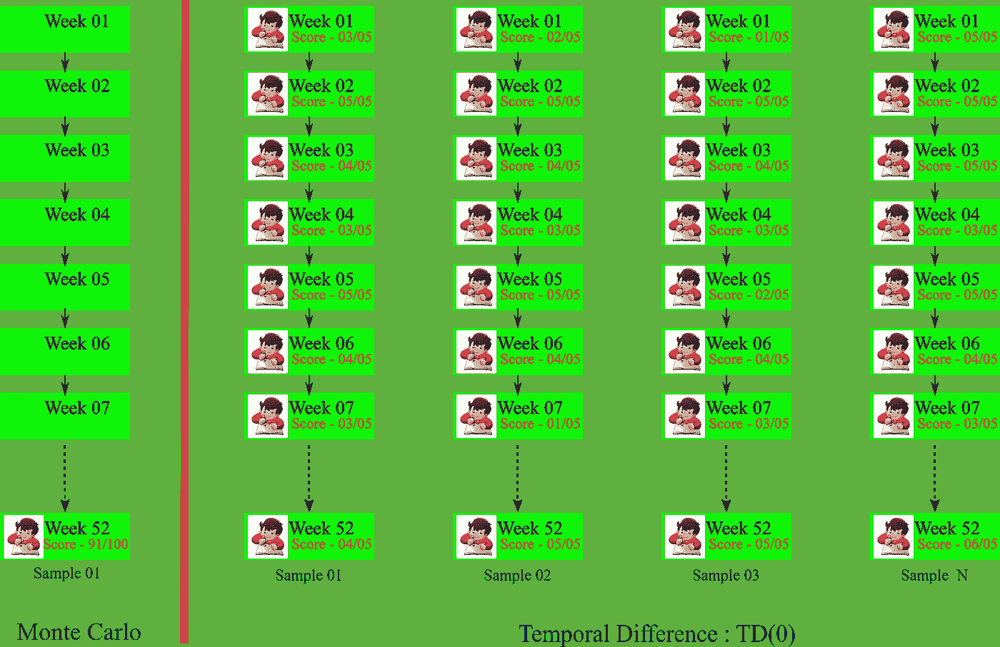
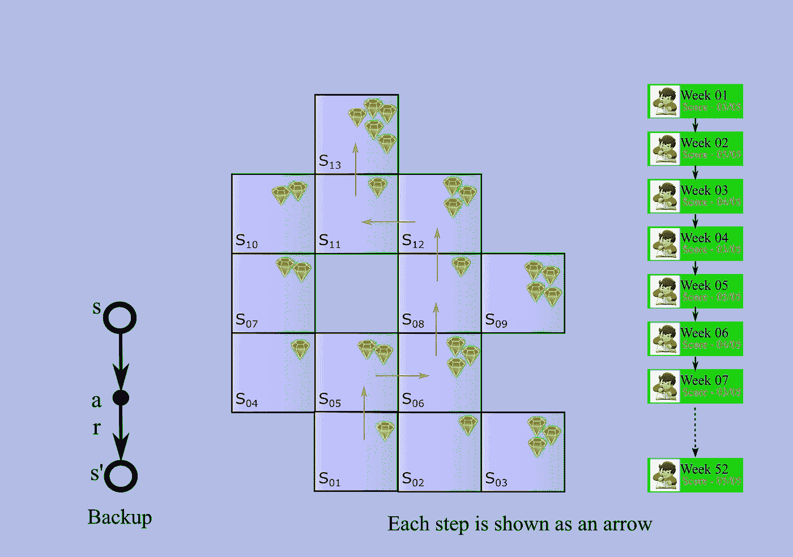
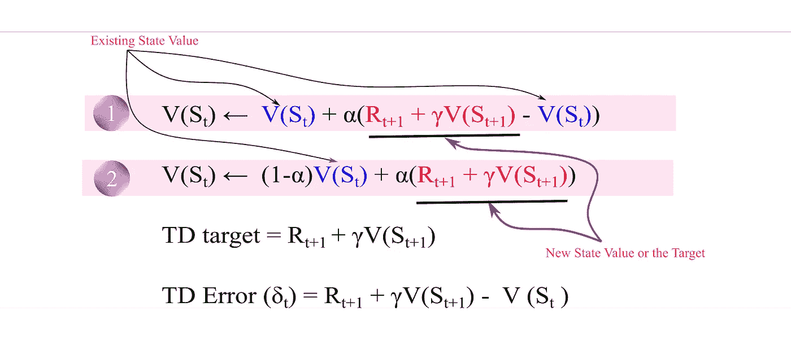
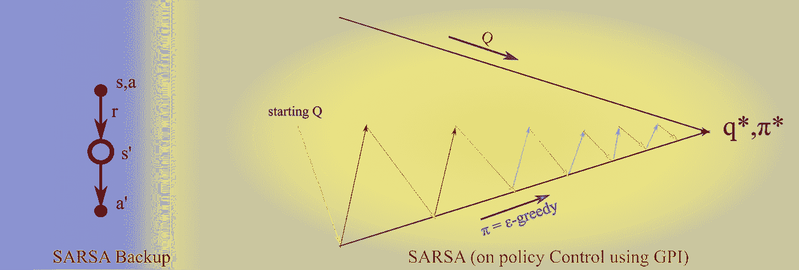
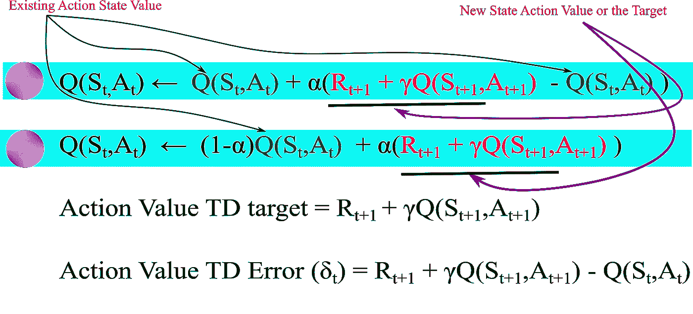
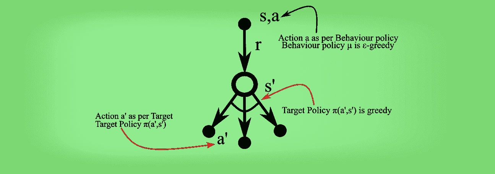
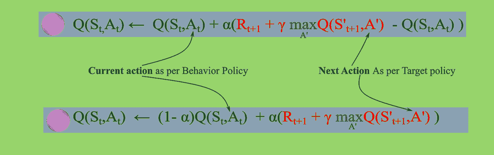
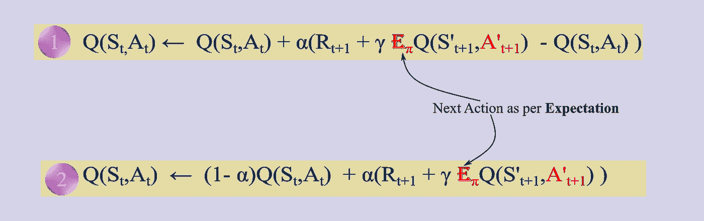

# 时差学习

> 原文：<https://towardsdatascience.com/temporal-difference-learning-47b4a7205ca8?source=collection_archive---------6----------------------->

## 使用时间差异(TD)学习的强化学习

在本文中，我将介绍时差学习方法。时域差分法是蒙特卡罗法和动态规划法的结合。

下面是蒙特卡罗(MC)方法的主要特征:

1.  没有模型(代理不知道状态 MDP 转换)
2.  代理人**从**采样的**经验中学习**(类似于 MC)
3.  像 DP 一样，TD 方法部分基于其他**学习估计**来更新估计，而不等待最终结果(它们**像 DP 一样引导**)。
4.  它可以从**不完整事件**中学习，因此该方法也可以用于连续问题
5.  TD 将猜测更新为猜测，并根据实际经验修改猜测

为了更好地理解这一点，考虑一个现实生活中的类比；如果蒙特卡洛学习就像一次年度考试，学生在年底完成这一集。类似地，我们有 TD 学习，它可以被认为是每周或每月的考试(学生可以在每个小间隔后根据这个分数(收到的奖励)调整他们的表现，最终分数是所有每周测试的累积(总奖励))。

## TD(0)

TD(0)是 TD 学习的最简单形式。在这种形式的 TD 学习中，在每一步之后，值函数用下一个状态的值来更新，并且沿途获得奖励。这种观察到的回报是保持学习基础的关键因素，并且算法在足够数量的采样后收敛(在无穷大的极限内)。下面是 TD(0)的备份图，以及我们的 gem 收集和检查示例的 TD(0)示例。

TD(0)可以用下图中的等式来表示。等式 1 通常在文献中显示，但我发现按照等式 2 编写的等式更直观。我们用α作为学习因子，γ作为折现因子。这里，状态 S 的值在下一个时间步长(t+1)中基于在时间步长 t 之后观察到的回报 r t+1 被更新，其中 S 的期望值在时间步长 t+1 中。因此，S 在时间步长 t 处的自举使用时间步长 t+1 的估计，而 r t+1 是观察到的回报(使算法落地的真实事物)。TD 目标和 TD 误差是等式的两个重要组成部分，用于 RL 的许多其他领域。

## 萨尔萨

用于**控制或改进**的 TD 算法之一是 SARSA。SARSA 的名字来源于代理从一个状态-动作值对向另一个状态-动作值对迈出一步，并在此过程中收集奖励 R(因此是 S t，at，R t+1，S t+1 &一个 t+1 元组，它创建了术语 **S，A，R，S，A** )。SARSA 是一种**政策上的**方法。SARSA 使用动作值函数 Q 并遵循策略π。**GPI**(blog-2 中描述的广义策略迭代)用于基于策略π采取行动(**ε-贪婪**以确保探索以及贪婪地改进策略)。

SARSA 可以用下图所示的等式来表示。等式 1 通常在文献中显示，但我发现按照等式 2 编写的等式更直观。我们用α作为学习因子，γ作为折现因子。还显示了 TD 目标和 TD 误差的动作值版本。

## q 学习

Q-learning 是一种**非策略**算法。在非策略学习中，我们评估目标策略(π)，同时遵循另一个称为**行为策略** (μ)的策略(这就像机器人遵循视频或基于**另一个代理**获得的经验的代理学习)。DQN(深度 Q-learning)登上了《自然》杂志的头版，它是一种基于 Q-Learning 的算法(几乎没有额外的技巧)，在雅达利游戏中超越了人类水平的专业知识(我将在未来的帖子中详细介绍 DQN)。在 Q-learning 中，目标策略是**贪婪策略**，行为策略是**ε-贪婪策略**(这确保了探索)。

参考下图，以两种不同方式编写的 Q 学习算法。看看目标和行为策略动作在等式中是如何表示的。

## **预期萨莎**

预期 SARSA 就像 Q-learning 一样，除了它使用**期望值**而不是下一个状态-动作对的最大值，并考虑了每个动作在当前策略下的可能性。给定下一个状态，Q-learning 算法确定性地将**向同一方向移动**，而 SARSA 按照**期望**跟随，因此，它被称为期望 SARSA。它的备份图如下所示。

参考下图，了解以两种不同方式编写的预期 SARSA 算法。与 Q-learning 的区别就凸显出来了。

TD 方法具有以下**优势**:

*   TD 可以在线或离线学习每一步
*   **TD 可以从**不完整序列**中学习**
*   **TD 可以在**非终止环境中工作**(续)**
*   **与 MC 相比，TD 具有更低的方差,因为它依赖于一个随机动作、转换、奖励**
*   **通常比 MC 更有效**
*   **TD 利用了**马尔可夫特性**，因此在马尔可夫环境中更加有效**

**但是它也有下面的**限制**:**

*   **TD 是一个有偏差的估计值**
*   **TD 对初始值更加敏感**

## **最后一个音符**

**这里我们介绍了单步 TD 方法，但也有多步 TD 方法以及 TD 和 MC 的组合，如 TD(λ)算法。TD 是强化学习中的突破性创新，每个从业者都需要将它放在他们的工具包中。**

## **感谢阅读。可以联系我@ [LinkedIn](http://www.linkedin.com/in/baijayantaroy) 。**

***只需每月 5 美元，就可以无限制地获取最鼓舞人心的内容……点击下面的链接，成为 Medium 会员，支持我的写作。谢谢大家！* [***https://baijayanta.medium.com/membership***](https://baijayanta.medium.com/membership)**