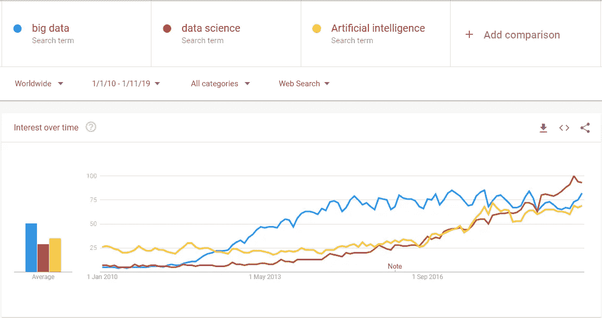

# 2020 年数据科学和人工智能的十大预测

> 原文：<https://towardsdatascience.com/ten-predictions-for-data-science-and-ai-in-2020-f6abb0c3977d?source=collection_archive---------13----------------------->

Photo by [Kevin Ku](https://unsplash.com/@ikukevk?utm_source=medium&utm_medium=referral) on [Unsplash](https://unsplash.com?utm_source=medium&utm_medium=referral)

当我们来到 2019 年底时，我们反思了这一年，这一年的开始已经看到 [100 篇机器学习论文在一天内发表](https://twitter.com/jeffdean/status/1135114657344237568?lang=en)，它的结束看起来将看到人工智能打破[记录的资助年。](https://venturebeat.com/2019/10/08/ai-startups-pace-break-funding-records-2019/)

但从数据科学和人工智能中获得真正价值的道路可能是一个漫长而艰难的旅程。

套用新经济思维研究所(Institute for New Economic Thinking)的 Eric Beinhocker 的话来说,*物理技术*以科学的速度发展，而*社会技术*以人类可以改变的速度发展——慢得多。

应用于数据科学和人工智能领域，如果决策不能有效地做出，组织流程积极阻碍数据科学和人工智能，人工智能应用程序由于缺乏信任而不被采用(“社交技术”)，那么最复杂的深度学习算法或最强大和可扩展的实时流数据管道(“物理技术”)就没有什么意义。

考虑到这一点，我对 2020 年的预测试图平衡这两个方面，强调公司的实际价值，而不仅仅是数据科学团队的“酷东西”。

1。 **数据科学和 AI 角色延续了专业化的趋势。**侧重于大型生产系统以及支撑它们的基础设施和平台的“工程型”数据科学角色(“数据/ML/AI 工程师”)与侧重于调查工作和决策支持的“科学型”数据科学角色(“数据科学家/业务分析专业人员/分析顾问”)之间存在实际差异。

对比鲜明的技能组合、不同的思维模式和既定的部门结构使这成为一种引人注目的模式。前者与 IT 有着天然的密切关系，并随着更多型号投入生产而变得更加突出。它也被证明是从软件工程开始的一个可行的职业过渡(比如这里的、这里的和这里的)。相反，决策支持的即时性和持续应对不确定性的需求要求数据科学家以咨询身份融入业务，而不是通过项目进行管理。

我们继续悄悄地远离独角兽的想法，因为仅仅因为某人*可以*做某事，并不意味着他或她*应该*。尽管多才多艺的执行者有很多价值，但在建立和扩展大型数据科学团队时，他们并不是比较优势。

2。 **高管对数据科学和 AI 的理解**变得更加重要。人们开始意识到，数据科学价值的瓶颈可能不是数据科学或人工智能的技术方面(喘息！)，而是数据科学实际消费者的成熟度。

虽然一些科技公司和大公司有一个[开端](https://techcrunch.com/2017/05/24/airbnb-is-running-its-own-internal-university-to-teach-data-science/)，但是越来越多的人意识到[内部培训项目通常是发展内部成熟度的最好方式](https://www.mckinsey.com/business-functions/mckinsey-analytics/our-insights/the-analytics-academy-bridging-the-gap-between-human-and-artificial-intelligence)。这是因为他们能够定制内容，从组织所处的位置开始，并根据可识别的公司业务问题和内部数据集调整培训。

3。 **端到端模型管理**成为需要生产的最佳实践。随着数据科学和人工智能项目在生产中的实际足迹越来越大，需要解决的问题已经合并到端到端模型管理的规程中。这包括模型的部署和监控(“模型操作”)、不同层次的支持，以及当模型随着时间的推移自然熵化时，对何时重新训练或重建模型的监督。

[模型运营](https://www.oreilly.com/radar/what-are-model-governance-and-model-operations/)支持活动的系统也是一种不同于数据科学家和机器学习工程师的独特技能，推动着这些团队和支持他们的 IT 组织的发展。

4。 **数据科学和人工智能伦理**继续获得动力，并开始形成一个独特的学科。大规模自动化决策的二阶效应一直是一个问题，但它最终在公众意识中获得了一席之地。这是由于像[剑桥分析公司丑闻](https://www.theguardian.com/news/series/cambridge-analytica-files)和[亚马逊废弃其显示对女性有偏见的秘密人工智能招聘工具](https://www.reuters.com/article/us-amazon-com-jobs-automation-insight/amazon-scraps-secret-ai-recruiting-tool-that-showed-bias-against-women-idUSKCN1MK08G)这样的突出事件。

该领域本身正在围绕一系列主题寻找定义，围绕自动决策的活动以及何时让人类参与进来，算法偏差和公平性，隐私和同意，以及通往人工通用智能的道路上的长期危险。

特别值得注意的是数据科学和全球隐私法规之间的互动。GDPR 已于 2018 年年中生效，现在对数据处理和分析、模型透明度的要求以及数据科学家工作的组织对不利后果负责的可能性都有限制。

技术通常比监管范式快几年，但监管正在迎头赶上。随着数据科学和人工智能团队学会在新的约束下工作，这将导致短期的痛苦，但最终将导致长期的收益，因为可信的参与者与坏的参与者是分开的。

5。 **工具的趋同导致混乱，**由于完成同一任务的多种方式，不同的群体根据其背景偏好不同的方法。这可能会继续造成混乱，因为新进入该行业的人可能只能看到整体的一部分。

今天，如果您为大型组织工作，并且能够负担得起，那么您可以使用企业工具进行建模。如果您是 MS SQL Server 的 DBA，您可以在数据库环境中建模。如果你是一名软件工程师，你可以调用机器学习 API，开发一个“人工智能产品”。如果您熟悉云产品，可以在 AWS Sagemaker 或 Azure ML Studio 等云平台上构建和部署相同的模型。这样的例子不胜枚举。

最终结果可能是误解和地盘之争的沃土，因为相似的功能以不同的形式存在。在这种情况下，能够在完全不同的技术团队之间建立高度信任的组织将会获得当今可用工具包的全部好处。

6。 **加倍努力实现数据科学和人工智能的“民主化”和“自动化”，过度承诺的政党失败了**。由于人才有些难以捉摸(或者至少是分配不当)，自动化数据科学和人工智能是一个有吸引力的想法。然而，现实仍然是，技术的界限只能使某些明确规定的任务自动化。

以一个典型的数据科学项目为例，围绕模型构建的活动有很多:

1.  选择正确的项目，组建具有正确技能组合的团队，交流方法，并在必要时获得必要的支持和资金。
2.  一旦项目开始，选择如何解决问题和采取的方法。例如，故障预测应该被框架化为有监督的还是无监督的机器学习问题？还是一个有待模拟的系统？还是异常检测问题？
3.  一旦你框定了问题，选择正确的数据来使用，并选择正确的数据*而不是*来使用——例如，出于道德考虑。
4.  在数据端进行处理，以确保不会导致错误的模型。例如，电子邮件数据实际上需要在标题、标签等之间进行大量的争论才能得到实际的信息。
5.  一旦你有了数据，就产生了假设——例如，在大规模数据集中进行数据挖掘，在“进行数据科学”之前，很多工作是关于决定哪些想法可能值得研究。
6.  **建立并优化模型。<这就是正在被自动化的>**
7.  一旦你建立并优化了你的模型(如果你选择使用模型的话)，决定它是否有价值。
8.  一旦你决定这项工作是值得的，将开发的机器学习模型嵌入到生产系统和既定的业务流程中。仅仅这一步通常比所有其他步骤加起来花费的时间还要多。
9.  一旦模型被部署，构建未来的版本以确保所构建的是完全运行的，经过测试的，并且与其他系统集成。
10.  一旦整个机器学习系统经过良好的测试并达到工程标准，就可以实际解释和处理数据科学项目的输出。

就像 Wix、Squarespace 和其他网站建设者没有让 web 开发者出局一样，AutoML 和 DataRobot 也不会取代数据科学家。(然而，它们是很好的工具，应该以这种方式进行营销。)

7 .。 **边缘建筑和迷雾开始进入主流**。部署越来越大的复杂模型的实际必要性和工程成本正在推动新的架构模式。对于实时视频分析的计算和数据传输要求来说尤其如此，被誉为边缘分析的“杀手级应用”。这一趋势得到了计算机视觉领域的[进步](/latest-computer-vision-trends-from-cvpr-2019-c07806dd570b)和新的专用商业硬件的支持，如 [AWS Deeplens](https://aws.amazon.com/deeplens/) 。

8。 **定义的炒作周期和泛滥正在转移。**在大约 5 到 6 年前转向“数据科学”之前，它首先专注于“大数据”，2020 年可能是所有“人工智能”都可能取代对话的一年。

Big data is not the point in itself — it is what we do with it that matters.

不得不接纳大量新人的副作用之一是简化了该领域，就数据科学而言，这种简化使其更加强调统计和机器学习，而不强调运筹学和模拟等其他数学建模学科。

人工智能也开始出现类似的模式，类似的重点是机器学习、神经网络和深度学习，通常是在视觉和自然语言处理的背景下。这种弱化目前似乎出现在经典的人工智能领域，如知识表示、专家系统和规划等。

作为旁注，我完全理解转移到一个新领域是很难的，数据科学和人工智能的广度可能是压倒性的。我发现打破这堵墙最有用的东西很少是更多的内容，而是更好的导航。有人能定位我们知道什么和不知道什么，并画出个人的学习路线图，这比无序的学习材料链接列表有用得多。

9。 **竞争进入 AI 芯片市场。**英伟达在深度学习硬件市场上有着巨大的领先优势，目前[主导了云中的大部分人工智能](https://www.forbes.com/sites/paulteich/2019/06/17/nvidia-dominates-the-market-for-cloud-ai-accelerators-more-than-you-think/)。虽然有来自谷歌、高通、亚马逊、Xilinx 和多家初创公司的重要进入者，但竞争仍主要发生在边缘地带。

这将最终改变，因为为人工智能提供动力不仅仅是一个芯片，而是一个完整的便携式硬件平台，最好没有供应商的限制。英特尔和脸书的新芯片可能是期待已久的竞争，或者它可能来自[中国公司在贸易战中急于制造自己的芯片](https://asia.nikkei.com/Business/China-tech/Chinese-companies-rush-to-make-own-chips-as-trade-war-bites)。几乎与此同时，到 2019 年下半年，[阿里巴巴](https://www.cnbc.com/2019/09/25/alibaba-unveils-its-first-ai-chip-called-the-hanguang-800.html)和[华为](https://www.cnbc.com/2019/08/23/huawei-launches-ai-chip-ascend-910-pitting-it-against-nvidia-qualcomm.html)都将发布芯片。

10。最后，**教授数据科学和人工智能并销售工具仍然比实际让它在实践中发挥作用更容易。**从数据科学和人工智能中创造价值不仅困难，而且需要超越数据科学家和机器学习工程师的讨论和共识。

从本质上来说，人工智能系统通常是优化机器。我们刚刚开始问的问题是“我们在优化什么？”尽管在数据、建模和架构方面“做正确的事情”得到了所有的关注，但在为以人为中心的体验和价值观进行设计方面，可以说更难的任务是“做正确的事情”。

同样，数据驱动的决策需要由高级、非技术决策者做出，他们通常会陷入复杂的政治阴谋网络中，并且经常在没有数据科学的情况下成功完成整个职业生涯。

在生产方面，成功的模型部署只是产品的一小部分，并且会受到从内部 IT 环境到过时的监管要求等无数因素的限制，所有这些都与处理数据固有的不确定性有关。对“生产中的模型”本身的痴迷也可能在某种程度上被误导，数据科学的主要 KPI 之一仍然是最难以捉摸的— *“你改变主意了吗”*？

*以上显示的所有图像仅用于非商业说明目的。本文是以个人身份撰写的，不代表我所工作或隶属的组织的观点。*