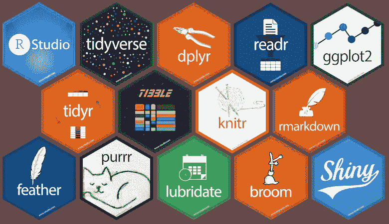

# R 中十个你可能不知道的随机有用的东西

> 原文：<https://towardsdatascience.com/ten-random-useful-things-in-r-that-you-might-not-know-about-54b2044a3868?source=collection_archive---------7----------------------->

## r 充满了有用的东西。这里有一些我经常使用的东西，其他人可能不知道。

我经常发现自己告诉我的同事和程序员同事一些我在 R 中使用的简单的事情，这些事情真的对我需要继续前进的任务有帮助。这些范围从琐碎的快捷方式，到鲜为人知的功能，到方便的小技巧。

因为 R 生态系统是如此丰富和不断增长，人们可能经常错过了解一些真正能帮助他们完成任务的东西。所以我经常会从我的观众那里得到惊讶的反应，比如“我从来不知道这件事！”。

以下是让我在 r 工作更轻松的十件事。如果你已经全部知道了，很抱歉浪费了你的阅读时间，请考虑添加一些你认为对其他读者有益的评论。

## 1.`switch`功能

我爱`switch()`。它基本上是一个根据另一个变量的值选择其值的`if`语句的简化。我发现当我编写需要根据您之前的选择加载不同数据集的代码时，它特别有用。例如，如果你有一个名为`animal`的变量，你想根据`animal`是狗、猫还是兔子来加载一组不同的数据，你可以这样写:

```
data <- read.csv(
  switch(animal, 
         "dog" = "dogdata.csv", 
         "cat" = "catdata.csv",
         "rabbit" = "rabbitdata.csv")
)
```

这在闪亮的应用程序中特别有用，在这些应用程序中，您可能希望根据一个或多个输入菜单选项来加载不同的数据集甚至环境文件。

## 2.RStudio 快捷键

这与其说是 R hack，不如说是 RStudio IDE，但是常用命令的快捷键非常有用，可以节省大量的键入时间。我最喜欢的两个是管道操作符`%>%`的 Ctrl+Shift+M 和赋值操作符`<-`的 Alt+。如果你想看到这些令人敬畏的快捷键的完整集合，只需在 RStudio 中键入 Atl+Shift+K。

## 3.flex 仪表板包

如果你想要一个快速闪亮的仪表板，并以最少的忙乱运行，`flexdashboard`包有你需要的一切。它提供了简单的 HTML 快捷方式，可以方便地构建侧栏和将显示组织成行和列。它还有一个超级灵活的标题栏，你可以将你的应用程序组织到不同的页面，并放置图标和链接到 Github 代码或电子邮件地址或其他任何东西。作为一个在`RMarkdown`中运行的包，它还允许你将所有的应用保存在一个`Rmd`文件中，而不需要像`shinydashboard`那样将它分解成单独的服务器和 UI 文件。每当我需要在进入更高级的设计之前创建一个简单的仪表板原型时，我都会使用`flexdashboard`。我经常可以使用`flexdashboard`在一个小时内设置并运行仪表盘。

## 4.R Shiny 中 req 和 validate 函数

r 闪亮的开发可能会令人沮丧，尤其是当您得到一般性的错误消息时，这些消息不能帮助您理解到底出了什么问题。随着 Shiny 的发展，越来越多的验证和测试功能被添加进来，以帮助更好地诊断和在特定错误发生时发出警报。`req()`功能允许您阻止一个动作的发生，除非环境中存在另一个变量，但这样做是无声的，不会显示错误。因此，您可以使 UI 元素的显示以之前的操作为条件。例如，参考我上面的示例 1:

```
 output$go_button <- shiny::renderUI({ # only display button if an animal input has been chosen

  shiny::req(input$animal) # display button shiny::actionButton("go", 
                      paste("Conduct", input$animal, "analysis!") 
  )
})
```

`validate()`在呈现输出之前进行检查，并使您能够在不满足特定条件时返回定制的错误消息，例如，如果用户上传了错误的文件:

```
# get csv input fileinFile <- input$file1
data <- inFile$datapath# render table only if it is dogsshiny::renderTable({
  # check that it is the dog file, not cats or rabbits
  shiny::validate(
    need("Dog Name" %in% colnames(data)),
    "Dog Name column not found - did you load the right file?"
  ) data
})
```

关于这些函数更多信息，请参见我的另一篇文章[这里的](/in-r-shiny-when-is-an-error-really-an-error-702205ebb5d5)。

## 5.使用隐藏凭据。伦韦龙

如果您正在共享需要登录数据库等凭证的代码，您可以使用`.Reviron`文件来避免将这些凭证发布到 Github 或其他可能存在风险的空间。`.Renviron`是一个可以存储重要环境变量的文件，可以使用`usethis`包中的`edit_r_environ()`函数轻松编辑。例如，您可以在`.Renviron`中为您的远程数据库凭证设置一个别名，例如:

```
 DSN = "database_name",
  UID = "User ID",
  PASS = "Password"
```

然后在你的共享脚本中，你可以调用这些变量。例如:

```
db <- DBI::dbConnect(
  drv = odbc::odbc(),
  dsn = Sys.getenv("DSN"),
  uid = Sys.getenv("UID"),
  pwd = Sys.getenv("PASS")
)
```

## 6.使用 styler 自动进行 tidyverse 造型

这是艰难的一天，你已经有很多事情要做了。你的代码不像你想的那样整洁，你没有时间来编辑它。不要害怕。`styler`包有许多功能，允许你的代码自动重定风格以匹配 tidyverse 风格。在你混乱的脚本上运行`styler::style_file()`很简单，它会为你做很多(虽然不是全部)工作。

## 7.参数化 R 降价文档

所以你写了一个可爱的 R Markdown 文档，其中你分析了一大堆关于狗的事实。然后你被告知——“不，我对猫更感兴趣”。不要害怕。如果您将 R markdown 文档参数化，那么只需一个命令就可以自动生成类似的关于 cats 的报告。

您可以通过在 R Markdown 文档的 YAML 头中定义参数，并给每个参数赋予一个值来做到这一点。例如:

```
---
title: "Animal Analysis"
author: "Keith McNulty"
date: "21 March 2019"
output:
  html_document:
    code_folding: "hide"
params:
  animal_name:
    value: Dog
    choices:
      - Dog
      - Cat
      - Rabbit
  years_of_study:
    input: slider
    min: 2000
    max: 2019
    step: 1
    round: 1
    sep: ''
    value: [2010, 2017]
---
```

现在，您可以将这些变量作为`params$animal_name`和`params$years_of_study`写入文档中的 R 代码。如果您正常编织您的文档，它将按照`value`变量用这些参数的默认值编织。但是，如果您通过在 RStudio 的编织下拉菜单中选择此选项(或使用`knit_with_parameters()`)来编织参数，则会出现一个可爱的菜单选项，供您在编织文档之前选择参数。厉害！


Knitting with Parameters

## 8.revealjs

`revealjs`是一个软件包，可以让你用一个直观的幻灯片导航菜单创建漂亮的 HTML 演示文稿，并嵌入 R 代码。它可以在 R Markdown 中使用，有非常直观的 HTML 快捷方式，允许您创建一个嵌套的、逻辑结构的漂亮幻灯片，有各种样式选项。事实上，演示是 HTML 格式的，这意味着人们可以在平板电脑或手机上听你讲话，这非常方便。您可以通过安装包并在您的 YAML 头文件中调用它来建立一个`revealjs`演示。这是我最近用`revealjs`做的一个演讲的 YAML 标题的例子

```
---
title: "Exporing the Edge of the People Analytics Universe"
author: "Keith McNulty"
output:
  revealjs::revealjs_presentation:
    center: yes
    template: starwars.html
    theme: black
date: "HR Analytics Meetup London - 18 March, 2019"
resource_files:
- darth.png
- deathstar.png
- hanchewy.png
- millenium.png
- r2d2-threepio.png
- starwars.html
- starwars.png
- stormtrooper.png
---
```

这是一个例子。你可以在这里找到代码[，在这里](https://github.com/keithmcnulty/hr_meetup_london/blob/master/presentation.Rmd)找到演示[。](http://rpubs.com/keithmcnulty/hr_meetup_london)


Easy online presentations using revealjs

## 9.R Shiny 中的 HTML 标签(例如在你的 Shiny 应用程序中播放音频)

大多数人没有充分利用 R Shiny 中可用的 HTML 标签。有 110 个标签提供了各种 HTML 格式和其他命令的快捷方式。最近，我开发了一个闪亮的应用程序，它需要很长时间来执行一项任务。知道用户可能会在等待任务完成的同时进行多任务处理，我使用`tags$audio`让应用程序播放胜利的号角，在任务完成时提醒用户。

## 10.表扬包

可笑的简单，但也很棒，`praise`包向用户传递赞美。虽然这看起来像是毫无意义的自我欣赏，但它实际上在编写简历包时非常有用，如果某人做对了，你可以对他进行表扬或鼓励，例如，如果一个过程成功完成。你也可以把它放在一个复杂脚本的末尾，当它成功运行时，给你额外的快乐。


The praise package

*最初我是一名纯粹的数学家，后来我成为了一名心理计量学家和数据科学家。我热衷于将所有这些学科的严谨性应用到复杂的人的问题上。我也是一个编码极客和日本 RPG 的超级粉丝。在* [*LinkedIn*](https://www.linkedin.com/in/keith-mcnulty/) *或*[*Twitter*](https://twitter.com/dr_keithmcnulty)*上找我。*

