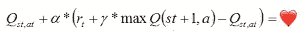
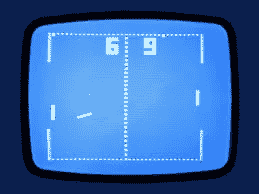

# 一万次初次约会:强化学习浪漫

> 原文：<https://towardsdatascience.com/ten-thousand-first-dates-reinforcement-learning-romance-c75992beab10?source=collection_archive---------19----------------------->

新西兰——我生活的地方——历史上没有“约会”文化，更没有“狂饮”文化。我年轻时普遍接受的交配仪式是喝得酩酊大醉，在一个完全陌生的人的陪伴下醒来，然后——如果你喜欢他们的样子——羞怯地建议再次订婚。但是时代在变。约会应用和日益全球化的文化让“约会”的概念在新西兰变得更加流行，如果一个人想在现代吸引情郎，他必须适应。我必须学会如何去约会？这对我来说是未知的领域！我的成长经历和以前的社会经验都没有让我准备好在吃饭时与一个有魅力的陌生人交谈的严酷。在和某人共度一夜之前决定我是否喜欢他的想法很奇怪，坦白说有点可怕。更令人不安的是，与此同时，他们会决定是否喜欢我！这是一个雷区。一个复杂的环境，充满了失误和变化的规则。一个不同于我自己的社会和文化。换句话说，它是机器学习算法的完美环境。

我们将要使用的特定算法在机器学习领域有点奇怪。这与我们之前看到的分类和回归方法有很大不同，在分类和回归方法中，一组观察结果被用来推导出规则，从而对未知情况做出预测。它也不同于我们见过的更非结构化的算法，例如让我们提出针织图案建议或找到类似电影的数据转换。我们将使用一种叫做“强化学习”的方法。强化学习的应用非常广泛，包括机器人的复杂控制器、建筑物中电梯的调度以及教计算机玩视频游戏。

在强化学习中，一个“代理”(计算机)试图通过在复杂的环境中做出选择来最大化它的“回报”。我将在这篇文章中使用的具体实现被称为“q-learning”，这是强化学习的一个最简单的例子。在每一步，该算法记录环境的状态，它所做的选择，以及该选择的结果，即它是产生奖励还是惩罚。该模拟被重复多次，并且计算机随着时间的推移学习在哪些状态下的哪些选择导致最大的奖励机会。

例如，想象一个强化算法学习玩视频游戏“Pong”。在 pong 中，两个玩家用一个白色的线代表的小球拍面对面。一个用白点表示的球在它们之间来回弹跳。球员可以上下移动球拍，试图阻挡球并将其反弹给对手。如果他们错过了球，他们失去了一分，游戏重新开始。

每半秒或四分之一秒，强化算法会记录下球拍的位置和球的位置。然后它选择向上或向下移动它的桨。起初，它随机做出这个选择。如果在接下来的时刻球还在比赛中，它会给自己一个小小的奖励。但是，如果球出界了，失分了，它会给自己一个很大的处罚。将来，当算法做出选择时，它会查看过去的行为记录。当选择导致奖励时，它更有可能再次做出选择，而当选择导致惩罚时，它就不太可能重复错误。在训练之前，算法随机上下移动桨，什么也没达到。经过几百轮训练后，动作开始稳定，它试图用桨抓住球。经过成千上万回合，它是一个完美的球员，从来没有错过球。它已经学会了什么叫做“政策”——给定一个特定的游戏状态，它精确地知道哪一个动作将最大化它获得奖励的机会。

但是如何将这一点应用到我目前的困境中呢？我如何用强化学习来教自己去约会？

首先，我需要一个典型约会场景的完全准确的模拟。然后，我将训练一名代理人完美地完成这次模拟。最后，我可以检查代理学习的策略，以确定最佳约会策略。这是一个万无一失的计划。

第一，模拟。我想给你介绍一个我开发的小程序，叫做完全精确的日期模拟器。这是对两个人之间的现代约会的完整而彻底的模拟。让我简单解释一下:

每次约会都要进行十轮。在每一轮约会中，代理人从四个普遍接受的话题中选择一个话题:体育、流行音乐、历史、机器学习和人工智能。这个话题会让代理人的伙伴高兴或不高兴，伙伴会给出微妙和模糊的信号。一旦伴侣对机智的对话感到足够满意，代理人可能会尝试“调情”，这将有望使约会圆满结束。代理人也可能选择喝酒——增加他们的信心，并希望给他们的谈话增添一些亮点；或者，对日期感到绝望，代理人可以选择离开。

从我以前不懂编织的失败中吸取了教训，我招募了一些约会专家来给出他们对模拟器的看法。他们把它描述为“令人困惑”、“武断”和“毫无意义”，由此我得出结论，这是一个非常成功的模拟。

你可以使用[完全精确的约会模拟器](https://date-simulator.herokuapp.com/)试试自己的约会运气。

Totally. Accurate.

所以，现在来训练我们的特工如何应对复杂的人际关系网。

我们派我们的代理人去约会一万次。代理记录每个点的日期状态，以及到达该点所采取的操作。任何以成功结束的约会都会有奖励。代理人会记住并更有可能重复导致这个结论的行为。起初，它会随机选择行动，但随着它在日期上的成功，它会更重视这些选择，更详细地探索这些成功的途径。

在训练期结束时，我们可以检查代理的表现如何——在 100 次约会中，有多少次以成功告终？我们运行模拟，发现…

…灾难！代理每次约会都失败！检查代理人的行动，他似乎仍然在作出基本上随机的选择。他什么都没学到！出了什么问题？原来这是强化学习的通病。代理需要采取的一系列行动是漫长而复杂的。他偶然发现这一点的几率非常低，而他经常重复这一点以形成强有力政策的几率几乎为零。这意味着，即使在一万次约会之后，代理人也没有学到足够的东西来可靠地吸引他的伴侣——他在约会中的成功永远不会超过随机的机会。

我们需要做的是创造所谓的“有形”奖励。我们需要奖励经纪人朝着成功约会迈出的一小步，比如选择一个好的话题；惩罚犯错的代理人，比如用一个糟糕的话题来烦对方。

有了这种新方法，我们将让代理人进行另外一万次约会，并再次测试他，引导我们…

…又是灾难！代理人每次约会都失败，当我们看他在约会中的行动时，很容易看出为什么:他在每次约会中的第一个也是唯一的行动是立即离开。他已经得出结论，惩罚比奖励要多得多，整个“约会”的情况是一个净损失。他最好的选择是在他有机会累积任何惩罚之前，尽早退出。我的约会专家小组将这种行为描述为“可能是聪明的”，以及“专家级的约会”。

这是强化学习困难的核心，事实上也是所有人工智能的核心。它不折不扣地遵循它的指示。代理对“正确”的结果没有概念。它只是将奖励最大化，将惩罚最小化。追求最优政策是无情的。代理人不知道“应该”如何处理问题，只知道实际的结果。在最好的情况下，这是人工智能的一大优势——没有先入之见，它可以发现解决问题的新方法，并丢弃任何不相关的东西。但在最坏的情况下，这是一个很大的弱点。代理人抛弃的许多先入之见都是长期来之不易的经验的产物。它忽略的许多“无关紧要”的副作用是至关重要的。

但是我呢？我应该在学习如何约会！我不满意！肯定有一种方法可以教会我们的代理人成功约会，至少像人类一样。我不断调整奖励结构，增加各种大小的惩罚和奖励。每一次，代理人都会使他的报酬最大化。有时，他会在愉快的谈话中度过整个约会，但从不冒险调情来进一步约会。有时他会借酒消愁，闷闷不乐地坐着，直到时钟显示日期。但最终，我得到了正确的公式。

奖励和惩罚的结合恰到好处，代理人实际上开始成功了。在一百次约会之后，他每十次中就有一次成功了。一千次后，他达到五分之一，到一万次约会结束时，他的学习稳定下来，三次约会中有一次成功。这比我自己能做到的要好得多。检查代理人的政策表明，他采用了一种相当传统的方法:他尝试各种主题，直到他发现一些有吸引力的东西，然后坚持下去，直到他收到足够的积极反馈。然后他转向调情，直到约会成功。如果他在任何时候被拒绝，他会喝几杯烈酒来壮壮胆，然后再试一次。

我们学到了什么？我从我的约会专家小组中了解到，将浪漫的进展描述为只有一种成功结果的对抗性遭遇是“不健康的”和“有点令人毛骨悚然的”。我还了解到，在理解现实世界时，强化学习的价值有限。没错，代理学会了成功地驾驭我构建的模拟，但是我真的能把这些经验应用到现实世界吗？这只在我的模拟准确的范围内有用。此外，在我如何构建我的模拟，以及我如何形成有助于代理学习的奖励，我都在实验中构建我自己关于约会如何工作的假设。但我认为，这个实验的关键教训是，人工智能对“成功”的定义与你我非常不同，也非常狭隘。智能体不关心它如何实现其目标，也不考虑超出其被赋予的参数的严格限制的任何问题。它不在乎从给定的数据中“应该”得出什么结论，也不在乎这些结论会导致什么意想不到的后果。当人工智能应用于现实世界的问题时，如果我们希望它的结果符合人类的安全感和公平感，我们就必须依靠人类的判断和人类的同情心。

*感谢阅读！这篇短文的所有代码都可以在我的 github 中找到，* [*这里*](https://github.com/SimonCarryer/date) *。别忘了试试* [*完全精确的日期模拟器*](https://date-simulator.herokuapp.com) *。你可能会喜欢我以前的一篇文章，《游戏中的大脑》***，这里是***。下个月再查一篇新论文。***