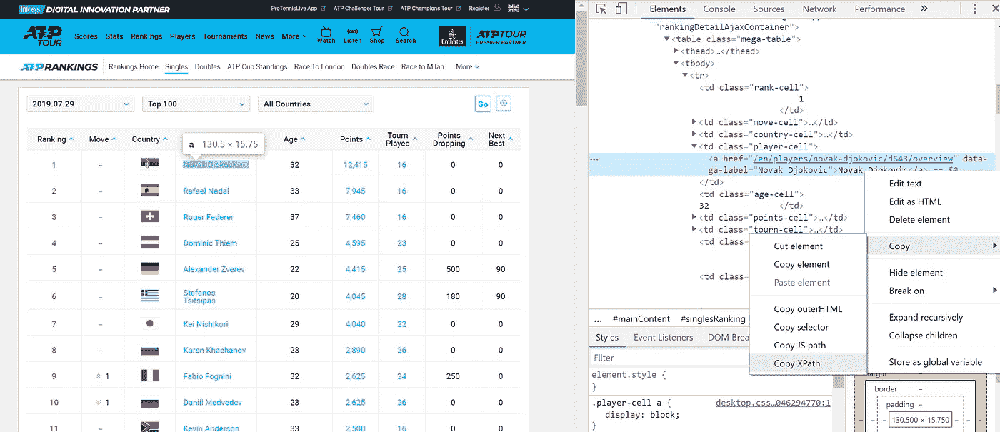
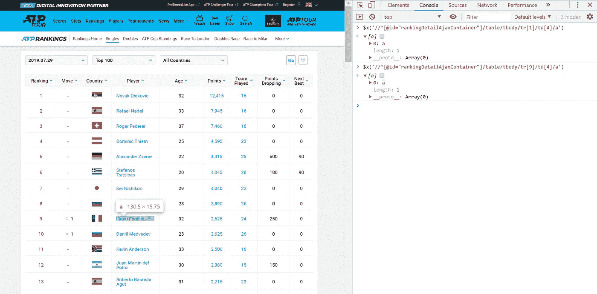
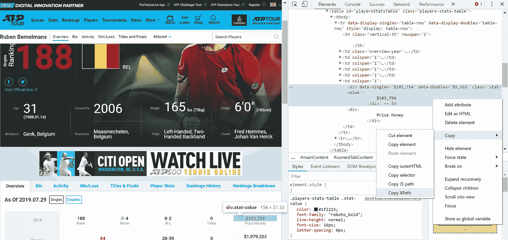
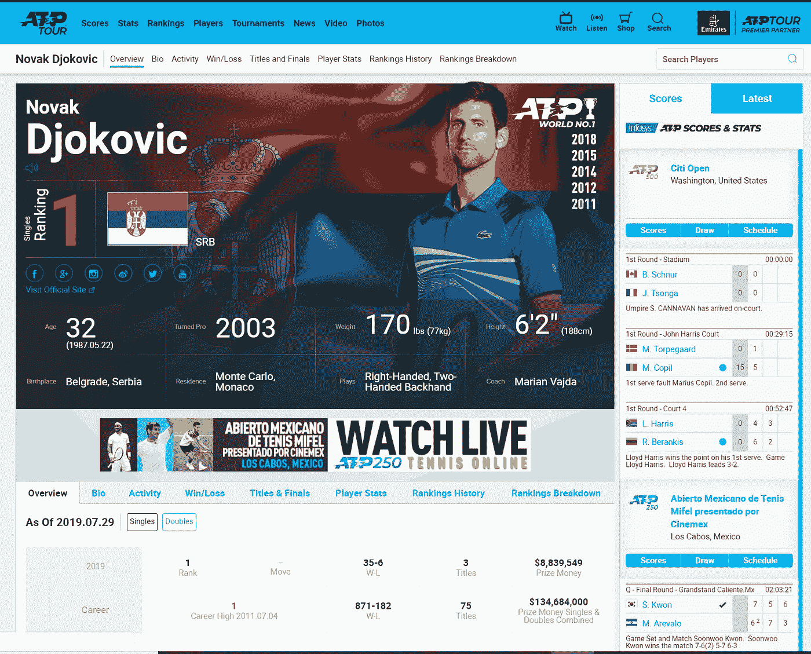
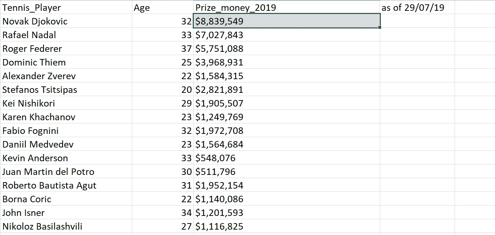
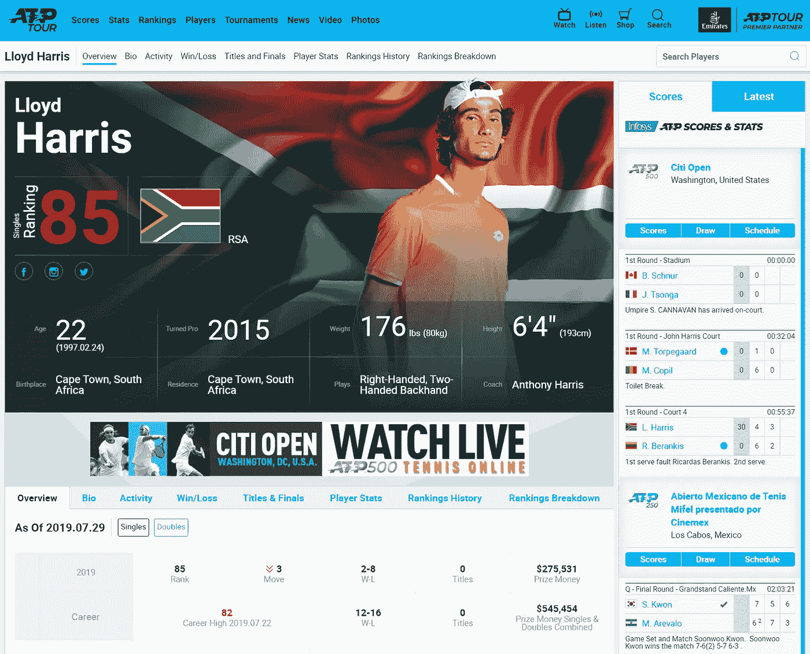
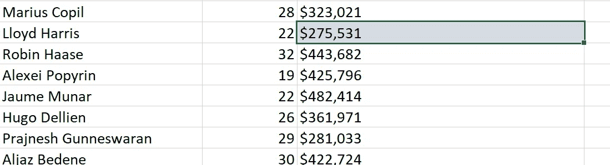
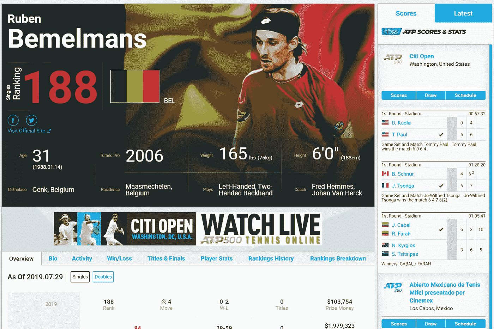
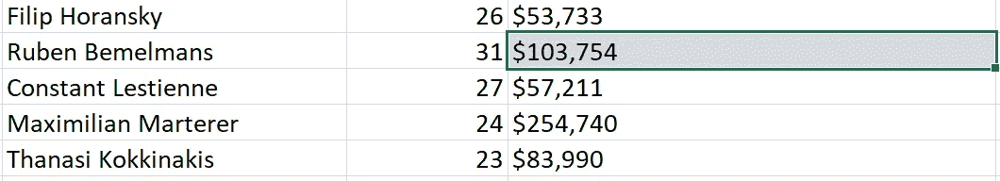

# 使用 Selenium 收集网球奖金数据

> 原文：<https://towardsdatascience.com/tennis-prize-money-data-harvesting-using-selenium-c38b79323d47?source=collection_archive---------26----------------------->

## **利用**模式的**进行多页面网页抓取，并在硒中等待**

**Lucas Davies via Unsplash**

# 介绍

这篇教程将详细介绍如何利用模式来迭代目前参加 ATP 巡回赛的前 200 名男子网球选手。

具体来说，对于每个球员，我想提取他们各自的姓名、年龄和截至 2019 年 7 月 29 日的奖金。web 抓取将使用 Selenium 模块执行，并将利用该模块中的一些有用的类，这将确保代码更有效地运行。

在这个例子中，玩家姓名和年龄在同一网页上，但是他们各自的奖金收入在单独的页面上，对于每个玩家是唯一的。

通过使用 Selenium 模块，可以获得这些信息。

# 入门和模式搜索

首先，我从 Selenium 模块导入 webdriver。然后，我创建一个 web 驱动对象，并将其分配给变量 browser。接下来，我只需导航到 ATP 巡回赛网页，如下所示。

现在已经加载了适当的网页，我可以清楚地看到前 100 名男单选手的列表(下图中的*，只显示了前 11 名，但向下滚动到底部会显示前 100 名选手*)。

为了遍历前 100 个玩家，我需要在数据组织中找到一些一致性。具体来说，当我右键单击、选择 inspect 并将鼠标悬停在玩家名称上时，我可以复制 Xpath。

然后，我将这个 Xpath 粘贴到 Chrome 开发者工具的控制台标签中。当我第一次复制并粘贴诺瓦克·德约科维奇的 Xpath 时，我可以看到球员对应于表行 1，tr[1]和表数据 4，td[4]。通过检查其他玩家，例如下面突出显示的 Fabio Fogini，我可以看到 Xpath 中唯一改变的部分是表的行号 tr[9]。

这是有意义的，因为数据被组织成表格格式，因此具有我可以利用的一致性。为了利用这个特性，我可以简单地替换 Xpath 的 **tr** 部分中的数字，并使用从 1(含)到 101(不含)的**范围**遍历所有玩家的名字！

我利用相同的关系提取玩家的年龄，但是在这种情况下，表中的数据 **td** 在第 5 列。

# 代码工作流

我希望我的代码如下工作:

1.  转到[主排名页面](https://www.atptour.com/en/rankings/singles)，从排名最高的玩家开始查找个人玩家姓名和年龄，并提取此信息。
2.  点击每位玩家的链接，从排名最高的玩家开始，提取他们今年到目前为止的奖金(截至 2019 年 7 月 29 日)。
3.  导航回主排名页面，对前 100 名玩家重复步骤 1 和 2。
4.  获得前 100 名玩家的数据后，点击进入下一页，玩家排名在 100-200 之间，重复步骤 1 和 2。
5.  一旦获得了这些信息，就停止迭代并将输出写入 Excel，以便进行下游数据操作和验证。

# Webdriver 等待和预期条件一起工作

当浏览器加载页面时，该页面中的元素可能会在不同的时间间隔加载。这使得定位元素变得困难:如果元素还没有出现在 DOM 中，定位函数将引发 ElementNotVisibleException 异常。使用等待，我们可以解决这个问题。

显式等待使 WebDriver 在继续执行之前等待某个条件发生。

为了使代码更加健壮，我将指示代码在对 web 元素执行任何操作之前等待，直到找到或可以点击 web 元素。下面是两种重要的硒，来源于:[https://seleniumhq.github.io/selenium/docs/api/py/api.html](https://seleniumhq.github.io/selenium/docs/api/py/api.html)。

WebDriverWait 和 expected_conditions 可以一起使用。在下面列出的预期条件示例中，我将等待定位 an 元素的可见性。

***类 selenium . web driver . support . wait . web driver wait(driver，timeout，poll_frequency=0.5，ignored _ exceptions = None)***

***类 selenium . web driver . support . expected _ conditions . visibility _ of _ element _ located(locator)***

# 如何在预期条件下使用 Webdriver Wait？

WebDriverWait 有两个必需的参数，即驱动程序、浏览器和超时。超时指示如果找不到相应的 web 元素，在引发超时异常之前要等待多长时间。

让我们剖析一个例子。

我想提取下面有 Xpath 的玩家名字

//*[@ id = " rankingDetailAjaxContainer "]/table/tbody/tr[1]/TD[4]/a '

我写了 WebdriverWait，然后是我的驱动程序 browser，然后等待 20 秒。然后，我通过将***visibility _ of _ element _ located****附加到****expected _ conditions，告诉 webdriver 等待元素可见。*** 我接着指定一个定位器使用 ***通过。Xpath(大写)*** ，后面是引用的适当 XPATH。

添加等待会在脚本中添加额外的检查步骤。这在 for 循环中在网页之间切换时特别有用，因为 web 元素可能需要一点时间来加载。

结合这些核心思想，现在可以创建一个范围为 1 到 101 的 for 循环，以收集每页上前 100 名玩家的数据。

当使用。文本功能，然后代码指示浏览器点击每个玩家的链接并提取他们的奖金。这里，不是通过**提取玩家名字。短信**功能，我用**点击他们的名字。单击()方法**，如下面的代码所示。由于每个玩家都在同一行，我可以使用我之前发现的模式来显示玩家统计页面的所有唯一链接。

每个玩家的奖金可以简单地通过复制 Xpath 找到。对于每个玩家，数据是统一组织的，因此这个 Xpath 将在 for 循环的每次迭代中为每个玩家工作。

一旦实现了这一点，我导航回到单打排名页面，提取排名第二的球员的姓名、年龄和收入。在 for 循环的每次迭代中，我都会将数据追加到 Tennis_player、Age 和 Prize_money_2019 的列表中。

当第一批 100 名玩家的数据收集完毕后，我导航到下一个页面，再次检查网页上是否有这样的按钮，并且可以点击。while 循环中的条件告诉代码返回到哪个页面。

当 while 循环的两次迭代完成后，我使用 pandas 将数据写入 Excel 文件，方法是创建一个 DataFrame 并将我的列表压缩在一起，并给它们指定合理的列名。

为了澄清脚本运行顺利，在每一次迭代中，我打印了玩家，以及他们的年龄和奖金。这是不必要的，但是给了我一个迭代进度的视觉检查。下面显示了该输出在控制台中的外观示例。

# 确认

最后，验证代码是否按预期工作是很重要的。例如，我将检查 3 个玩家，以显示已经获得了正确的数据。首先，让我们通过查看我的 Excel 文件“Tennis_Player_Earnings”来确认诺瓦克·德约科维奇的奖金是 8，839，549 美元。

成功！现在让我们再次检查与另一名球员，即劳埃德哈里斯。他的奖金应该是 275531 美元。

在与诺瓦克争夺奖金之前，劳埃德似乎还有一段路要走！

为了再次确认，我应该检查第二页的玩家，即排名在 100-200 之间的玩家是否有正确的奖金。排名第 188 位的鲁本·贝蒙尔曼斯本应获得 103，754 美元的奖金。这将确认点击到下一页的工作符合预期！同样，信息是正确的。

该代码在一个单独的页面上自动遍历网球运动员和他们的奖金，通过他们名字上的链接可以访问。实时观察自动 web 迭代显示了这个过程是如何工作的。为了演示，描述了显示前 3 个玩家的迭代的视频。

# 摘要

这个例子说明了，通过寻找模式并利用它们，以及等待 web 元素加载并填充网页，我们可以提取信息，而不会出现常见的元素位置错误。但是，需要注意的是，这些模式是使用 Xpaths 找到的。

如果该页面的组织者决定添加一列或将玩家姓名移动到另一列，脚本将会中断，因此在使用 Xpaths 时要小心，并尽可能使用 CSS 选择器。然而，如果您正在编写一个像这样的快速脚本，并将数据输出到 Excel，所示的方法应该足够了，但是不要期望它能工作 X 个月。