# tensor flow 2.0——在 Google Colab 上创建和训练一个普通的 CNN

> 原文：<https://towardsdatascience.com/tensorflow-2-0-create-and-train-a-vanilla-cnn-on-google-colab-c7a0ac86d61b?source=collection_archive---------5----------------------->

## Colab 和 Tensorflow 2.0 简介

Tensorflow 2.0 在不到一周前发布，它一直是我的 twitter TL 上讨论最多的话题，所以我决定加入讨论并写这篇文章。Tensorflow 有一些重大改进，同时使任何人都可以轻松开始使用它。Tensorflow 2.0 现在与 Keras 高度集成，这使得用最少的专业知识构建和测试简单模型更加容易。谷歌还决定强调“热切执行”，而不是建立基于会话的模型。急切执行允许立即计算 python 操作，而不是构建计算图。这篇文章将一步一步地介绍如何使用 Google Colab 并在 Tensorflow 2.0 中构建 CNN 模型

对于那些不知道 Google Colab 是什么的人(如果你知道，你可以跳过下面几行)，它是一个在线 Jupyter 笔记本，让你编写和共享代码。最好的部分是代码在谷歌的服务器上执行。你甚至可以选择在谷歌的云 GPU 或 TPU 上训练你的模型。

要在 GPU 或 TPU 上训练您的模型，请转到运行时→更改运行时类型→硬件加速器

# 资料组

我们将使用的数据集是[德国交通标志识别基准](http://benchmark.ini.rub.de/?section=gtsrb&subsection=news)。该数据集包含 50K 多幅图像和 40 多种交通标志。

# 让我们从代码开始

## 玩弄我们的数据

第一部分是将数据集导入 Google Colab。你可以把你的数据上传到你的 google drive，然后把它安装到你的 Colab 笔记本上。将数据集作为. zip 文件上传到驱动器后，在您的 Colab 笔记本中键入以下代码以挂载驱动器。

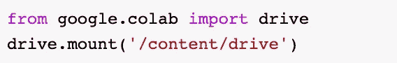

Mount your drive

您可以使用 shell 命令 unzip 解压缩该文件。通过在命令前面加上“！”，可以在笔记本单元中调用 Shell 命令。看看下面的例子。

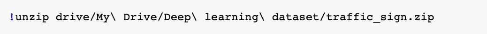

note: If you have spaces in your directory names, use escape sequence ‘\’

数据集已经分为训练和测试图像，其中 75%的图像用于训练，其余用于测试我们的模型。由于我们已经装载了驱动器，现在我们可以通过引用驱动器中的路径来访问数据集。看看下面的代码来加载训练和测试数据。

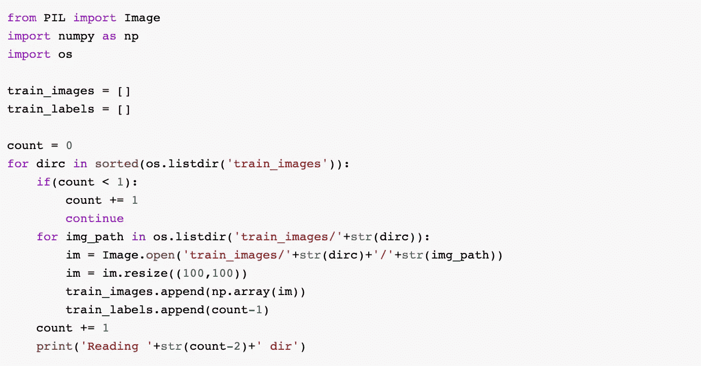

Loading Training data

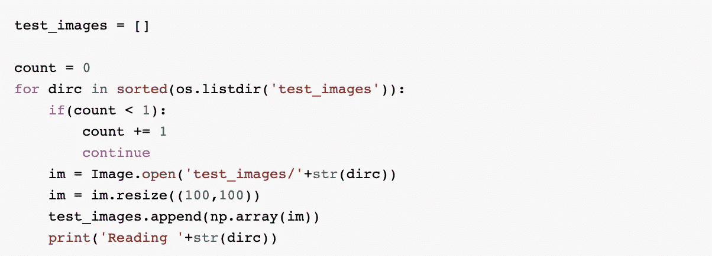

Loading Testing data

我们使用 PIL 从目录中加载图像，由于图像的尺寸不同，我们使用 im.resize()将每个图像的尺寸调整为 100x100 的标准尺寸。我们现在将 train_images、train_labels 和 test_images 从列表转换为 numpy 数组。numpy 数组“train_labels”在每一行中只有一个条目，因此我们使用下面的代码对它进行了整形。

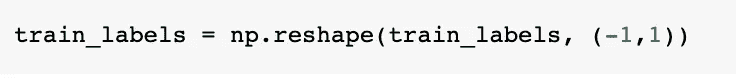

reshape labels of training data

注意:“-1”表示未知维度

既然我们已经重塑了我们的培训标签，我们可以将它们转换成一次性编码。要了解什么是一次性编码以及我们为什么要这样做，请点击[这里](https://machinelearningmastery.com/why-one-hot-encode-data-in-machine-learning/)。

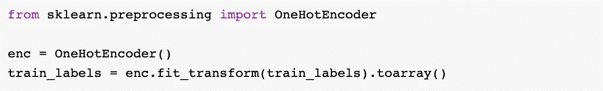

One-hot encoding our training labels

Scikit-learn 有一个预定义的函数，我们可以直接导入它来创建我们的一次性编码标签。我们现在通过将图像除以 255 来标准化它们。

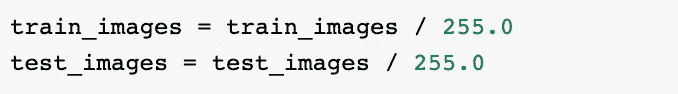

Image Normalization

将图像除以 255.0 将每个图像中的像素值范围减少到 0.0–1.0，这从我们的模型中提供了更好的结果。

## 构建我们的模型

在我们开始编写模型之前，检查我们的 Colab 是否使用 Tensorflow 2.0 作为后端，我们可以通过输入以下命令来完成。

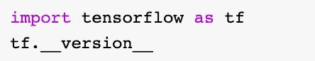

check TensorFlow version

如果 Tensorflow 的早期版本被用作后端，我们可以通过在笔记本中键入以下命令来升级它

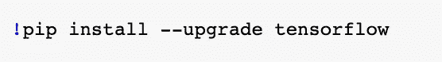

Upgrade Tensorflow

现在，我们可以开始进行必要的导入，并根据我们的训练数据创建批量张量。

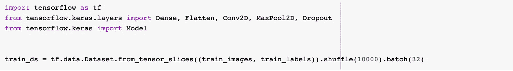

Create tensor slices from training data

Tensorflow 的数据集库(tf.data)在 2.0 版本中进行了扩展，并随着新的添加而变得更加复杂。

1.  from_tensor_slices()函数接受 numpy 数组作为参数，并生成张量对象。
2.  shuffle()以 buffer_size 作为参数，从缓冲区中随机抽取元素。
3.  batch()函数将 batch_size 作为参数，并将数据中的连续元素合并成与 batch_size 相等的批

记住 Tensorflow 2.0 更强调“急切执行”，避免计算图。因此，一旦单元被执行，操作就被评估。因此，train_ds 有两个随机采样和批处理的张量。这些张量代表训练图像和标签。

让我们开始对模型的架构进行编码。

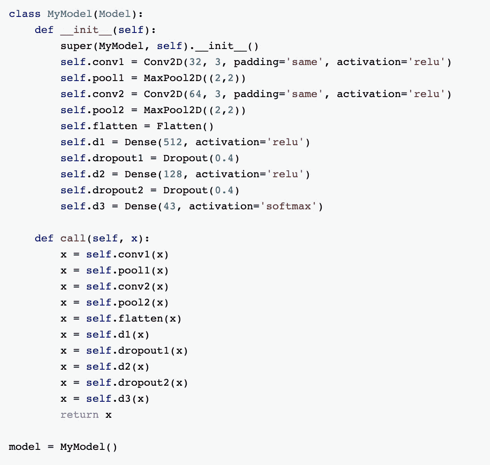

Model Architecture

我们创建我们的模型类(MyModel)作为模型的派生类。这为我们节省了大量编写自己的模型类的时间。我们将使用的架构是一个简单的 CNN，具有用于类别预测的密集层。想了解更多关于 CNN 的信息，请点击这里。在定义了我们的模型架构之后，我们为我们的模型创建一个对象，然后继续定义我们的损失函数、优化器和度量标准。

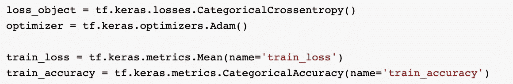

我们使用[分类交叉熵](https://peltarion.com/knowledge-center/documentation/modeling-view/build-an-ai-model/loss-functions/categorical-crossentropy)作为我们的损失函数，使用[亚当](https://machinelearningmastery.com/adam-optimization-algorithm-for-deep-learning/)作为我们的优化器。

1.  train_loss 将是每个时期所有损失的平均值
2.  train_accuracy 将是我们的模型在每个时期的精度度量

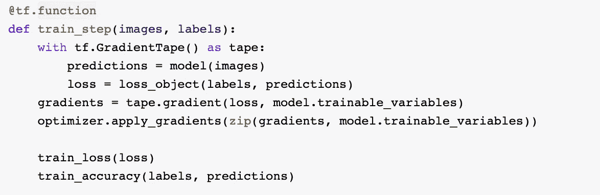

上述函数用于训练我们的模型。它接收图像和相应的标签，计算损失和梯度。

1.  由于 Tensorflow 2.0 使用“热切执行”，性能和可部署性可能会受到挫折。为了确保出色的性能和普遍的可部署性，我们可以添加一个 decorator @tf.function，这个 decorator 将函数转换成一个图形。
2.  tf。GradientTape()是用于计算差异的高级 API。在上面的代码行中，我们根据真实标签和预测标签计算损失，并使用梯度磁带来计算损失相对于模型变量的梯度(微分)，并将它们应用于优化器
3.  我们还会计算每一步的训练损失和准确度

既然我们已经完成了构建模型的所有必要步骤，我们就开始训练它，但是要执行下面的代码。

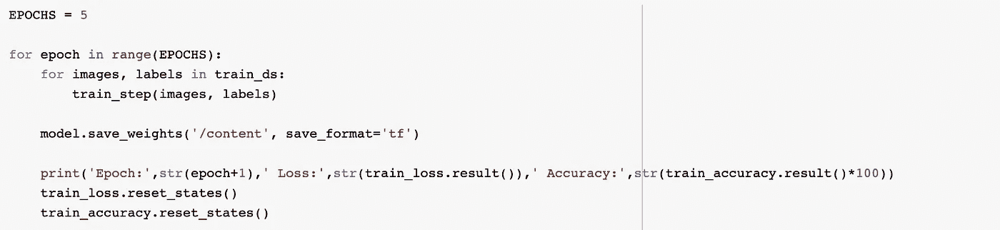

model training

我们为 5 个时期训练模型，并在每个时期后保存模型的权重。请注意，模型权重将保存在谷歌驱动器中。我们还重置了每个时期的训练损失和准确度值。

若要加载模型的权重，请创建 MyModel 类的实例，并使用 load_weights(path)函数。

## 基于测试集的预测

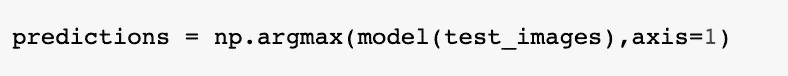

Model predictions

我们可以通过提供 test_images 作为参数来获得模型预测，由于模型返回概率分布，我们使用 np.argmax()来获得最高值。

# 结论

通过遵循以上步骤，您已经使用 Tensorflow 2.0 成功地对 CNN 进行了关于 Colab 的培训。如果您有任何疑问，请与我联系:)

链接至完整代码:[https://github.com/grohith327/traffic_sign_detection](https://github.com/grohith327/traffic_sign_detection)

# 参考

 [## 有效张量流 2 |张量流核心

### TensorFlow 2.0 有多种变化，以提高 TensorFlow 用户的工作效率。TensorFlow 2.0 消除了冗余…

www.tensorflow.org](https://www.tensorflow.org/guide/effective_tf2)  [## TensorFlow 2 专家快速入门| TensorFlow Core

### 这是一个谷歌协作笔记本文件。Python 程序直接在浏览器中运行——这是一种很好的学习和…

www.tensorflow.org](https://www.tensorflow.org/tutorials/quickstart/advanced)