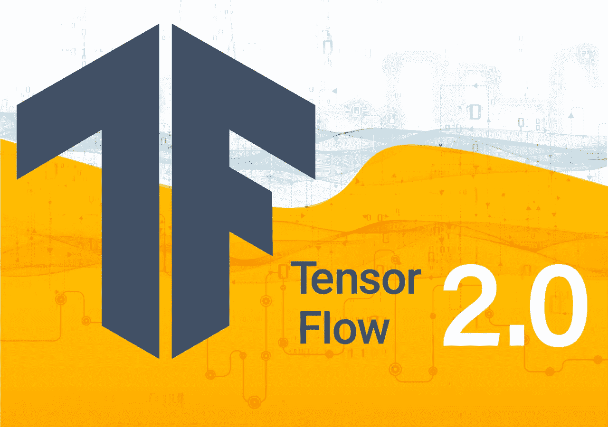

# TensorFlow 2.0:动态、可读、高度扩展——Exxact 博客

> 原文：<https://towardsdatascience.com/tensorflow-2-0-dynamic-readable-and-highly-extended-exxact-blog-4755ad9d2f27?source=collection_archive---------21----------------------->

考虑学习深度学习的新 Python 框架？如果你已经知道一些 TensorFlow，并且正在寻找一些更有活力的东西，你不必再完全切换到 PyTorch，这要感谢 TensorFlow 2.0 中的一些实质性变化。事实上，2.0 中的许多变化专门针对 TensorFlow 的所谓缺点。默认情况下，有了急切执行，当你过分热衷于你的面向对象原则时，你不再需要预先定义一个静态图，初始化会话，或者担心张量超出适当的范围。TensorFlow 仍然拥有大约 3 倍于 PyTorch 的用户基础(从 GitHub 上引用[每个框架](https://github.com/search?q=pytorch)的存储库来判断)，这意味着更多的扩展、更多的教程和更多的开发人员合作探索堆栈溢出上所有可能的代码错误的空间。您还会发现，尽管从 TensorFlow 2.0 开始发生了重大变化，但项目开发人员已经采取了许多措施来确保可以保持向后兼容性。

# 什么是张量流？

TensorFlow 的核心是一个用于张量的数学操作、存储和转换的软件包，是矩阵概念的推广。TensorFlow 的主要效用和开发驱动力是机器学习，尤其是具有数百万参数的深度神经网络。TensorFlow 通常被用作 Python 的扩展，但所有那些允许 TF 在 GPU 和谷歌张量处理单元等硬件加速器上运行的底层组件都是用 C++和 CUDA 等编译语言编写的。TensorFlow 于 2015 年在 Apache 2.0 许可下发布，此后在研究、工业和教育社区中得到了广泛使用。它被大约 3 倍于下一个最受欢迎的框架的深度学习实践者使用，并被一些项目高度扩展，如用于以隐私为中心的联合学习的 [TF-encrypted](https://github.com/tf-encrypted/tf-encrypted) 或用于图像和音乐的深度学习增强艺术的 [Magenta](https://magenta.tensorflow.org/) 。许多 AI 和 ML 从业者的大型用户社区和开源精神意味着有大量的材料可以学习和项目可以贡献。张量流计算是基于图形的，张量形式的数据以定向方式沿着连接边在计算节点之间流动。对于建立并行计算，图是一个合适的认知框架。它也非常适合分布式计算、编译器级别的优化，并提供了一个存在于编写它的编程语言之外的模型结构(因此是可移植的)。但是 TensorFlow pre-2.0 中采用的基于[图和会话](https://www.tensorflow.org/guide/graphs)的方法要求开发人员首先定义一个静态图，然后建立一个会话来运行该图。这种方法导致更多重用的样板代码，避免使用普通的 Python 流控制，并且因为在 TensorFlow 会话中调用它们之前必须定义图形，所以它们在训练期间不太灵活。

张量流图 CC 由[Tensorflow.org](https://www.tensorflow.org/guide/graphs)

# TensorFlow 2.0 的主要变化

简化 TensorFlow 体验是 TensorFlow 2.0 的主要开发目标。他们通过减少冗余、完全的 keras 集成以及从静态图形到快速执行的重大转变实现了这一点。后一种变化使框架更加动态，并且可以说提高了代码的直观性和可读性。TF 2.0 已经完全接受 keras 作为高级应用程序编程接口(API)。这意味着不再直接使用 keras，而是由 TensorFlow 后端在后台完成所有繁重的工作，keras 的所有功能都可以从 tf.keras 下的 TensorFlow 中获得。尽管 keras 与 TensorFlow 的集成早在 2.0 之前就已经开始，但该团队已经投入了大量精力来整合冗余，并将所有内容归入 keras 旗下。特别是，您可能会发现自己正在使用 keras layers API。keras 的发明者 Francois Chollet 发布了一个 [18 条 tweet 速成课程](https://twitter.com/fchollet/status/1105139360226140160)，并提供了代码支持，突出了 TF 2.0 中 layers API 所扮演的核心角色。以前，你可以在 TensorFlow 的几个不同角落找到略有不同的相同功能。

2.0 中的一个主要更新是合并了许多令人困惑的冗余，现在 keras API 中内置了许多功能。现在使用面向对象编程和优雅的 Python 流控制的概念要容易得多。总的来说，TF 2.0 承诺为研究级实验提供更高的灵活性，同时保留推动 TensorFlow 成为最广泛的深度学习框架的现实世界实用性和可部署性。虽然 TF 2.0 采用急切执行使实验和原型制作变得轻而易举，但开发人员可以通过用 tf.function 注释包装他们的代码来获得图形的所有好处。更重要的是，对于大多数用户来说，2.0 中的变化可能会导致更平滑的学习曲线和更可读的代码。

# 值得注意的项目

作为 TF 2.0 的一部分和深度学习的一个主要趋势，一个令人兴奋的发展是边缘计算:轻量级深度学习模型，旨在部署在低功耗分布式设备上，如手机、嵌入式微控制器和物联网(IoT)设备。TensorFlow Lite 是为边缘计算量身定制的，TF 开发者峰会在一款新的轻量级 TPU 支持的 [Coral 开发板](https://www.youtube.com/watch?v=CukaWaWbBHY&list=PLQY2H8rRoyvzoUYI26kHmKSJBedn3SQuB&index=34)上演示了 edge ML。这是对像[树莓派](https://medium.com/tensorflow/tensorflow-1-9-officially-supports-the-raspberry-pi-b91669b0aa0)这样的设备的现有支持的补充。其他利用 TF 2.0 改进功能的有趣项目包括一个名为 [DeepPavlov](https://devpost.com/software/deeppavlov-eio49m) 的开源聊天机器人库，一个[虫咬图像分类器](https://devpost.com/software/bugbite-tf)，以及一个基于手机图像估计污染水平的空气质量预测应用[。](https://devpost.com/software/air-cognizer)

# 警告

在撰写本文时，TensorFlow 2.0 仍然是预发布版本，因此伴随着一系列的错误和不断变化的功能，这些错误和功能会伴随任何处于早期开发阶段的项目。例如，在 TF 2.0 alpha 发布后不久，我开始了一个涉及灵活 cGAN 模型的新项目，升级到当前的 TF 2.0 beta 意味着由于 keras layers API 处理张量拼接的方式中的错误而导致的主要代码更改。任何基于 TF 2.0 的大型项目都有可能经历类似的修订，至少需要几周到几个月的时间，因为 2.0 已经准备好全面发布了。

# 如何开始使用 TensorFlow 2.0

TensorFlow 价值主张的一个重要组成部分是围绕开源项目构建的大型社区。这意味着有大量的教程、博客文章和成熟的项目可供选择。我建议你采用一个分三部分的方法来快速掌握 2.0。

1.  通过阅读博客帖子(如[这篇](https://medium.com/tensorflow/whats-coming-in-tensorflow-2-0-d3663832e9b8))和观看来自 [TF Dev Summit 2019](https://www.youtube.com/watch?v=P4_rJfHpr7k&list=PLQY2H8rRoyvzoUYI26kHmKSJBedn3SQuB) 的 TensorFlow 团队的一些演示，从高层次了解 TensorFlow 2.0 的主要变化以及这些变化如何影响您的项目。这是为了激发你的想象力，并有助于专注于特定的概念，这些概念将对你能构建的东西产生巨大的影响。
2.  从像[谷歌种子库](https://research.google.com/seedbank/)这样的资源中研究大量的教程和代码示例，它们都附有代码，你可以在谷歌协作笔记本中修改和运行。这是习惯 TF 2.0 中更加动态和灵活的急切执行原则的好方法，我想你会同意结果比旧的基于图形和会话的开发流程更加 Pythonic 化。
3.  你从 1 和 2 得到的印象应该给你足够的 2.0 的认知大纲，开始解决真正的问题。如果你对强化学习感兴趣，你可能会发现 [TF-Agents](https://github.com/tensorflow/agents) 成为你下一个项目的有用权宜之计，而自然语言处理从业者可能会发现[递归神经网络](https://www.tensorflow.org/beta/tutorials/text/text_classification_rnn)的改进后的新易用性很快变得不可或缺。

最后，如果您一直对构建 TensorFlow 专业知识并在项目中使用它持观望态度，2.0 标志着一个方便的边界，它对可用性和实用性进行了许多改进。另一方面，如果你是一个 TensorFlow 老手，你应该会发现你所知道和喜欢的所有功能仍然可以在其他领域进行无数的改进。许多新特性将在项目早期的快速迭代中提高您的效率，而不会牺牲后期的便利部署。

# TensorFlow GPU 基准测试

*   [面向 TensorFlow 的 RTX 2080 Ti 深度学习基准](https://blog.exxactcorp.com/nvidia-rtx-2080-ti-deep-learning-benchmarks-for-tensorflow-updated-with-xla-fp16/)
*   [面向 Tensorflow 的泰坦 RTX 深度学习基准](https://blog.exxactcorp.com/titan-rtx-performance-benchmarks-for-tensorflow-2019/)
*   [面向 TensorFlow 的 NVIDIA Quadro RTX 6000 GPU 性能指标评测](https://blog.exxactcorp.com/nvidia-quadro-rtx-6000-gpu-performance-benchmarks-for-tensorflow/)
*   [Quadro RTX 8000 深度学习性能指标评测 TensorFlow](https://blog.exxactcorp.com/nvidia-quadro-rtx-8000-deep-learning-performance-benchmarks-for-tensorflow-2019/)

*原载于 2019 年 8 月 13 日*[*【https://blog.exxactcorp.com*](https://blog.exxactcorp.com/tensorflow-2-0-dynamic-readable-and-highly-extended/)*。*