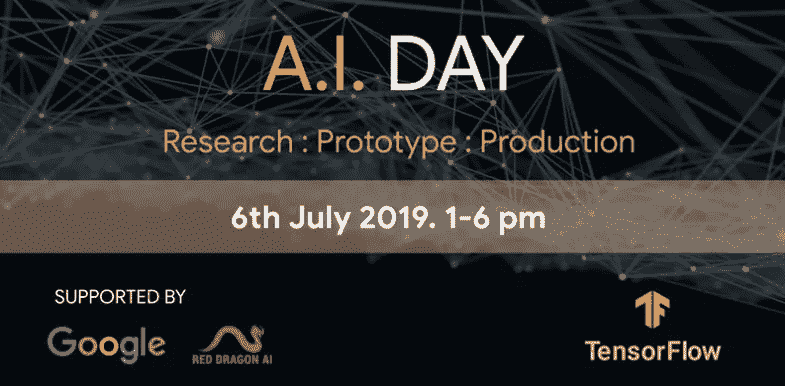
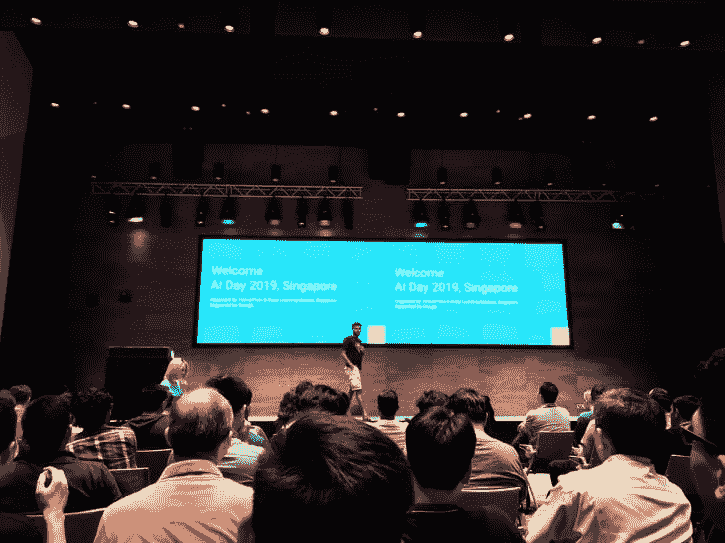

# tensor flow 2.0——这是我在谷歌的人工智能日学到的东西

> 原文：<https://towardsdatascience.com/tensorflow-2-0-here-is-what-ive-learned-from-a-i-day-at-google-64a31914610f?source=collection_archive---------15----------------------->

## 从研究、原型到生产

信不信由你，在新加坡有很多不同的聚会讨论数据科学和人工智能。

但我最喜欢的同学会依然是 [**TensorFlow 和深度学习新加坡**](https://www.meetup.com/TensorFlow-and-Deep-Learning-Singapore/) 和 [**DataScience SG**](https://www.meetup.com/DataScience-SG-Singapore/) 。

当我意识到 [TensorFlow 和深度学习新加坡](https://www.meetup.com/TensorFlow-and-Deep-Learning-Singapore/)将组织这个**一天的会议—**[**a . I . Day**](https://www.meetup.com/TensorFlow-and-Deep-Learning-Singapore/events/262501989/)谈论和展示正在用于开发和创建真实世界人工智能产品的最新和最伟大的技术时…言语简直无法形容我有多激动！

> 看到人们谈论这些技术的出现是一回事，看到行业专家用行业的技巧和诀窍来分析这些产品是如何制造的是另一回事。

所有演讲者都是在该领域工作的第一手从业者，而不是营销和销售人员。

更令人兴奋的是，在新加坡，本次大会首次邀请了 4 位机器学习领域的谷歌开发者专家和 3 位来自谷歌大脑的演讲人——他们都在同一个平台上。

如果你是刚刚开始使用 TensorFlow 2.0 或一直在使用 tensor flow 2.0 的人，我相信你已经看过了 [Paige Bailey](https://medium.com/u/b25caf7ab5dc?source=post_page-----64a31914610f--------------------------------) 的一些视频，他目前是 TensorFlow core 和 Swift 的产品经理(他也是 TensorFlow core 的开发者倡导者)。

因此，能够在会议期间见到她本人，我激动不已！

这正是我喜欢成为数据科学和开源社区的一部分的原因——彼此分享，同时学习。

Upgrade your existing code for TensorFlow 2.0 by Paige Bailey

虽然我无法记下整个会议中每个主题的所有细节，但我设法记下了一些重要的知识和教训，我相信这些知识和教训会对你有所帮助。

在这篇文章结束时，我希望你能更多地了解 TensorFlow 2.0 提供的**最新功能和其他**最先进的模型**在你的项目中的应用。**

我们开始吧！

# 演讲者的主题从研究、原型到生产

A.I. Day 2019

在我开始之前，如果您想了解更多关于 TensorFlow 2.0 的信息，请随意查看这里的[官方网站](https://www.tensorflow.org/beta)或[我不久前写的文章](/announcement-tensorflow-2-0-has-arrived-ee59283fd83a)，其中讨论了实现的新功能。

在接下来的章节中， ***我将依次讲述每个主题以及我学到的简短经验/知识*** :

1.  **TF . keras 和 TensorFlow 2.0 介绍**—Google Brain 的 Paige Bailey
2.  **对话式人工智能的图形深度学习** —红龙人工智能的山姆·维特芬
3.  **TensorFlow Extended (TFX):生产中的真实世界机器学习**——来自谷歌大脑的 Robert Crowe
4.  **我们应该展示哪张酒店照片？用于图像选择的神经线性强盗** —来自 Agoda 的 Sirinart Tangruamsub
5.  **XLNet——最新的语言模型**——红龙 AI 的马丁·安德鲁斯
6.  用于 TensorFlow 的 Swift——谷歌大脑的 Paige Bailey
7.  **TensorFlow Lite: On-Device ML 和模型优化工具包**——来自 Light 的 Jason Zaman

每个主题都是相互独立的。所以请随意跳到你感兴趣的话题。

## **1。**[**TF . keras**](https://www.tensorflow.org/guide/keras)**和**[**tensor flow 2.0**](https://www.tensorflow.org/beta)简介

*   **Keras**—tensor flow 2.0 最值得推荐的高级 API
*   如果在`model.compile()`方法中使用`run_eagerly = True`,模型性能将会非常慢，因为该方法是静态运行的。`model.compile()`默认是非急切情况下进行训练和推理
*   使用功能方法构建模型(使用高级 API 构建 DAG)

## **2。** [**对图形进行深度学习**](/graph-theory-and-deep-learning-know-hows-6556b0e9891b) **用于对话式 AI**

*   现在使用的图的例子包括社交图、推荐图等。
*   知识图表——Freebase、Wikidata、Cyc 和 DBpedia
*   **构建图表的挑战**—数据在欧几里得空间中没有很好地按顺序映射。很难捕捉图表中的所有相关节点来进行准确预测
*   如何解决这些挑战— [**图卷积**](/how-to-do-deep-learning-on-graphs-with-graph-convolutional-networks-62acf5b143d0) 。这种方法在图中移动，一次一个节点，以捕捉所有相关节点，并给出更准确的预测，特别是在对话式人工智能中
*   对图形的深度学习可能具有挑战性，目前仍在积极研究中

## **3。** [**TensorFlow 扩展**](https://www.tensorflow.org/tfx) **(TFX):生产中的真实世界机器学习**

*   [TFX](https://www.tensorflow.org/tfx) 是一个用于部署生产 ML 管道的端到端平台
*   TFX 流水线是实现 ML 流水线的一系列组件，ML 流水线是专门为可扩展的高性能机器学习任务设计的
*   TFX 的主要库包括张量流数据验证、张量流变换、张量流模型分析和张量流服务
*   **ML 开发部署面临的挑战** —数据生命周期管理、标记数据、特征空间覆盖、最小维度、最大预测数据、公平性、稀有条件。TFX 旨在应对这些挑战，尤其是在**数据生命周期管理**方面
*   [**位于 TFX 的元数据存储库**](https://www.tensorflow.org/tfx/guide/mlmd) 包含工件及其属性、组件的执行记录(运行)和数据来源(接受过哪些数据训练？)在所有执行中。
*   位于 TFX 的元数据存储在检查你的模型性能中扮演着重要的角色。例如，一年前您训练了一个模型，现在您有了一个新模型，并希望将其性能与以前的模型进行比较。您可以使用已经为之前的模型存储了元数据的 TFX，并使用 TensorBoard 可视化两个模型的性能
*   Apache Beam 为运行批处理和流数据处理作业提供了一个框架，这些作业以分布式方式在各种执行引擎上运行

## **4。我们应该展示哪张酒店照片？用于图像选择的神经线性 Bandit**

Hotel pictures shown on Agoda website

*   向用户推荐照片是基于特定的上下文和酒店图片
*   之后，训练神经网络模型，然后使用[贝叶斯线性回归](/introduction-to-bayesian-linear-regression-e66e60791ea7)计算用户点击酒店图片的概率
*   这个概念很大程度上是基于这篇[的研究论文](https://arxiv.org/pdf/1802.09127.pdf)

## **5。XLNet —最新的语言模型**

*   [**XLNet**](https://arxiv.org/abs/1906.08237) 是一种用于语言理解的广义自回归预训练方法
*   XLNet 表明置换法作为语言模型目标是一个很好的选择
*   与 [BERT](/bert-explained-state-of-the-art-language-model-for-nlp-f8b21a9b6270) 相比，XLNet 的关键增强包括最大限度地利用上下文进行预测、双流注意力和长记忆(如 [TransformerXL](https://arxiv.org/abs/1901.02860) )

## **6。用于 TensorFlow 的 swift**

Swift for TensorFlow: The Next-Generation Machine Learning Framework (TF Dev Summit ‘19)

*   **Swift for TensorFlow** 是用于深度学习和差异化编程的下一代平台
*   用于 TensorFlow 的 Swift 并没有牺牲作为强语言的性能(类似于 C++)。它是一种跨平台的语言——可以去 C++能去的任何地方
*   能够用于构建和训练新的模型，例如 [AlphaGo](https://deepmind.com/research/alphago/) 和[英雄联盟](https://www.youtube.com/watch?v=c0SVXInpw5k)

## 7。[**tensor flow Lite**](https://www.tensorflow.org/lite)**:On-Device ML 和模型优化工具包**

*   **TensorFlow Lite** 用于在移动和物联网设备上部署机器学习模型，用于设备上的推理
*   **为什么要在设备上使用 ML？因为我们可以通过快速紧密的交互访问更多数据，同时还能保护隐私**
*   在对精确度影响最小的情况下，优化片上 ML 模型的方法之一是通过**量化**
*   **量化**通过降低模型本身的值和运算的精度，能够减少模型的大小和推理所需的时间。这可能意味着模型尺寸缩小 4 倍，执行速度(CPU)提高 10–50%。

# 最后的想法

Wonderful Google office tour in Singapore

感谢您的阅读。

尽管 TensorFlow 2.0 仍在积极开发中，但您肯定可以开始使用它的功能来构建具有热切执行能力的模型。

我希望您了解了更多关于 TensorFlow 2.0 和其他**最先进模型**提供的**最新特性，以便在您的项目中应用。**

同时，如果您有兴趣了解 TensorFlow 2.0 的最新发展，您可以随时订阅[邮件列表](https://www.tensorflow.org/community/lists)或[在此加入社区](https://www.tensorflow.org/community/groups)！

一如既往，如果您有任何问题或意见，请随时在下面留下您的反馈，或者您可以随时通过 [LinkedIn](https://www.linkedin.com/in/admond1994/) 联系我。在那之前，下一篇文章再见！😄

## 关于作者

[**Admond Lee**](https://www.admondlee.com/) 现在的使命是让每个人都能接触到数据科学。他正在帮助公司和数字营销机构通过创新的数据驱动方法，利用可操作的见解实现营销投资回报。

凭借其在高级社会分析和机器学习方面的专业知识，Admond 旨在弥合数字营销和数据科学之间的差距。

如果你想了解更多关于 Admond 的故事、数据科学服务以及他如何在营销领域帮助你，请查看他的 [**网站**](https://www.admondlee.com/) 。

你可以在 [LinkedIn](https://www.linkedin.com/in/admond1994/) 、 [Medium](https://medium.com/@admond1994) 、 [Twitter](https://twitter.com/admond1994) 、[脸书](https://www.facebook.com/admond1994)上和他联系。

 [## 阿德蒙德·李

### 让每个人都能接触到数据科学。Admond 正在通过先进的社交分析和机器学习，利用可操作的见解帮助公司和数字营销机构实现营销投资回报。

www.admondlee.com](https://www.admondlee.com/)