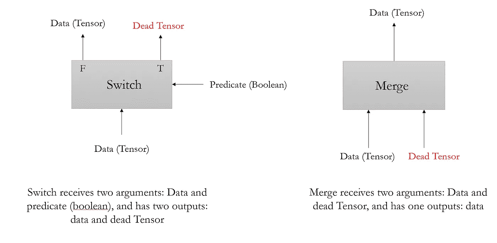
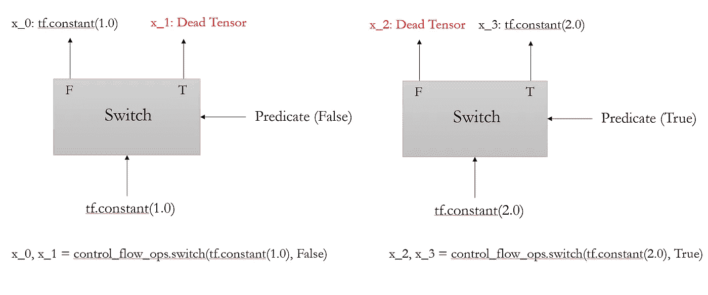
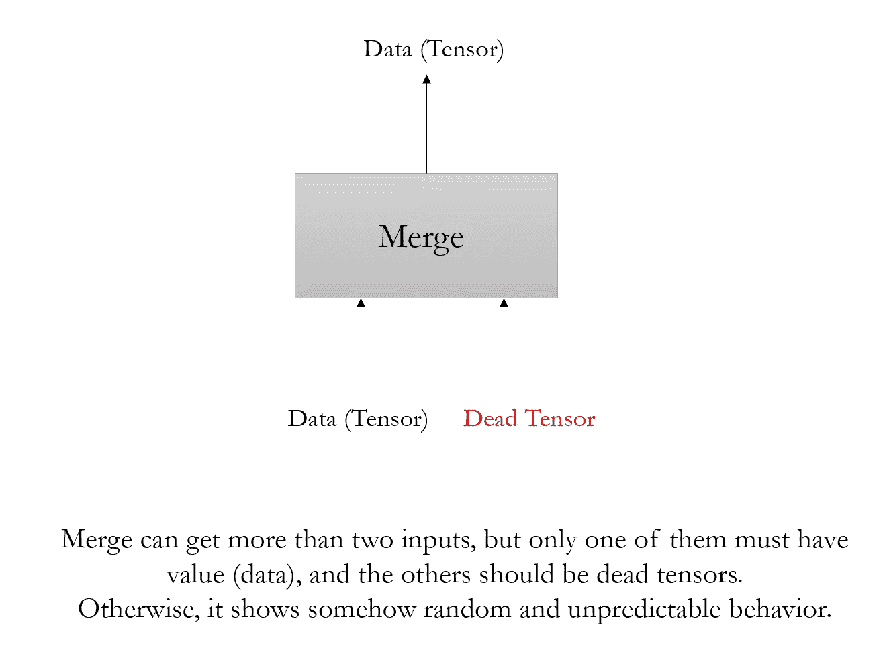
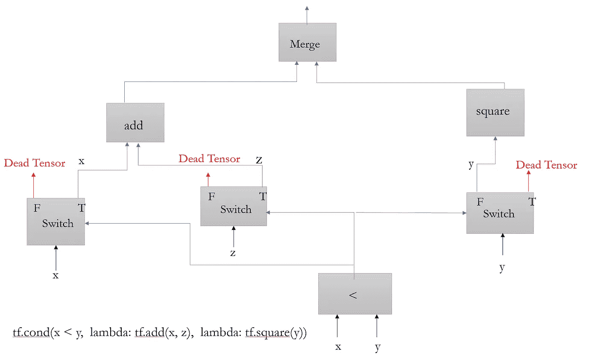
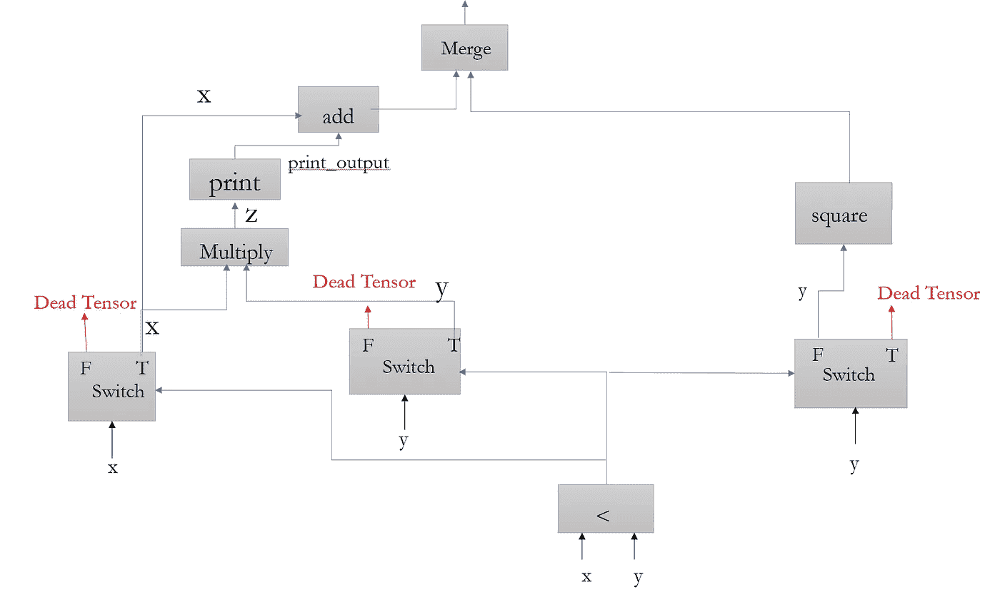
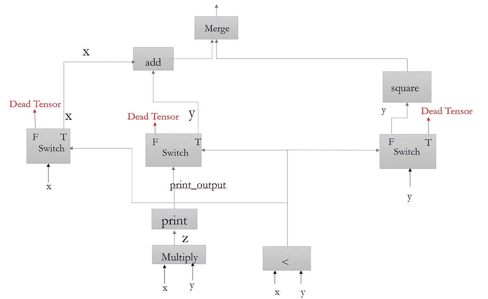

# TensorFlow 控制流:tf.cond()

> 原文：<https://towardsdatascience.com/tensorflow-control-flow-tf-cond-903e020e722a?source=collection_archive---------4----------------------->

## 更深入地了解控制流操作在张量流中的工作方式

## 介绍

Tensorflow 是最受欢迎的深度学习框架之一，在推进深度学习方面发挥了关键作用。我使用 Tensorflow 已经两年多了，但是在使用控制流的过程中，我看到了许多奇怪和不可预测的行为。

最近(2019 年 4 月 19 日)看了一段 TensorFlow 团队自己内部培训的视频，很有帮助，让大家更清楚控制流 ops 是怎么工作的。我绝对推荐看这个[视频](https://youtu.be/IzKXEbpT9Lg)。

视频详细介绍了 tf.cond()和 tf.while_loop。所以，我决定写这篇文章来详细说明 tf.cond()是如何工作的，并提供一些例子来说明。希望我会在后续的文章中介绍 tf.while_loop。

*注*:我打算在这篇帖子里涉及底层操作。还有其他类似功能性操作的操作，这超出了本文的范围。

## 切换并合并

在构建图的过程中使用的两个重要操作是切换和合并。因此，在本节中，我将介绍它们是如何工作的，并提供一些例子来熟悉它们的一些怪异行为！



Figure 1: Schematics of what are the inputs and outputs of Switch and Merge, and how they work.

如您所见，开关接收两个输入:数据和谓词，并提供两个输出:数据和死张量！。此外，Merge 接收两个(或两个以上)输入，并提供一个输出，即数据。我将在下面谈到更多的细节。

**开关**

首先，让我们考虑开关。如果您访问 Tensorflow 网站，您可以找到关于开关操作的定义和总结:

> 将`*data*`转发到由`*pred*`决定的输出端口。如果`*pred*`为真，则`*data*`输入被转发给`*output_true*`。否则，数据转到`*output_false*`。

正如我之前提到的，Switch 接收两个输入。其中一个是谓词，是布尔张量(真或假)，还有一个是要传递的数据。谓词决定数据应该通过 output_true 分支还是 output_false 分支传递。但是，这里有一个奇怪的东西是*死张量*的概念。不管谓词是真还是假；总是有两个输出:一个是数据，另一个是死张量。如果`pred` 为真，则死张量沿着`output_false`发送(反之亦然)。

没有明确的参考资料解释为什么以及如何死张量是有用的，但似乎它们对分布式处理是有用的，它们的存在是一个实现细节。例如，你可以在这里找到[的](https://stackoverflow.com/questions/46680462/tensorflow-node-which-is-dead)一个令人信服的答案:

> 首先，死张量是 TensorFlow 的控制流构造:`[*tf.cond()*](https://www.tensorflow.org/api_docs/python/tf/cond)`和`[*tf.while_loop()*](https://www.tensorflow.org/api_docs/python/tf/while_loop)`的一个实现细节。这些构造使 TensorFlow 能够根据数据相关值确定是否执行子图。

让我们看一个例子，让事情更清楚。我从[这篇](https://stackoverflow.com/questions/47107994/how-to-use-the-function-merge-and-switch-of-tensorflow)帖子中获得了提供这个例子的灵感。

```
import tensorflow as tf
from tensorflow.python.ops import control_flow_opsx_0, x_1 = control_flow_ops.switch(tf.constant(1.0), False)
x_2, x_3 = control_flow_ops.switch(tf.constant(2.0), True)
print(x_0, x_1, x_2, x_3)
with tf.Session() as sess:
    print(sess.run(x_0))    # prints 1.0
    print(sess.run(x_3))    # prints 2.0'''
output:
Tensor("Switch:0", shape=(), dtype=float32) Tensor("Switch:1", shape=(), dtype=float32) Tensor("Switch_1:0", shape=(), dtype=float32) Tensor("Switch_1:1", shape=(), dtype=float32)
1.0
2.0
'''
```

因此，让我们深入了解一下这个示例中发生了什么。我创建了一个图来说明正在发生的事情。



Figure 2: Illustrating what is happening in the provided example.

我认为从图中可以清楚地看到发生了什么。如在`x_0, x_1 = control_flow_ops.switch(tf.constant(1.0), False)`中，谓语是假的；因此，`tf.constant(1.0)`被转发到`output_false`分支，而死张量被转发到`output_true`分支。

需要提及的一件重要事情是，我已经在 tf 内执行了`x_0`和`x_3`。Session()，它包含数据(张量)。如果我试图运行和执行死张量，我将面临一个错误。每当您试图在 Session.run()中执行和检索死张量时，都会导致错误。例如，以下代码引发了一个著名且经常发生的错误:

```
with tf.Session() as sess:
    print(sess.run(x_1))'''
output:
**InvalidArgumentError**: Retval[0] does not have value
'''
```

现在，我认为这对于 Switch 来说已经足够了。让我们看看合并是如何操作的。

**合并**

Merge 是构造 tf.cond()图所需的另一个运算符。



Figure 3: Merge ops

Merge 可以接收多个输入，但其中只有一个必须包含数据，其他的应该是死张量。否则，我们将面临一些随机和不可预测的行为。让我们看看合并在最后一个例子中是如何工作的:

```
with tf.Session() as sess:
    print(sess.run(control_flow_ops.merge([x_0, x_1])))       
    print(sess.run(control_flow_ops.merge([x_1, x_0])))       
    print(sess.run(control_flow_ops.merge([x_2, x_3])))   
    print(sess.run(control_flow_ops.merge([x_3, x_2])))     
    print(sess.run(control_flow_ops.merge([x_0, x_1, x_2])))'''
output:
Merge(output=1.0, value_index=0)
Merge(output=1.0, value_index=1)
Merge(output=2.0, value_index=1)
Merge(output=2.0, value_index=0)
Merge(output=1.0, value_index=0)
Merge(output=2.0, value_index=2)
'''
```

它的表现完全符合我们的预期。但是，当你把两个有数据的张量输入合并时，事情变得有点出乎意料和奇怪。

```
with tf.Session() as sess:
    print(sess.run(control_flow_ops.merge([x_1, x_0, x_3]))) 
    print(sess.run(control_flow_ops.merge([x_0, x_3])))
    print(sess.run(control_flow_ops.merge([x_3, x_0])))'''
output:
Merge(output=1.0, value_index=1)
Merge(output=1.0, value_index=0)
Merge(output=2.0, value_index=0)
'''
```

有时，它返回`x_0`的值，有时返回`x_3`的值。所以，对这种行为要谨慎。

注意:死张量通过计算图形传播，直到它们到达合并运算。

## tf.cond()

现在，我认为我们已经很好地掌握了交换和合并是如何操作的。现在正是深入 tf.cond()的好时机。我正在考虑一个简单的例子，其中输入参数是`pred`、`true_fn`和`false_fn`。

```
tf.cond(pred, true_fn, false_fn)
```

我将考虑一个简单的例子来介绍这个概念。考虑以下情况:

```
tf.cond(x < y, lambda: tf.add(x, z), lambda: tf.square(y))
```

我已经为这个简单的例子构建了计算图，您可以在图 4 中找到它。



Figure 4: computational graph to show how tf.cond() works.

首先要提的是每个输入都有一个开关。我所说的输入是指 tf.cond()中 true 和 false 函数的参数。在本例中，有三个输入(x、y 和 z ),因此，计算图中有三个开关。

对于 true_fn，开关输出从 true 分支发出。对于 false_fn，开关输出从 false 分支发出。根据条件结果(无论 x 是否小于 y)，谓词可以为真或假，其中一个分支(左或右)将被执行。值得注意的是，`tf.add()`和`tf.square()`操作都在开关之后。因此，在本例中，只有其中一个将被执行，另一个保持不变。

另外，我觉得这张图有点不对。我认为死张量通过加法或平方运算传播，直到它们遇到合并运算。合并运算去掉了死张量，只提供一个输出。

希望到目前为止，您已经了解了一些关于 tf.cond()的知识，并且对使用这个 API 已经变得更加得心应手。我将通过提供一个有争议的例子来结束这篇文章，并解释到目前为止我们所学到的东西是如何帮助我们理解内在工作的。在 TensorFlow 网站中，您可以找到以下声明:

> **警告**:无论运行时选择哪个分支，在`*true_fn*`和`*false_fn*`之外创建的任何张量或操作都将被执行。尽管这种行为与 TensorFlow 的数据流模型是一致的，但它经常让那些期待更懒惰的语义的用户感到惊讶。

因此，我将提供一个例子来阐明这个警告的含义。我提供了两个例子:在第一个例子中，所有的操作都定义在`true_fn`和`false_fn`中，在第二个例子中，一些操作定义在这个函数之外。我将构建并可视化计算图来解释为什么会出现这种行为。

**例 1:**

```
import tensorflow as tf
x = tf.constant(3.0)
y = tf.constant(2.0)def true_fn():
    z = tf.multiply(x, y)
    print_output = tf.Print(z, [z], "The value I want to print!!")
    return tf.add(x, print_output)def false_fn():
    return tf.square(y)result = tf.cond(x < y, true_fn, false_fn)with tf.Session() as sess:
    print(sess.run(result))## output: 4.0'''
if you keep everything the same and just changing x to x = tf.constant(1.0), the predicate becomes true and the output will be as the following:3.0
The value I want to print!![2]
'''
```

这里需要重点关注的是，所有的张量和运算都是在函数内部创建的。因此，有三个输入参数，因此，图中有三个开关。为这种情况构建一个计算图将会很容易。



Figure 5: Computational graph for Example 1.

如果谓词为真(x 将小于 y)，将执行`true_fn` (左分支)，右分支不执行，保持不变(反之亦然)。

*注*:我用过 tf。Print()函数，以便打印计算图形中的内容，并访问图形中张量的值。使用 tf。Print()有点复杂，我不打算在这里解释它是如何工作的。这里有一篇关于这个功能[的优秀博文。](/using-tf-print-in-tensorflow-aa26e1cff11e)

*注*:当谓词为假(x > y)时，执行`false_fn` (右分支)，结果是 tf。Print()只接收死张量，不打印任何东西。

**例 2:**

示例 1 有点无聊，结果完全符合我们的预期。在这个例子中，事情变得更加有趣。

```
x = tf.constant(3.0)
y = tf.constant(2.0)z = tf.multiply(x, y)
print_output = tf.Print(z, [z], "The value I want to print!!")def true_fn():
    return tf.add(x, print_output)def false_fn():
    return tf.square(y)result = tf.cond(x < y, true_fn, false_fn)with tf.Session() as sess:
    print(sess.run(result))'''
output:
4.0
The value I want to print!![6]
'''
```

在这个例子中，谓词为假(x > y ),我们期望`false_fn` 执行而`true_fn` 保持不变。然而，我们可以看到输出包含“我想打印的值！！[6]“属于哪一种`true_fn`。起初，也许这种行为看起来有点怪异，但这与我们目前所看到和理解的完全一致。一些张量(z 和 print_output)已在函数外定义，因此，它们将被放在计算图中的开关之前。让我们用图表来说明这一点:



Figure 6: Computational graph for Example 2.

您可以在图 6 中看到，乘法和打印运算在开关之外(之前)。所以，不管谓词是真还是假，这两个操作在两种情况下都会被执行。

因此，通过理解切换和合并，并意识到 tf.cond()是如何工作的，希望您可以看到这种行为与 TensorFlow 的数据流模型是一致的，并且没有任何错误。

我将在这里完成这篇文章。谢谢你把帖子看完。请让我知道我是否犯了一个错误或有什么不对的地方。希望我会在后续的文章中介绍 tf.while_loop()。

## 参考

*   内部[张量流](https://www.youtube.com/watch?v=IzKXEbpT9Lg&t=907s):控制流
*   [张量流，死节点](https://stackoverflow.com/questions/46680462/tensorflow-node-which-is-dead)
*   [如何使用 TensorFlow 的合并和切换功能？](https://stackoverflow.com/questions/47107994/how-to-use-the-function-merge-and-switch-of-tensorflow)
*   [官方](https://www.tensorflow.org/api_docs/python/tf/cond) TensorFlow [文档](https://www.tensorflow.org/api_docs/cc/class/tensorflow/ops/switch)
*   [使用](/using-tf-print-in-tensorflow-aa26e1cff11e) tf。在 TensorFlow 中打印()