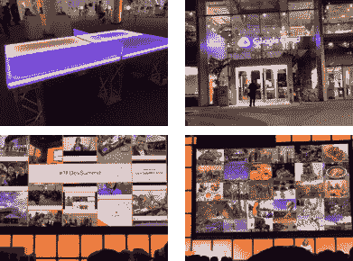

# 2019 TensorFlow 开发峰会总结

> 原文：<https://towardsdatascience.com/tensorflow-dev-summit-2019-wrap-up-a43ec2e5845a?source=collection_archive---------28----------------------->



连续第二年，我有幸参加了 3 月 6 日—7 日在美国加州桑尼维尔的谷歌活动中心举行的 [TensorFlow dev 峰会](https://www.tensorflow.org/dev-summit/)。去年，我对组织、场地、日程、演讲者印象深刻，我认为今年甚至更好。因此，再次祝贺 Google 和 TensorFlow 团队组织了如此令人惊叹的活动！

TensorFlow Dev Summit 仍然汇集了来自世界各地的机器学习用户的多样化组合；现在是两天而不是一天。第一天充满了技术讲座、演示、新产品发布和对框架的其他改进，而第二天侧重于闪电讲座，即参与者可以与 TensorFlow 团队成员一起编写代码的实践会议。

关于这次活动有很多有趣的事情要说，所以在这篇文章中，我将分享我的个人笔记，并简要总结一下最引起我注意的事情。


# **第 1 天-3 月 6 日**


## 张量流 2.0

在 TensorFlow 2.0 中，重点是让 API 更简单、更自然。API 组件可以更好地与 Keras 集成，默认情况下，激活了 eager 模式。在 2.0 中，您可以使用您所知道的 Keras，用顺序 API 构建您的模型，然后使用 compile 和 fit。Keras 的 fit()将适用于许多情况；但是，如果需要，还有更多的选项可用。在最近的过去，你需要熟悉 *tf.where，* *tf.select* 以便写出条件，并且很难把复杂的控制流写成一个张量流图。有了 2.0，你可以简单地用 decorator *@tf.function* 把一个复杂的控制流写成 TensorFlow graph。 *tf.function* 只是要附加到 Python 函数的 decorator。TensorFlow 编译器自动解析对张量的依赖性，并创建适当的图形。这使得开发更容易理解和使用，因为我们现在可以像编写“标准”Python 代码一样编写张量流图的控制流。

```
a = tf.constant([1, 2])
b = tf.constant([3, 4])
print(a + b)
# returns: tf.Tensor([4 6], shape=(2,), dtype=int32)
```

这种魔力是通过重载一些方法实现的，例如像 *__if__* 或 *__while__* 。所以总的来说，你不需要再写了:

```
tf.session.run
tf.control_dependencies
tf.global_variables_initializer
tf.cond, tf.while_loop
```

除了 2.0，该团队还推出了 [TensorFlow Datasets](https://medium.com/tensorflow/introducing-tensorflow-datasets-c7f01f7e19f3) ，这是一组常用的 ML 数据集，以 tf.data.Datasets 或 NumPy 数组的形式准备和公开，以便在 TensorFlow 中轻松使用。此外，他们还提供转换和迁移工具，帮助从 1.x 代码过渡到 2.0。


TensorFlow Datasets & TensorFlow Probability

其他附件和扩展:

*   TensorFlow 代理:强化学习库
*   TF Federated:利用分散数据(即不同位置的数据)进行联合学习的库
*   TF Privacy:一个带有工具的库，用于帮助训练具有不同隐私的模型
*   Mesh TensorFlow:使用并行技术构建和训练大规模模型的库
*   TensorFlow Probability:在我看来，TensorFlow Probability 可能是最令人兴奋的插件之一，它是一个在 ML 模型中使用概率方法进行预测的库，处理不确定性并结合领域知识。

这些以及更多关于 TensorFlow 的资源、示例、文档和案例研究可以从[tensorflow.org](https://www.tensorflow.org/)网站获得。

[](https://www.linkedin.com/feed/update/urn:li:activity:6509288966850703360) [## Arnaud Zinflou 在 LinkedIn 上说:“来自#TFDevSummit 主题演讲的另一个非常有趣的小视频…

### 2019 年 3 月 7 日:阿诺德·津弗卢在 LinkedIn 上发帖

www.linkedin.com](https://www.linkedin.com/feed/update/urn:li:activity:6509288966850703360) 

**张量流扩展**

我最喜欢的 TensorFlow 生态系统插件之一是 TensorFlow Extended (TFX)。TFX 为用户带来了整个机器学习生命周期的管理。它有几个组件库，包括:

*   TensorFlow 数据可视化(TFDV)用于大规模监控和验证 ML 数据。
*   用于预处理任务(如标记化和格式转换)的张量流转换。
*   TensorFlow 模型分析(TFMA ),使开发人员能够计算和可视化模型评估指标。
*   TensorFlow Serving 用于服务 ML 模型，支持版本化和多模型支持

作为奖励，它现在集成了开源管弦乐队，如[气流](https://airflow.apache.org/)和 [KubeFlow](https://github.com/kubeflow/kubeflow) 。

**TensorFlow Lite**

去年推出的 TensorFlow Lite (TFLite)是一个用于设备上推理的轻量级解决方案。根据 Google 的说法，TFLite 现在运行在超过 20 亿台移动设备上，引领了下一代移动设备上的 ML。出于以下原因，需要在边缘设备中运行 ML:

*   快速交互应用程序(通过在客户端运行 ML 应用程序，我们可以消除在服务器和客户端之间发送数据的开销)
*   数据隐私(通过避免向服务器发送数据)

对 TensorFlow Lite 的一般可用性、模型转换功能和性能进行了一些改进。例如，通过将处理委托给边缘 TPU，结合量化，他们实现了 62 倍的最快推断时间。他们还推出了 Coral Dev Board，这是一款带有可移动模块上系统的单板计算机，具有 Edge TPU 和 Coral USB Accelerator，这是一款 USB 加密狗，旨在加速现有 Raspberry Pi 和 Linux 系统上的机器学习推理。此外，他们还推出了 Sparkfun。 [Sparkfun](https://www.sparkfun.com/products/15170) 是一款由 TensorFlow 驱动的 edge 演示板。根据所提供的信息，Sparkfun 可以激活搅拌机或热水器，或者在听到某个单词时做任何你的微控制器可以做的事情，只需要一个硬币电池作为电源；有趣不是吗？更有趣的是，我们收到了 Sparkfun 板和 coral USB 加速器作为参加会议的礼物。


TFDevSummit goodies

这种礼物总是很有趣，因为我们可以尝试使用我们所学到的东西。所以这些我以后都要试试:)。


The SparkFun Edge board

**TensorFlow.js 1.0**

Javascript 是使用最多的编程语言之一，TensorFlow。Js 给 JavaScript 开发者带来了 ML。在会议期间，他们宣布发布 TensorFlow.Js。除了核心组件，围绕 TensorFlow.js 还有多个支持库。

*   [tfjs-层](https://github.com/tensorflow/tfjs-layers)
*   [tfjs-data](https://github.com/tensorflow/tfjs-data)
*   [tfjs-vis](https://github.com/tensorflow/tfjs-vis)

实际上，TensorFlow.js 项目将支持各种平台，如 Electron 和 React Native，以便我们可以在许多平台上使用相同的应用程序代码。AirBnb 和优步等公司正在生产环境中使用 TensorFlow.js。

**面向 TensorFlow 的 Swift**

这可能是我去年最喜欢的发布之一，Swift for TensorFlow 随着 0.2 版本的发布而发展。这是一个渐进的改进。在 0.2 中，用户可以看到增加的可用性，并尝试这种新颖的 ML 范例。此外，他们还通过 fast.ai 推出了使用 [Swift for TensorFlow 的新机器学习课程，让 Swift 更容易上手 ML。](https://www.fast.ai/2019/03/06/fastai-swift/)

**在比率中**

该项目正在开发一个基于 TensorFlow 的机器转录系统，以加快梵蒂冈历史档案中的大规模搜索和知识发现。经过众包注释训练的定制 CNN 使该系统能够处理具有挑战性的中世纪笔迹。

**关于 TensorFlow 和 TensorFlow world 的新课程**

分别与 [Udacity](https://www.udacity.com/course/intro-to-tensorflow-for-deep-learning--ud187) 和 [Coursera](https://www.coursera.org/learn/introduction-tensorflow) 合作的两个新的在线课程可用于学习 TensorFlow。

最后，新发布会 [TensorFlow World](https://conferences.oreilly.com/tensorflow/tf-ca) 将于 2019 年 10 月 28 日-31 日举行。与 O'Reilly 合作举办的 TensorFlow 世界大会将召集工程师、开发人员、高管和产品经理，讨论他们由 TensorFlow 支持的产品/服务。

# 第二天-3 月 7 日


第二天专门进行灯光讲座、小组讨论和研讨会，例如:

*   ML 的可视化调试工具
*   网易
*   蝴蝶:民主化的超声波
*   PAI:阿里巴巴的人工智能平台


PAI presentation

*   TensorFlow.jl:现在在 Julia 编程语言中支持 TensorFlow


Julia and Python syntax side by side

*   TF-lattice:一个帮助开发人员确保他们的机器学习模型即使在训练数据有噪声的情况下也能坚持全球趋势的项目


TF-lattice

*   TF.text:改进 TensorFlow 中的文本，改进 TensorFlow 中的 unicode 支持
*   TF.js 在创意实验室的使用

我还参加了 Tensorflow 2.0 升级的小组讨论。

**TensorFlow Extended (TFX)车间**

TFX 研讨会旨在提供 TensorFlow Extended (TFX)的实践经验，并帮助学习创建我们自己的机器学习管道。在研讨会期间，参与者遵循典型的 ML 开发过程，从检查数据集开始，以完整的工作管道结束。这也是一个探索不同方法来调试和更新我们的管道并衡量绩效的机会。


TFX workshop screenshot

**最终想法**

总的来说，2019 TF Dev 峰会很不错，一堆信息和公告。与去年相比有许多改进；例如，增加第二天和研讨会。如果您使用 TensorFlow，并且希望结识在现实生活用例中也使用 TF 的同行，我肯定认为这个事件是必须考虑的。

# 参考资料和进一步阅读:

*   [TensorFlow 网站](https://www.tensorflow.org/)
*   [张量流开发峰会](https://www.tensorflow.org/dev-summit)
*   [回顾 2019 年发展峰会](https://medium.com/tensorflow/recap-of-the-2019-tensorflow-dev-summit-1b5ede42da8d) t
*   [SparkFun 网站](https://www.sparkfun.com/news/2886)
*   [推出 SparkFun Edge](https://blog.hackster.io/introducing-the-sparkfun-edge-34c9eb80a000)
*   [介绍 TensorFlow 数据集](https://medium.com/tensorflow/introducing-tensorflow-datasets-c7f01f7e19f3)
*   [珊瑚与谷歌](https://coral.withgoogle.com/)
*   [向谷歌珊瑚问好](https://blog.hackster.io/say-hello-to-google-coral-cdbb49183864)
*   [TensorFlow YouTube 频道](https://www.youtube.com/playlist?list=PLQY2H8rRoyvzoUYI26kHmKSJBedn3SQuB)