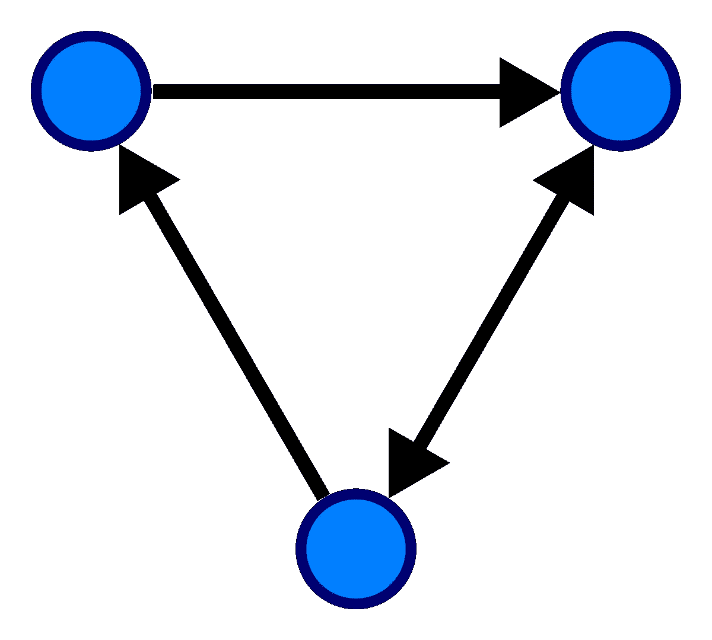
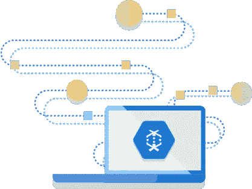

# 让我们谈谈数据流

> 原文：<https://towardsdatascience.com/tensorflow-goes-2-0-but-what-is-dataflow-16a2056e6cf8?source=collection_archive---------13----------------------->

Photo by [@eberhardgross](https://unsplash.com/@eberhardgross)

## TensorFlow 走 2.0，但什么是数据流？

**谷歌的研究和生产使用 TensorFlow。或许正是因为这个原因，作为使用机器学习的最大的技术公司之一，理解 TensorFlow 是什么并对其新的更新有一点兴趣是明智的。它是一个应用程序编程接口。应用程序接口(API)是一组用于构建软件应用程序的例程、协议和工具。如果你已经熟悉 TensorFlow 是什么，或者只是想查看新的更新，那么这篇文章可能不适合你——请直接在 Medium 上查看 tensor flow******[**的新文章。在我的文章中，我将尝试解释和探索*数据流*，它是张量流中的一个核心概念。**](https://medium.com/tensorflow/tensorflow-2-0-is-now-available-57d706c2a9ab)****

## ****什么是张量流？****

*******tensor flow****是一个免费的开源软件库，用于数据流和跨一系列任务的差异化编程。*****

****在这个简短的第一句话中，我们听到了两个可能令人困惑或需要澄清的概念。****

1.  *******数据流*******
2.  *****可微编程*****

****在这篇文章中，我将集中讨论第一个概念。****

## ****数据流或数据流编程****

******数据流编程**将程序建模为操作间数据流动的有向图，从而实现数据流原则数据流原则和架构。****

****在数学中，**有向图**(或**有向图**)是由一组由边连接的顶点组成的图，其中边有一个与之相关的方向。****

********

****Retrieved 6th of October 2019 from Wikipedia on [Directed graph](https://en.wikipedia.org/wiki/Directed_graph)****

****[Flawnson Tong](https://medium.com/u/a1dcfdd487e6?source=post_page-----16a2056e6cf8--------------------------------) 在他的文章[中把一个图解释为:****图*** *，在图论的上下文中，是一个结构化的数据类型，它具有* ***节点*** *(保存信息的实体)和* ***边*** *(可以深度学习是一种机器学习算法，而机器学习算法又是人工智能的一个子集。**](/graph-theory-and-deep-learning-know-hows-6556b0e9891b)****

********************

*****Data is not this neat of course, gif by [Matthew Butler](https://giphy.com/butler/)*****

*****有些人使用术语“数据流”而不是“数据流”,这是因为可能与先前基于不确定性机器范例的“数据流架构”概念相混淆。非决定论是一种认为事件不是由或不是由决定论引起的观点。它与决定论相反，与偶然性有关。因此，这是某种加权的可能性，即某事应该发生或不发生，以及影响结果的变化的偏差(输入)。*****

**********

*****Iillustration by Google on the Cloud Dataflow page [retrieved the 6th of October](https://cloud.google.com/dataflow/)*****

**********

*****Dataflow pipeline by [Sameer Abhyankar](https://medium.com/u/9d41ebd0edce?source=post_page-----16a2056e6cf8--------------------------------) posted in [Google Cloud Platform on Medium](https://medium.com/google-cloud)*****

*****数据流原则——基于数据流的进度表示。一篇名为 [*调度表示之间的等价:理论与应用*](http://citeseerx.ist.psu.edu/viewdoc/download?doi=10.1.1.537.5104&rep=rep1&type=pdf) 的论文是这样说的:“调度通常被表示为一组作业到一组处理器的映射；这种映射随着时间而变化。”因此，它可以被描述为一个优化问题或不同的最优或次优(不太)理想解决方案的“映射”。*****

**********

*****An overview of data transformation with [Google Cloud](http://Data Transformation with Cloud Dataflow)*****

*****维基百科对数据流编程的描述非常有趣，所以我决定直接引用它:*****

******“顺序程序可以被想象成在任务(操作)之间移动的单个工人，而数据流程序更像是装配线***上的一系列工人，只要有材料，每个人都在做特定的任务。因为操作只关心数据输入的可用性，所以它们没有要跟踪的隐藏状态，并且同时都“就绪”*******

******数据流编程语言共享一些函数式的特征，并且通常被开发来将一些函数式概念引入到更适合数字处理的语言中。在函数式编程中，程序被视为一系列无状态的函数求值。******

******照这样！******

******[**TensorFlow**](https://en.wikipedia.org/wiki/TensorFlow) **:基于数据流编程的机器学习库。********

******然而，它同时还是一个符号数学库，也用于机器学习应用，如神经网络。它是一个应用程序编程接口。应用程序接口(API)是一组用于构建软件应用程序的例程、协议和工具。******

******希望这能让你稍微开心一点，当然，这可能会引出更多的问题，而不是答案。******

************

******Hope this made you happy! — Gif made by [**@sherchle**](https://giphy.com/channel/sherchle)******

## ******张量流 2.0******

******谷歌希望扩大机器学习的规模，并发布了 TensorFlow2.0。它被描述为企业和研究人员易于使用的框架。它面向可扩展的 ML 支持的应用，将 Keras 紧密集成到 TensorFlow 中。******

******[***Keras***](https://keras.io/)*是一个用 Python 编写的开源神经网络库。它能够运行在 TensorFlow、微软认知工具包、Theano 或 PlaidML 之上。旨在实现深度神经网络的快速实验，它专注于用户友好、模块化和可扩展。*******

******因此，TensorFlow 2.0 优先考虑 Python 开发者(一种编程语言)。它有更完整的底层 API。低级接口。最详细的编程接口(API ),允许程序员在非常精细的级别上操作软件模块或硬件中的功能。粒度数据是详细的数据，或者是目标集中数据的最低级别。从哲学意义上来说，粒度计算可以描述一种思维方式，这种思维方式依赖于人类在不同粒度级别(即抽象)下感知真实世界的能力，以便只抽象和考虑那些服务于特定兴趣的事物，并在不同粒度之间切换。”******

******新的 2.0 保存了具有各种运行时的模型(部署到 web 和云)。运行时是指程序正在运行(或可执行)的时候。也就是说，当你启动一个在计算机上运行的程序时，它就是那个程序的运行时。它可以在浏览器中运行，并有多 GPU 支持。多 GPU。(多图形处理单元)使用两个或更多图形卡来支持更快的运行时间。******

******除此之外，还有扩展的 TensorFlow 数据集(标准化)。推荐执行急切的常规 Python。我以前写过关于[急切执行](https://medium.com/@alexmoltzau/speculative-execution-of-code-fd06c20bbb8?source=friends_link&sk=72243ab0cd7bc39e79808afb4a6a3ea9)的文章。 ***急切执行*** *是一种推测执行的形式，其中条件分支的两端都被执行；然而，只有当谓词为真时，才提交结果。*******

******这是#500daysofAI 的第 125 天。如果你喜欢这篇文章，请给我一个答复，因为我确实想提高我的写作或发现新的研究，公司和项目。******