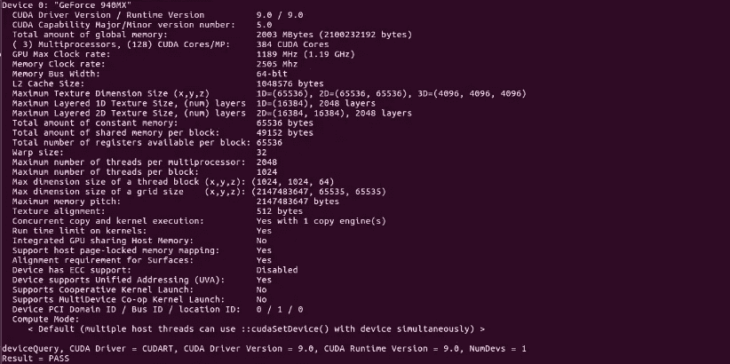

# Tensorflow GPU 安装变得简单:Ubuntu 版本

> 原文：<https://towardsdatascience.com/tensorflow-gpu-installation-made-easy-ubuntu-version-4260a52dd7b0?source=collection_archive---------6----------------------->

在 ubuntu 上安装 Tensorflow GPU 对于正确版本的 cuda 和 cudnn 来说是一个挑战。一年前，我写了一篇文章，讨论了用 conda 安装 Tensorflow GPU，而不是用单行命令安装 pip。这是那篇文章的链接。

[](/tensorflow-gpu-installation-made-easy-use-conda-instead-of-pip-52e5249374bc) [## Tensorflow GPU 安装变得简单:使用 conda 而不是 pip

### 我有一个配置不错的 GPU，以前玩 FIFA 都是用它。转行 AI，本来想用 GPU 做深度学习的…

towardsdatascience.com](/tensorflow-gpu-installation-made-easy-use-conda-instead-of-pip-52e5249374bc) 

这篇文章已经被阅读了超过 25 万次，但仍然有一些 Ubuntu 用户在使用正确版本的 CUDA 和 CUDNN 运行 Tensorflow GPU 时面临问题。我知道这篇文章的标题可能会误导人，但是相信我，如果你一步一步的去做，那么在 ubuntu 上正确的安装是很容易的。

## 目录:

1.  检查 GPU 与 Tensorflow GPU 的兼容性！
2.  切换到图形卡
3.  检查 CUDA 与图形卡的兼容性
4.  根据 CUDA 确定 Tensorflow 版本
5.  下载 CUDA 工具包
6.  安装 CUDA
7.  下载 cudnn 并安装
8.  验证 cudnn 安装
9.  在使用 Conda 的新环境中使用 pip 安装 Tensorflow-gpu
10.  验证 tensorflow 正在使用 GPU。

## 注意-你可以使用这篇文章安装任何版本的 TENSORFLOW，确保你正确的决定了 CUDA 的版本。

1.  检查 GPU 与 Tensorflow GPU 的兼容性(从[到此处](https://developer.nvidia.com/cuda-gpus)
2.  打开显卡
    进入菜单>搜索“驱动程序设置”>点击附加驱动程序


选择 NVIDIA 二进制驱动程序，在我的例子中是 384 版本的**。这是非常重要的记录下来，因为这个驱动程序版本将有助于我们确定 CUDA 版本。**


现在，如果你去一个终端，键入 nvidia-smi，你也会得到驱动程序版本。


3.从[这里](https://docs.nvidia.com/deploy/cuda-compatibility/)检查 CUDA 与您的驱动程序版本的兼容性。


**在我们的例子中，因为驱动程序版本是 384.130，所以我们只能安装 CUDA 9.0**

4.根据 CUDA 确定 Tensorflow 版本


完成这一步后，你应该对 3 件事非常清楚:
i)你要安装什么 Tensorflow 版本(tensorflow-gpu 1.12.0)
ii)你要安装什么 CUDA 版本(9.0)
iii)你要安装什么 cudnn 版本。(7)

**注意:这些问题的答案会因您当前使用的驱动程序版本而异。**

如果你知道这三个问题的答案，那么你已经闻到胜利的味道了。

5.下载 CUDA 工具包
转到此[链接](https://developer.nvidia.com/cuda-toolkit-archive)并下载您在步骤 4 中找到的 CUDA 的具体版本(本例中为 CUDA 9.0)


6.CUDA 安装


Execute the run file downloaded

你将获得软件许可证，长按回车键。现在接受除驱动程序安装之外的所有内容。


安装后，您将收到以下消息:


现在你必须在 bashrc 文件中输入特定的路径，这样你才能访问 cuda。打开终端并运行命令

> sudo su
> sudo gedit ~/。bashrc
> 
> (在文件末尾添加以下行)

```
export PATH=/usr/local/cuda/bin:/usr/lib/:$PATH
export LD_LIBRARY_PATH=/usr/local/cuda/lib64:/usr/lib/nvidia-384:$LD_LIBRARY_PATH
export CUDA_HOME=/usr/local/cuda-9.0
```

保存并关闭文件，然后将 bashrc 文件作为源，以使更改生效。

> 来源~/。bashrc

现在打开一个终端并编写命令

```
nvcc -V
```


您将获得运行的 CUDA 版本。

6.验证 CUDA 安装(可选):如果你对 nvcc 版本满意，那么你可以跳过这一步。

打开终端并运行以下命令:

```
cd /usr/local/cuda/samples/1_Utilities/deviceQuery
sudo make
./deviceQuery
```



7.下载与 CUDA 兼容的 cudnn 并安装

进入[链接](https://docs.nvidia.com/deeplearning/sdk/cudnn-archived/index.html)并安装 cudnn。记住在这里下载 cudnn 的版本，它与 CUDA 兼容，在这里是 7。你需要注册 NVIDIA 网站来下载这个。


Download all the three files.

按照以下顺序安装 cudnn 包:运行时>开发人员>文档。使用命令

> sudo dpkg -i<package_name></package_name>


8.验证 cudnn 安装

为了验证我们的 cudnn 安装，我们将测试一个 cudnn 样本。打开终端并发出以下命令:

```
cp -r /usr/src/cudnn_samples_v7/ $HOME
cd  $HOME/cudnn_samples_v7/mnistCUDNN
make clean && make
./mnistCUDNN
```

如果 cudnn 安装正确，您将会看到这样的消息:测试通过


9.下载 Miniconda 并安装。记得不要 root 安装。

现在创建一个安装 tensorflow-gpu 的环境。

```
conda create  --name tf1 python=3.6
```

执行此命令后，将使用 python 版安装一个名为 tf1 的新环境。现在激活环境并执行命令来安装我们在步骤 4 中找到的特定版本的 tensorflow-gpu。

```
source activate tf1
pip install tensorflow-gpu==1.12
```

10.要测试 tensorflow 安装，请遵循以下步骤:

1.  打开终端，使用*‘源激活 tf1’激活环境。*
2.  使用*python*进入 python 控制台

```
import tensorflow as tfsess = tf.Session(config=tf.ConfigProto(log_device_placement=True))
```

现在，如果您能够在终端中看到您的 GPU 信息，那么恭喜您，您终于成功了！


谢谢你的时间。请通过 [LinkedIn](http://linkedin.com/in/harveenchadha) 与我联系，了解更多关于数据科学的更新和文章。