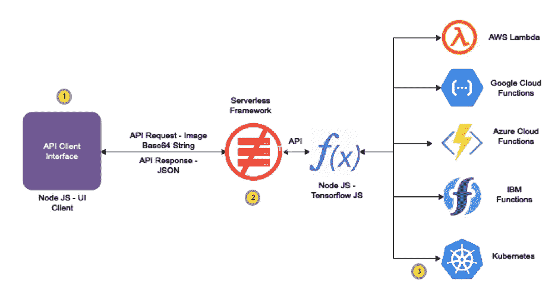
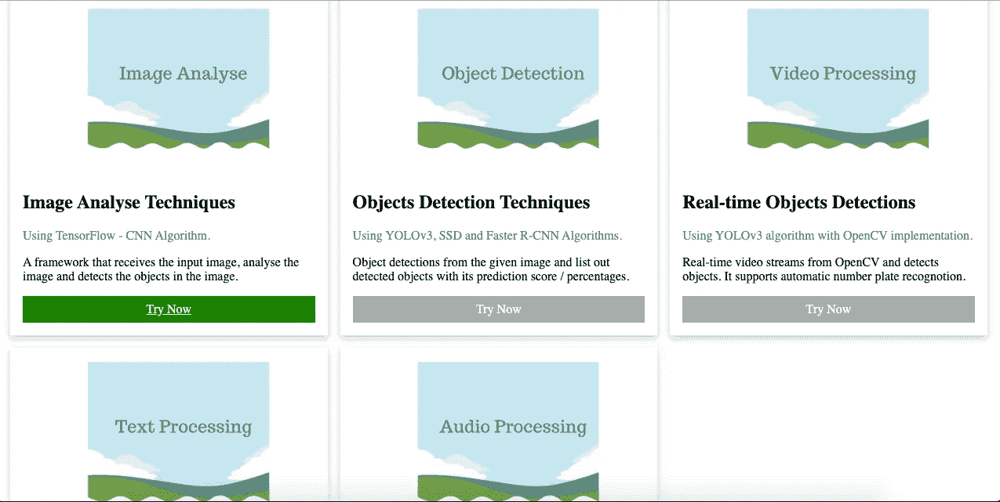
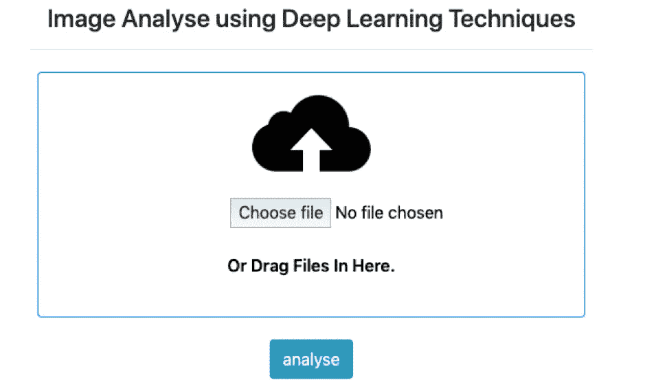
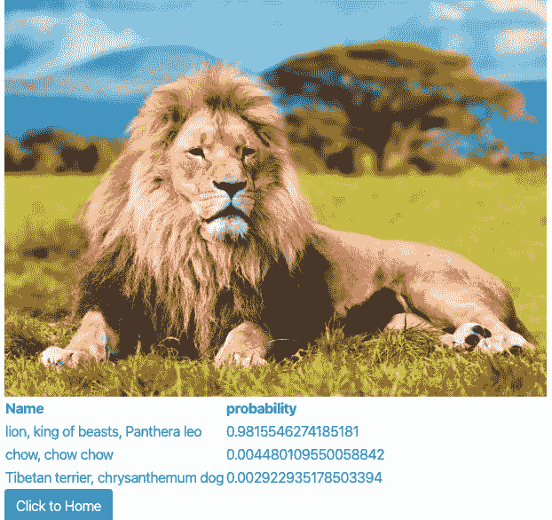
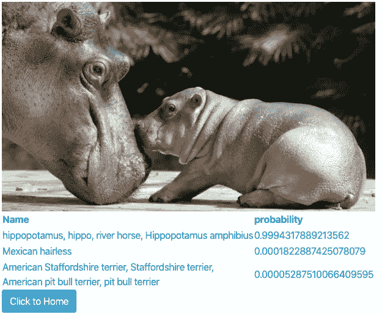
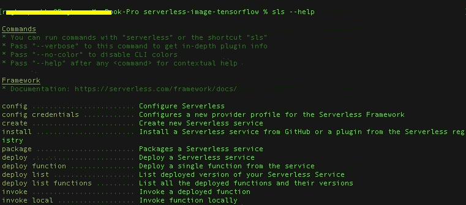
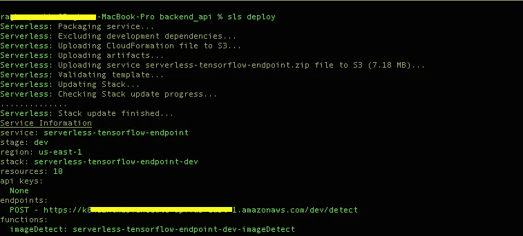
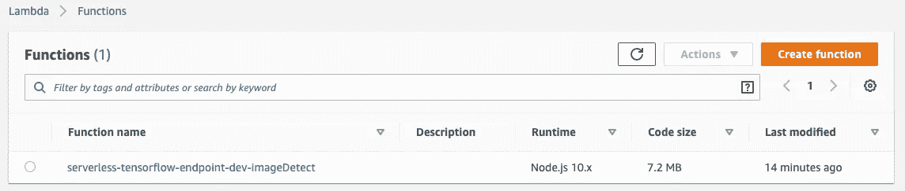
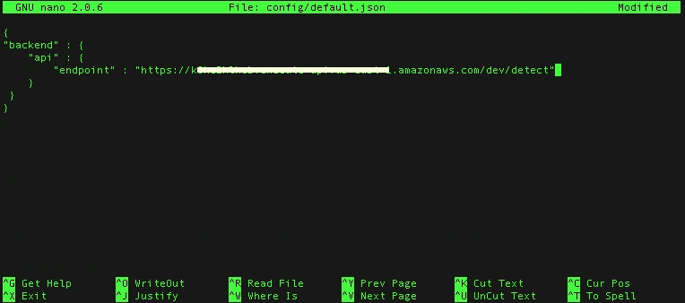

# 使用无服务器架构的 TensorFlow 图像识别教程—节点 JS

> 原文：<https://towardsdatascience.com/tensorflow-image-recognition-tutorial-using-serverless-architecture-node-js-69eb1a3ce110?source=collection_archive---------18----------------------->

## 使用 TensorFlow JS + Serverless 的分步教程

基于卷积神经网络(CNN)的架构，如 VGG-16、GoogLeNet、ResNet、MobileNet 等。是广泛用于图像识别、从图像和视频中检测物体的模型。更多关于卷积神经网络的细节，请参考我比较老的[博客](https://medium.com/@RaghavPrabhu/understanding-of-convolutional-neural-network-cnn-deep-learning-99760835f148)。

在这篇博客中，我将使用无服务器架构和 CNN 的 MobileNet 模型来解释图像识别教程。MobileNet 架构是一种适用于移动和嵌入式设备的轻量级模型。MobileNet 模型已经训练了超过 1400 万幅图像和 20，000 个图像分类。使用预先训练的模型，该模型有助于快速分类输入图像并产生结果。

**无服务器架构——tensor flow 后端**

在无服务器云函数中使用 MobileNet 模型的图像识别过程。因为 MobileNet 是轻量级架构，可以在云功能中运行。在这个架构中，我们将使用 Node JS 作为客户端接口和后端 REST 服务(无服务器)。

Figure 1: Serverless Architecture with TensorFlow MobileNet model — Node JS

上图描述了一个两层架构。

*   API 客户端接口
*   使用 TensorFlow 作为后端的图像处理组件

TensorFlow 框架，具有 MobileNet 模型 API 包装器实现和使用节点 JS 堆栈的 API 客户端接口。

**申请流程**

*   用户将使用客户端界面上传图像。客户端接口将图像转换为 base 64 数据，并将数据发布到后端 REST API 中
*   在 AWS Lambda 中开发和部署的后端 REST API。在本教程中，我们使用 [AWS Lambda](https://aws.amazon.com/lambda/getting-started/) 。
*   [无服务器框架](https://serverless.com/)帮助我们使用 YAML + CLI 部署将基于节点 JS 的 REST API 部署到任何云功能，如 AWS、Azure、Google Cloud &等。
*   后端 REST API 模块使用 TensorFlow 深度学习模块分析图像并预测图像
*   JSON 数据的结果将被发送到客户端接口。客户端界面在浏览器中呈现输出结果。

# API 客户端界面—流程

Figure 2: Client UI — Landing Page. Currently, our tutorial supports — Image Analyse Techniques module

Figure 3: Image Analyse Client Interface — UI

*   API 客户端界面帮助将图像上传到 API 服务器
*   当图像上传到 API 服务器时，它会转换成 base64 编码的字符串，并调用 TensorFlow 无服务器云函数(这里是 AWS Lambda)
*   基于 TensorFlow 的应用程序使用 Node JS 开发，部署在 AWS Lambda 中。

# 图像处理实用程序—输出

下面是几个输出。

Figure 4: Image Analyse Output

Figure 5: Image Analyse Output

现在，让我们一层一层、一步一步地看代码。

**TensorFlow REST API —在无服务器环境中运行**

首先，我们将导入 TensorFlow 节点 js 模块。细节在下面的片段中提到。

注意:-使用 Node JS 开发的后端 REST 和客户端接口的源代码都可以在我的 Github repo 中找到。请参考底部的 Github 链接。

下面的代码片段是主节点 js 函数，它作为 REST 端点导出。

***第 6 行*** :事件参数，包含一个体属性“event.body”从客户端接口获取图像 base 64 数据，用户上传

***第 8 行:*** 它获取 base 64 图像数据，并作为图像写入临时路径(对于每个请求，将创建一个新的文件名。参考，第 5 行)

***第 9 行:*** 它调用另一个名为“classify”的函数 by，传递前面创建的参数路径。path 变量包含新的图像文件路径。分类函数的细节可以在下面的代码片段中找到。输出变量结果以异步模式接收响应，该响应包含张量流图像预测结果以及概率得分。输出详情请参考上图 4 & 5。

***第 5 行*** :从路径中读取图像

***第 6 行*** :从给定图像转换三维数组

***第 7 行*** :加载 MobileNet 模型

***第 8 行*** :将输入图像的 3d 数组矩阵作为参数，对图像进行分类，得到预测的图像结果。

**从 URL 加载移动网络模型**

**客户端界面—UI**

***第 7 行:*** 它将输入图像作为 base 64 数据提交，并将其发布到后端 REST 服务端点。变量“apiURL”从 config.json 加载 REST URL。

**后端 API 部署**

*   首先，我们必须部署后端服务。后端服务是一个 REST API，它使用 TensorFlow 处理图像输入并对图像进行分类/预测
*   API 是用 Node JS 开发的
*   使用无服务器框架，我们将把我们的 API 部署到无服务器环境中。在本教程中，我们使用 AWS Lambda 作为无服务器环境。

**步骤 1** :在你的机器上下载并安装/更新无服务器框架。请参考此无服务器文档链接获取安装帮助—【https://serverless.com/framework/docs/getting-started/ 

安装完成后，键入"*SLS-help "*应该会得到如下图所示的输出

Figure 6: Serverless command to test “sls — — help”

**步骤 2** :下载您的 AWS 凭证(访问&密钥)并在您的操作系统中设置为环境变量，如果您使用的是 Linux 或 Mac 操作系统，则使用“export”命令，如果您的操作系统是 windows，则使用“set”命令

> *导出 AWS_ACCESS_KEY_ID= < <您的 AWS 访问密钥> >*
> 
> 导出 AWS_SECRET_ACCESS_KEY= <<your aws="" secret="" key="">></your>

**第三步**:从 Github URL 克隆源代码

> git 克隆 git @ github . com:RaghavPrabhu/Deep-learning . git

成功克隆后，转到文件夹*server less _ image _ tensor flow/back end _ API*

**第四步**:在 backend_api 文件夹中执行下述命令

> *npm 安装*

上述命令将通过读取 package.json 文件来安装所有节点模块。*注意:——你也可以通过“yarn”命令来安装节点模块*

**步骤 5** :使用无服务器命令将我们的后端 API 部署到 AWS Lambda

> sls 部署

上面的命令将在 AWS Lambda 中部署 API。请参考下面的截图了解更多细节。

Figure 7: Deploy backend API on AWS Lambda using Serverless command to test “sls deploy”

注意:请确保您已经在您的环境中设置了 AWS 访问和密钥。参见**步骤 2。**

成功部署后，在 AWS 中验证您的 Lambda 函数细节。

Figure 8: AWS Lambda Function Deployment Details

**前端 UI 部署**

**第一步**:转到“前端 _ 客户端”文件夹

**第二步**:在 backend_api 文件夹中执行下述命令

> npm 安装

**第四步**:打开 config/default.json 文件，更新 API URL。参考下面的截图。**注意:这一步很重要！！！**

Figure 9: Config file update in default.json file

**步骤 3** :运行以下命令启动客户端界面

> node server.js

**万岁！！！已经部署好了。**

转到浏览器，键入“http://localhost”并测试。您应该会看到类似于图 2 中的屏幕。

你可以在我的 [Github URL](https://github.com/RaghavPrabhu/Deep-Learning.git) 中找到后端 API 和前端 UI 的源代码。

**总结**

*   使用 node js + TensorFlow js 库构建 Tensorflow 图像检测 API
*   使用无服务器框架将 API 部署到无服务器环境中
*   使用节点 js 构建客户端接口，并在 config/default.json 文件中配置 API 端点
*   使用客户端 UI 上传图像并测试图像类型
*   本教程使用无服务器框架在 AWS Lambda 中进行了测试。随意将 API 部署到其他云功能中，如 Azure cloud function、Google cloud function、IBM openwhisk、Kubeless 等。，通过利用无服务器框架的特性。
*   这个教程代码可以在[这里](https://github.com/RaghavPrabhu/Deep-Learning.git)找到。