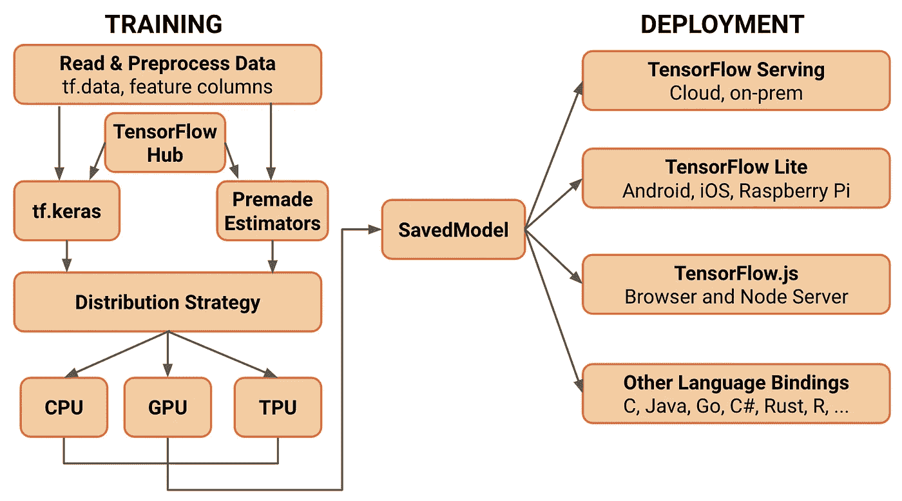

# TensorFlow 与 Keras 有关系—推出 TF 2.0

> 原文：<https://towardsdatascience.com/tensorflow-is-in-a-relationship-with-keras-introducing-tf-2-0-dcf1228f73ae?source=collection_archive---------13----------------------->

今年早些时候，oogle 的 TensorFlow 团队宣布了其最新且相当易用的版本。对于使用过 TensorFlow 1。XX，这个版本没那么丑，没那么毛骨悚然，更人性化(技术更新和改动在下面讨论)。我将写一个 3 部分的系列，这是一个开始，也是最短的一个。这些部分主题如下:

*   TF 2.0 简介
*   TensorFlow 2.0 中的图像分类
*   TensorFlow 2.0 中的迁移学习

# TensorFlow 和 Keras 是什么？

[维基百科](https://en.wikipedia.org/wiki/TensorFlow) 提出 **TensorFlow** 是一个免费的开源软件库，用于数据流和跨一系列任务的差异化编程。从人类的角度来说，TensorFlow 是一个大规模构建机器学习模型的开源库。它是迄今为止最受欢迎的构建深度学习模型的库。它还拥有最强大的庞大的开发人员、研究人员和贡献者社区。

[**Keras**](https://keras.io/) 是一个高级神经网络 API，用 Python 编写，能够运行在 Tensorflow、Theano 或 CNTK 之上。它在研究和开发社区中非常受欢迎，因为它支持快速实验、原型和用户友好的 API。用户友好的代价是无法访问 TensorFlow 的内部细节，但合理数量的复杂事情仍然可以完成。

# Tensorflow 2.0 中的新增功能

Tensorflow 致力于为正在进行的任何计算构建计算图；从增加两个数到建立一个生成性的对抗网络。一旦构建了图形，它就在所谓的**会话中执行。**对于初学者来说，这可能听起来像是一剂重药(现在你可能明白为什么 TensorFlow 1 有点难看了)，这就是为什么很难，尤其是对于初学者来说，直接跳到 TensorFlow 来实现神经网络。

随着 TensorFlow 2 的出现，事情变得非常整洁、灵活，任何人都可以通过实验轻松进入深度学习领域。Tensorflow 2 实现了 Keras 和直观的高级 API **tf.keras** 的紧密集成，以构建神经网络和其他 ML 模型。您可以获得 Keras 的用户友好性，也可以从访问 TensorFlow 的所有低级课程中受益。这是一个完美的组合，适合不同行业和专业知识的人使用；因此，一个完美的爱情故事 TensorFlow 和 Keras。

根据 Tensorflow 2 新功能的官方评论，这些新功能可以归纳为三大类:

## 1)可用性

*   随着 Keras 的集成，可用性变得非常强大。在深度学习方面具有不同专业水平的人可以使用 TensorFlow now 进行工作；这在很大程度上增加了可用性。
*   **最大的**变化之一是默认的**急切执行**模式。简单地说，您不需要构建图形，然后在会话中执行它们来运行基本的乘法运算。你可以简单地在飞行中建立深层网络。这对为神经网络编写代码的开发人员隐藏了很多复杂性。然而，这并没有剥夺你使用该图的好处，因此这些可以通过 **tf.function.** 访问

## 2)清晰度

*   重复的功能已被删除。为了消除这些问题，在实际代码库中做了大量的清理工作。
*   语法更加直观(多亏了 Keras ),并且始终一致。

## 3)灵活性

*   如前所述，您仍然可以为不同种类的定制任务使用低级 API。
*   它还为变量、层和检查点提供了可继承的接口。

TensorFlow 2 的架构如下所示。

Tensorflow 2 Architecture

# 接下来会发生什么？

TensorFlow 中有更多的更新和新功能，我们将在本系列的未来博客中探索它们。在下一篇博客中，我们将讨论如何在 Tensorflow 2 中借助卷积神经网络构建图像分类器来启动计算机视觉。你可以看看我之前关于[计算机视觉入门](/roadmap-for-conquering-computer-vision-213695472ad0)的博客，对计算机视觉有个了解。这将有助于你理解大局，也肯定有助于应对下一个博客。《Keras》的作者 Francois Chollet 最近出版了一本[笔记本](https://colab.research.google.com/drive/1UCJt8EYjlzCs1H1d1X0iDGYJsHKwu-NO)，作为 Tensorflow 2 的速成课程。要彻底研究 tensorflow 2，你可以查看 [Coursera](https://www.coursera.org/specializations/tensorflow-in-practice?utm_source=deeplearningai&utm_medium=institutions&utm_campaign=TFWebsiteTFSHomepageButton) 和 [Udacity](https://www.udacity.com/course/intro-to-tensorflow-for-deep-learning--ud187) 上提供的两个有趣的专业。

有关 TensorFlow 2 的更多更新，请访问[https://www.tensorflow.org/](https://www.tensorflow.org/)

您也可以在我的 [LinkedIn](https://www.linkedin.com/in/m-zaid/) 上联系我进行任何讨论。