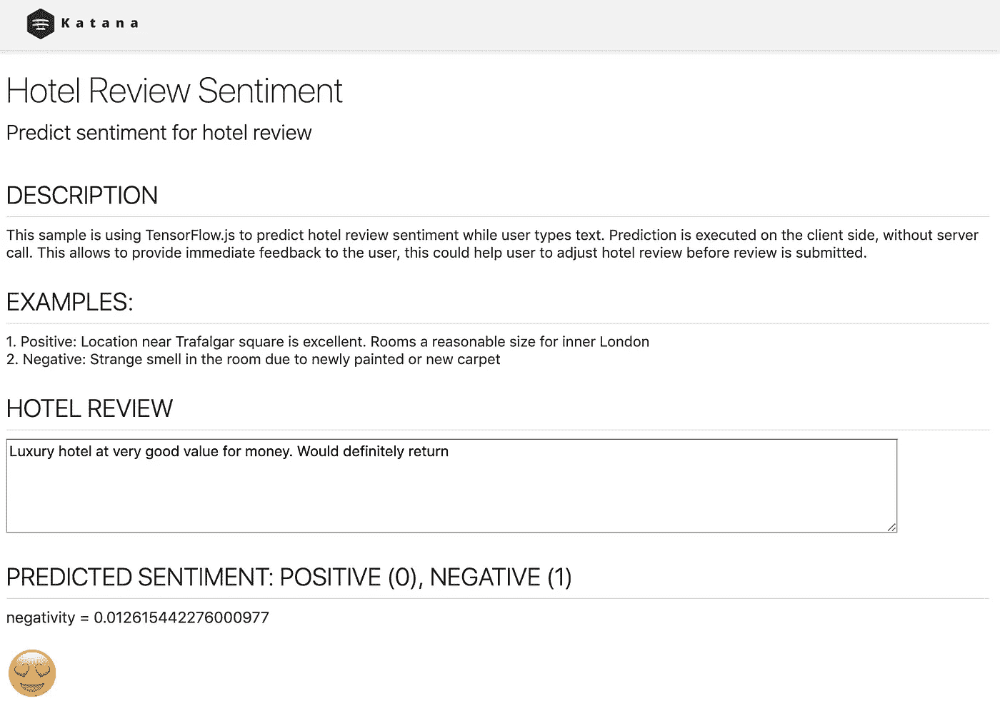
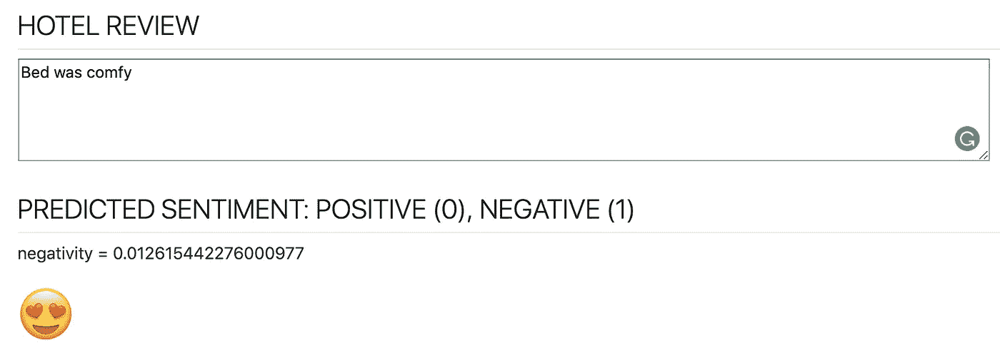
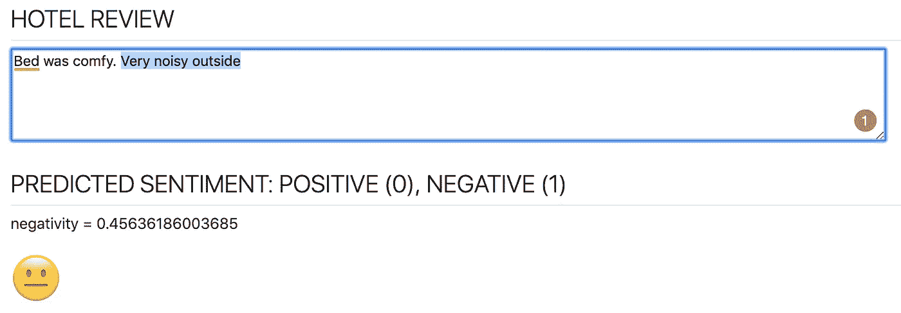
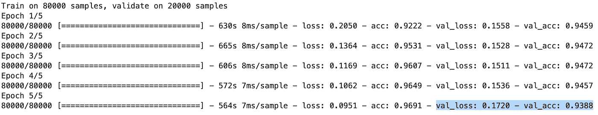

# 张量流。JS —使用 JavaScript Web Worker 运行 ML 预测函数

> 原文：<https://towardsdatascience.com/tensorflow-js-using-javascript-web-worker-to-run-ml-predict-function-c280e966bcab?source=collection_archive---------18----------------------->

## 这篇文章是关于客户端的机器学习。我将解释如何在 JavaScript Web Worker 中运行 ML 模型。该模型在 TensorFlow/Keras(使用 Python)中训练，以检测酒店评论的情绪。


Source: Pixabay

我是 JavaScript 开发人员，当机器学习模型在客户端(在浏览器中)运行时，我感觉棒极了。如果你决定在浏览器中运行 ML 模型，我将在这篇文章中讨论几个主题，我相信你会发现它们很有用:

*   如何用 Python 训练 ML 模型
*   ML 模型如何转换为与 TensorFlow.js 兼容
*   运行 TensorFlow.js 预测函数的 JavaScript Web Worker

我在用 ML 模型为一篇酒店评论预测情绪。我在 Kaggle 上发现了这个优秀的数据集— [欧洲 515K 酒店点评数据](https://www.kaggle.com/jiashenliu/515k-hotel-reviews-data-in-europe)。它提供了来自 Booking.com的 51.5 万条酒店评论记录。使用这个数据集，我训练了 Keras 模型，将其转换为与 TensorFlow.js 兼容，然后包含到客户端 js 应用程序中。你可以亲自检查它是如何工作的，这个应用程序部署在 Heroku—【https://sentiment-tfjs-node.herokuapp.com/ :

[](https://sentiment-tfjs-node.herokuapp.com/)

JS app with TensorFlow.js

试着输入*Bed comfort*，你会得到非常低的否定分数:



JS app with TensorFlow.js

然后加上— V *外面很吵*，负面评分会增加到中性情绪:



JS app with TensorFlow.js

**如何用 Python 训练 ML 模型**

使用 Zaid Alyafeai 帖子[中解释的方法实现文本情感分类——从 Keras 到浏览器的情感分类](https://medium.com/@alyafey22/sentiment-classification-from-keras-to-the-browser-7eda0d87cdc6)。关于如何建立文本情感分类我就不深入解释了，你可以在 Zaid post 里看。

为了能够训练模型，我处理了酒店评论数据集，并从所有属性中提取了酒店评论文本和情感(0-正面，1-负面)。我使用数据子集来训练模型，以减少训练时间。我使用了前 10 万条评论:

```
df = pd.read_csv('hotel-reviews.csv', nrows=100000)
df['REVIEW_TEXT'] = df['REVIEW_TEXT'].astype(str)
print('Number of rows ', df.shape[0])
```

使用批量= 128(批量越大，训练越快)，在 5 个时期中训练该模型。验证集被分配了 20%的训练数据:

```
model.fit(np.array(X_train_tokens), np.array(Y_train),
          validation_split=0.2, epochs=5, batch_size=128)
```

模型训练成功，验证准确率高达 94%；



Model training results

当模型被训练时，还有两件事要做。创建一个字典文件，它将用于编码用户语句，以供客户端预测功能处理。使用优化器保存模型，以便能够将其转换为 TensorFlow.js 友好表示。

确保在保存模型时，训练过程只进行了一次(在保存之前，您没有多次运行训练，或者关闭 Python notebook 并从头开始进行新的训练)，否则保存的文件中的模型会过载，并且 TensorFlow.js 无法重用模型。

**ML 模型如何转换为与 TensorFlow.js 兼容**

保存模型后，将其转换为 TensorFlow.js 格式，这样将创建两个新文件(模型 bin 文件和包含元数据的 JSON 文件):

```
tensorflowjs_converter --input_format keras hotel-reviews-model.h5 tensorflowjs/
```

在此阅读更多信息— [将 Keras 模型导入 TensorFlow.js](https://www.tensorflow.org/js/tutorials/conversion/import_keras) 了解如何将现有 Keras 模型转换为 TensorFlow.js，然后将其加载到 TensorFlow.js

**JavaScript Web Worker 运行 TensorFlow.js 预测函数**

TensorFlow.js *predict* 函数调用为什么需要使用 Web Worker？预测函数调用不是异步的，这意味着它阻塞主 JavaScript 线程，用户屏幕将被冻结，直到预测完成。情感分析预测需要几秒钟的时间，用户界面冻结会让用户烦恼。Web Worker 允许将长时间运行的任务委托给单独的 JavaScript 线程，而不会阻塞主线程。

JavaScript 应用基于 [Oracle JET](https://www.oracle.com/webfolder/technetwork/jet/globalGetStarted.html) toolkit(开源库集合— knockout.js、require.js 等。).要在您的计算机上运行示例应用程序，请执行以下命令:

1.  npm install -g @oracle/ojet-cli
2.  从应用程序根文件夹运行:ojet 恢复
3.  从应用程序根文件夹运行:ojet serve

appController.js 中有一个函数，每次当用户停止输入文本时都会被调用——调用预测情绪。此函数创建 Web Worker(如果不存在)并将用户输入发送到 Web Worker(输入被编码并准备好用于张量创建):

```
if (!worker) {
  worker = new Worker("js/worker.js");
}worker.postMessage(seq);
worker.onmessage = function (event) {
  console.log('prediction: ' + event.data);
  self.negativityScore(event.data);
  self.sentiment(convertToSentiment(event.data));
};
```

事件侦听器被注册来处理返回消息(预测)—它通过剔除可观察变量被推送到 UI。

Web Worker 在 worker.js 文件中实现。这个文件在它自己的上下文中运行，您应该在这里隐式引用 TensorFlow.js 库。确保设置 CPU 后端，Web Worker 中的 TensorFlow.js 仅适用于 CPU 后端:

```
importScripts('https://cdn.jsdelivr.net/npm/setimmediate@1.0.5/setImmediate.min.js');importScripts('https://cdn.jsdelivr.net/npm/@tensorflow/tfjs@1.2.7/dist/tf.min.js');tf.setBackend('cpu');
```

这是主代码(Web Worker 中的消息监听器)—调用 TensorFlow.js predict 函数(将用户输入转换为张量)的地方，结果通过消息返回到主线程:

```
onmessage = async function (event) {
  console.log('executing worker');
  seq = event.data;
  if (!model) {
    model = await createModel();
  }
  input = tf.tensor(seq);
  input = input.expandDims(0);
  predictOut = model.predict(input);
  score = predictOut.dataSync()[0];
  postMessage(score);
  predictOut.dispose();
};async function createModel() {
  const model = await tf.loadLayersModel('ml/model.json')
  return model
}
```

资源:

*   源代码— [GitHub](https://github.com/abaranovskis-redsamurai/automation-repo/tree/master/tfjs-sentiment)
*   示例应用程序 live—[https://sentiment-tfjs-node.herokuapp.com/](https://sentiment-tfjs-node.herokuapp.com/)