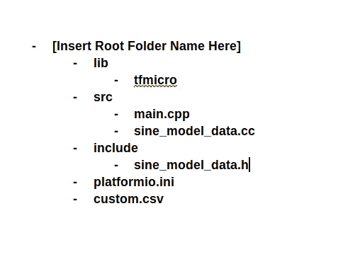
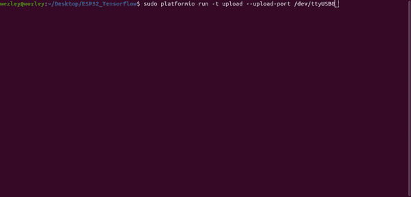

# TensorFlow，认识一下 ESP32

> 原文：<https://towardsdatascience.com/tensorflow-meet-the-esp32-3ac36d7f32c7?source=collection_archive---------4----------------------->

## 如何为 ESP32 设置 TensorFlow Lite 环境


如果我必须选择一个最喜欢的计算领域，我会选择嵌入式系统。我喜欢在资源受限的环境中优化代码所带来的挑战。

当我意识到 TensorFlow Lite 支持微控制器时，我兴奋地翻了翻桌子。

我有几个 ESP32-CAM 模块，想用于家庭安全系统。我的想法是部署一个能识别人的模型，当摄像机捕捉到一个人时就开始记录。我不想在这里使用动作感应，因为我有一只狗会触动传感器。

我认为 TensorFlow Lite 是这个用例的一个很好的工具。我可以训练一个模型来识别我桌面上的人，然后将其部署到我的 ESP32-CAM 模块中。

通读 TensorFlow Lite 文档后，很明显使用 PlatformIO 不会像调用:

```
platformio lib install tfmicro
```

除非我想用 Adafruit 库(**剧透**:我不要)。

通过一些仔细的试验和错误，我能够让 TensorFlow Lite 在 ESP32 上很好地与 PlatformIO 兼容。

本指南将介绍我是如何使用 PlatformIO 和 [Arduino-ESP32](https://github.com/espressif/arduino-esp32) 支持将“Hello World”示例编译并上传到 ESP32-CAM 模块的。

## 为 PlatformIO 部署设置 TensorFlow Lite

你要做的第一件事是安装 PlatformIO。为此，请打开终端并键入:

```
pip install -U platformio
```

现在，创建项目的根目录。这个目录还应该包含 **src** 、 **lib** 、 **include** 的子目录。

在项目的根目录下，创建一个名为 **platformio.ini** 的文件。该文件将包含 PlatformIO 初始化开发环境所需的所有信息。我的看起来像:

platformio.ini

接下来，您需要创建一个名为 **custom.csv** 的文件。这是 ESP32 闪存的分区信息。您可以根据应用程序的需求和 ESP32 的闪存大小格式化分区表。更多关于 ESP32 分区表的信息可以在[这里找到](https://docs.espressif.com/projects/esp-idf/en/latest/api-guides/partition-tables.html)。下面是我的 **custom.csv** 文件的格式:

custom.csv — The custom partition table I am using for the ESP32

完成所有设置后，继续[克隆 TensorFlow 存储库](https://github.com/tensorflow/tensorflow)(包括 TensorFlow Lite)。您可以下载. zip 文件并解压到您选择的目录中，或者使用 git 克隆:

```
git clone [https://github.com/tensorflow/tensorflow.git](https://github.com/tensorflow/tensorflow.git)
```

下载 TensorFlow 存储库后，从 TensorFlow Lite 文件夹中生成一个示例 ESP32 项目。我们想要生成一个样例项目，这样我们就可以获取生成的 **tfmicro** 库和样例模型。要生成示例项目，请导航到根“tensorflow”文件夹并运行:

```
sudo make -f tensorflow/lite/experimental/micro/tools/make/Makefile TARGET=esp generate_hello_world_esp_project
```

这将生成一个示例项目，它位于:

```
tensorflow/lite/experimental/micro/tools/make/gen/esp_xtensa-esp32/prj/hello_world
```

导航到 **hello_world/esp-idf** 目录，将 **tfmicro** 文件夹从 **components** 复制到之前创建的 **lib** 文件夹中。如果您计划运行示例程序以确保正确设置环境，那么将 **sin_model_data.cc** 和 **sine_model_data.h** 从**主**文件夹复制到 **src** 和 **include** 文件夹。

您的文件结构现在应该类似于:



Project Directory Structure

到目前为止很简单，是吧？

您几乎完成了！你只需要调整一下 **tfmicro** library 文件夹中的一些东西，这样 PlatformIO 就可以看到 TensorFlow Lite 需要的所有第三方库。

导航到 **tfmicro** 文件夹。你应该会看到两个文件夹: **tensorflow** 和 **third_party** 。

进入**third _ party/flatbuffers/include**，将 **flatbuffers** 子目录复制到 **tfmicro** 根目录。

接下来，进入**第三方/gemmlowp** ，将**固定点**和**内部**目录复制到 **tfmicro** 根目录。

最后，将 **kissfft** 目录从**第三方**复制到 **tfmicro** 根目录。

此时，您可以继续删除**第三方**目录。

通过将所有第三方库移动到 **tfmicro** 根目录，PlatformIO 可以识别并使用它们。

项目的最终结构应该是这样的:


File structure for a TensorFlow Lite ESP32 Project

文件结构完成后，导航到**lib/TF micro/flatbuffers**并打开 **base.h** 。在 **base.h** 内，将第 34 行从:

```
#if defined(ARDUINO) && !defined(ARDUINOSTL_M_H)
  #include <utility.h>
#else
  #include <utility>
#endif
```

收件人:

```
#include <utility>
```

您现在完成了！剩下要做的唯一一件事就是在项目中导入和使用 TensorFlow Lite。

## 构建一个示例项目

为了测试 TensorFlow Lite 是否正常工作，我改编了“Hello World！”Arduino-ESP32 草图中使用的正弦模型。

下面我来指导你我是怎么做的！

## 包括

我做的第一件事是导入项目将使用的所有库。

Needed Libraries for TensorFlow Lite Sample Project

这些库如下:

*   Arduino。h — Arduino 支持！:)
*   **math.h** —这里专门用来定义 M_PI(后面会讨论)。
*   **all_ops_resolver.h** —定义用于运行模型的操作。
*   **micro_error_reporter.h** —用于错误报告。
*   **micro_interpreter.h** —运行模型。
*   **sine_model_data.h** —我们正在使用的样本模型。

## 全局变量

接下来，我设置变量:

TensorFlow Lite Variables

我定义的第一个全局变量是内存池，用于存储模型生成的数组。 [TensorFlow 的文档](https://www.tensorflow.org/lite/microcontrollers/get_started)指出，您可能需要从不同模型的实验中得出池的大小。为此，我只是使用了 TensorFlow 为运行正弦模型提供的示例代码。

然后我定义了模型、解释器和输入/输出节点。

## 设置设计

定义了全局变量之后，就该设置环境了。

在“setup()”函数中，我以 115200 波特启动串行，并导入正弦模型。

Start Serial and Import Sine

然后我实例化了 TensorFlow Lite 微解释器

最后，我将模型的张量分配到被定义为全局的内存池中，并将输入和输出变量设置到它们对应的节点。

“setup()”函数到此结束。简言之:我导入了模型，创建了解释器，并将模型加载到内存中。

## 控制回路设计

“setup()”函数完成后，我开始实现控制循环逻辑。

对于控制循环，我等待来自 serial 的用户输入，并将其转换为 float。然后，我检查以确保用户输入在模型的参数(0–2 * PI)范围内:

然后，我将模型的输入节点设置为已解析的用户输入，调用解释器，然后打印出结果:

## 部署到 ESP32

代码完成后，您可以使用 PlatformIO 部署到 ESP32，包括:

```
platformio run -t upload --upload-port /dev/ttyUSB0
```



Uploading to the ESP32

然后，您可以使用以下命令通过串行给出程序输入:

```
screen /dev/ttyUSB0 115200
```


Running Sine Model on ESP32

就是这样！我真的很惊讶 TensorFlow 可以如此轻松地将模型部署到微控制器上。我的下一篇文章将讨论如何使用 TensorFlow 创建模型，以及如何将其转换为可以由 TensorFlow Lite 运行的东西！

GitHub 项目报告:[https://GitHub . com/wezleysherman/ESP32-tensor flow-Lite-Sample](https://github.com/wezleysherman/ESP32-TensorFlow-Lite-Sample)