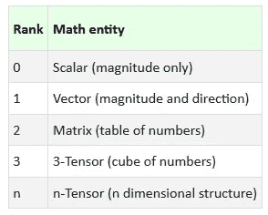
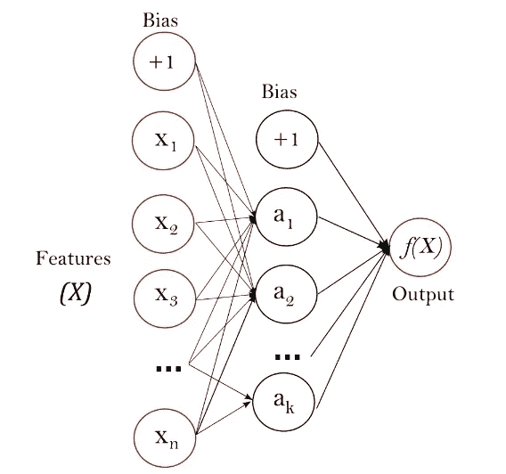

# 张量流——核心概念

> 原文：<https://towardsdatascience.com/tensorflow-the-core-concepts-1776ea1732fa?source=collection_archive---------8----------------------->

[source: https://tensorflow.org]

和大多数机器学习库一样，TensorFlow 是“重概念轻代码”的。这种语法不难学。但是理解它的概念非常重要。

# 什么是张量？

根据维基百科，“张量是一种几何对象，它以多线性方式将几何向量、标量和其他张量映射到结果张量。因此，通常已经在基础物理和工程应用中使用的向量和标量本身被认为是最简单的张量。此外，来自提供几何向量的向量空间的对偶空间的向量也被包括为张量。在这种情况下，几何学主要是为了强调坐标系选择的独立性

别担心，没那么复杂。当处理一个有多个变量的问题时，将它们以向量或矩阵的形式集中在一起通常是很方便的，这样就更容易对它们进行线性运算。大多数机器学习都是基于这样的矩阵运算——将一组输入值一起处理，得到一组输出值。

例如，在贷款审批问题中，我们考虑该主题的几个参数(过去贷款的金额、归还贷款的时间等。)并用适当的权重将它们相加，得到一个称为信用评级的输出数字。这是使用简单的矩阵乘法实现的。

这种矩阵乘法只给出一种情况的结果。当我们想要用一百万个这样的案例的数据来训练一个神经网络时，我们不能一个接一个地把它们相乘。这就是张量的用途。张量是一种数据结构，表示矩阵或向量或标量的集合，允许我们同时对所有数据样本执行操作。这给了我们很大的性能提升。

张量不需要有数值。它可以是一个输入值，一个常数，一个变量，或者只是对一些其他张量的数学运算的引用。

张量可能是 3D(矩阵的集合)或 2D(向量的集合)或 1D(数的集合)，甚至是 0D(单个数)。维度的数量并不构成张量——重要的是对多个实体同时操作的概念。

## 军阶

张量的维数叫做张量的秩。因此，我们有几个可能的等级。

## 常数张量

最简单的张量是一个常数。我们可以用显式值或使用为常用值定义的方法来定义。

注意，这并没有将常数值赋给张量。它只创建需要时可以评估的张量。

## 可变张量

常数允许我们创建可用于计算的预定义值。但是没有变量的计算是不完整的。训练一个神经网络需要能够代表要在该过程中学习的权重的变量。这些变量可以使用 tf.Variable 类生成。

每一个都产生一个可变张量。但是第三个和其他的略有不同。前两个张量可以训练。但是，第三个只是创建了不可改变的变量张量——就像常量一样。

做那样的事情有什么用？为什么不直接定义一个常数呢？对于 10x10 的张量，创建一个常数张量更有意义。但是当处理巨大的数据时，人们应该更喜欢变量。这是因为变量得到了更有效的管理。

## 占位符

常数张量和变量张量与任何编程语言中的常数和变量在直觉上是相似的。这不需要花时间去理解。占位符定义了将在代码运行前获得值的张量。从这个意义上说，占位符可以比作输入参数。

这将生成一个张量 x——保证在代码实际运行之前提供它的值。

# 懒惰执行

按照设计，TensorFlow 是基于延迟执行的(尽管我们可以强制急切执行)。这意味着，它实际上不处理可用的数据，直到它不得不这样做。它只是收集我们输入的所有信息。只有当我们最终要求它处理时，它才会处理。

这种懒惰(讽刺地)极大地提高了处理速度。要理解如何，我们需要理解 TensorFlow 的节点和图形。

Typical Dense Neural Network

这是神经网络的教科书观点。正如我们看到的，我们有几个输入 X1-Xn。这些构成了网络的第一层。第二层(隐藏层)是这些层与权重矩阵的点积，后面是 sigmoid 或 relu 之类的激活函数。

第三层只是一个值，它是作为其权重矩阵与第二层的输出的点积而获得的。

## 结节

对于 TensorFlow，这些单独的实体中的每一个都是一个节点。第一层有 n+1 个节点(n 个输入和 1 个常数)。第二层有 k+1 个节点，第三层有 1 个节点。这些节点中的每一个都由一个张量表示。

## 图表

我们可以看到一些节点有一个恒定值(如偏差 1)。其中一些具有可变值，如权重矩阵——我们从随机初始化开始，并在整个过程中对其进行调整。我们有一些节点，其值只是基于其他节点上的一些计算—这些是依赖节点—我们无法获得它们的值，直到我们有了先前节点的值。

在这个网络中，我们在中间层有 k 个节点，在最后一层有 1 个依赖于其他节点的节点，我们有 k+1 个依赖节点和 k 个需要调整的变量。

## 汇编

当我们创建单独的张量时，我们只是创建单独的节点并分配定义关系——这些关系还没有实现。定义完成后，我们启动 compile()方法，该方法标识连接节点的图。

这是整个过程中的重要一步。如果我们有循环依赖或任何其他可能破坏图表的原因，错误就在这一点上被识别出来。

## 会议

张量流计算总是在“会话”中执行。会话本质上是一个具有自己状态的环境。会话不是一个线程，但是如果我们有两个独立的计算需要一起运行——彼此不影响，我们可以使用会话。

这里，A 和 C 将在会话 1 下运行，并将看到一个环境，B 和 D 将在会话 2 中运行，并将看到另一个环境。

一旦我们定义了节点并编译了图形，我们最终可以运行命令来获取图形中特定节点的值。当我们这样做时，TensorFlow 会回头检查该请求节点所需的所有节点。只有那些节点会以适当的顺序进行评估。因此，图中的节点仅在需要时才被评估；只有在需要的时候。

这对处理速度影响很大，是 TensorFlow 的一大优势。

# 简单代码示例

为了理解 TensorFlow，理解常量、变量、占位符和会话的核心概念非常重要。现在让我们设计一个例子，它可以一次显示所有这些概念。

当然，我们从导入 TensorFlow 模块开始

现在，让我们定义几个张量。这里，t1 和 t2 是常数，t3 是占位符，t4 是变量。

这里，我们将 t1 定义为大小为 4x5 的常数张量，所有值都设置为 1。t2 是大小为 5x4 的常数张量，具有随机值。

t3 是一个维数为 0 的占位符，是一个浮点数 32。

与此同时，我们定义了一个 4x4 形状的变量 t4。初始值设定项被设置为 ones_initializer。这意味着，每当我们初始化变量时，它的值将被设置为 1。请注意，这只会在我们初始化变量时发生，而不是现在。

接下来，我们可以定义张量表达式

这段代码取 t1 和 t2 的点积，乘以标量 t3，然后加到 t4。其结果然后被分配给 t4。因此，每次执行该表达式时，t4 的值都会改变。注意 t3 是一个占位符，所以当我们想要处理这个表达式时，我们必须提供 t3 的值。

同样，这段代码只定义了表达式。它不会立即执行。

一切就绪后，我们现在可以开始会话，并开始与张量一起工作

在这里，我们实际上运行代码。我们从启动会话开始。我们必须初始化变量。到目前为止，t4 只是被声明，没有初始化。在这里，我们实际上初始化它。执行初始化代码。在这种情况下，恰好是“tf.ones_initializer”。因此，t4 从一个 4x4 张量开始，所有值都设置为 1。

接下来，我们运行表达式和 feed_dict。记住，表达式有一个占位符 t3。除非我们给它一个 t3 的值，否则它不会求值。这个值是通过 feed_dict 传递的。每次运行都会更新 t4，并为其分配一个新值。

上面的代码生成以下输出:

请注意，t4 在初始化之前没有值，只有当表达式在有效会话中运行时，它的值才会改变。可以对表达式求值三次，以断言输出与我们预期的一样。