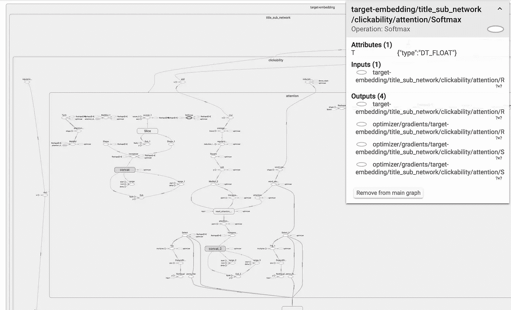
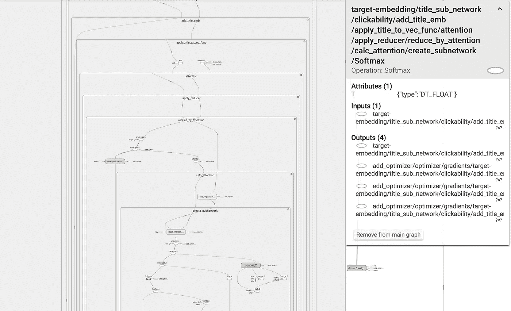

# 张量流——软件工程的范围

> 原文：<https://towardsdatascience.com/tensorflow-the-scope-of-software-engineering-ad7306560bb?source=collection_archive---------20----------------------->

## 如何像软件工程师一样构建你的张量流图

现在，您已经完成了对模型的训练，是时候了解一下它学到了什么。你决定哪个张量应该是有趣的，并在你的代码中去寻找它——找出它的名字。然后你突然想到——你忘了给它起个名字。您还忘记了用一个命名的作用域来包装逻辑代码块。这意味着你很难找到张量的参考。它适用于 python 脚本和 TensorBoard:



你能看到那个消失在张量海中的小红圈吗？找到它很难…

真令人失望！如果它看起来更像这样会好得多:



这还差不多！构成一个逻辑单元的每组张量都包含在一个命名的作用域内。

为什么图形不能以类似于你的代码的方式自动构建？我的意思是，大多数情况下，你没有使用单一函数来构建模型，是吗？您的代码库包含多个函数——每个函数都构成一个逻辑单元，它理应拥有自己的命名范围！

假设你有一个张量`x`，它是由函数`f`定义的，这个函数又被`g`调用。这意味着当你写代码的时候，你的头脑中有这样的逻辑结构:`g`->-`f`->-`x`。如果这个模型能够以张量名为`g/f/x`的方式自动构建，那不是很好吗？

仔细想想，这很容易做到。您所要做的就是检查所有的函数并添加一行代码:

```
def f():
    with tensorflow.name_scope(‘f’):
        # define tensors
```

那么这种方法有什么问题呢？

1.  函数名`f`出现了两次——在函数声明中和作为`tensorflow.name_scope`的参数。也许下周你会把函数的名字改成更有意义的，比如说`foo`。不幸的是，您可能会忘记更新作用域的名称！
2.  你必须对`f`的整个主体应用缩进。虽然没那么糟糕，但就我个人而言，我不喜欢高缩进级别。假设`f`包含一个 for 循环，该循环包含一个 if 语句，该语句包含另一个 for 循环。由于调用了`tensorflow.name_scope`，我们已经达到了缩进级别 4！

我们可以使用简单的元编程来绕过这些缺点——Python 的 decorators 来拯救我们！

```
import re def name_scope(f):
    def func(*args, **kwargs):
        name = f.__name__[re.search(r’[^_]’, f.__name__).start():]
        with tensorflow.name_scope(name):
            return f(*args, **kwargs)
    return func @name_scope
def foo():
    # define tensors
```

它是如何工作的？`@`是一个语法糖。它相当于以下内容:

```
def foo():
    # define tensors foo = name_scope(foo)
```

`name_scope`获取一个函数作为参数(`f`)并返回一个新函数(`func`)。`func`创建一个命名作用域，然后调用`f`。

结果呢？由`f`定义的所有张量都将在一个命名的作用域内创建。作用域的名称将是原始函数的名称(“foo”)—多亏了`f.__name__`。

一个小问题是，虽然函数名可能以“_”开头，但 tensorflow 作用域名不能。这就是我们必须使用`re`的原因。

# 为什么这么重要？


与实际使模型变得更好的研究挑战相比，编写干净的张量流代码的挑战可以忽略不计。

因此，很容易被诱惑去专注于你工作的研究方面。然而，从长远来看，重要的是不要忽视代码的可维护性和可读性，包括图形的可维护性和可读性。

装饰器方法使我的工作变得简单了一些，我希望您也能从中受益。你还有其他的建议想分享吗？在评论里掉一行！

*最初由我发表于*[*engineering.taboola.com*](https://engineering.taboola.com/tensorflow-scope-software-engineering)*。*