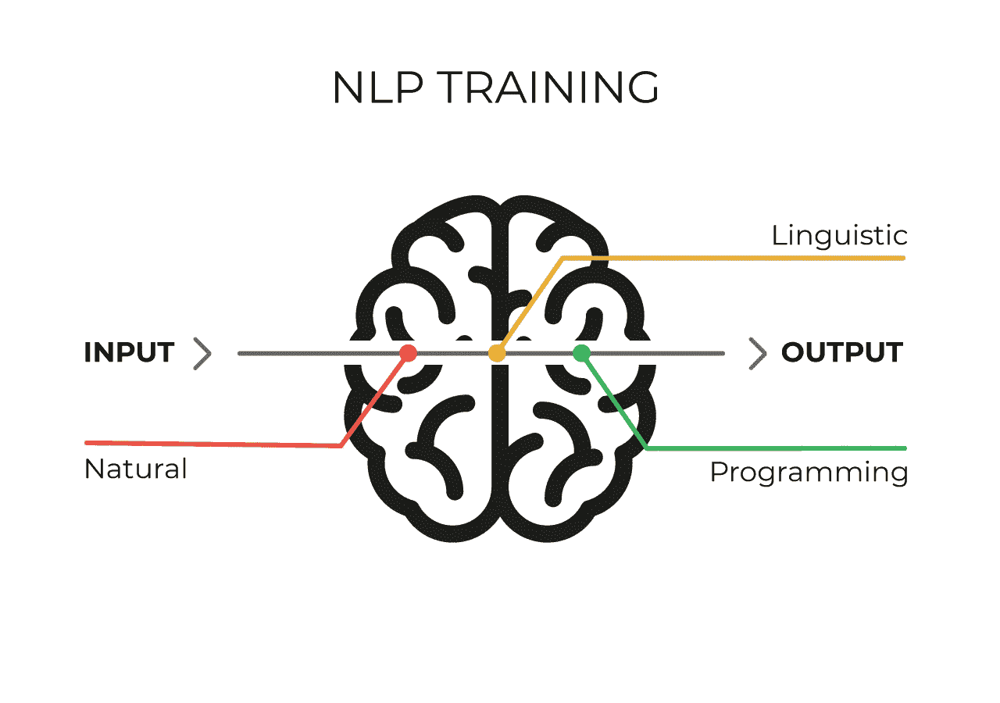

# tensor flow vs py torch vs Keras for NLP—exx act

> 原文：<https://towardsdatascience.com/tensorflow-vs-pytorch-vs-keras-for-nlp-exxact-8e51dd13c3f5?source=collection_archive---------9----------------------->

在开始 TensorFlow 与 PyTorch 和 Keras 的功能比较之前，让我们先了解一下它们之间的一些非竞争性的软差异。

# 非竞争事实:

下面我们将介绍 TensorFlow、PyTorch 和 Keras 之间的一些差异。这些不同之处并不是出于相互比较的目的，而是为了引入本文讨论的主题。

# 张量流

*   由谷歌创建
*   2017 年 2 月 1.0 版本

# PyTorch

*   由脸书创造
*   2018 年 10 月 1.0 版本
*   基于 Torch，另一个基于 Lua 的深度学习框架

# 克拉斯

*   简化深度学习框架复杂性的高级 API
*   运行在其他深度学习 API 之上——tensor flow、Theano 和 CNTK
*   它本身不是一个图书馆

# TensorFlow 与 PyTorch 和 Keras 的竞争差异:

现在，让我们来看看他们三人更具竞争力的事实。我们特别希望对侧重于自然语言处理**的框架进行比较分析。**

# **1.两者中可用的 rnn 类型**

**当寻找 NLP 问题的深度学习解决方案时，递归神经网络(RNNs)是开发人员最受欢迎的架构。因此，从这个角度比较框架是有意义的。**

**所有正在考虑的框架都有模块，允许我们创建**简单 RNNs** 以及它们更进化的变体——门控循环单元( **GRU** )和长短期记忆( **LSTM** )网络。**

# **PyTorch:**

**PyTorch 为构建这种循环网络提供了两个级别的类:**

*   ****多层类— nn。新泽西州 RNN。GRU·安迪。LSTM**
    这些类的对象能够表示深度双向递归神经网络。**
*   ****细胞水平类— nn。新罕布什尔州 RNNCell。格鲁塞尔和 nn。这些类的 LSTMCell**
    对象只能代表一个单元格(*同样，一个简单的 RNN 或 LSTM 或 GRU 单元格*)，可以处理一个时间步长的输入数据。**

**因此，当我们不想在神经网络中进行太多定制时，多层类就像是细胞级类的一个很好的包装器。**

**此外，在多层类中将**双向**参数设置为**真**就可以实现 RNN 双向了！**

**查看我们的文章[使用 PyTorch 框架开始使用 NLP](https://blog.exxactcorp.com/getting-started-with-natural-language-processing-using-pytorch/)——深入了解这些类的更多细节。**

# **张量流:**

**TensorFlow 为我们提供了一个 **tf.nn.rnn_cell 模块**来帮助我们满足标准的 rnn 需求。**

**`tf.nn.rnn_cell`模块中一些最重要的类如下:**

*   ****单元级类**，用于定义 RNN 的单个单元，即— `BasicRNNCell`、`GRUCell`和 LSTMCell**
*   ****MultiRNNCell 类**用于堆叠各种单元格以创建深度 rnn**
*   ****DropoutWrapper 类**，用于实现退出正则化**

**查看我们的文章[使用 TensorFlow 和 Keras 框架开始使用 NLP](https://blog.exxactcorp.com/getting-started-with-nlp-using-the-tensorflow-and-keras-frameworks/)，深入了解这个模块的更多细节。**

# **Keras:**

**Keras 是 Keras 库中提供的[重现层](https://keras.io/layers/recurrent/)。这些层包括:**

*   ****SimpleRNN** —全连接的 RNN，输出将反馈到输入**
*   ****GRU** —门控循环单元层**
*   ****LSTM**——长短期记忆层**

**查看我们的文章— [使用 TensorFlow 和 Keras 框架开始使用 NLP](https://blog.exxactcorp.com/getting-started-with-nlp-using-the-tensorflow-and-keras-frameworks/)—深入了解这些类的更多细节。**

**因此，TensorFlow、PyTorch 和 Keras 三者都具有内置功能，允许我们创建流行的 RNN 架构。区别在于他们的界面。**

**Keras 有一个简单的接口和一个定义良好的参数列表，使得上面的类很容易实现。作为 TensorFlow 之上的高级 API，我们可以说 Keras 让 TensorFlow 变得简单。虽然 PyTorch 提供了与 TensorFlow 类似的灵活性，但它的界面要干净得多。**

**既然我们谈到了这个主题，让我们更深入地进行一项基于每个框架易用性的比较研究。**

# **2.易于使用 TensorFlow vs PyTorch vs Keras**

**TensorFlow 经常因其不全面的 API 而受到指责。PyTorch 使用起来更加友好和简单。总的来说，PyTorch 框架与 Python 语言集成得更紧密，大多数时候感觉更原生。当你在 TensorFlow 中写作时，有时你会觉得你的模型在一堵砖墙后面，有几个小孔可以沟通。这就是为什么，克雷斯。
让我们根据它们的易用性，再讨论几个比较这三者的因素:**

# **静态计算图与动态计算图:**

**这个因素在 NLP 中尤其重要。TensorFlow 使用静态图形进行计算，而 PyTorch 使用动态计算图形。**

**这意味着在 Tensorflow 中，在模型运行之前，您静态地定义计算图。与外界的所有通信都是通过 tf 进行的。会话对象和 tf。占位符是在运行时将被外部数据替换的张量。**

**在 PyTorch 中，事情更加命令化和动态化:您可以随时定义、更改和执行节点，没有特殊的会话接口或占位符。**

**在 RNNs 中，对于静态图形，输入序列长度将保持不变。这意味着，如果你为英语句子开发一个情感分析模型，你必须将句子长度固定到某个最大值，并用零填充所有较小的序列。不太方便吧？**

# **调试:**

**由于 PyTorch 中的计算图是在运行时定义的，所以您可以使用我们最喜欢的 Python 调试工具，如 pdb、ipdb、PyCharm 调试器或旧的可信打印语句。【TensorFlow 却不是这样。您可以选择使用一个名为 [tfdbg](https://www.tensorflow.org/guide/debugger) 的特殊工具，它允许在运行时计算张量流表达式，并浏览会话范围内的所有张量和操作。当然，你不能用它来调试任何 python 代码，所以有必要单独使用 pdb。**

**Tensorflow 比 PyTorch 更成熟。与 PyTorch 和 Keras 加起来相比，它有一个更大的社区。它的用户群增长速度比 PyTorch 和 Keras 都快。**

**所以这意味着-**

*   **一个更大的 StackOverFlow 社区来帮助您解决问题**
*   **更多的在线学习材料——博客、视频、课程等。**
*   **更快地采用最新的深度学习技术**

# **NLP 的未来:**

**虽然递归神经网络已经成为 NLP 任务的“首选”架构有一段时间了，但它可能不会永远这样。我们已经有了一个更新的基于注意力机制的变形金刚模型，在研究人员中很受欢迎。**

**它已经被誉为新的 NLP 标准，取代了递归神经网络。一些评论者认为， [Transformer 将成为 2019 年](https://blog.floydhub.com/ten-trends-in-deep-learning-nlp/#trends-in-nlp-architectures)的主导 NLP 深度学习架构。**

**查看我们全面的 [3 部分教程，开始学习变形金刚。](https://blog.exxactcorp.com/transformer-architecture-part-1/)**

**Tensorflow 似乎在这场竞赛中遥遥领先:**

*   **首先，基于注意力的架构是谷歌自己引入的。**
*   **第二，只有 TensorFlow 有针对 Transformer 架构的[稳定版本](https://github.com/tensorflow/models/tree/master/official/transformer)**

**这并不是说 PyTorch 远远落后，在 Huggingface 的[https://github.com/huggingface/pytorch-transformers](https://github.com/huggingface/pytorch-transformers)有许多预先训练好的变形金刚模型。**

**所以，这就是比较的全部。但是在分手之前，让我告诉你一些可能会在一年内使整个谈话过时的事情！**

# **张量流 2.0**

**[谷歌最近发布了 Tensorflow 2.0](https://medium.com/tensorflow/announcing-tensorflow-2-0-beta-abb24bbfbe3d) ，这是一个游戏规则改变者！**

**方法如下:**

*   **展望未来， [Keras](https://keras.io/) 将成为 TensorFlow 的高级 API，它经过扩展，因此您可以直接从 [tf.keras](http://bit.ly/tfkeras) 使用 TensorFlow 的所有高级功能。因此，TensorFlow 在各种规模和所有硬件下都非常简单。**
*   **在 TensorFlow 2.0 中，急切执行现在是默认的。即使在 eager 上下文中，您也可以利用图形，这使得您的调试和原型制作变得容易，而 TensorFlow 运行时则在幕后处理性能和可伸缩性。**
*   **[TensorBoard](https://www.youtube.com/watch?v=xM8sO33x_OU) 与 Keras 整合，现在是… **one** -liner！**

**所以，我想这减轻了人们对张量流的所有抱怨。这意味着 TensorFlow 将巩固其作为所有深度学习任务的首选框架的地位，甚至比现在更好！**

***原载于 2019 年 8 月 6 日*[*https://blog.exxactcorp.com*](https://blog.exxactcorp.com/tensorflow-vs-pytorch-vs-keras-for-nlp/)*。***