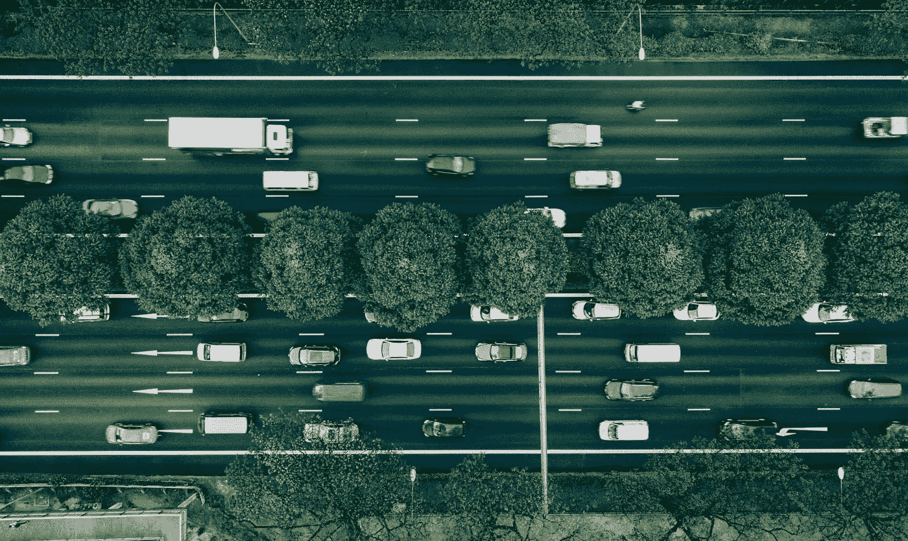
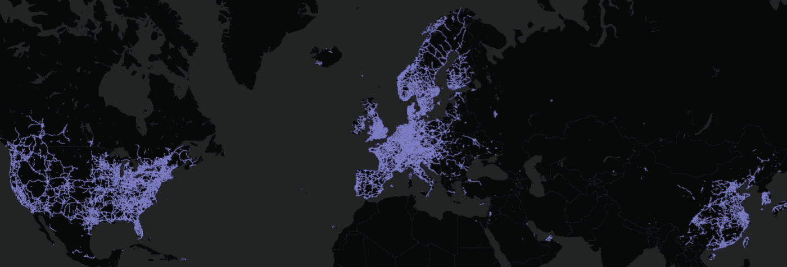
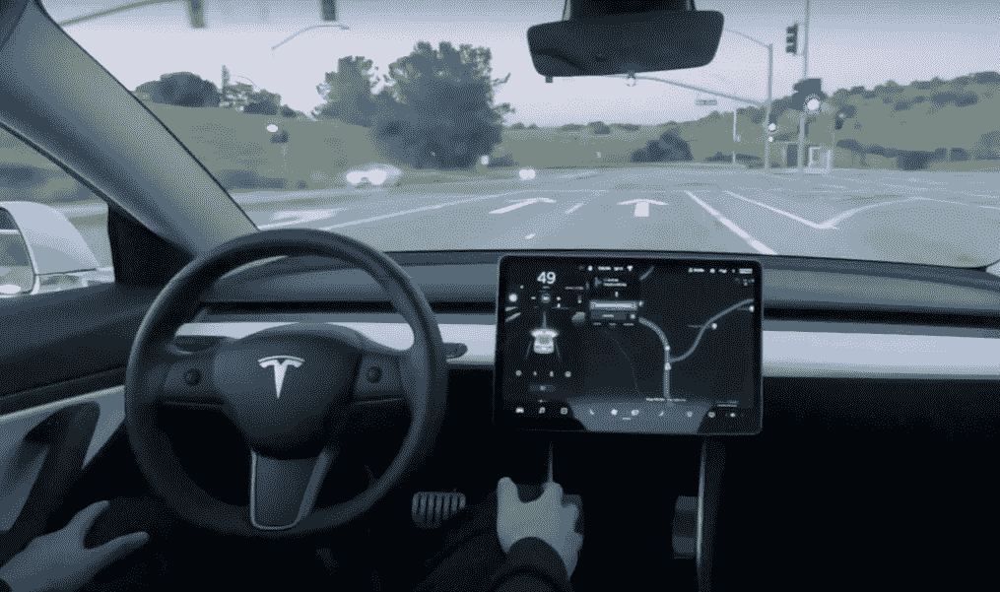
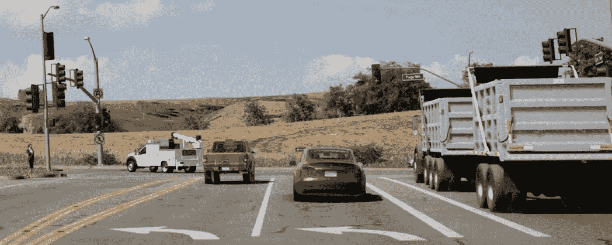

# 特斯拉的大规模深度学习:使用数十亿英里训练神经网络

> 原文：<https://towardsdatascience.com/teslas-deep-learning-at-scale-7eed85b235d3?source=collection_archive---------2----------------------->

Photo by [Chuttersnap](https://unsplash.com/@chuttersnap).

## 特斯拉能做到而 Waymo 做不到的事情

训练数据是决定深度神经网络性能的基本因素之一。(另外两个是网络架构和优化算法。)作为一般原则，更多的训练数据导致更好的性能。这就是为什么我相信特斯拉，而不是 Waymo，拥有世界上最有前途的自动驾驶汽车计划。

Visualization of Tesla’s fleet. Image courtesy of Tesla.

大约有 50 万辆配备了特斯拉声称的完全自动驾驶硬件的[车队](https://hcai.mit.edu/tesla-autopilot-miles-and-vehicles/)在路上行驶，特斯拉的车队每天行驶的里程数大约为 1500 万英里，相当于 Waymo 车队成立以来行驶的里程数。每天 1500 万英里推算起来就是每年 54 亿英里，比 Waymo 预计的一年后的总里程数多 200 倍。特斯拉的车队也在以每周约 5000 辆的速度增长。

数据在三个关键领域发挥着重要作用:

*   计算机视觉
*   预言；预测；预告
*   路径规划/驾驶策略

# 计算机视觉

一个重要的计算机视觉任务是目标检测。有些物体，比如马，只是很少出现在路上。每当特斯拉遇到神经网络认为可能是马的东西(或者可能只是一个未识别的物体阻挡了一段道路)，相机就会拍摄快照，稍后会通过 wifi 上传。它有助于让车辆每年行驶数十亿英里，因为你可以找到许多稀有物品的例子。显而易见，随着时间的推移，特斯拉在识别稀有物体方面将比 Waymo 车辆更好。

对于常见的物体，Waymo 和特斯拉的瓶颈很可能是付钱给人来手动标记图像。很容易捕捉到比你付钱给人们去贴标签更多的图像。但对于稀有物体来说，Waymo 的瓶颈可能是首先收集图像，而特斯拉的瓶颈可能只是标记和开发软件，以便在正确的时间触发快照。这是一个更好的位置。

特斯拉的人工智能总监 Andrej Karpathy 在这个剪辑中解释了特斯拉如何获取图像来训练物体检测(摘自他在[自治日](https://youtu.be/Ucp0TTmvqOE)的演讲):

# 预言；预测；预告

预测是提前几秒钟预测汽车、行人和骑自行车者的运动和行动的能力。安东尼·莱万多夫斯基(Anthony Levandowski)多年来一直是 Waymo 的顶级工程师之一，最近[写道](https://link.medium.com/BKehpVFUtW)“没有人实现‘完全自主’的原因是因为今天的软件还不足以预测未来。”莱万多夫斯基[声称](https://youtu.be/fNgEG5rCav4)自动驾驶汽车的主要失败是错误地预测附近汽车和行人的行为。

特斯拉大约 500，000 辆汽车的车队是一个极好的资源。每当特斯拉对汽车或行人做出不正确的预测时，特斯拉都可以保存数据快照，以便稍后上传并添加到特斯拉的训练集中。特斯拉可能能够上传由其计算机视觉神经网络产生的场景的抽象表示(其中物体被可视化为彩色编码的长方体形状，像素级信息被丢弃)，而不是上传视频。这将从根本上降低上传这些数据的带宽和存储需求。

尽管用于训练对象检测的图像需要人类标记，但预测神经网络可以仅从事件的时间序列中学习过去和未来之间的相关性。什么行为先于什么行为是任何记录(视频或摘要)中固有的。安德烈·卡帕西在下面的视频中解释了这个过程:

由于不需要人类来标记数据，特斯拉可以根据它可以收集的尽可能多的有用数据来训练它的神经网络。这意味着其训练数据集的大小将与其总里程数相关。与物体检测一样，与 Waymo 相比的优势不仅仅是有更多的数据来预测常见行为，而是能够收集在罕见情况下看到的罕见行为的数据，以便预测这些行为。

# 路径规划/驾驶策略

路径规划和驾驶政策指的是汽车采取的行动:在限速车道上保持居中、变道、超车、在绿灯时左转、绕过一辆停着的汽车、停下来等。似乎很难指定一套规则来涵盖汽车在任何情况下可能需要采取的所有行动。解决这一棘手难题的一种方法是让神经网络模仿人类的行为。这被称为模仿学习(有时也被称为学徒学习，或从示范中学习)。

训练过程类似于神经网络如何通过绘制过去和未来之间的相关性来学习预测其他道路使用者的行为。在模仿学习中，神经网络通过绘制它所看到的(通过计算机视觉神经网络)和人类驾驶员采取的行动之间的相关性，来学习预测人类驾驶员会做什么。

Still frame from Tesla’s autonomous driving [demo](https://www.youtube.com/watch?v=tlThdr3O5Qo). Courtesy of Tesla.

模仿学习最近取得了可以说是迄今为止最大的成功:AlphaStar。DeepMind 使用数百万人玩的星际争霸游戏数据库中的例子来训练神经网络像人类一样玩游戏。该网络了解了游戏状态和人类玩家行为之间的相关性，从而学会了预测人类在面对游戏状态时会做什么。仅通过这种训练，AlphaStar 就达到了 DeepMind [估计](https://twitter.com/oriolvinyalsml/status/1094670648042012673?s=21)将使其在星际争霸的竞争排名中大致处于中间的能力水平。(后来，AlphaStar 使用强化学习进行了增强，这使它能够提升到专业水平的能力。自动驾驶汽车可能会也可能不会有类似的增强——这是另一个话题。)

特斯拉正在将模仿学习应用于驾驶任务，例如如何处理高速公路三叶草的陡峭曲线，或者如何在十字路口左转。听起来特斯拉计划随着时间的推移将模仿学习扩展到更多的任务，比如如何以及何时在高速公路上变道。卡帕西在这个片段中描述了特斯拉如何使用模仿学习:

与预测一样，上传汽车周围场景的抽象表示可能就足够了，而不是上传视频。这意味着更低的带宽和存储需求。

与预测一样，一旦数据上传，就不需要人为标记。由于神经网络正在预测人类驾驶员在给定世界状态的情况下会做什么，所以它需要的只是世界状态和驾驶员的行动。本质上，模仿学习是预测特斯拉司机的行为，而不是预测特斯拉周围其他道路使用者的行为。与 AlphaStar 一样，所有需要的信息都包含在所发生事情的回放中。

基于 Karpathy 关于预测超车的评论，当特斯拉未能正确预测前方车辆是否会切入特斯拉的车道时，它可以触发汽车保存重播。同样，当参与路径规划或驾驶政策的神经网络未能正确预测特斯拉驾驶员的行动时，特斯拉可能会捕捉到重播数据。埃隆·马斯克(Elon Musk)过去曾提到过这一功能(或类似的功能)，尽管尚不清楚它目前是否在特斯拉汽车上运行。

相反，当特斯拉处于自动驾驶或即将到来的城市半自动驾驶模式时，人类司机就会接管。这可能是一个丰富的例子，其中系统做了一些错误的事情，然后人类驾驶员立即演示如何正确地做。

其他捕捉有趣回放的方法包括:突然刹车或转向，自动紧急刹车，撞车或碰撞警告，以及机器学习中更复杂的技术，称为异常检测和新奇检测。(这些相同的条件也可以用于触发用于预测的重放捕获或用于对象检测的相机快照。)如果特斯拉已经知道它想要捕捉什么，比如十字路口的左转，它就可以设置一个触发器，每当视觉神经网络看到交通灯并激活左转信号时，或者方向盘左转时，就捕捉回放。

# 结论

由于拥有大约 50 万辆汽车，特斯拉在三个关键领域比 Waymo(和其他竞争对手)更具优势:

*   计算机视觉
*   预言；预测；预告
*   路径规划/驾驶策略

对收集正确数据的担忧，付钱给人们去贴标签，或者为带宽和存储付费，都不能排除这些优势。通过设计好的触发器，使用不需要人为标记的数据，以及使用抽象的表示(重放)而不是原始视频，可以解决这些问题。

商业分析师、记者和普通公众的大多数观点似乎是，Waymo 在自动驾驶方面遥遥领先，而特斯拉并没有接近。当你看神经网络的第一原理时，这种观点是没有意义的。

更重要的是，AlphaStar 是针对复杂任务的大规模模仿学习的概念证明。如果你怀疑特斯拉的方法是正确的，或者路径规划/驾驶政策是一个容易处理的问题，你必须解释为什么模仿学习对星际争霸有效，但对驾驶无效。

我预测，除非 Waymo 采取激进措施扩大其车队规模，否则在未来 1-3 年内，Waymo 遥遥领先、特斯拉远远落后的观点将被广泛抛弃。人们一直过于关注演示，这些演示没有告诉我们系统的健壮性、[深度受限的](https://www.theverge.com/2019/2/13/18223356/california-dmv-self-driving-car-disengagement-report-2018)脱离度指标，以及谷歌/Waymo 对顶级机器学习工程师和研究人员的访问。他们对训练数据的关注太少，特别是对于罕见的物体和行为，Waymo 没有足够的数据来做好机器学习，或者根本没有。

Tesla’s driving simulation. Image courtesy of Tesla.

模拟并不是 Waymo 的优势，因为特斯拉(像所有自动驾驶汽车公司一样)也使用模拟。更重要的是，模拟不能产生罕见的对象和罕见的行为，因为模拟的创建者不能预测或不知道如何准确地建模。

纯粹的强化学习对 AlphaStar 不起作用，因为星际争霸的行动空间太大，随机探索无法找到好的策略。所以，DeepMind 不得不用模仿学习来引导。这显示了一个假设的弱点，即与 AlphaGo Zero 一样，纯模拟体验将解决任何问题。特别是当涉及到像驾驶这样的问题时，预测人类的行为是一个关键的组成部分。预测人类行为需要真实世界的经验信息。

自动驾驶汽车领域的观察人士可能低估了特斯拉吸引顶级机器学习人才的能力。一项对科技工作者的调查发现，特斯拉是湾区第二受欢迎的公司，仅次于谷歌。它还发现特斯拉是全球第四大最受欢迎的公司，比排名第二的谷歌落后两个等级。(Shopify 在全球排名第三，SpaceX 排名第一。)还值得注意的是，机器学习的基本进展通常由学术界、OpenAI 以及谷歌、脸书和 DeepMind 的企业实验室公开分享。特斯拉能做的和 Waymo 能做的差别可能没那么大。

这两家公司最大的区别在于数据。随着特斯拉的车队增长到 100 万辆，其每月里程数将约为 10 亿英里，比 Waymo 每月约 100 万英里的里程数多 1000 倍。这 1000 倍的差异对特斯拉来说意味着对罕见物体的卓越检测，对罕见行为的卓越预测，以及对罕见情况的卓越路径规划/驾驶政策。自动驾驶的挑战更多的是处理包含罕见边缘情况的 0.001%的里程，而不是 99.999%的里程。所以，按理说，能从这 0.001%的里程中收集到大量训练样本的公司，会比不能的公司做得更好。