# SAS 中的统计显著性检验

> 原文：<https://towardsdatascience.com/test-of-statistical-significance-in-sas-7c2372b19438?source=collection_archive---------12----------------------->

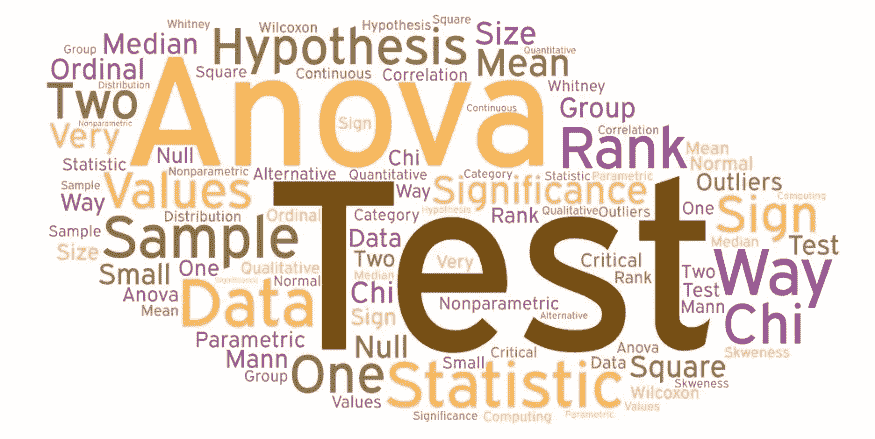

许多材料可用于统计显著性检验。这个博客为你提供了为什么、什么、何时以及如何使用统计测试的简短想法？。此外，这篇博文试图快速修订这些统计测试的用法。p 值和假设没有在这个博客中讨论，你可以在这里查看。

# 为什么我们需要很多统计测试？

例如，我们想测量球的重量。我们有四种测量设备可供选择，如天平、温度计、尺子和容量瓶。我们选择哪一个？显然，我们选择身体平衡。不是吗？假设我们想测量球的温度。然后我们选择温度计。对于体积，我们选择容量瓶。

现在，您可以看到，随着我们要测量的变量发生变化，器件也会发生变化。同样的，为什么我们有这么多的统计测试？我们有不同类型的变量和分析。随着分析类型的改变，统计检验也随之改变。

让我们再举一个例子，假设老师想比较班上男生和女生的身高。

于是老师产生了无效的替代假设。这里，

**零假设(H0)** →男孩和女孩的身高相似，身高之间的任何差异都是偶然的。

**(H1)**→男孩的身高高于女孩的身高，所以观察到的身高差异是真实的。

如何验证这个假设？为此，统计显著性检验发挥了作用。

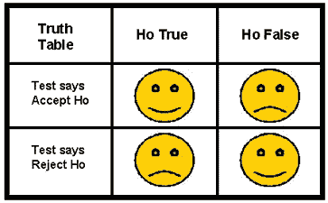

# 什么是统计显著性检验？

> 这些测试有助于研究人员或分析师确认假设。换句话说，这些测试有助于假设是否正确？

有很多统计测试。但是，我们将在这个博客中看到两种类型。

统计显著性检验分为两种类型。

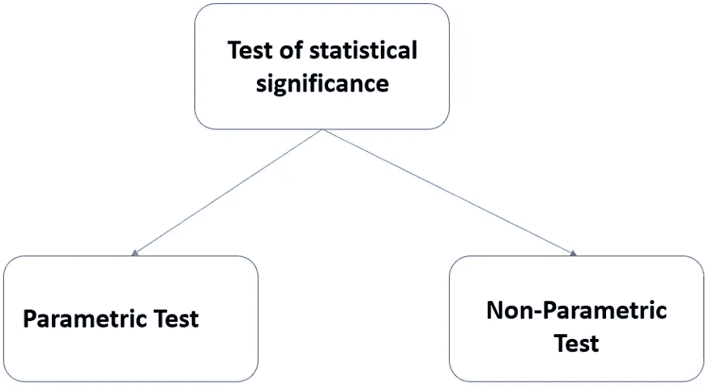

# 下一个问题，什么时候用？

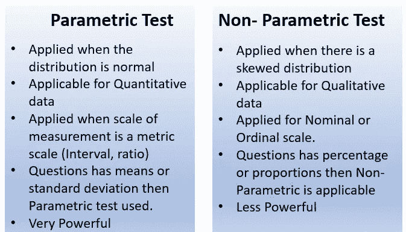

# 选择统计测试

参数和非参数都有不同类型的测试(不同类型的参数测试将在下面介绍)，但是分析师或研究者如何根据研究设计、变量类型和分布选择正确的测试呢？

下面的图表总结了在选择正确的测试之前需要回答的问题。参考:明尼苏达大学。这里可以查[。](https://cyfar.org/choosing-statistical-test)

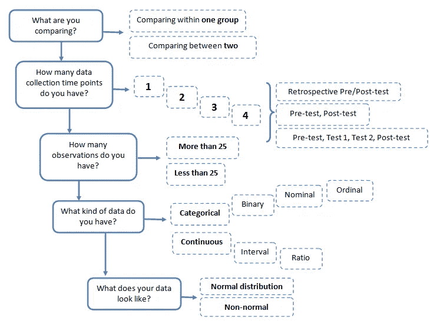

**什么是参数测试？**

> *如果关于总体的信息通过其参数完全已知，则使用该方法，然后统计检验被称为参数检验。*

**参数测试的类型**

# 1) t 检验

# 一个样本的 t 检验

> *t 检验比较不同组的两个平均值之间的差异，以确定该差异是否具有统计显著性*

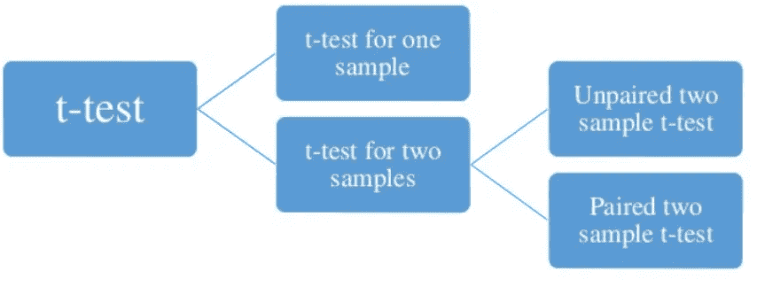

让我们以 hbs2 数据集为例。该数据集包含来自高中生样本的 200 个观察值。它有性别，社会经济地位，种族背景，学科分数，如阅读，写作，数学，社会研究。

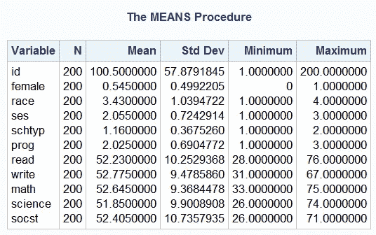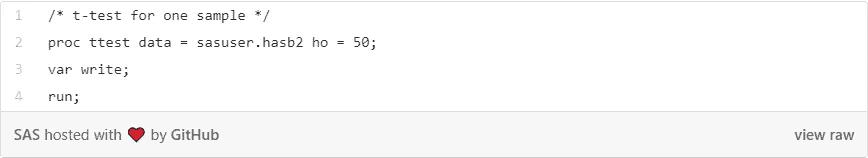

在这里，我想测试一下写作平均分是否与 50 分有显著差异。

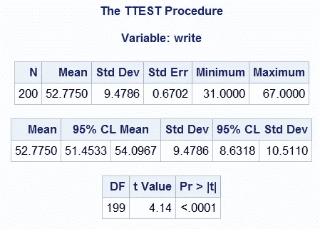

这里，p 值小于 0.05。因此，这个学生样本的变量 write 的平均值是 52.77，这与测试值 50 有显著的统计学差异。我们可以得出结论，这组学生在写作测试中的平均分明显高于 50 分。

# 两个样本的 t 检验

> *当两个独立的随机样本来自方差未知或相同的正态总体时使用。它分为两种类型*

1.  **独立双样本 T 检验:**

当您想要比较两个独立组的正态分布区间因变量的平均值时，可以使用独立样本 t 检验。换句话说，t 检验是为了比较两组之间相同变量的平均值。

在这里，我们想测试男性和女性的写作意义是否相同。(女性是具有 0 和 1 的变量(0 ->男性，1 ->女性)。该变量是进行独立组 t 检验所必需的，由**类**语句指定。

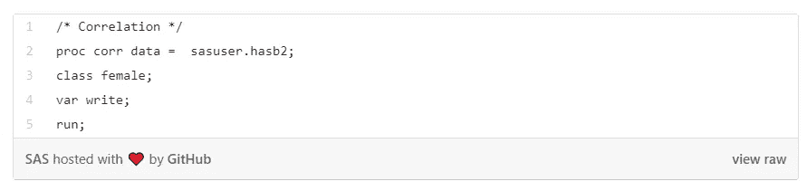

在我们的数据集中，我们比较了女学生组和男学生组的平均写作分数(在上面的代码中作为一个类提到，女性是一个变量(0 ->男性，1 ->女性)。这给出了两个可能不同的 t 统计量和两个不同的 p 值。p 值的解释与其他 t 检验相同。

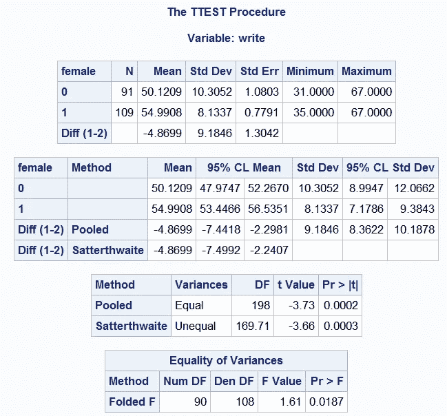

从上面的方差等式中，p 值为 0.0187，小于 0.05，我们得出方差显著不同的结论。上述结果表明，男性和女性的平均写作成绩之间存在统计学上的显著差异(t = -3.73，p = .0003)。换句话说，从统计数据来看，女性的写作平均分(54.991)明显高于男性(50.121)。

**2。配对双样本 t 检验**

当您有两个相关的观察值(即，每个受试者有两个观察值)并且您想要查看这两个正态分布区间变量的平均值是否彼此不同时，可以使用该方法。

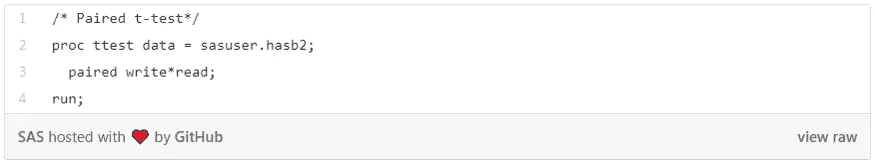

检查写作和阅读

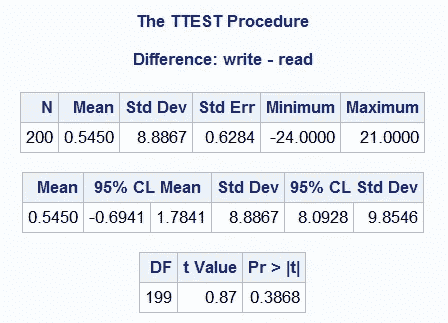

p 值大于 0.05。上述结果表明，阅读的平均水平与写作的平均水平在统计上没有显著差异。

# 2) Z 检验

z 检验是一种应用正态分布的统计检验，主要用于处理频率大于或等于 30 的大样本问题。当总体标准差已知时使用。如果样本量小于 30，则 t 检验适用。

在 SAS proc 中，t-test 会考虑样本大小并相应地给出结果。SAS 中没有 z 测试的独立代码。

# 3)方差分析(ANOVA)

> 它是一组统计模型的集合，用于分析组均值或方差之间的差异。

**单因素方差分析**

当您有一个分类自变量(有两个或多个分类)和一个正态分布区间因变量，并且您希望测试因变量按自变量水平分解的均值差异时，可以使用单向方差分析(ANOVA)。

> *在 SAS 中使用* ***PROC ANOVA*** 完成

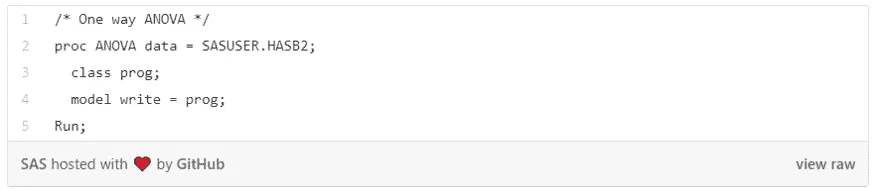

这里，我们将测试三种程序类型( **prog** )的**写**的含义是否不同。Prog 是一个类别变量。

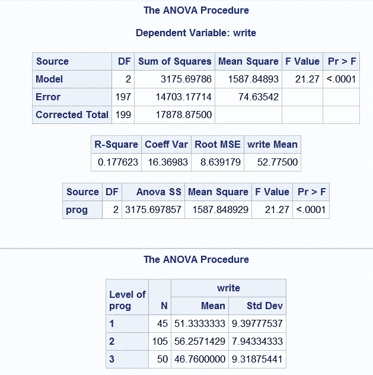

因变量(写作)的平均值在不同的课程类型中有显著差异。然而，我们不知道这种差异是只存在于两个级别之间，还是存在于所有三个级别之间。我们还可以看到，学术项目(prog 2 水平->学术项目)的学生平均写作成绩最高，而职业项目的学生最低。(计划 1 的水平->职业)

**双向方差分析**

双向方差分析是一种有一个数字结果变量和两个分类解释变量的研究设计。

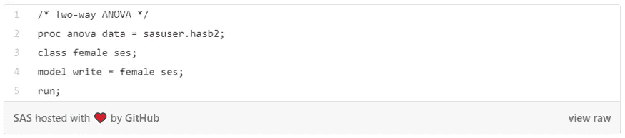

这里写为因变量，女性和社会经济地位(ses)为自变量。我们想检查女性和社会经济地位之间的书写差异。

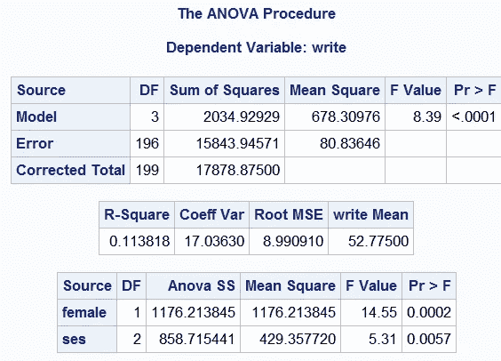

这些结果表明，总体模型具有统计学意义(F = 8.39，p = 0.0001)。变量**女性**和 **ses** 具有统计学意义(分别为 F = 14.55，p = 0.0002 和 F = 5.31，p = 0.0057)。

# 4)皮尔逊相关系数(r)

当您想要查看两个(或多个)正态分布区间变量之间的线性关系时，相关性非常有用。

我们可以在数据集中运行两个连续变量读和写之间的关联

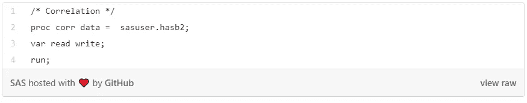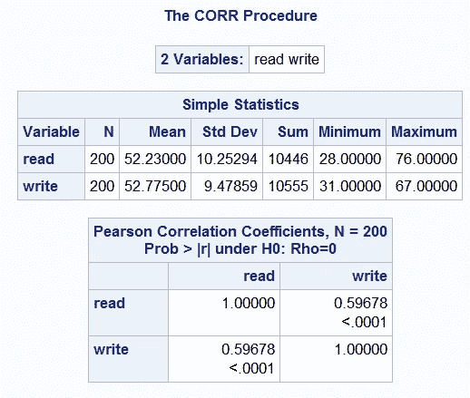

我们可以看到**读**和**写**的相关性为 0.59678。通过对相关性求平方，然后乘以 100，我们可以找出共有可变性的百分比。让我们将 0.59678 四舍五入为 0.6，其平方为 0.36，乘以 100 为 36%。因此**读股**约有 36%的可变性与**写股**相同。

我将在下一篇文章中解释非参数测试。

请继续学习，并关注更多内容！

参考:

1.  [https://stats.idre.ucla.edu/sas/](https://stats.idre.ucla.edu/sas/)