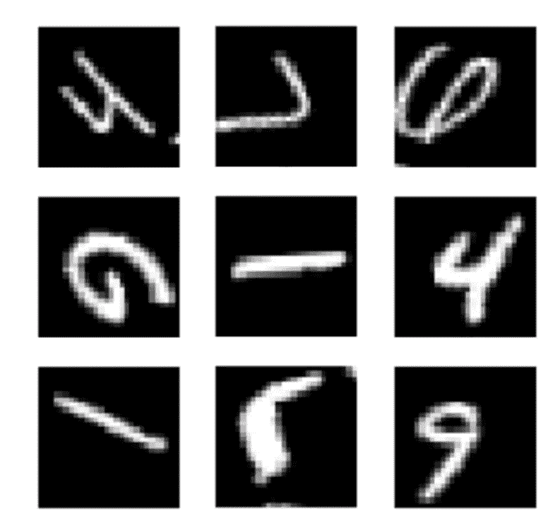

# 测试时间增加(TTA)以及如何使用 Keras 进行测试

> 原文：<https://towardsdatascience.com/test-time-augmentation-tta-and-how-to-perform-it-with-keras-4ac19b67fb4d?source=collection_archive---------13----------------------->

这里有很多方法可以通过改变我们**训练**神经网络的方式来改善它的结果。特别是，*数据扩充*是一种常见的做法，用于虚拟增加训练数据集的大小，也用作一种正则化技术，使模型对输入数据的微小变化更加稳健。

数据扩充是对输入数据随机应用一些操作(旋转、缩放、移动、翻转等)的过程。通过这种方式，模型永远不会显示两次完全相同的示例，并且必须学习他必须识别的类的更多一般特征。

Example of Data Augmentation on the CIFAR10 dataset

然而，也有一些方法可以通过改变我们**测试**它的方式来改善模型的结果，这就是*测试时间增加* (TTA)发挥作用的地方…

## 什么是测试时间增加？

类似于数据扩充对训练集所做的，测试时间扩充的目的是对测试图像执行随机修改。因此，我们将多次显示增强图像，而不是只向训练模型显示一次常规的“干净”图像。然后，我们将平均每个相应图像的预测，并把它作为我们的最终猜测。

但是所有这些都将通过一个例子变得更加清晰。让我们以一个在 CIFAR10 上训练的神经网络为例，它呈现了以下测试图像:

The test image (a boat)

下面是模型的预测，表示为给定图像属于可能类别的置信度(最高分数对应于预测的标签):

这是这张图片的真实标签:

我们可以看到，模型在输出一个错误的答案，因为他最有信心图像属于第二类(对应汽车)，但正确答案是第九类(对应船)。

如果我们增加测试时间，会发生什么？我们将呈现同一图像的 5 个稍微修改的版本，并要求网络预测它们中每一个的类别。

Modified version of the test image

以下是相应的预测:

Prediction 1

Prediction 2

Prediction 3

Prediction 4

Prediction 5

如您所见，只有预测 1 和预测 4 是正确的，并具有合理的可信度。2 只在很小的范围内是正确的，而 3 和 5 是不正确的。如果我们取这 5 个结果的平均值，会发生什么？

Average of the 5 predictions

现在我们可以看到，均值给出了正确的答案，具有合理的置信度。因此，我们现在有了一个正确的**答案，而不是有一个**错误的**答案，就像原始测试图像的情况一样。**

这种方法有效的原因是，通过对随机修改的图像平均我们的预测，我们也平均了误差。在单个向量中，误差可能很大，导致错误的答案，但是平均起来，只有正确的答案会突出。

测试时间增加对于模型非常不确定的测试图像特别有用。即使这 5 张图片看起来与你非常相似，但从模型的预测来看，它们是非常不同的。

## 如何搭配 Keras 使用？

测试时间增加可以很容易地与 Keras 一起使用，尽管在文档中没有明确提到。

第一步是创建一个真正简单的卷积神经网络，我们将在 CIFAR10 上对其进行训练以进行演示:

然后，我们可以通过使用 *ImageDataGenerator* 类 *:* 来定义我们想要在训练图像上执行的增强

我们现在可以为几个时期训练网络:

验证图像上模型的最终精度为:

为了增加测试时间，我们可以重用用于训练的同一*数据生成器*，并将其应用于验证图像。

然后，我们可以向模型显示 10 次(例如)随机修改的图像，获得每次的预测，并取平均值:

现在我们得到的精度是:

最终精度提高了超过 **3%** ，没有对模型做任何改动！

## 更多的数据扩充并不总是更好

虽然数据扩充是获得更好结果的非常有效的技术，但是必须明智地使用它。如果使用不当，它会损害模型的准确性。我会告诉你为什么会这样:

Bad data augmentation on MNIST

> 你能猜出每张图片中的数字吗？

给你个提示，图中没有 6…

你想做什么样的增强取决于你拥有的数据！在 MNIST 的例子中，你当然不希望进行随机翻转或太大的旋转，因为它们会完全改变图像的内容，6 可以翻转成 9，反之亦然，这使得你的模型很难学会区分这些类别。

然而，在像 CIFAR10 这样的数据库中，你完全想做水平翻转，因为它们不会改变图像，向右看或向左看的马仍然是马。但是在这里，垂直翻转也没有意义，因为您不太可能希望您的模型识别出一艘颠倒的船。

在某些情况下，如卫星成像或作物栽培图像，颠倒的图像不会改变它们的含义，您可以使用大旋转和垂直翻转作为数据扩充。

总之，只要你明智地使用，数据扩充既可以用于在**训练**时提升你的模型的结果，也可以用于**测试**时。

**不要犹豫，试试 ImageDataGenerator 参数，看看它如何影响您的结果！**

## 我希望这篇文章对新的深度学习实践者来说是清晰和有用的，并且它让你对什么是测试时间增加有了很好的了解！如果有不清楚的地方，请随时给我反馈或问我问题。

> 代码可从以下网址获得:

 [## 纳坦胡本斯/TTA-喀拉斯

### 在 GitHub 上创建一个帐户，为纳坦胡本斯/TTA-喀拉斯的发展做出贡献。

github.com](https://github.com/nathanhubens/TTA-Keras)