# 使用偏度和峰度检验正态性

> 原文：<https://towardsdatascience.com/testing-for-normality-using-skewness-and-kurtosis-afd61be860?source=collection_archive---------1----------------------->


[PDF of the Normal distribution](https://en.wikipedia.org/wiki/File:Normal_Distribution_PDF.svg) (Source: Wikimedia Commons under CC0)

## …以及使用**综合 K 平方**和**Jarque–Bera 正态性测试**的分步指南

我们将讨论以下 4 个主题:

1.  什么是常态，为什么要关心常态？
2.  什么是**偏度**和**峰度**以及如何使用它们来测试正态性？
3.  如何使用**两种非常常用的正态性检验，即基于偏度和峰度的综合 K 平方检验**和**Jarque–Bera 检验**。
4.  如何将这些测试应用于真实世界的数据集，以决定**O**rdinary**L**east**S**quares 回归是否是该数据集的合适模型。

## 快速提示

> 要直接进入显示如何测试正态性的 Python 代码，向下滚动到名为 **Example** 的部分。
> 
> 文章中使用的数据集可以从[这个链接](https://gist.github.com/sachinsdate/7b0a54bdbe29c4a60c02465fad895058)下载。

## 什么是常态？

正态性意味着你的数据遵循正态分布。具体来说，*中的每一个值 *y_i* 都是某个正态分布随机变量 *N( _i* ， *σ_i)* 的“实现”，如下:*

*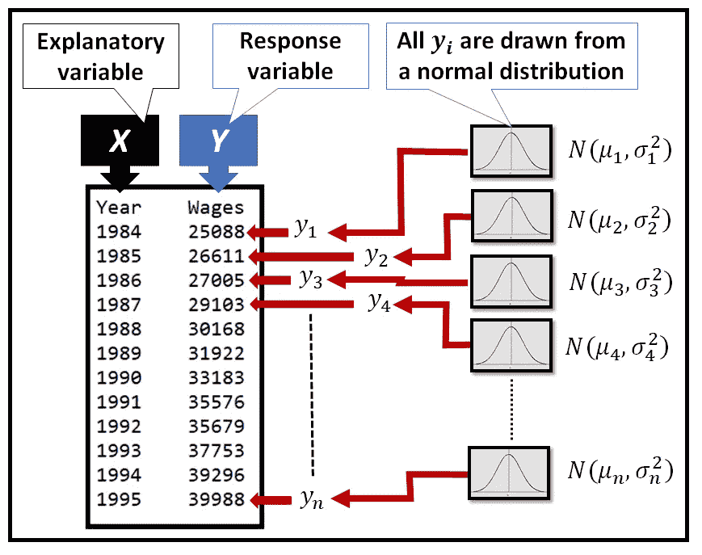*

**A normally distributed response variable* ***Y*** *(Image by* [*Author*](https://sachin-date.medium.com/)*)**

## *线性回归背景下的正态性*

*在建立线性回归模型时，假设 ***Y*** 依赖于回归变量的矩阵*这使得 ***Y* 在***【X .***上有条件正常**如果***X =【X _ 1，x_2，…，X _ n】***与 ***联合*****

****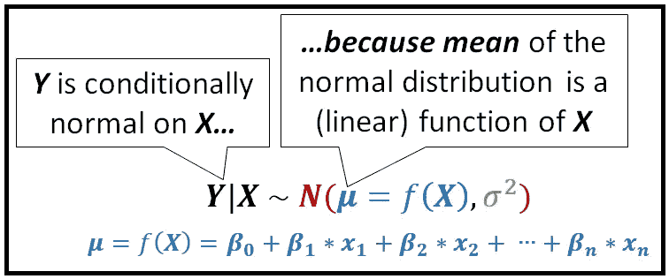****

****In linear regression, ***Y*** is conditionally normally distributed on the rmatrix of regressors ***X*******

## ****为什么要测试常态？****

****一些统计技术和模型假设基础数据是正态分布的。****

****我将给出以下三种常态抬头的情况:****

*   ****如上图所示，在**O**d**L**东 **S** 方( **OLS** )回归中， ***Y*** 是*有条件的*正常对回归变量*X:***Y***是正常的，如果***X =【x_1，X _ 1 但是，即使 ***Y*** 不是正态分布，你的 OLS 模型也不会发生任何不好的事情。********
*   ***经典线性回归模型的一个不太严格的要求是，回归的残差*'***'*'应该是期望值为零的正态分布*，即 e(****【ϵ****)= 0。* **如果残差ϵ为*非*正态分布，则无法使用 t 分布可靠地计算模型预测的置信区间**，尤其是对于小样本量(n ≤ 20)。****

> ****请记住，即使误差不是正态分布的，只要 E(ϵ)=0 满足 OLSR 的所有其他要求，OLS 估计量仍然是模型的蓝色估计量，即线性估计量。****

*   ****最后，某些拟合优度技术，如用于回归分析的 [F 检验](/fisher-test-for-regression-analysis-1e1687867259)假设竞争回归模型的残差都是正态分布的。**如果残差不是正态分布，f 检验不能可靠地用于**比较两个竞争回归模型的拟合优度。****

## ****如何判断我的数据是否(不是)正态分布？****

****有几个统计测试可以用来测试你的数据偏离正态的程度，**以及偏离是否有统计学意义**。****

****在本文中，我们将查看基于矩的度量，即**偏度**和**峰度**，以及基于这些度量的显著性统计测试，即**综合 K** 和 **Jarque — Bera** 。****

## ****什么是“偏斜度”以及如何使用？****

****偏斜度允许您测试分布的总体形状**与正态分布形状的偏离程度。******

****下图说明了偏态分布。****

****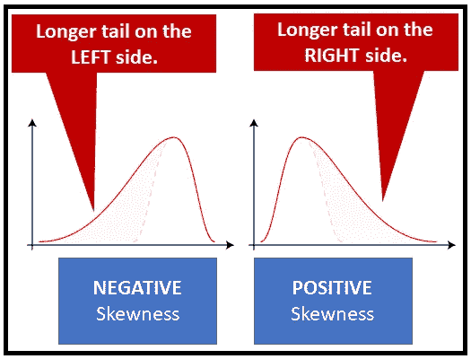****

****[Positive and negative skewness](https://commons.wikimedia.org/wiki/File:Negative_and_positive_skew_diagrams_(English).svg) (Source: Wikimedia Commons under CC BY-SA 3.0)****

****基于矩的偏斜度定义如下:****

> ****偏斜度被定义为概率分布的随机变量的第三个标准化中心矩。****

****人口的**偏度公式如下所示:******

****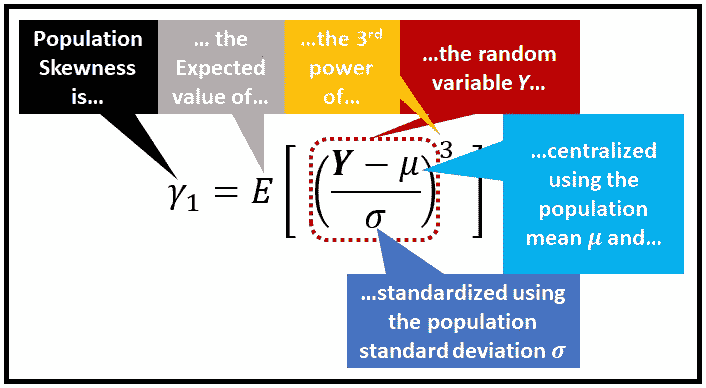****

****Formula for population skewness *(Image by* [*Author*](https://sachin-date.medium.com/)*)*****

******偏度有以下性质:******

*   ******偏度是一个基于** [**矩**](https://en.wikipedia.org/wiki/Moment_(mathematics)) **的度量**(具体来说是三阶矩)，因为**它使用的是一个随机变量**的三次方的期望值。****
*   ******偏斜度是一个中心矩，**因为随机变量的值是通过从平均值中减去它而被集中的**。******
*   ******偏斜度是一个标准化的矩**，因为它的值是通过除以**标准差**的(的幂)而标准化的**。******
*   ****因为是三阶矩，**围绕平均值完全对称的概率分布将具有零偏斜度**。这是因为，对于每个大于平均值的 *y_i* ，将有一个相应的 *y_i* 比平均值小相同的量。由于分布围绕平均值对称，两个 y_i 值将具有相同的概率。所以成对的 *(y_i- )* 将相互抵消，总偏斜度为零。****
*   ******正态分布的偏斜度为零。******
*   ****虽然对称分布将具有零偏斜度，但是具有零偏斜度的分布不一定是对称的。****
*   ******基于特定比率的分布** —最著名的[柯西分布](https://en.wikipedia.org/wiki/Cauchy_distribution) — **具有未定义的偏斜度**，因为它们具有未定义的均值。****

****实际上，我们可以通过计算样本的偏度来估计总体的偏度。对于样本，我们假设随机变量是均匀分布的，因此样本中每个 *y_i* 的概率是 1/n，第三个，中心的**样本**矩变成所有(y_i —y_bar)的简单求和的 1/n 倍。****

****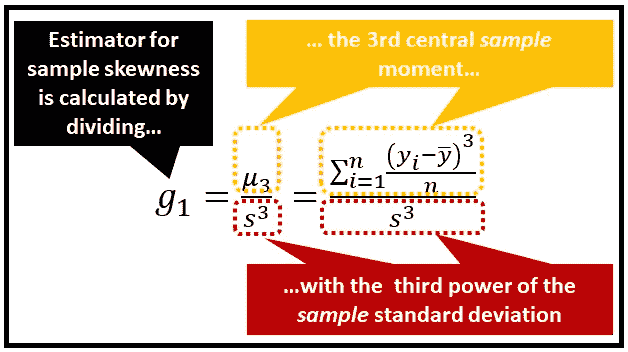****

****Formula for sample skewness *(Image by* [*Author*](https://sachin-date.medium.com/)*)*****

****偏斜度对概率分布的参数非常敏感。****

****下图说明了事件率参数λ的不同值的 [**泊松分布**](/the-poisson-process-everything-you-need-to-know-322aa0ab9e9a) 的 **P** 概率 **M** ass **F** 函数的偏斜度:****

****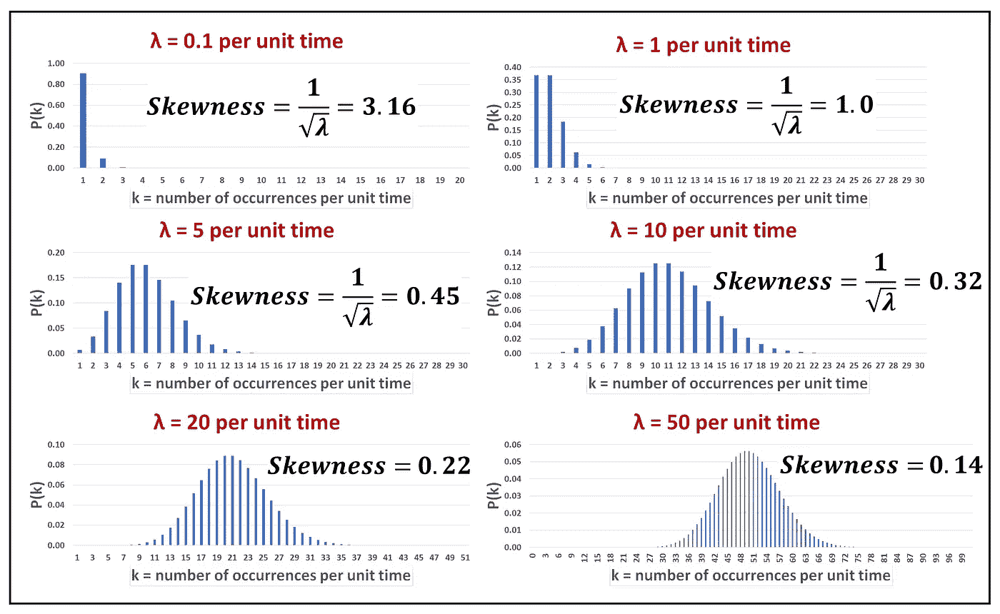****

****Skewness of the Poisson(λ) distribution for various event rates (λ) *(Image by* [*Author*](https://sachin-date.medium.com/)*)*****

******对于大事件率，泊松 PMF 的偏斜度为什么会降低？**对于较大的λ值，泊松分布的 PMF 接近正态分布的 PMF，均值和方差= λ。即泊松(λ) → N(λ，λ)，为λ → ∞。因此，上图中所见绝非巧合。****

> ****当λ → ∞，泊松分布的偏斜度趋于正态分布的偏斜度，即 0。****

****还有其他偏斜度的度量，例如:****

*   ****模式偏斜度****
*   ****中位数的偏斜度****
*   ****根据四分位值计算的偏斜度****
*   ****…还有一些其他的。****

## ****什么是峰度，如何使用它？****

****峰度是一种度量标准，用来衡量分布**的尾部与正态分布**的尾部相比有多不同。偏度侧重于整体形状，峰度侧重于尾部形状。****

****峰度定义如下:****

> ****峰度是概率分布的随机变量的第四个标准化中心矩。****

****峰度的公式如下:****

****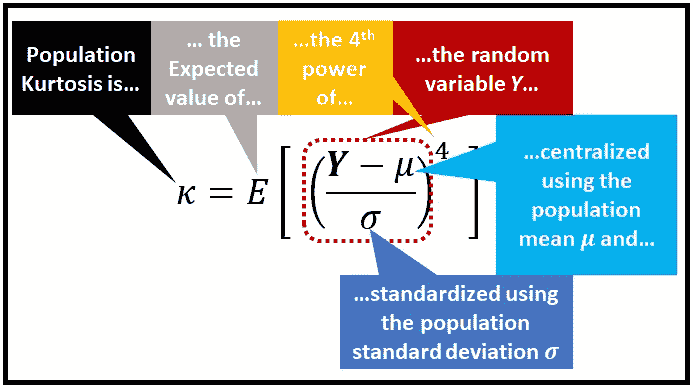****

****Formula for population Kurtosis *(Image by* [*Author*](https://sachin-date.medium.com/)*)*****

## ******峰度有以下性质:******

*   ****就像偏度一样，**峰度是基于矩的度量**，**它是一个中心的标准化矩**。****
*   ****因为是第四矩，**峰度总是正的**。****
*   ****峰度对尾部偏离正态性很敏感。由于 4 次幂，上式中集中值 *(y_i- )* 的较小值被大大削弱。换句话说，位于分布中心附近的 Y 值不被强调。相反， *(y_i- )* 的较大值，即位于分布的两个尾部的值，由 4 次方大大强调。这个性质使得峰度在很大程度上不知道位于分布中心的值，并且使得峰度对位于分布尾部的值敏感。****
*   ******正态分布的峰度为 3.0** 。在测量偏离正态性时，峰度有时表示为**过度峰度**，即峰度减去 3.0 后的**余额。******

****对于一个样本，*过度*峰度是通过将第四中心*样本*矩除以样本标准差的四次方，然后减去 3.0 来估计的，如下所示:****

****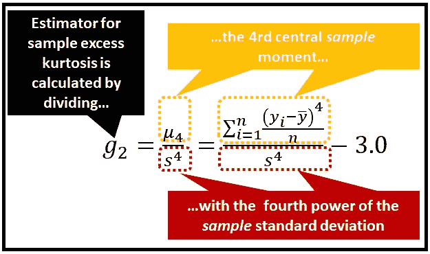****

****Formula for sample excess Kurtosis *(Image by* [*Author*](https://sachin-date.medium.com/)*)*****

****这里有一张来自维基共享的优秀图片，展示了各种分布的过度峰度。我在图像的左上方叠加了一个放大版的尾巴:****

****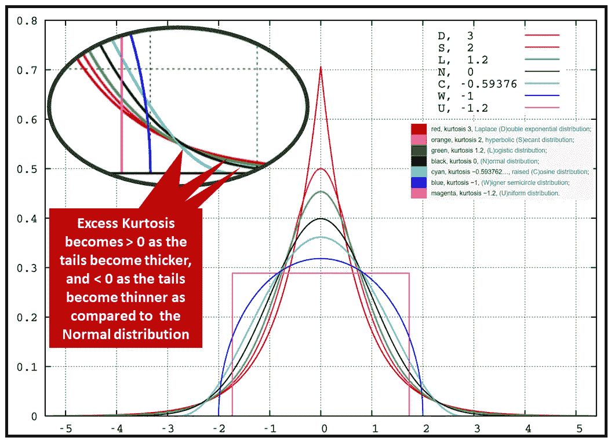****

****[Excess Kurtosis of various distributions](https://commons.wikimedia.org/wiki/File:Standard_symmetric_pdfs.png) (Source: Wikimedia Commons under CC0)****

## ****基于偏度和峰度的正态性检验****

****虽然偏度和峰度量化了偏离正态性的量，**人们可能想知道这种偏离在统计上是否显著**。下面两个测试让我们做到了这一点:****

*   ******综合 K 平方检验******
*   ******Jarque–Bera 测试******

****在这两个测试中，我们从以下假设开始:****

*   *****零假设(* H_0):数据**为**正态分布。****
*   *****交替假设* (H_1):数据**不是**正态分布，换句话说，由检验统计量测量的偏离正态性在统计上是显著的。****

## ****综合 K 平方正态性检验****

****综合检验将偏斜度和峰度的随机变量组合成一个单一的检验统计量，如下所示:****

****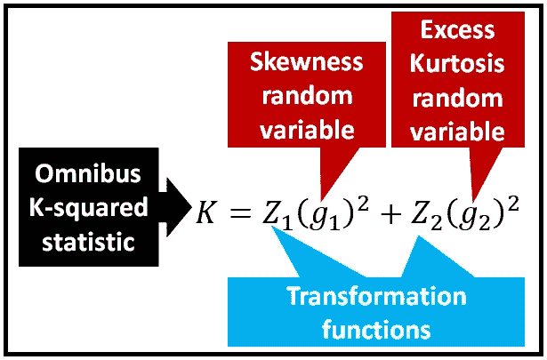****

****Formula for the Omnibus K-squared test statistic *(Image by* [*Author*](https://sachin-date.medium.com/)*)*****

******检验统计量的概率分布:** 在上述公式中，函数 *Z1()* 和 *Z2()* 意在使随机变量 *g1* 和 *g2* 近似正态分布。这又使得它们的平方和近似为*卡方(2)* 分布**，**从而使得**综合 K 平方的统计量近似为*卡方(2)* 分布** *假设零假设为真*，即数据是正态分布的。****

## ****jar que–Bera 正态性检验****

****该测试的测试统计如下:****

****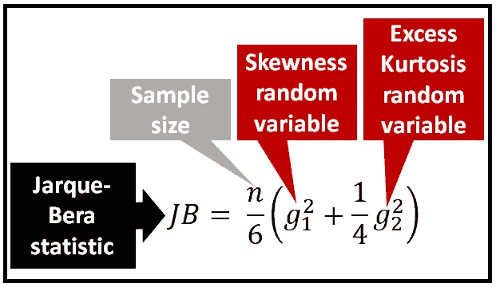****

****Formula for the Jarque-Bera test statistic *(Image by* [*Author*](https://sachin-date.medium.com/)*)*****

******检验统计量的概率分布:** 检验统计量是各自近似正态分布的随机变量 *g1* 和 *g2* 的缩放平方和，从而使得 **JB 检验统计量近似为卡方(2)分布**，假设原假设为真。****

## ****例子****

****我们将使用来自[美国劳工统计局](https://www.bls.gov/)的以下数据集来说明正态性检验的应用:****

****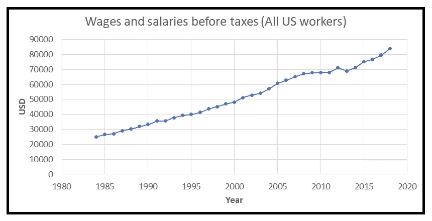****

****Source: Wages and salaries (series id: CXU900000LB1203M). [U.S. Bureau of Labor Statistics](https://www.bls.gov/) *(Image by* [*Author*](https://sachin-date.medium.com/)*)*****

****以下是数据集的前几行:****

****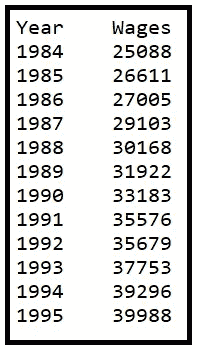****

*****(Image by* [*Author*](https://sachin-date.medium.com/)*)*****

****你可以从[这个链接](https://gist.github.com/sachinsdate/7b0a54bdbe29c4a60c02465fad895058)下载数据。****

****让我们用下面的 **OLS** 回归模型来拟合这个数据集:****

*******工资****=****β_ 0****+****β_ 1*********年份****+****ϵ*******

****其中:****

*****是因变量 ***，*** 是回归变量 ***，
β_0*** *是回归的截距，* ***β_ 1****是回归系数，****** 

****我们将使用 Python 库 *pandas* 和 *statsmodels* 来读取数据，并为这些数据构建和训练我们的 OLS 模型。****

****让我们从导入所需的包开始:****

```
****import** pandas **as** pd**import** statsmodels.formula.api **as** smf**import** statsmodels.stats.api as sms**from** statsmodels.compat **import** lzip**import** matplotlib.pyplot **as** plt**from** statsmodels.graphics.tsaplots **import** plot_acf**
```

****将数据读入熊猫数据框:****

```
**df = pd.read_csv(**'wages_and_salaries_1984_2019_us_bls_CXU900000LB1203M.csv'**, header=0)**
```

****剧情*工资*对比*年份*:****

```
**fig = plt.figure()plt.xlabel('Year')plt.ylabel('Wages and Salaries (USD)')fig.suptitle('Wages and Salaries before taxes. All US workers')wages, = plt.plot(df['Year'], df['Wages'], 'go-', label='Wages and Salaries')plt.legend(handles=[wages])plt.show()**
```

****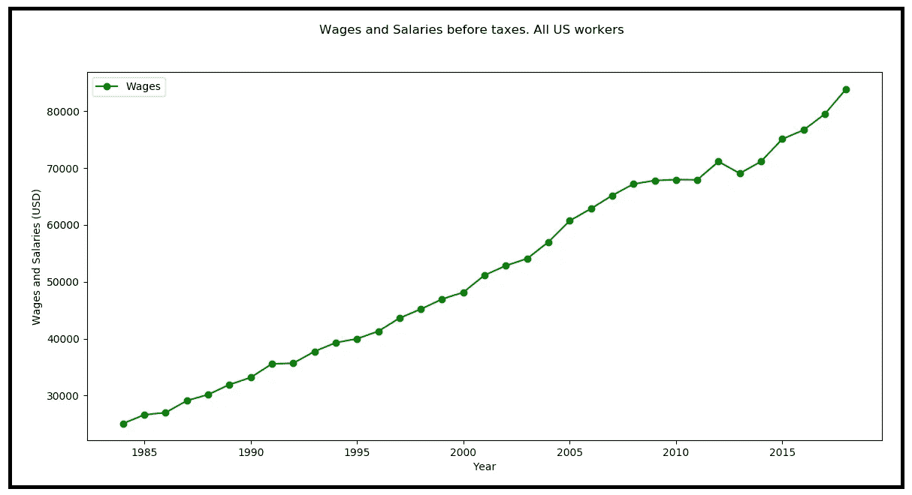****

****Source: Wages and salaries (series id: CXU900000LB1203M). U.S. Bureau of Labor Statistics *(Image by* [*Author*](https://sachin-date.medium.com/)*)*****

****用 [patsy](https://patsy.readthedocs.io/en/latest/quickstart.html) 语法创建回归表达式。在下面的表达式中，我们告诉 *statsmodels* 说*工资*是响应变量，而*年*是回归变量。statsmodels 会自动将截距添加到回归方程中。****

```
**expr = 'Wages ~ Year'**
```

****通过传递模型表达式来配置 OLS 回归模型，并在数据集上训练模型，所有这些都在一个步骤中完成:****

```
**olsr_results = smf.ols(expr, df).fit()**
```

****打印模型摘要:****

```
**print(olsr_results.summary())**
```

****在下面的输出中，我指出了我们的 OLS 模型对数据适用性的吉兆和凶兆区域:****

****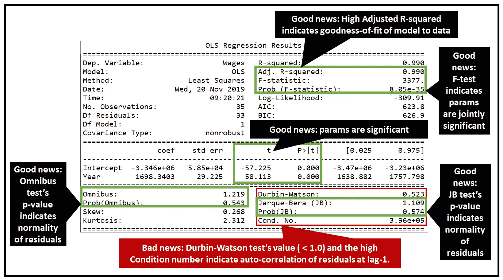****

****Summary of OLS regression model *(Image by* [*Author*](https://sachin-date.medium.com/)*)*****

## ****解释结果****

****以下是从结果中需要注意的一些事情:****

*   ****残差是正偏斜的，偏斜度为 0.268，并且它们还具有 2.312 的过度正峰度，即较厚的尾部。****
*   ****综合测试和 JB 测试都产生了测试统计值(分别为 1.219 和 1.109)，它们位于卡方(2) PDF 的 *H_0 接受区*内(见下图)。因此我们将接受假设 h0，即残差是正态分布的。****

****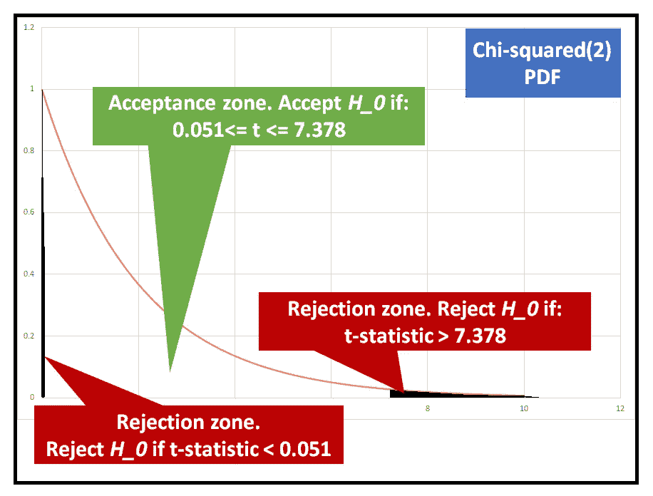****

****Acceptance and rejection zones for the Null hypothesis in the Chi-squared(2) PDF for two-tailed α=0.05 *(Image by* [*Author*](https://sachin-date.medium.com/)*)*****

*   ****您还可以获得偏度值、过度峰度值以及综合测试和 JB 测试的测试统计值，如下所示:****

```
**name = ['Omnibus K-squared test', 'Chi-squared(2) p-value']#Pass the residual errors of the regression into the test
test = sms.**omni_normtest**(olsr_results.resid)lzip(name, test)#Prints out the following:
> [('**Omnibus K-squared test**', 1.2194658631806088), ('**Chi-squared(2) p-value**', 0.5434960003061313)]name = ['Jarque-Bera test', 'Chi-squared(2) p-value', 'Skewness', 'Kurtosis']test = sms.**jarque_bera**(olsr_results.resid)lzip(name, test)#Prints out the following:
[('**Jarque-Bera test**', 1.109353094606092), ('**Chi-squared(2) p-value**', 0.5742579764509973), ('**Skewness**', 0.26780140709870015), ('**Kurtosis**', 2.3116476989966737)]**
```

*   ****由于残差似乎呈正态分布，我们也可以相信模型报告的两个模型参数的 95%置信水平。****
*   ****我们也可以相信 f 检验的 p 值。它非常小，表明这两个模型参数也*共同*显著。****
*   ****最后，模型报告的 R 平方相当高，表明模型与数据拟合得很好。****

******现在是坏的部分:**Durbin-Watson 测试和残差的条件数都表明残差是自相关的，特别是在滞后 1 时。****

****我们可以通过残差的 ACF 图轻松确认这一点:****

```
**plot_acf(olsr_results.resid, title='ACF of residual errors')plt.show()**
```

****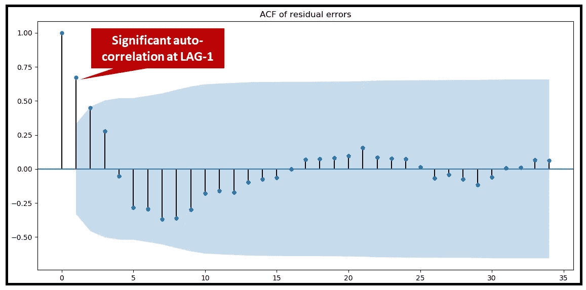****

****ACF plot of residual errors *(Image by* [*Author*](https://sachin-date.medium.com/)*)*****

****这给我们提出了一个问题:经典线性回归模型的一个基本要求是残差不应该是自相关的。在这种情况下，他们肯定是如此。这意味着 OLS 估计器可能低估了训练数据中的方差，这又意味着它的预测将偏离很大一部分。****

****简单地说，OLS 估计器不再是模型的 T2 蓝色估计器。真扫兴。****

****残差的自相关指出了一种*可能性*，即我们的模型被错误地选择或错误地配置。特别是，****

*   ****我们可能遗漏了一些关键的解释变量，导致一些信号以自相关的形式泄漏到残差中，或者，****
*   ****对这个数据集来说，选择 OLS 模型本身可能是完全错误的。我们可能需要寻找替代模型。****

****在这种情况下，您的选择是接受所选模型的次优性，并解决上述两个次优性的原因。****

## ****摘要****

*   ****一些统计程序假设基础数据遵循正态分布。****
*   ******偏度**和**峰度**是两个基于矩的度量，将帮助您快速计算偏离正态的程度。****
*   ****除了使用**偏度**和**峰度、**之外，您还应该使用**综合 K 平方**和 **Jarque-Bera** 测试来确定偏离正态的数量是否具有统计显著性。****
*   ****在某些情况下，如果数据(或残差)不是正态分布的，您的模型将是次优的。****

*****感谢阅读！如果你喜欢这篇文章，请关注我的*[***Sachin Date***](https://timeseriesreasoning.medium.com)*获取关于时间序列分析和预测的技巧、方法和编程建议。*****