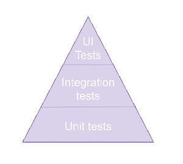
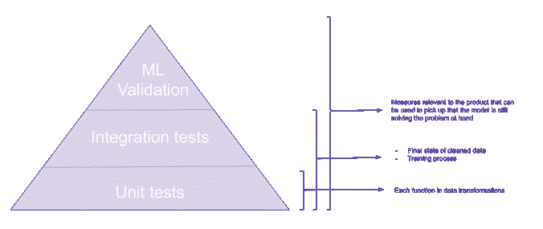

# 测试机器学习(ML)管道

> 原文：<https://towardsdatascience.com/testing-your-machine-learning-ml-pipelines-81f9c436727c?source=collection_archive---------28----------------------->

说到数据产品，很多时候有一种误解，认为这些产品不能通过自动化测试。尽管管道的某些部分由于其实验性和随机性而无法通过*传统的*测试方法，但大部分管道可以。除此之外，更不可预测的算法可以通过专门的验证过程。

让我们看看传统的测试方法，以及如何将这些方法应用到我们的数据/ML 管道中。

# 测试金字塔

您的标准简化测试金字塔如下所示:



Image by author

这个金字塔是你为应用程序编写的测试类型的代表。我们从大量的单元测试开始，这些单元测试孤立地测试单个功能。然后，我们编写集成测试，检查将我们隔离的组件组合在一起是否如预期的那样工作。最后，我们编写 UI 或验收测试，从用户的角度检查应用程序是否按预期工作。

说到数据产品，金字塔并没有太大的不同。我们的水平差不多。



Image by author

请注意，UI 测试仍然会在产品中进行，但是这篇博文关注的是与数据管道最相关的测试。

让我们在一些科幻作家的帮助下，仔细看看在机器学习的背景下，这些都意味着什么。

# 单元测试

*“这是一个测试你对宇宙的想法的系统，看看它们是否符合”艾萨克·阿西莫夫。*

数据管道中的大部分代码由数据清理过程组成。每个用来清理数据的函数都有一个明确的目标。比方说，我们为我们的模型选择的特征之一是前一天和当天之间的值的变化。我们的代码可能看起来有点像这样:

```
def add_difference(asimov_dataset):    
    asimov_dataset['total_naughty_robots_previous_day'] = 
        asimov_dataset['total_naughty_robots'].shift(1)  

    asimov_dataset['change_in_naughty_robots'] = 
        abs(asimov_dataset['total_naughty_robots_previous_day'] - 
            asimov_dataset['total_naughty_robots'])     return asimov_dataset[['total_naughty_robots', 
        'change_in_naughty_robots', 'robot_takeover_type']]
```

这里我们知道，对于给定的输入，我们期望得到一定的输出，因此，我们可以用下面的代码来测试这一点:

```
import pandas as pd 
from pandas.testing import assert_frame_equal 
import numpy as np def test_change(): 
    asimov_dataset_input = pd.DataFrame({ 
        'total_naughty_robots': [1, 4, 5, 3], 
        'robot_takeover_type': ['A', 'B', np.nan, 'A'] 
    })     expected = pd.DataFrame({ 
        'total_naughty_robots': [1, 4, 5, 3], 
        'change_in_naughty_robots': [np.nan, 3, 1, 2], 
        'robot_takeover_type': ['A', 'B', np.nan, 'A'] 
    })     result = add_difference(asimov_dataset_input)

    assert_frame_equal(expected, result)
```

对于每个独立的功能，您应该编写一个单元测试，确保数据转换过程的每个部分对数据都有预期的影响。对于每项功能，你还应该考虑不同的场景(是否有 if 语句？然后所有条件句都要考)。这些将在每次提交时作为持续集成(CI)管道的一部分运行。

除了检查代码是否如预期的那样，单元测试还在调试问题时帮助我们。通过添加一个测试来重现一个新发现的 bug，我们可以确保当我们认为那个 bug 被修复时，它就被修复了，并且我们可以确保这个 bug 不会再次发生。

最后，这些测试不仅检查代码做了预期的事情，还帮助我们记录我们在创建功能时的期望。

# 集成测试

*因为“清澈的眼睛更好，无论它看到什么。”弗兰克·赫伯特*。

这些测试旨在确定单独开发的模块在组合在一起时是否能按预期工作。就数据管道而言，它们可以检查:

*   数据清理过程会产生适合模型的数据集
*   模型训练可以处理提供给它的数据并输出结果(确保代码在将来可以重构)

因此，如果我们采用上面的单元测试函数，并添加以下两个函数:

```
def remove_nan_size(asimov_dataset): 
    return asimov_dataset.dropna(subset=['robot_takeover_type']) def clean_data(asimov_dataset): 
    asimov_dataset_with_difference = add_difference(asimov_dataset) 
    asimov_dataset_without_na = remove_nan_size(
        asimov_dataset_with_difference)     return asimov_dataset_without_na
```

然后我们可以用下面的代码测试组合 *clean_data* 中的函数是否会产生预期的结果:

```
def test_cleanup(): 
    asimov_dataset_input = pd.DataFrame({ 
        'total_naughty_robots': [1, 4, 5, 3], 
        'robot_takeover_type': ['A', 'B', np.nan, 'A']
    }) 
    expected = pd.DataFrame({ 
        'total_naughty_robots': [1, 4, 3], 
        'change_in_naughty_robots': [np.nan, 3, 2], 
        'robot_takeover_type': ['A', 'B', 'A']    
    }).reset_index(drop=True)     result = clean_data(asimov_dataset_input).reset_index(drop=True)    

    assert_frame_equal(expected, result)
```

现在让我们说，下一件事，我们做的是饲料上述数据到一个逻辑回归模型。

```
from sklearn.linear_model import LogisticRegression def get_reression_training_score(asimov_dataset, seed=9787): 
    clean_set = clean_data(asimov_dataset).dropna() 
    input_features = clean_set[['total_naughty_robots',    
        'change_in_naughty_robots']] 
    labels = clean_set['robot_takeover_type'] 

    model = LogisticRegression(random_state=seed).fit(
                input_features, labels) return model.score(input_features, labels) * 100
```

虽然我们不知道期望值，但是我们可以确保我们总是得到相同的值。对我们来说，测试这种集成以确保:

*   数据可由模型使用(每个输入都有一个标签，数据的类型由所选的模型类型接受，等等)
*   我们能够在未来重构我们的代码，而不会破坏端到端的功能。

我们可以通过为随机生成器提供相同的种子来确保结果总是相同的。所有主要的库都允许您设置种子(Tensorflow 有点特殊，因为它要求您通过 numpy 设置种子，所以请记住这一点)。该测试可能如下所示:

```
from numpy.testing import assert_equal def test_regression_score(): 
    asimov_dataset_input = pd.DataFrame({ 
        'total_naughty_robots': [1, 4, 5, 3, 6, 5], 
        'robot_takeover_type': ['A', 'B', np.nan, 'A', 'D', 'D'] 
    }) 
    result = get_reression_training_score(asimov_dataset_input, 
                 seed=1234) 
    expected = 50.0     assert_equal(result, expected)
```

这类测试不会像单元测试那样多，但是它们仍然是你的 CI 管道的一部分。您将使用这些来检查组件的端到端功能，并因此测试更多的主要场景。

# ML 验证

*为什么？"表现出知道错误问题的答案是完全无用的."厄休拉·K·勒·古恩。*

既然我们已经测试了我们的代码，我们还需要测试 ML 组件是否解决了我们试图解决的问题。当我们谈论产品开发时，ML 模型的原始结果(无论基于统计方法多么精确)几乎从来都不是期望的最终结果。在被用户或其他应用程序使用之前，这些结果通常与其他业务规则相结合。出于这个原因，我们需要验证模型解决了用户问题，而不仅仅是准确性/f1 分数/其他统计度量足够高。

这对我们有什么帮助？

*   它确保模型实际上帮助产品解决手头的问题
*   它确保模型产生的价值对行业有意义
*   它为所做的决定提供了一个额外的文档层，帮助工程师在过程的后期加入团队。
*   它以客户、产品经理和工程师同样理解的通用语言提供了产品 ML 组件的可见性。

这种验证应该定期运行(通过 CI 管道或 cron 作业)，其结果应该对组织可见。这可确保组织能够看到数据科学组件的进展，并确保及早发现由变更或陈旧数据引起的问题。

# 结论

毕竟“魔法只是我们还不了解的科学”亚瑟·C·克拉克。

ML 组件可以通过多种方式进行测试，这为我们带来了以下优势:

*   产生了一种数据驱动的方法来确保代码做了预期的事情
*   确保我们可以在不破坏产品功能的情况下重构和清理代码
*   记录功能、决策和以前的错误
*   提供产品 ML 组件的进度和状态的可见性

所以不要害怕，如果你有技能来写代码，你就有技能来写测试，并获得以上所有的优势🙂

再见，感谢所有的测试！

*原载于 2019 年 7 月 18 日*[*【http://intothedepthsofdataengineering.wordpress.com*](https://intothedepthsofdataengineering.wordpress.com/2019/07/18/testing-your-machine-learning-ml-pipelines/)*。*