# 从“金属乐队”到阿黛尔——R

> 原文：<https://towardsdatascience.com/text-analysis-of-successful-song-lyrics-e41a4ccb26f5?source=collection_archive---------5----------------------->

# **其他都不重要**

> “我们没有争议”——这是一句拉丁语。

我们每个人都有自己对音乐的偏好，不同的背景让我们对不同的话题和感受产生共鸣，这可能就是*“在品味问题上，没有争议”的真理。然而，非常成功的艺术家很容易与平庸的艺术家区分开来。成功可以通过售出的唱片数量、在 Spotify 上的播放次数、在世界各地的门票销售一空等来衡量。*

下面的迷因从夸张的角度展示了两位非常成功的音乐人的歌词是如何完全不同的:

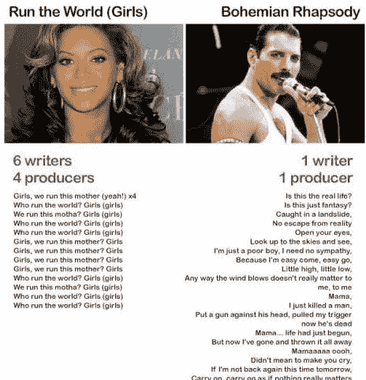

Figure 1: lyrics depth

本文不想支持碧昂斯或弗雷迪·墨丘利，而是调查在非常成功的音乐作品中使用的词语选择、抒情动机、主题和感情。

歌词对一个艺人的成功有什么影响吗，还是说这一切都是制作价值，朗朗上口，其他什么都不重要？

# **你为了钱做什么亲爱的**

*songlyrics.xlsx* 数据集包含不同流派和时代的 6 位标志性人物的歌词，使用他们最畅销的专辑。它包括发行年份、艺术家、专辑、流派、售出的唱片数量和产生的收入，以及该专辑中每首歌曲的歌词。分析过程中使用了以下艺术家和专辑:

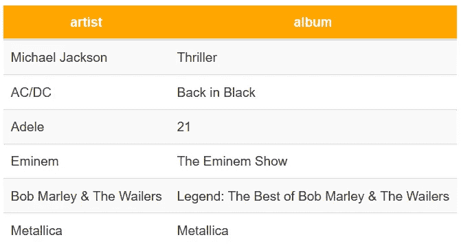

Table 1: Artists and albums

# **清理我的衣柜**

数据集只需要轻微的数据清理:

*   在一些歌曲中，括号用来表示[独唱]、[合唱]或表演歌曲一部分的艺术家、[德瑞医生]等。这些将被删除。
*   需要转换成`tidytext`格式:每行一个 token (word)。
*   我们必须为无意义的词创建一个自定义的停用词词典，比如詹姆斯·海特菲尔德的*“耶”* s，阿姆的*“哟”* s，迈克尔杰克逊的*“马麻色，马麻萨，马麻库萨”* s
*   删除数字。

# **想开始点什么吗**

让我们从使用`dplyr`的`count()`开始，找出最常用的单词:

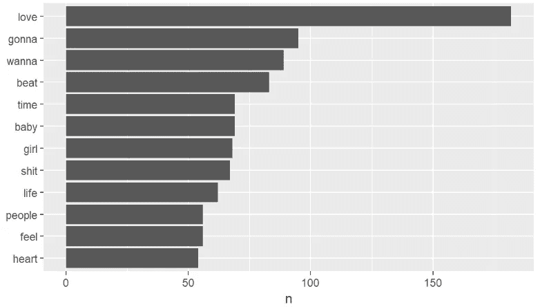

Figure 2: most used words in the dataset

毫不奇怪，单词 *love* 是数据集中所有有意义的单词中使用最多的单词。*将要*和*想要*可能会被认为是停用词。像*女孩*、*宝宝*、*心*这样的词也是和爱情、关系这个话题联系在一起的。

下图显示了三位艺术家如何不同地使用词语:

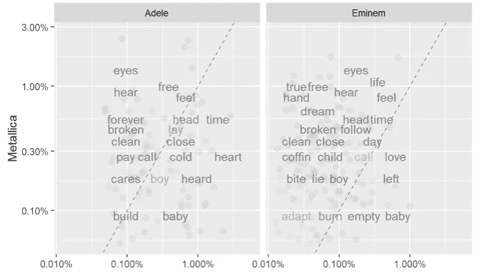

Figure 3: Different word choices

不同流派代表使用的常用词不多。他们使用*头*、*叫*和*男孩*的比例相对相似，但金属乐队演唱关于被*打破*、*自由*和*梦想*的方式比阿姆或阿黛尔多。为了量化它们的差异，我们可以使用皮尔森相关性。阿黛尔和金属乐队的得分是 0.03，金属乐队和阿姆的得分是 0.09。

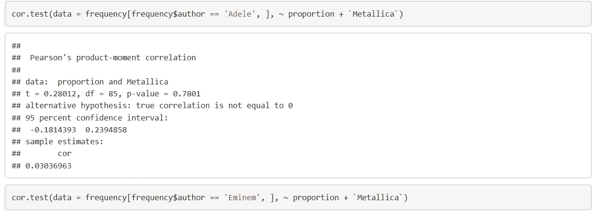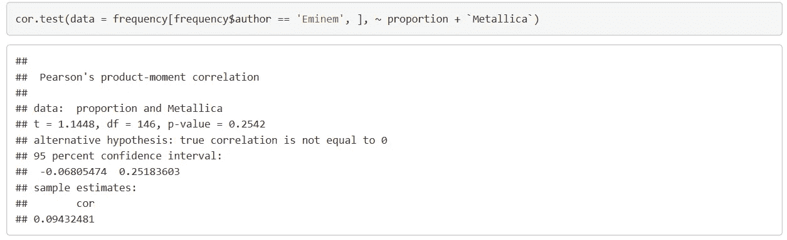

这是意料之中的，因为数据集跨越了 31 年(1980-2011)，使用了 6 种不同的体裁。人们期望不同类型的音乐会有不同的词汇选择。

我们还可以检查每种体裁的词频有何不同:

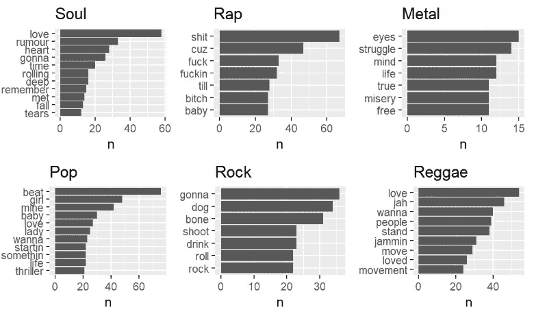

Figure 4: Word frequencies by Genre

灵魂似乎是关于*爱情*和*眼泪*，说唱有很多诅咒，金属是关于*斗争*和*苦难*而雷鬼是关于*爱情*和*人*。听起来很准确。

# **这就是爱情**

为了更深入地了解这些歌曲的成功之处，让我们通过加入一个情感词汇来研究它们是如何处理情感的。

首先，我们可以看到每个流派的平均情绪得分是多少。当金属触及我们的负面情绪时，雷鬼真的能让我们感到快乐吗？

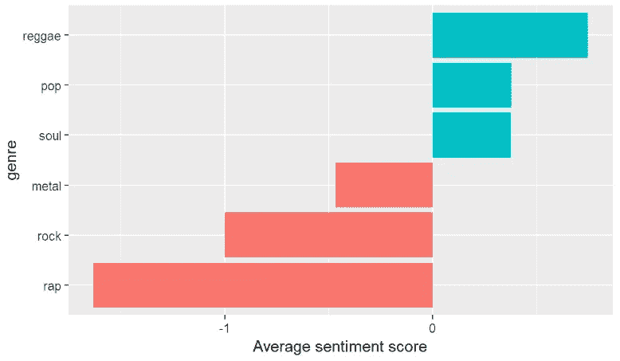

Figure 5: average sentiment per Genre

“快乐”类型的结果正如预期的那样，但令人惊讶的是，摇滚比金属有更多的负面情绪，说唱超过了这两者。

为了更深入地挖掘这一现象，让我们看看对这一平均情绪有贡献的最有影响力的词。

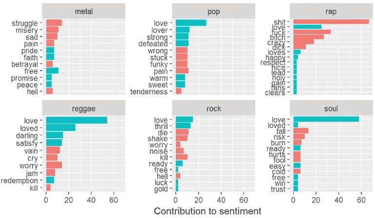

Figure 6: Words contributing to sentiments per Genre

现在我们看到为什么说唱变成了最负面的，看看过多的脏话。它们可能会被视为停用词，但它们也有意义。我的假设是，如果这首歌包含许多来自 S-F-B 三角的词，它很可能不是关于一个快乐的话题。

还有一些用词不当:《摇滚》中的 *shake* 是关于跳舞/移动的(*抖腿*))，是一个比较中性的词。当然，在雷鬼, *jam* 这个词也不是负面的，一起演奏音乐有更多积极的意义。

# **独一无二的**

我们可以使用 *tf-idf* 统计数据来量化每个流派的内容。它显示了一个词在一个流派的流派集合中对这个流派有多重要。

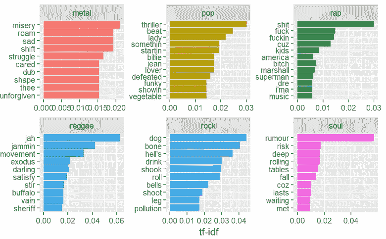

Figure 7: Highest tf-idf words per Genre

金属是相当直接的:我们看到像*痛苦*和*挣扎*这样的重要词汇，在其他流派中并不常见。流行和说唱就不那么有代表性了:tf-idf 最高的词都是他的歌名( *billie* 、 *jean* 、*starting '*、*something*、 *thriller* 等。)，而 Slim Shady 则独特地提到了 Dre 博士和他自己(*马歇尔*)。雷鬼使用[方言](https://en.wikipedia.org/wiki/Jamaican_Patois)俚语，如 *jah* ，谈论*运动*和*出埃及*。摇滚是关于*地狱*、*喝酒* ing，以及关于摇滚*滚*本身的歌唱。

# **内部斗争**

使用潜在的狄利克雷分配，让我们看看这些歌曲的歌词中有哪些不同的主题。

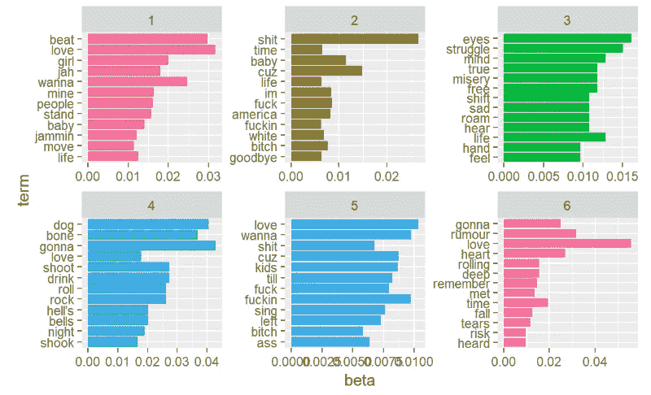

Figure 8: Topic modeling using LDA

这些话题中的词汇选择再次暗示了它主要取决于音乐的类型，选择哪些词汇和讨论哪些话题。

第一个话题主要是关于享受*生活*，和一个*女孩*在*恋爱*，总体幸福。大多数单词与雷鬼最常用的单词相似。话题 6 是关于分手的，有*心*、*时间*、*遇见*、*泪*之类的词，大部分来自灵魂歌词。

# **当音乐停止时**

这项分析只关注了 6 位艺术家和他们最畅销的专辑，以得出关于什么是成功的音乐作品的结论。结果肯定对艺术家本身有一些偏见，但我们仍然可以画出他们的词汇用法和主题。

一首歌的成功在很大程度上取决于它属于哪种类型。说唱、摇滚和金属歌曲往往有更多的负面信息，有时亵渎歌词，谈论作者的痛苦和挣扎。流行和灵魂乐歌手倾向于关注爱情和分手，使用更积极的词语，他们是关于关系的。

这种分析可以很容易地用更多的数据来重复，以得出关于音乐产业状况的更普遍的结论，并且包括不太成功的艺术家可以进一步揭示什么是成功的歌曲的主题，哪些词的选择和主题导致更高的销售额和收入。

# **出埃及记**

该分析基于朱莉娅·西尔格和大卫·罗宾逊的作品，重点是他们的书《用 R 进行文本挖掘》。R 代码和数据集可以在 GitHub 上我的 [NLP_songlyrics](https://github.com/BenceToth/nlp_songlyrics) 资源库中找到。

特别感谢[Eduardo ario de la Rubia](https://www.linkedin.com/in/earino/)在匈牙利中欧大学为我提供了这篇文章的基础知识。