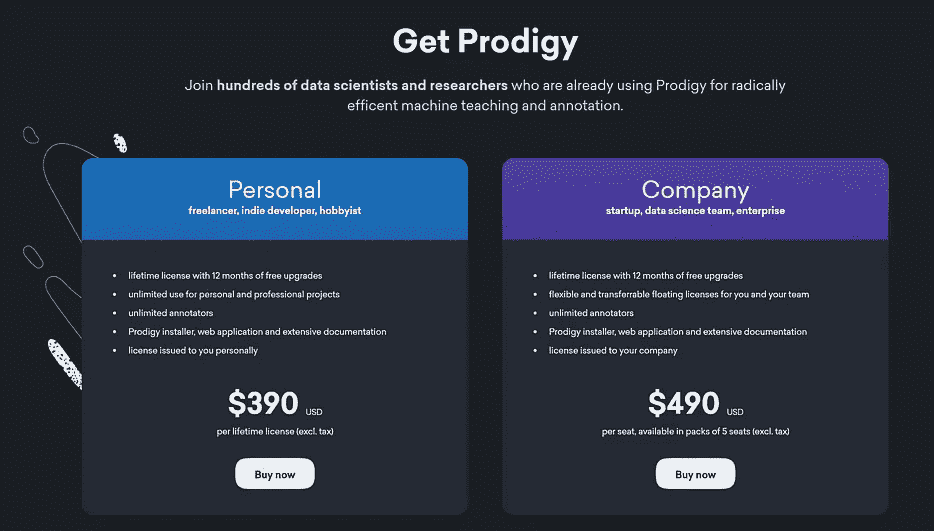

# 使用 Azure Web Apps & Doccano 对预算进行文本注释

> 原文：<https://towardsdatascience.com/text-annotation-on-a-budget-with-azure-web-apps-doccano-b29f479c0c54?source=collection_archive---------17----------------------->


**TLDR:** 这篇文章讲述了如何在 Azure Web 应用上部署 [Doccano](https://github.com/chakki-works/doccano/) ，以便为自然语言处理任务协同注释文本数据。

这篇文章的所有代码可以在这里找到:

[](https://github.com/aribornstein/doccano4Azure) [## aribornstein/Doccano4Azure

### 在 Azure 上一键部署 doccano。通过创建帐户为 aribornstein/Doccano4Azure 开发做贡献…

github.com](https://github.com/aribornstein/doccano4Azure) 

# 什么是 Doccano？

[Doccano](https://github.com/chakki-works/doccano/) 是一个开源工具，为文本分类、序列标记和序列对序列提供注释功能。


最近，我一直在对一个数据集进行注释以供共同参考，作为这项任务的一部分，我有时间评估了几个不同的文本注释平台。

大多数免费开源注释工具，如 Brat 和 Anafora，都不遵守现代 UX 原则。Doccano 是我见过的唯一一个具有现代 UX 体验的开源注释工具。虽然存在其他现代文本注释工具，如 [**Prodigy**](https://prodi.gy/) 和 [**LightTag**](https://www.lighttag.io/) 存在，但它们拥有非常昂贵的许可证。



Prodigy and Lighthead are expensive with Doccano we can annotate data at fraction of the cost

然而，为了合作，我们需要在某个地方托管网站，以使这个过程更容易。本教程将告诉你如何做。

# 什么是[容器的 Web App](https://azure.microsoft.com/services/app-service/containers/?WT.mc_id=blog-medium-abornst)？

Azure App Service 不仅为你的应用增加了微软 Azure 的强大功能，比如安全性、负载平衡、自动伸缩和自动化管理。您还可以利用它的 DevOps 功能，例如从 Azure DevOps、GitHub、Docker Hub 和其他来源、包管理、暂存环境、自定义域和 SSL 证书进行连续部署。


If the webservice is under 1GB and there is not much usage we can run the compute for free on Azure

# 步骤 1:将 Doccano 部署到 Azure 应用服务

如果您已有 Azure 订阅，只需点击下面的按钮进行自动部署，即可开始为您的数据添加注释。

[](https://azuredeploy.net/?repository=https://github.com/aribornstein/Doccano4Azure)

Click the Deploy button above to get started!

否则，你可以在这里获得一个免费的 Azure 帐户，然后点击上面的部署按钮。

[](https://azure.microsoft.com/offers/ms-azr-0044p/?WT.mc_id=medium-blog-abornst) [## Azure 免费试用版|微软 Azure

### 开始您的免费 Microsoft Azure 试用，并获得 200 美元的 Azure 点数，以任何方式使用。运行虚拟机…

azure.microsoft.com](https://azure.microsoft.com/offers/ms-azr-0044p/?WT.mc_id=medium-blog-abornst) 

Fill in the config with admin details and deploy

# 步骤 2:导航到您的 Doccano 部署并登录


部署后，导航到以下 url，其中{appname}是您在上面选择的 appname。

[https://{ appname } . azure websites . net/](https://docanna.azurewebsites.net/)登录

例如，在我们上面的部署中，登录 url 应该是

[https://doccana.azurewebsites.net/](https://docanna.azurewebsites.net/)登录

这将带您进入 Doccano 登录页面，您可以使用您在部署中配置的 **Admin_user** 和 **Admin_pass** 登录。


现在你可以开始注释你自己的数据了，看看来自 [Doccano github](https://github.com/aribornstein/doccano4Azure) 的指令。以下步骤是从教程中一字不差地摘录下来的。

# 步骤 3 创建数据集

在这里，我们接受了一个科幻小说的 NER 注释任务，给你一个关于 doccano 的简短教程。

下面是一个 JSON 文件，包含了许多不同语言的科幻小说描述。我们需要注释一些实体，比如人名、书名、日期等等。

`books.json`

```
{"text": "The Hitchhiker's Guide to the Galaxy (sometimes referred to as HG2G, HHGTTGor H2G2) is a comedy science fiction series created by Douglas Adams. Originally a radio comedy broadcast on BBC Radio 4 in 1978, it was later adapted to other formats, including stage shows, novels, comic books, a 1981 TV series, a 1984 video game, and 2005 feature film."}
{"text": "《三体》是中国大陆作家刘慈欣于 2006 年 5 月至 12 月在《科幻世界》杂志上连载的一部长篇科幻小说，出版后成为中国大陆最畅销的科幻长篇小说之一。2008 年，该书的单行本由重庆出版社出版。本书是三体系列（系列原名为：地球往事三部曲）的第一部，该系列的第二部《三体 II：黑暗森林》已经于 2008 年 5 月出版。2010 年 11 月，第三部《三体 III：死神永生》出版发行。 2011 年，“地球往事三部曲”在台湾陆续出版。小说的英文版获得美国科幻奇幻作家协会 2014 年度“星云奖”提名，并荣获 2015 年雨果奖最佳小说奖。"}
{"text": "『銀河英雄伝説』（ぎんがえいゆうでんせつ）は、田中芳樹によるSF 小説。また、これを原作とするアニメ、漫画、コンピュータゲーム、朗読、オーディオブック等の関連作品。略称は『銀英伝』（ぎんえいでん）。原作は累計発行部数が1500 万部を超えるベストセラー小説である。1982 年から2009 年 6 月までに複数の版で刊行され、発行部数を伸ばし続けている。"}
```

# 创建一个项目

我们需要为此任务创建一个新项目。使用超级用户帐户登录。


要创建您的项目，请确保您在项目列表页面中，然后单击`Create Project`按钮。对于本教程，我们将项目命名为`sequence labeling for books`，编写一些描述，选择序列标签项目类型，并选择我们创建的用户。


# 导入数据

创建项目后，我们会看到“导入数据”页面，或者点击导航栏中的`Import Data`按钮。我们应该会看到以下屏幕:


我们选择 JSON 文件`books.json`来上传。上传数据集文件后，我们会看到`Dataset`页面(或者点击左边栏的`Dataset`按钮列表)。此页面显示我们在一个项目中上传的所有文档。

# 定义标签

点击左边栏的`Labels`按钮定义我们自己的标签。我们应该会看到标签编辑器页面。在标签编辑器页面中，您可以通过指定标签文本、快捷键、背景颜色和文本颜色来创建标签。


至于教程，我们创建了一些与科幻小说相关的实体。

# 第六步注释

接下来，我们准备注释文本。只需点击导航栏中的`Annotate Data`按钮，我们就可以开始注释文档了。


# 导出数据

在注释步骤之后，我们可以下载带注释的数据。点击导航栏中的`Edit data`按钮，然后点击`Export Data`。您应该会看到下面的屏幕:


这里我们选择 JSON 文件，通过点击按钮来下载数据。下面是我们辅导项目的注释结果。

`sequence_labeling_for_books.json`

```
{"doc_id": 33, "text": "The Hitchhiker's Guide to the Galaxy (sometimes referred to as HG2G, HHGTTGor H2G2) is a comedy science fiction series created by Douglas Adams. Originally a radio comedy broadcast on BBC Radio 4 in 1978, it was later adapted to other formats, including stage shows, novels, comic books, a 1981 TV series, a 1984 video game, and 2005 feature film.", "entities": [[0, 36, "Title"], [63, 67, "Title"], [69, 75, "Title"], [78, 82, "Title"], [89, 111, "Genre"], [130, 143, "Person"], [158, 180, "Genre"], [184, 193, "Other"], [199, 203, "Date"], [254, 265, "Genre"], [267, 273, "Genre"], [275, 286, "Genre"], [290, 294, "Date"], [295, 304, "Genre"], [308, 312, "Date"], [313, 323, "Genre"], [329, 333, "Date"], [334, 346, "Genre"]], "username": "admin"}
{"doc_id": 34, "text": "《三体》是中国大陆作家刘慈欣于 2006 年 5 月至 12 月在《科幻世界》杂志上连载的一部长篇科幻小说，出版后成为中国大陆最畅销的科幻长篇小说之一。2008 年，该书的单行本由重庆出版社出版。本书是三体系列（系列原名为：地球往事三部曲）的第一部，该系列的第二部《三体 II：黑暗森林》已经于 2008 年 5 月出版。2010 年 11 月，第三部《三体 III：死神永生》出版发行。 2011 年，“地球往事三部曲”在台湾陆续出版。小说的英文版获得美国科幻奇幻作家协会 2014 年度“星云奖”提名，并荣获 2015 年雨果奖最佳小说奖。", "entities": [[1, 3, "Title"], [5, 7, "Location"], [11, 14, "Person"], [15, 22, "Date"], [23, 26, "Date"], [28, 32, "Other"], [43, 45, "Genre"], [53, 55, "Location"], [70, 75, "Date"], [126, 135, "Title"], [139, 146, "Date"], [149, 157, "Date"], [162, 172, "Title"], [179, 184, "Date"], [195, 197, "Location"], [210, 212, "Location"], [227, 230, "Other"], [220, 225, "Date"], [237, 242, "Date"], [242, 245, "Other"]], "username": "admin"}
{"doc_id": 35, "text": "『銀河英雄伝説』（ぎんがえいゆうでんせつ）は、田中芳樹によるSF 小説。また、これを原作とするアニメ、漫画、コンピュータゲーム、朗読、オーディオブック等の関連作品。略称は『銀英伝』（ぎんえいでん）。原作は累計発行部数が1500 万部を超えるベストセラー小説である。1982 年から2009 年 6 月までに複数の版で刊行され、発行部数を伸ばし続けている。", "entities": [[1, 7, "Title"], [23, 27, "Person"], [30, 34, "Genre"], [46, 49, "Genre"], [50, 52, "Genre"], [53, 62, "Genre"], [63, 65, "Genre"], [66, 74, "Genre"], [85, 88, "Title"], [9, 20, "Title"], [90, 96, "Title"], [108, 114, "Other"], [118, 126, "Other"], [130, 135, "Date"], [137, 144, "Date"]], "username": "admin"}
```

恭喜你！您刚刚掌握了如何在 Azure 上使用 doccano 进行序列标记项目。

如果您有任何问题、评论或希望我讨论的话题，请随时在 [Twitter](https://twitter.com/pythiccoder) 上关注我。如果您认为我错过了某个里程碑，请告诉我。感谢 [Hironsan](https://github.com/Hironsan) 的惊人工作！

# 关于作者

[**亚伦(阿里)博恩施泰因**](https://www.linkedin.com/in/aaron-ari-bornstein-22aa7a77/) 是一个狂热的人工智能爱好者，对历史充满热情，致力于新技术和计算医学。作为微软云开发倡导团队的开源工程师，他与以色列高科技社区合作，用改变游戏规则的技术解决现实世界的问题，然后将这些技术记录在案、开源并与世界其他地方共享。