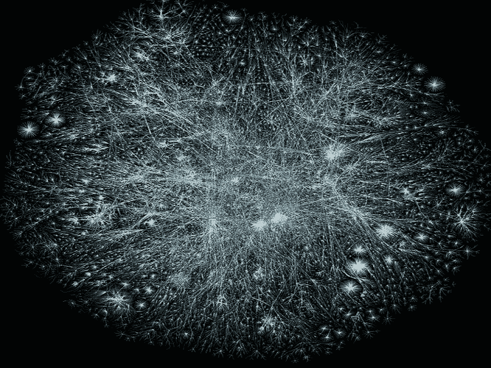
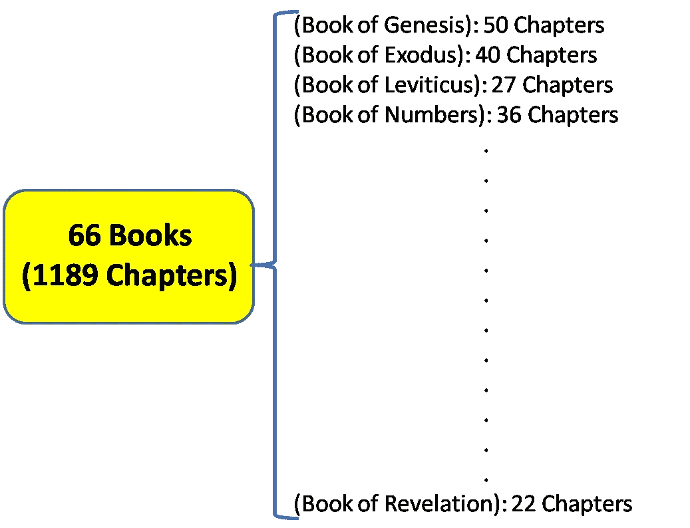
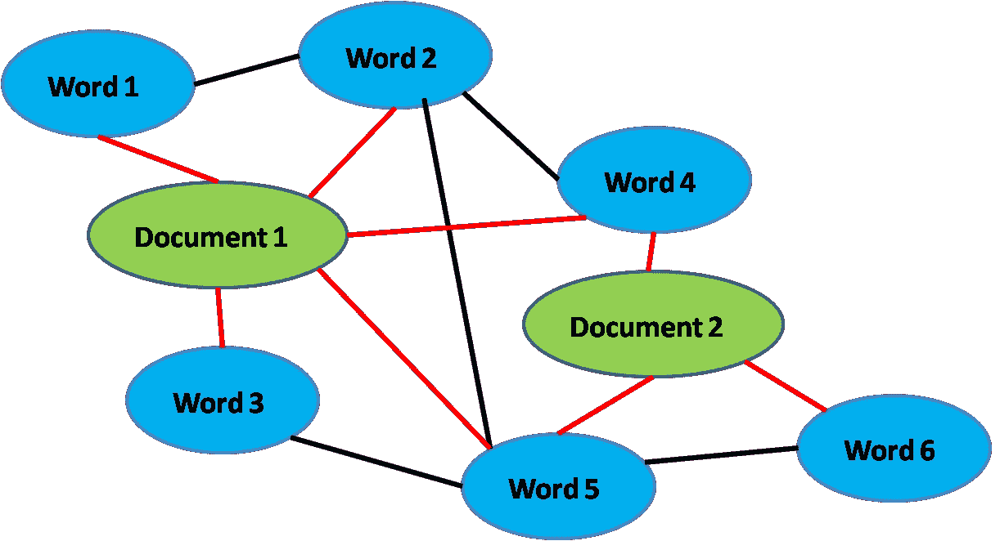
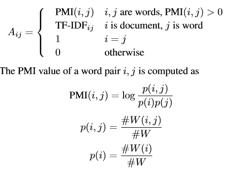
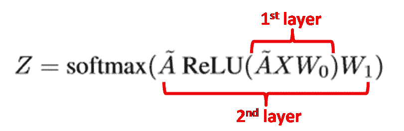
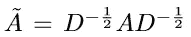
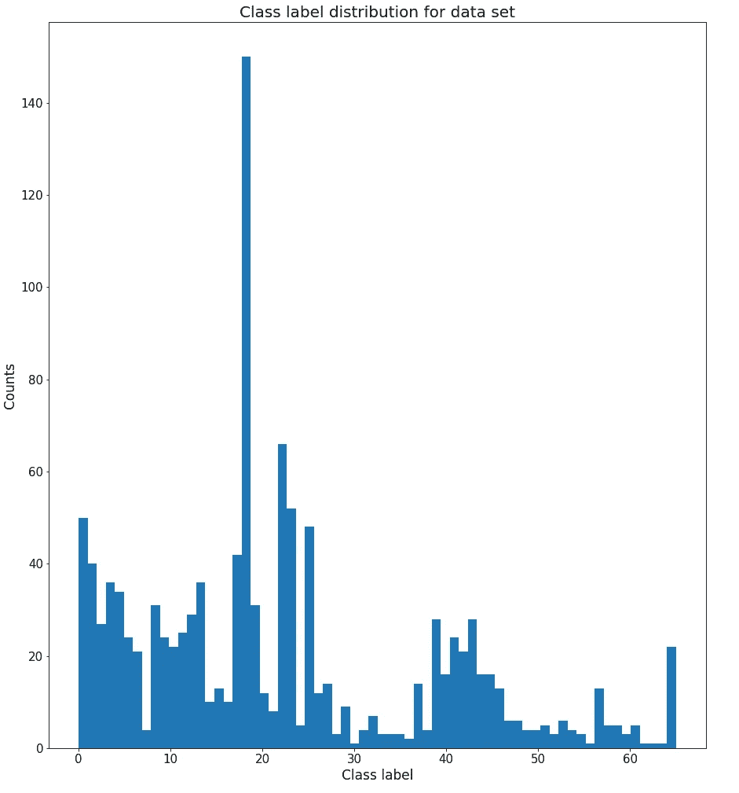
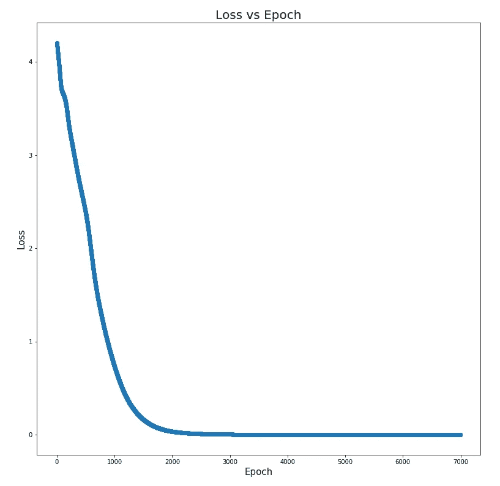
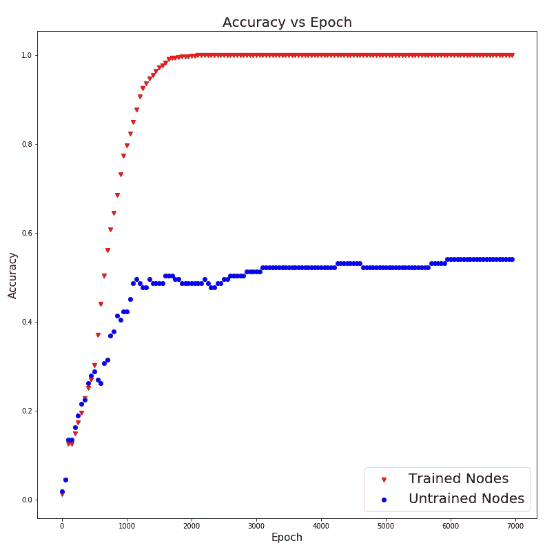

# 基于文本的图卷积网络——圣经分类

> 原文：<https://towardsdatascience.com/text-based-graph-convolutional-network-for-semi-supervised-bible-book-classification-c71f6f61ff0f?source=collection_archive---------7----------------------->

## ***一种基于半监督图的文本分类和推理方法***

The most beautiful graph you have ever seen, courtesy of [https://www.quora.com/Whats-the-most-beautiful-graph-you-have-ever-seen](https://www.quora.com/Whats-the-most-beautiful-graph-you-have-ever-seen).

在本文中，我将详细介绍基于文本的图卷积网络(GCN)及其使用 PyTorch 和标准库的实现。基于文本的 GCN 模型是一种有趣而新颖的最新*半监督*学习概念，最近[提出](https://arxiv.org/abs/1809.05679)(扩展了之前由 [Kipf *等人*](https://arxiv.org/abs/1609.02907) *提出的 GCN 思想)。*在非文本数据上)，能够在给定相关已知标注文本数据的情况下，非常准确地推断出一些未知文本数据的标注。

在最高级别，它通过将整个语料库嵌入到单个图中来实现，该图以文档(一些已标记，一些未标记)和单词作为节点，每个文档-单词&单词-单词边缘基于它们彼此之间的关系具有一些预定的权重(例如 Tf-idf)。然后，用具有已知标签的文档节点在该图上训练 GCN，然后使用训练的 GCN 模型来推断未标记文档的标签。

我们在这里使用圣经作为语料库实现基于文本的 GCN，选择圣经是因为它是世界上最受欢迎的书之一，并且包含丰富的文本结构。圣经(新教)由 66 本书(创世纪，出埃及记等)和 1189 章组成。这里的半监督任务是训练一个语言模型，该语言模型能够在给定其他章节的已知标签的情况下，对一些未标记章节所属的书籍进行正确分类。(由于我们实际上知道所有章节的确切标签，我们将有意屏蔽大约 10–20%章节的标签，这些标签将在模型推断过程中用作测试集，以测量模型准确性)

Structure of the Holy Bible (Protestant)

为了解决这个任务，语言模型需要能够区分与各种书籍相关联的上下文(例如，创世纪更多地谈论亚当和夏娃，而传道书谈论所罗门王的生活)。正如我们将在下面看到的，文本-GCN 模型所获得的良好结果表明，图结构能够相对较好地捕捉这种上下文，其中文档(章节)-单词边缘编码章节内的上下文，而单词-单词边缘编码章节之间的相对上下文。

关于图形神经网络的详细解释，你可以看看这篇伟大的文章[https://Neptune . ai/blog/graph-neural-network-and-some-of-gnn-applications](https://neptune.ai/blog/graph-neural-network-and-some-of-gnn-applications)

这里使用的圣经文本(BBE 版本)是由[https://github.com/scrollmapper/bible_databases](https://github.com/scrollmapper/bible_databases)提供的。

实现遵循基于文本的图卷积网络的论文(【https://arxiv.org/abs/1809.05679】T2

实现的源代码可以在我的 GitHub 库(【https://github.com/plkmo/Bible_Text_GCN】T4)中找到

如果你想在你自己的语料库上尝试文本 GCN，我已经创建了一个 NLP 工具包的最先进的模型，其中一个实现了文本 GCN，用于简单的文本分类(以及其他任务)。你可以在这里使用它([https://github.com/plkmo/NLP_Toolkit](https://github.com/plkmo/NLP_Toolkit))。

# **代表语料库**

Corpus represented as a graph. Red lines represent document-word edges weighted by TF-IDF, black lines represent word-word edges weighted by PMI.

在这篇论文之后，为了让 GCN 能够捕捉到章节的上下文，我们用节点和边构建了一个图，来表示章节和单词之间的关系。节点将由所有 1189 个章节(文档)加上整个词汇表(单词)组成，在它们之间有加权的文档-单词和单词-单词边。它们的重量 *A_ij* 由下式给出:

Edges weights

其中 PMI 是在滑动窗口 *#W* 上的同现词对之间的逐点互信息，我们将其固定为 10 个词的长度。 *#W(i)* 是包含单词 *i* 的语料库中滑动窗口的数量， *#W(i，j)* 是包含单词 *i* 和 *j* 的滑动窗口的数量，#W 是语料库中滑动窗口的总数。TF-IDF 是通常的词频——该词在文档中的逆文档频率。直观上，单词对之间的高正 PMI 意味着它们具有高语义相关性，相反，我们不会在具有负 PMI 的单词之间建立边。**总的来说，TF-IDF 加权的文档-词边缘捕获文档内上下文，而 PMI 加权的词-词边缘(可以跨文档)捕获跨文档上下文。**

相比之下，对于非基于图的模型，这样的跨文档上下文信息不容易作为输入特征提供，并且模型将不得不基于标签“从零开始”自己学习它们。由于在 GCN 提供了关于文档之间关系的附加信息，这在 NLP 任务中是绝对相关的，因此可以预期 GCN 会表现得更好。

1.  **计算 TF-IDF**

df_data[“c”] is a Pandas dataframe containing the chapters text

计算 TF-IDF 相对简单。我们知道数学并理解它是如何工作的，所以我们只需在我们的 1189 文档文本上使用 sklearn 的 tfidf 矢量器模块，并将结果存储在数据帧中。当我们稍后创建图表时，这将用于文档单词权重。

**2。计算单词之间的逐点互信息**

计算单词间的 PMI 比较棘手。首先，我们需要在一个包含 10 个单词的滑动窗口中找到单词 *i，j* 之间的共现，该窗口存储为数据帧中的一个方阵，其中行和列代表词汇表。由此，我们可以使用前面的定义计算 PMI。上面显示了计算的注释代码。

**3。构建图表**

现在我们已经有了所有边的权重，我们准备构建图 ***G*** 。我们使用 networkx 模块来构建它。这里，值得指出的是，整个项目中用于数据处理的大部分繁重计算都花在了构建词-词边缘上，因为我们需要迭代大约 6500 个词的词汇表中所有可能的成对词组合。*幸运的是，有一种有效的方法来实现这一点，并且只需要大约 3 分钟就可以运行。*我们计算的代码片段如下所示。

Building the graph of nodes and weighted-edges

# **图卷积网络**

在用于图像相关任务的卷积神经网络中，我们有卷积层或滤波器(具有可学习的权重)，它们“越过”一串像素，以生成通过训练学习的特征图。现在，假设这些像素是你的图形节点，我们同样会有一组具有可学习权重的过滤器 *W* 来“忽略”GCN 中的这些图形节点。

然而，有一个大问题:图形节点并不像像素那样有一个清晰的物理空间和距离的概念(我们不能说一个节点在另一个节点的右边或左边)。因此，为了用我们的过滤器 *W* 有意义地卷积节点，我们必须首先为每个节点找到最好地捕获图结构的特征表示。对于高级读者，作者通过将每个节点的滤波器权重 *W* 和特征空间 *X* 投影到图的傅立叶空间来解决这个问题，这样卷积就变成了节点与特征的逐点乘法。为了深入探究这一推导，Kipf *等人*的原始论文。是一个很好的起点。否则，读者可以将就这种直观的解释，并继续下去。

我们将在这里使用两层 GCN(特征被卷积两次)，因为根据他们的论文，它给出了最好的结果。双层 GCN 后的卷积输出特征张量由下式给出:

在哪里

这里， ***A*** 是图 ***G*** 的邻接矩阵(对角元素为 1 表示节点的自连接)***【D***是***G*** 的度矩阵。*w0 和 w1*分别是待训练的第一和第二 GCN 层的可学习滤波器权重。**最终的输出然后被馈送到 softmax 层，该层具有交叉熵损失函数，用于用对应于 66 本书中的每一本的 66 个不同标签进行分类。**

下面给出了 PyTorch 中两层 GCN 架构的实现。

GCN architecture, with Xavier’s initialization of W_0 (self.weight) and W_1(self.weight2) as well as biases.

# **培训阶段**

Class label distribution

在总共 1189 个章节中，我们将在训练期间屏蔽其中 111 个章节(约 10 %)的标签。由于 1189 个章节的类别标签分布非常不均匀(见上图)，因此我们不会屏蔽其总数小于 4 的章节的任何类别标签，以确保 GCN 可以从所有 66 个唯一类别标签中学习表示。

我们训练 GCN 模型来最小化未屏蔽标签的交叉熵损失。在对 GCN 进行 7000 个纪元的训练之后，我们将使用该模型来推断 111 个被屏蔽章节的图书标签，并分析结果。

# 结果

Loss vs Epoch

从上面的损失与历元图中，我们看到训练进行得很好，并在大约 2000 个历元时开始饱和。

Accuracy of training nodes (trained nodes) and inference accuracy of masked nodes (untrained nodes) with epoch.

随着训练的进行，可以看到训练精度以及(屏蔽节点的)推断精度一起增加，直到大约 2000 个时期，推断精度开始饱和在大约 50%。考虑到我们有 66 个类，如果我们假设该模型完全是随机预测的，那么它将具有 1.5 %的基线准确性，因此 50%的推断准确性看起来已经很好了。这告诉我们，在对已标记章节进行适当训练之后，GCN 模型能够在大约 50 %的时间内正确地推断出给定的未标记章节属于哪本书。

# **分类错误的章节**

GCN 模型能够很好地捕捉文档内和文档间的上下文，但是对于分类错误的章节呢？这是否意味着 GCN 模式在这些方面失败了？让我们看看其中的几个来找出答案。

*   书:马太福音第 27 章:“到了早晨，众祭司长和长老商议，要把耶稣治死。他们就把他捆绑带走，交给官长彼拉多。卖耶稣的犹大见自己将要被杀，就后悔把那三十块钱拿给祭司长和长老说，我把一个义人交在你们手里，是有罪的。但他们说，那与我们何干？这是你的事。他就把银子放在殿里，出去，并且吊死了。祭司长拿着银子说，不可把它放在殿里，因为这是血的价。他们就定意用这银子买窑匠的一块田，作为埋葬外乡人的地方。所以那块田名叫……他从死里复活了。并且后来的错，比先前的更重了。彼拉多对他们说，你们有看守的人。去尽你所能保证它的安全。他们就去了，把他的尸首藏起来，放在石头上，看守的人也和他们在一起。
    预言为:卢克

在这种情况下，马太福音第 27 章被错误地归类为路加福音。从上面，我们看到这一章是关于耶稣被祭司长处死，为我们的罪而死，以及犹大背叛耶稣后的罪。路加福音中也提到了这些事件。(在《马可福音》和《约翰福音》中也是如此)这很可能是为什么这个模型把它归类为《路加福音》的原因，因为它们有着相似的背景。

*   书:以赛亚书
    第 12 章:*“到那日，你必说，耶和华阿，我要称谢你；因为你虽然向我发怒，你的怒气却已转消，我也得了安慰。看哪，神是我的拯救。我要倚靠耶和华，并不惧怕。因为耶和华是我的力量，我的诗歌。他成了我的救星。你必从救恩的泉源欢欢喜喜地喝水。当那日，你们要说，你们要赞美耶和华，尊他的名为大。将他所行的传扬在万民中，称他的名被尊崇。向主歌唱；因为他行了奇事，要在全地传扬。锡安的居民哪，当扬声欢呼，因为在你们中间的以色列圣者，乃为至大。」*
    预言为诗篇

在这里，以赛亚书的第 12 章被错误地推断为来自诗篇。从这一段可以清楚地看出，以赛亚书第 12 章的叙述者谈到了赞美上帝，上帝是他的安慰者和拯救的源泉。赞美上帝并向他寻求安慰正是诗篇的整个主题，大卫在他的成功、试炼和苦难中写下了他对上帝的赞美和祈祷！因此，难怪模型会将它归类为诗篇，因为它们共享相似的上下文。

# **结论**

基于文本的图卷积网络确实是一个强大的模型，特别是对于半监督学习，因为它能够强烈地捕捉单词和文档之间以及跨单词和文档的文本上下文，并在已知的情况下推断未知。

GCNs 的应用程序实际上相当健壮且影响深远，本文只是提供了它能做什么的一瞥。一般来说，除了这里提出的任务，GCN 可以在任何时候使用，只要你想结合图形表示和深度学习的力量。为了提供一些有趣的例子供进一步阅读，GCN 已经与[【递归神经网络(RNNs)](https://arxiv.org/abs/1902.10191) / [【长短期记忆(lst ms)】](https://arxiv.org/abs/1812.04206)结合用于动态网络/节点/边缘预测。通过将人体关节建模为图形节点，将人体结构和时间帧之间和内部的关系建模为图形边缘，它还成功应用于人体骨骼的动态姿态估计。

感谢阅读，我希望这篇文章有助于解释其内部工作。

## 有用的链接

1.  圣经文本上的文本——https://github.com/plkmo/Bible_Text_GCN 的 GCN 实现——
2.  文本-通用语料库上的 GCN 实现(在其他自然语言处理任务中)——[https://github.com/plkmo/NLP_Toolkit](https://github.com/plkmo/NLP_Toolkit)

## *参考文献*

1.  [托马斯·n·基普夫](https://arxiv.org/search/cs?searchtype=author&query=Kipf%2C+T+N)，[马克斯·韦林](https://arxiv.org/search/cs?searchtype=author&query=Welling%2C+M)，*带图卷积网络的半监督分类*([https://arxiv.org/abs/1609.02907](https://arxiv.org/abs/1609.02907))(2016)
2.  、[成胜茂](https://arxiv.org/search/cs?searchtype=author&query=Mao%2C+C)、[罗原](https://arxiv.org/search/cs?searchtype=author&query=Luo%2C+Y)、*用于文本分类的图卷积网络*([https://arxiv.org/abs/1809.05679](https://arxiv.org/abs/1809.05679))(2018)

要了解最新的人工智能/数据科学趋势、论文和新闻，请查看我的@ follow AI _ bot([https://t.me/followai_bot](https://t.me/followai_bot))，这是您的个性化人工智能/数据科学电报机器人。