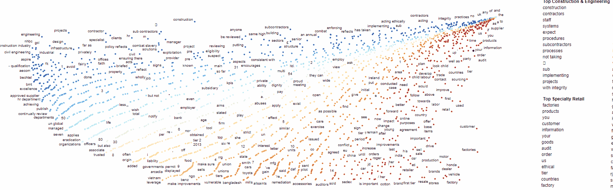
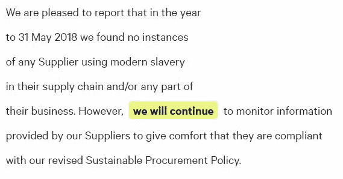
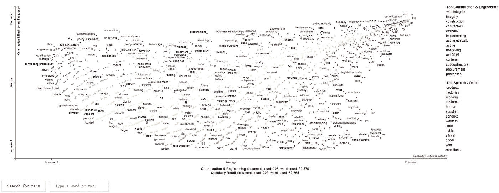

# 文字可以很美

> 原文：<https://towardsdatascience.com/text-can-be-beautiful-226ea089513a?source=collection_archive---------17----------------------->

## *可视化如何发现文本数据中隐藏的模式*



**Modern Slavery Act filings:** We will be building an interactive visualisation to uncover key trends and insights from a series of text documents. Words at the top right are common across the two industries analysed. Words at the bottom left are uncommon across the industries.

互联网上充斥着关于自然语言处理的文章。其中许多描述了如何建立分类系统，执行主题建模，问题回答。很少有人对文本语料库进行更全面的分析，更少有人展示如何以可视化、交互式和易于理解的格式构建输出。

在现实世界中，找到方法**理解**数据集中文本如何以及为什么不同通常要有用得多。接受客户评论；虽然根据内容预测评论评级可能有用，但更有价值的是**了解为什么**客户会对特定产品或服务给出正面或负面的评论。

这可以用来创建更有效的营销，通知未来的产品开发，甚至设计客户支持流程，以适应通过产品审查确定的问题。预测模型能做到所有这些吗？不，它不能。

在本帖中，我们将分析数千家公司的现代奴隶制回报，以了解企业正在做出哪些承诺来防止现代奴隶制，然后我们将使用先进的可视化技术来确定不同行业如何应对内部和供应链中的现代奴隶制风险。

# 一个重要的题外话:现代奴隶制


Shellfish Gathering is just one of many industries with a high inherent risk of Modern Slavery

如果您已经阅读了我以前在 Medium 上的帖子，您可能已经了解了正在使用的底层数据。这与 2015 年以来数千家英国和国际公司提交的现代奴隶制申报表有关。为什么要用这个数据？下面是一个重要的，如果忧郁，离题到现代奴隶制和防止它的措施。

现代奴隶制是一个大问题。据估计，仅在英国，每年就要花费纳税人 43 亿英镑。作为一种犯罪，它对受害者和社会的危害仅次于杀人。

> “剥削和奴役世界各地和英国境内的男人、女人和儿童是最令人震惊的罪行之一，也是最有利可图的罪行之一。”
> 
> **男爵夫人巴特勒-斯洛斯，2004 年前任上诉法院大法官**

据估计，英国有 136，000 人(1/500)是现代奴隶制的受害者，自 2013 年以来，这一数字增长了 [10 倍。与现代奴隶制有关的罪行令人憎恶。例子包括劳动剥削、性剥削、家庭奴役、摘取器官和犯罪剥削。](https://www.freedomunited.org/news/britain-gsi-estimates-1-in-500-are-victims-of-modern-slavery/)

受害者被[武力、威胁、胁迫、绑架、欺诈和欺骗所控制。](https://www.gla.gov.uk/who-we-are/modern-slavery/)

**正在采取什么措施来防止它？**

《2015 年现代奴隶制法案》旨在打击英国的现代奴隶制。该法案的一部分要求营业额超过 3600 万英镑的公司公布他们在业务和供应链中为防止现代奴隶制所做的工作。截至 2019 年 4 月，有 8700 份声明[被标识为已发布](https://www.modernslaveryregistry.org/)。

***但是公司实际在做什么呢？他们承诺什么？他们正在实施什么流程？不同的行业如何处理这个问题？***

# 用空间确定公司承诺

为了了解公司正在积极做什么和承诺做什么，我们需要创造一种智能的方式来识别每一个现代奴隶制回归中的这种承诺。

典型的回报将包括许多不相关的信息，如公司背景和现代奴隶制法案。幸运的是，使用 SpaCy NLP 库，我们可以使用其强大的匹配功能过滤掉这些内容。

文本匹配的问题是，即使使用正则表达式这样的技术，它也会很快变得很麻烦。问题是在寻找一个简单的模式时，你需要考虑所有不同的短语组合。例如，我们感兴趣的是识别包含如下语句的短语:

```
"We are committed to..."
```

然而，下面的短语也会引起我们的兴趣，我们怎样才能在不为每个例子都写代码的情况下将它们包含在我们的分析中呢？

```
"We promise to"
"We have committed to"
"We will continue to"
"[COMPANY NAME] has committed to"
"[COMPANY NAME] has implemented"
```

**词性匹配**

SpaCy 中的匹配引擎允许您使用词性(POS)标签将短语匹配到特定模式，例如，我们可以过滤一系列词性标签，而不是搜索特定的单词:

```
PRON, VERB, VERB
```

这种匹配从《现代奴隶回归》的片段中识别出以下短语:



Even using a very simple POS filter we can identify phrases which denote commitments made from businesses in their Modern Slavery returns. The match here is highlighted in yellow.

SpaCy 甚至提供了一个在线工具来帮助构建和检查不同规则的结果:

[***基于 SpaCy 法则的匹配器***](https://explosion.ai/demos/matcher?text=We%20are%20pleased%20to%20report%20that%20in%20the%20year%0Ato%2031%20May%202018%20we%20found%20no%20instances%0Aof%20any%20Supplier%20using%20modern%20slavery%0Ain%20their%20supply%20chain%20and%2For%20any%20part%20of%0Atheir%20business.%20However%2C%20we%20will%20continue%0Ato%20monitor%20information%20provided%20by%20our%0ASuppliers%20to%20give%20comfort%20that%20they%20are%0Acompliant%20with%20our%20revised%20Sustainable%0AProcurement%20Policy.%20%0A&model=en_core_web_sm&pattern=%5B%7B%22id%22%3A0%2C%22attrs%22%3A%5B%7B%22name%22%3A%22POS%22%2C%22value%22%3A%22PRON%22%7D%5D%7D%2C%7B%22id%22%3A1%2C%22attrs%22%3A%5B%7B%22name%22%3A%22POS%22%2C%22value%22%3A%22VERB%22%7D%5D%7D%2C%7B%22id%22%3A2%2C%22attrs%22%3A%5B%7B%22name%22%3A%22POS%22%2C%22value%22%3A%22VERB%22%7D%5D%7D%5D)

创建一套产生良好结果的规则根本不需要很长时间。下面的代码实现了这些规则，并返回已识别结果的整个句子:

```
def collect_sents(matcher, doc, i, matches):
    match_id, start, end = matches[i]
    span = doc[start:end]  # Matched span
    sent = span.sent  # Sentence containing matched span
    # Append mock entity for match in displaCy style to matched_sents
    # get the match span by ofsetting the start and end of the span with the
    # start and end of the sentence in the doc
    match_ents = [{
        "start": span.start_char - sent.start_char,
        "end": span.end_char - sent.start_char,
        "label": "MATCH",
    }]
    matched_sents.append({"text": sent.text, "ents": match_ents})

matcher = Matcher(nlp.vocab)
#this type of pattern matching requires SpaCy >2.1:pattern = [{'POS': {'IN': ['PROPN', 'PRON']}, 'LOWER': {'NOT_IN': ['they','who','you','it','us']}  },
           {'POS': 'VERB', 'LOWER': {'NOT_IN': ['may','might','could']}  },
           {'POS': {'IN': ['VERB', 'DET']}, 'LOWER': {'NOT_IN': ['a']}}]
matcher.add("commit", collect_sents, pattern)pattern = [{'POS': {'IN': ['PROPN','PRON']}, 'LOWER': {'NOT_IN': ['they','who','you','it','us']}  },
           {'POS': 'VERB', 'LOWER': {'NOT_IN': ['may','might','could']}},
           {'POS': 'ADJ'},
           {'POS': 'ADP'}]
matcher.add("commit", collect_sents, pattern)
```

# 不同行业如何应对现代奴隶制？

现在，我们已经从公司提交的报告中筛选出一系列承诺和行动，这能告诉我们不同行业如何应对现代奴隶制？

在这个分析中，我们将使用由 Jason Kessler 开发的神奇的散射文本库。

这使用了一种简单而强大的方法来查找分隔两类文本的关键词和短语。然后，结果可以很容易地输出到交互式可视化。

下面的代码过滤了我们现代奴隶制回归到两个高风险行业:建筑业和零售业。然后，它创建一个文本语料库，用于散点文本可视化:

```
#select industries to compare:
ind1 = 'Specialty Retail'
ind2 = 'Construction & Engineering'#Filter into a new df with 3 columns one for industry, one for company and the third containing the text
ftr      = (df['Industry'] == ind1) | (df['Industry'] == ind2)
df_corp  = df.loc[ftr]
df_corp  = df_corp[['Industry','Company','clean text']]#Create a scattertext corpus from the df:
corpus = st.CorpusFromPandas( df_corp, 
                              category_col='Industry', 
                              text_col='clean text',
                              nlp=nlp).build()
```

完成后，我们可以运行下面的来创建一个交互式的散射文本输出:

```
html = st.produce_scattertext_explorer(corpus,
         category='Construction & Engineering',
         category_name='Construction & Engineering',
         not_category_name=ind1,      
         width_in_pixels=1600)
open("MS-Visualization.html", 'wb').write(html.encode('utf-8'))
HTML(html)
```

这会产生以下输出:



The output from comparing two industries Modern Slavery returns in ScatterText

该图按两个类别(在本例中为零售业和建筑业)绘制了单词分布图。右上角的单词在两个类别中都很常见，左下角的单词在两个类别中都不常见。

左上角和右下角的文字显示了这两个行业在反对现代奴隶制的方法上的主要区别。点击一个单词会显示它在语料库中的使用位置。这有助于找到特定单词和短语在一个行业中出现而在另一个行业中不出现的上下文和原因。完整的输出可以在本文末尾下载。

经过短短几分钟的分析，很容易发现这两个行业在处理现代奴隶制问题的方式上的显著差异(粗体项目代表图表中已经分析过的单词):

*施工*

*   建筑业已经有了关于质量管理( **ISO** 9001)和环境管理体系( **ISO** 14001)的规定。公司正在利用这些标准制定的流程来帮助应对现代奴隶制风险。
*   行业意识到**分包商**构成风险，但目前几乎没有对**分包商**实施检查或控制。
*   它更加重视内部员工。由**人力资源**部门和直线**经理**负责将流程落实到位以降低风险。

*零售*

*   零售业在方法上更多地面向外部；重视在高风险地区对供应商进行的**审计** s (印度、中国和土耳其经常被归类为高风险国家)。
*   在零售业，人们更加关注供应链和直接供应商之外的映射，以了解供应网络的第一层**下面是什么。很明显，一些公司在这方面比其他公司取得了更大的进步。**

## 结束语:

能够浏览成千上万的文档并即时了解各行业趋势的价值是巨大的。它可用于:

*   突出最佳实践；
*   帮助将创新从一个行业带到其他行业；
*   找出在防止现代奴隶制方面做得不够的地方。

希望这篇文章有助于展示一些简单但强大的 NLP 和可视化技术可以打开非结构化数据中的洞见。

## 进一步阅读

下面的 Colab 笔记本包含了这篇文章中使用的所有代码:

 [## 谷歌联合实验室

### 现代奴隶制分析

colab.research.google.com](https://colab.research.google.com/drive/1VIMd9jhpNgB9siYlTSFqjV62mMQQFx4K) 

要查看交互式散射文本输出，请参见下面的嵌入内容:

 [## MS-ScatterText.html

### 分散文本输出

drive.google.com](https://drive.google.com/open?id=1nNrw8UGboV3-RvMUWIXuQd16VOEa_pNz) 

这是 NLP 关于现代奴隶制回归分析的迷你系列的一部分。要查看相关文章，请参见以下内容:

[](/elmo-contextual-language-embedding-335de2268604) [## ELMo:上下文语言嵌入

### 使用 ELMo 的深层语境化语言表示创建语义搜索引擎，以及为什么语境是…

towardsdatascience.com](/elmo-contextual-language-embedding-335de2268604) [](/supercharging-word-vectors-be80ee5513d) [## 增压词向量

### 一个在你的 NLP 项目中提升快速文本和其他单词向量的简单技术

towardsdatascience.com](/supercharging-word-vectors-be80ee5513d) [](/clean-your-data-with-unsupervised-machine-learning-8491af733595) [## 使用无监督的机器学习清理您的数据

### 清理数据不一定是痛苦的！这篇文章是一个如何使用无监督机器学习的快速例子…

towardsdatascience.com](/clean-your-data-with-unsupervised-machine-learning-8491af733595)