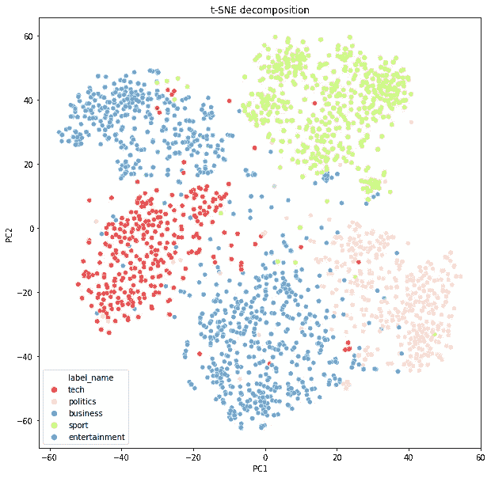

# Python 中的文本分类

> 原文：<https://towardsdatascience.com/text-classification-in-python-dd95d264c802?source=collection_archive---------0----------------------->

## [一个端到端的机器学习项目](https://towardsdatascience.com/tagged/an-end-to-end-ml-project)

## 学习用 Python 构建文本分类模型

本文是我将涵盖开发一个机器学习项目的**整个过程**的系列文章的第一篇。

在这篇文章中，我们集中在用 Python 训练一个监督学习**文本分类**模型。

写这些文章背后的动机如下:作为一名学习数据科学家，他已经使用数据科学工具和机器学习模型工作了相当长的时间，我发现互联网、书籍或文献中的许多文章通常都非常关注建模部分。也就是说，给我们一个特定的数据集(如果是监督学习问题，已经分配了标签)，尝试几个模型并获得一个性能度量。这个过程到此结束。

但是在现实生活问题中，我认为用正确的超参数找到正确的模型只是任务的开始。当我们部署模型时会发生什么？它将如何应对新数据？这些数据看起来会和训练数据集一样吗？也许，会有一些我们需要的信息(缩放或功能相关的信息)？会有吗？用户会允许并理解与结果相关的不确定性吗？如果我们想成功地将基于机器学习的服务带给我们的最终用户，我们必须问自己这些问题。

出于这个原因，我开发了一个项目，涵盖了创建基于 ML 的服务的整个过程:获取原始数据并解析它，创建功能，训练不同的模型并选择最佳模型，获取新数据以提供给模型，并向最终用户显示有用的见解。

该项目包括创建一个实时 web 应用程序，该应用程序从几家报纸收集数据，并显示新闻文章中讨论的不同主题的摘要。

这是通过能够预测给定新闻文章类别的监督机器学习**分类模型**、从报纸获取最新新闻的**网络搜集方法**以及向用户显示所获得结果的**交互式网络应用**来实现的。

这可以看作是一个**文本分类**的问题。文本分类是在不同的商业问题中广泛使用的自然语言处理(NLP)应用之一。

这些文章的目标读者是已经对基本的机器学习概念有所了解的人(例如，知道什么是交叉验证以及何时使用它，知道逻辑回归和线性回归之间的区别等等)。但是，我将简要说明项目中涉及的不同概念。

github 回购可以在这里找到。它包括所有的代码和一个完整的报告。我不会在这篇文章中包含代码，因为它太大了，但是我会在需要的地方提供一个链接。

我将这个过程分为三个不同的岗位:

*   分类模型培训(本岗位)
*   新闻文章网页抓取([链接](/web-scraping-news-articles-in-python-9dd605799558)
*   应用创建和部署([链接](/deploying-a-text-classification-model-7ad2d23a556d))

本帖涵盖第一部分:**分类模型训练**。我们将在以下步骤中介绍它:

1.  问题定义和解决方法
2.  输入数据
3.  初始数据集的创建
4.  探索性数据分析
5.  特征工程
6.  预测模型

# 1.问题定义和解决方法

正如我们已经说过的，我们正在讨论一个监督学习的问题。这意味着我们需要一个带标签的数据集，这样算法就可以学习数据中的模式和相关性。幸运的是，我们有一个可用的，但在现实生活中，这是一个关键的步骤，因为我们通常必须手动完成任务。因为，如果我们能够自动化标记一些数据点的任务，那么我们为什么需要一个分类模型呢？

# 2.输入数据

这个项目中使用的数据集是 BBC 新闻原始数据集。可以从[这里](http://mlg.ucd.ie/datasets/bbc.html)下载。

它由来自 BBC 新闻网站的 2225 份文件组成，对应于 2004 年至 2005 年五个主题领域的故事。这些领域是:

*   商业
*   娱乐
*   政治
*   运动
*   技术

下载文件包含五个文件夹(每个类别一个)。每个文件夹都有一个*。每篇新闻文章的 txt* 文件。这些文件包括原始文本的新闻文章正文。

# 3.初始数据集的创建

此步骤的目的是获得具有以下结构的数据集:

我们用 R 脚本创建了这个数据集，因为包 *readtext* 简化了这个过程。剧本可以在[这里](https://github.com/miguelfzafra/Latest-News-Classifier/blob/master/0.%20Latest%20News%20Classifier/01.%20Dataset%20Creation/01.%20Dataset%20Creation.R)找到。

# 4.探索性数据分析

通常的做法是进行探索性数据分析，以便从数据中获得一些见解。然而，到目前为止，我们还没有任何定义数据的特性。我们将在下一节中看到如何从文本中创建特征。特性工程)，但是，由于这些特性的构造方式，我们不期望从分析它们中得到任何有价值的见解。为此，我们只进行了粗浅的分析。

在开发分类模型时，我们主要关心的一个问题是不同的类是否是**平衡的**。这意味着数据集包含每个类的大致相等的部分。

例如，如果我们有两个类，并且 95%的观察值属于其中的一个，一个总是输出多数类的哑分类器将有 95%的准确性，尽管它会使少数类的所有预测失败。

有几种处理不平衡数据集的方法。第一种方法是**欠采样**多数类和**过采样**少数类，以便获得更平衡的数据集。其他方法可以使用精度之外的其他误差度量，例如**精度**、**召回**或 **F1 分数**。稍后我们将详细讨论这些指标。

查看我们的数据，我们可以得到属于每个类别的观察值的百分比:

我们可以看到，类是近似平衡的，所以我们不会执行任何欠采样或过采样方法。然而，我们无论如何都会使用精度和召回率来评估模型性能。

另一个感兴趣的变量可以是新闻文章的长度。我们可以获得跨类别的长度分布:

我们可以看到，政治和科技文章往往更长，但并不显著。此外，我们将在下一节中看到，我们用来创建特征的方法会考虑并修正文章的长度。所以这对我们来说没什么大不了的。

EDA 笔记本可以在[这里](https://github.com/miguelfzafra/Latest-News-Classifier/blob/master/0.%20Latest%20News%20Classifier/02.%20Exploratory%20Data%20Analysis/02.%20Exploratory%20Data%20Analysis.ipynb)找到。

# 5.特征工程

特征工程是构建任何智能系统的基本部分。正如吴恩达所说:

> “想出新功能既困难又耗时，需要专业知识。‘应用机器学习’基本上是特征工程。”

特征工程是将数据转换为特征以充当机器学习模型的输入的过程，以便高质量的特征有助于提高模型性能。

处理文本数据时，有几种方法可以获取表示数据的特征。我们将介绍一些最常见的方法，然后选择最适合我们需要的方法。

# 5.1.文本表示

回想一下，为了表示我们的文本，数据集的每一行都将是语料库的单个文档。根据我们选择的特征创建方法，列(特征)会有所不同:

*   **字数统计向量**

使用这种方法，每一列都是语料库中的一个术语，每个单元格都代表每个文档中每个术语的频率计数。

*   ***TF–IDF*矢量**

*TF-IDF* 是表示一个术语在文档和整个语料库中的相对重要性的分数。 *TF* 代表*词频*， *IDF* 代表*逆文档频率*:

*TF-IDF* 值与单词在文档中出现的次数成比例增加，并被语料库中包含该单词的文档数量所抵消，这有助于调整某些单词通常更频繁出现的事实**。**

它还考虑了这样一个事实，即通过规范化 *TF* 术语(表示相对术语频率)，一些文档可能比其他文档大。

这两种方法(单词计数向量和 *TF-IDF* 向量)通常被称为单词袋方法，因为句子中单词的顺序被忽略了。下面的方法更先进，因为它们以某种方式保留了单词的顺序和它们的词汇考虑。

*   **单词嵌入**

单词在向量空间中的位置是从文本中学习的，并且是基于当使用单词时该单词周围的单词。单词嵌入可以与应用迁移学习的预训练模型一起使用。

*   **基于文本或基于自然语言处理的特征**

我们可以手动创建我们认为在区分类别时可能很重要的任何特征(例如，单词密度、字符数或单词数等)。

我们还可以使用词性模型来使用基于 NLP 的特征，词性模型可以告诉我们，例如，一个单词是名词还是动词，然后使用词性标签的频率分布。

*   **话题模型**

潜在狄利克雷分配等方法试图通过词的概率分布来表示每个主题，这就是所谓的主题建模。

我们选择了 *TF-IDF* 向量来表示我们语料库中的文档。这次选举的动机是以下几点:

*   *TF-IDF* 是一个**简单的**模型，它在这个特定的领域产生了巨大的成果，我们将在后面看到。
*   *TF-IDF* 功能创建是一个**快速**过程，这将使我们在用户使用 web 应用程序时缩短等待时间。
*   我们可以**调整**特征创建过程(见下一段)来避免像过度拟合这样的问题。

使用此方法创建特征时，我们可以选择一些参数:

*   N-gram 范围:我们能够考虑一元，二元，三元…
*   最大/最小文档频率:在构建词汇表时，我们可以忽略文档频率严格高于/低于给定阈值的术语。
*   最大特征:我们可以选择语料库中按词频排序的前 *N* 个特征。

我们选择了以下参数:

我们希望二元模型通过考虑文档中经常一起出现的单词来帮助提高我们的模型性能。我们已经选择了一个最小 DF 值等于 10，以排除在超过 10 个文档中不出现的极其罕见的单词，以及一个最大 DF 值等于 100%，以不忽略任何其他单词。之所以选择 300 作为最大特征数，是因为我们希望避免可能的过拟合，过拟合通常是由于与训练观察的数量相比，特征的数量太多而引起的。

正如我们将在接下来的章节中看到的，这些值使我们达到真正高精度的值，所以我们将坚持使用它们。然而，为了训练更好的模型，可以调整这些参数。

有一个重要的考虑需要提及。回想一下 *TF-IDF* 分数的计算需要存在一个**文档语料库**来计算逆文档频率项。因此，如果我们想一次预测一篇新闻文章(例如，一旦部署了模型)，我们就需要定义这个语料库。

这个语料库是一组训练文档。因此，当从新文章中获取 *TF-IDF* 特征时，将仅为该新文章创建存在于训练语料库中的特征。

很容易得出这样的结论:当模型被部署时，训练语料与我们将要搜集的消息越相似，我们可能获得的准确性就越高。

# 5.2.文本清理

在从原始文本创建任何特征之前，我们必须执行一个清理过程，以确保模型中没有引入失真。我们遵循了以下步骤:

*   **特殊字符清理:**特殊字符，如" *\n* "双引号必须从文本中删除，因为我们不期望它们有任何预测能力。
*   例如，我们会认为“书”和“书”是同一个单词，具有相同的预测能力。因此，我们把每一个字都写了下来。
*   **标点符号:**字符如“？”, "!", ";"已被移除。
*   **所有格代词:**此外，我们会期望“Trump”和“Trump 的”具有相同的预测能力。
*   **词干化或词条化:**词干化是将派生单词还原到其词根的过程。引理化是将一个词简化为其引理的过程。这两种方法的主要区别在于，词汇化提供了现有的单词，而词干化提供了可能不是现有单词的词根。我们使用了一个基于 WordNet 的 Lemmatizer。
*   **停用词:**像“what”或“the”这样的词没有任何预测能力，因为它们可能对所有文档都是通用的。因此，它们可能代表可以消除的噪声。我们已经从 *nltk* 包中下载了一个英语停用词列表，然后将它们从语料库中删除。

在这一点上，有一个重要的考虑事项必须要做。我们应该考虑到可能出现的失真，这些失真不仅出现在训练测试中，还会出现在运行 web 应用程序时收集的新闻文章中。

# 5.3.标签编码

机器学习模型需要数字特征和标签来提供预测。因此，我们必须创建一个字典来将每个标签映射到一个数字 ID。我们创建了这个映射方案:

# 5.4.列车-测试分离

在预测未知数据时，我们需要设置一个测试集来证明模型的质量。我们选择了一个随机分割，85%的观察值组成训练测试，15%的观察值组成测试集。我们将在训练数据中执行交叉验证的超参数调整过程，拟合最终模型，然后使用**完全不可见的**数据对其进行评估，以获得偏差尽可能小的评估指标。

完整详细的特征工程代码可在[这里](https://github.com/miguelfzafra/Latest-News-Classifier/blob/master/0.%20Latest%20News%20Classifier/03.%20Feature%20Engineering/03.%20Feature%20Engineering.ipynb)找到。

# 6.预测模型

# 6.1.超参数调整方法和模型

我们已经测试了几个机器学习模型，以找出哪一个可能更适合数据，并正确地捕捉点及其标签之间的关系。由于我们拥有的数据量不足，我们只使用了经典的机器学习模型，而不是深度学习模型，这可能会导致模型过度拟合，无法对看不见的数据进行很好的概括。

我们尝试了以下模型:

*   随机森林
*   支持向量机
*   k 个最近邻居
*   多项式朴素贝叶斯
*   多项式逻辑回归
*   梯度推进

它们中的每一个都有多个超参数需要调整。在为每个模型定义最佳超参数集时，我们遵循了以下方法:

首先，我们已经决定了**我们想要为每个模型调整哪些超参数**，考虑到那些可能对模型行为有更大影响的超参数，并且考虑到大量的参数将需要大量的计算时间。

然后，我们定义了一个可能值的网格，并使用三重交叉验证(50 次迭代)执行了一个**随机搜索**。最后，一旦我们获得了具有最佳超参数的模型，我们已经使用以这些值为中心的三重交叉验证执行了**网格搜索**，以便在超参数空间中彻底搜索最佳性能组合。

我们遵循这种方法，因为通过随机搜索，我们可以覆盖每个超参数的更大范围的值，而不会导致真正高的执行时间。一旦我们缩小了每个设置的范围，我们就知道在哪里集中搜索，并明确指定要尝试的每个设置组合。

选择𝐾 = 3 作为随机搜索中的折叠数和 50 次迭代的原因来自于较短执行时间或测试大量组合之间的权衡。在选择流程中的最佳模型时，我们选择了准确性作为评估标准。

# 6.2.性能测定

在通过交叉验证对训练数据执行超参数调整过程并将模型拟合到该训练数据之后，我们需要在完全看不见的数据(测试集)上评估其性能。在处理分类问题时，有几个度量标准可用于深入了解模型的执行情况。其中一些是:

*   准确性:准确性度量测量正确预测与评估的实例总数的比率。
*   Precision: precision 用于度量从一个肯定类中的所有预测模式中正确预测的肯定模式。
*   回忆:回忆被用来衡量被正确分类的积极模式的比例
*   f1-得分:此指标表示召回率和精确度值之间的调和平均值
*   ROC 曲线下面积(AUC):这是在各种阈值设置下对分类问题的性能测量。ROC 是概率曲线，AUC 代表可分性的程度或度量。它告诉我们一个模型在多大程度上能够区分不同的类。

这些度量被高度扩展并广泛用于二进制分类。然而，当处理多类分类时，它们变得更加复杂，难以计算和解释。此外，在这个特定的应用程序中，我们只希望正确预测文档。假阳性或假阴性的成本对我们来说是一样的。出于这个原因，我们的分类器是更具体还是更敏感对我们来说并不重要，只要它能正确地分类尽可能多的文档。因此，我们研究了比较模型和选择最佳超参数时的**精度**。在第一种情况下，我们计算了训练集和测试集的准确性，以便检测过度拟合模型。然而，我们还获得了每个模型的混淆矩阵和分类报告(计算所有类的精确度、召回率和 F1 值),因此我们可以进一步解释它们的行为。

# 6.3.最佳型号选择

下面我们展示了不同模型及其评估指标的摘要:

总的来说，我们为每个模型获得了非常好的精度值。我们可以观察到梯度增强、逻辑回归和随机森林模型似乎过拟合，因为它们具有极高的训练集精度，但测试集精度较低，因此我们将丢弃它们。

我们将在剩余的模型中选择 SVM 分类器，因为它具有最高的测试集精度，这实际上接近于训练集精度。SVM 模型的**混淆矩阵**和**分类报告**如下:

# 6.4.模型解释

在这一点上，我们已经选择了 SVM 作为我们进行预测的首选模型。现在，我们将通过分析错误分类的文章来研究它的行为，以便获得关于模型工作方式的一些**见解**，并且如果必要的话，思考添加到模型中的新特性。回想一下，虽然超参数调整是一个重要的过程，但开发机器学习项目时最关键的过程是能够从数据中提取良好的特征。

让我们举一个分类错误的文章的例子。它的实际类别是政治，尽管这个模型预测的是科技。

> 议员发出黑莓威胁
> 
> 众议院议长迈克尔·马丁裁定，如果议员们在众议院使用黑莓手机，他们将被赶出下议院。
> 
> 这 200 台掌上电脑可以用作电话、传呼机或发送电子邮件。这些设备在本周获得了新的关注，因为阿拉斯泰尔·坎贝尔用他的手机意外地向《新闻之夜》的一名记者发送了一条充满诅咒的信息。马丁先生透露，一些议员在辩论中一直使用他们的黑莓手机，他还警告议员们不要使用隐藏的耳机。
> 
> 长期以来，在下议院使用电子设备是不被允许的。手机或寻呼机的声音会招致议长或副议长的强烈指责。议长主持下议院的辩论，负责确保议院的秩序，执行众议院的规则和惯例。他或她总是由同事们选择的议员，一旦被提名，就放弃所有政党的忠诚。

这篇文章谈的是下议院禁止黑莓手机的问题。它既涉及政治又涉及技术，所以这种错误分类是有道理的。

# 6.5.降维图

降维指的是将具有大量维度的一组数据转换成具有较少维度的数据的过程，以确保其简明地传达相似的信息。

降维技术在机器学习中有许多应用。其中之一是可视化。通过将维度空间减少到包含大部分信息的 2 或 3 维，我们可以绘制我们的数据点，并能够将一些模式识别为人类。

我们使用了两种不同的降维技术:

*   **主成分分析**:该技术依赖于获得数据矩阵的特征值和特征向量，并试图提供最少数量的变量，以保持最大的方差。
*   **t-SNE**:t 分布随机邻居嵌入是一种概率技术，特别适用于高维数据集的可视化。它最小化两个分布之间的差异:测量输入对象的成对相似性的分布和测量嵌入中相应低维点的成对相似性的分布。

让我们画出结果:

我们可以看到，使用 t-SNE 技术更容易区分不同的类。虽然我们只使用了降维技术进行绘图，但我们可以使用它们来减少特征的数量，以支持我们的模型。由于通常大量的特征，这种方法在文本分类问题中特别有用。

# 6.6.预测条件概率

在进入网页抓取过程之前，我们还需要做一个额外的考虑。训练数据集的文章被标记为商业、娱乐、体育、科技和政治。但是我们可以想到不适合任何一个的新闻文章(例如，天气新闻文章)。由于我们已经开发了一个监督学习模型，这类文章会被错误地归类到 5 类中的一类。

此外，由于我们的训练数据集的日期是 2004-2005 年，因此在搜集最新文章时可能会出现许多新概念(例如，技术概念)，但这些概念不会出现在训练数据中。同样，我们预计在这些情况下预测能力很差。

许多分类模型不仅提供某个数据点所属的类别。它们还可以提供属于𝐶.类的条件概率

例如，当我们有一篇明确谈论政治的文章时，我们期望属于政治类的条件概率非常高，而其他 4 个条件概率应该非常低。

但是当我们有一篇关于天气的文章时，我们期望所有条件概率向量的值都一样低。

因此，我们可以用这种思路指定一个阈值:如果最高条件概率低于阈值，我们将为文章提供无预测标签。如果更高，我们会分配相应的标签。

经过一个简短的研究，探索不同的文章，可能不属于任何 5 个类别，我们已经固定在 65%的阈值。

有关模型培训流程所有步骤的更多详情，请访问[此链接](https://github.com/miguelfzafra/Latest-News-Classifier/tree/master/0.%20Latest%20News%20Classifier/04.%20Model%20Training)。

在这一点上，我们已经训练了一个模型，它将能够对我们输入的新闻文章进行分类。我们离构建我们的应用又近了一步！