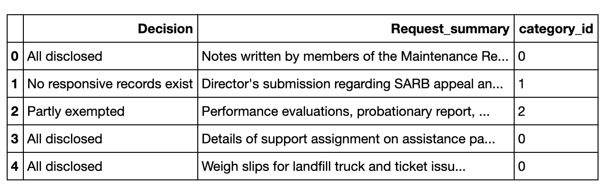
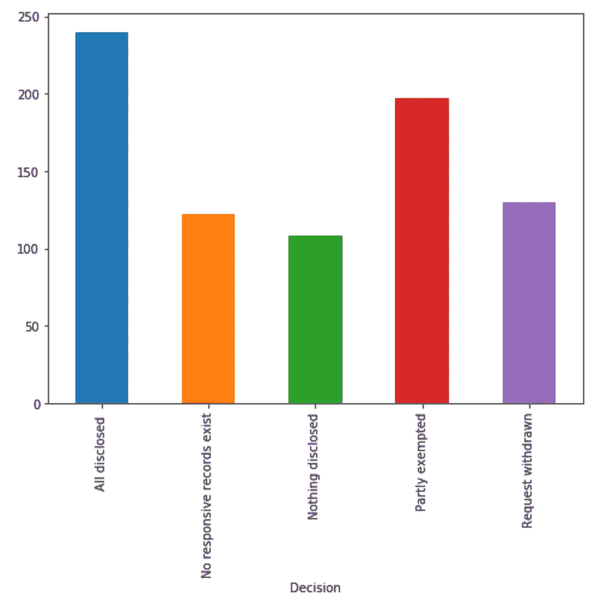
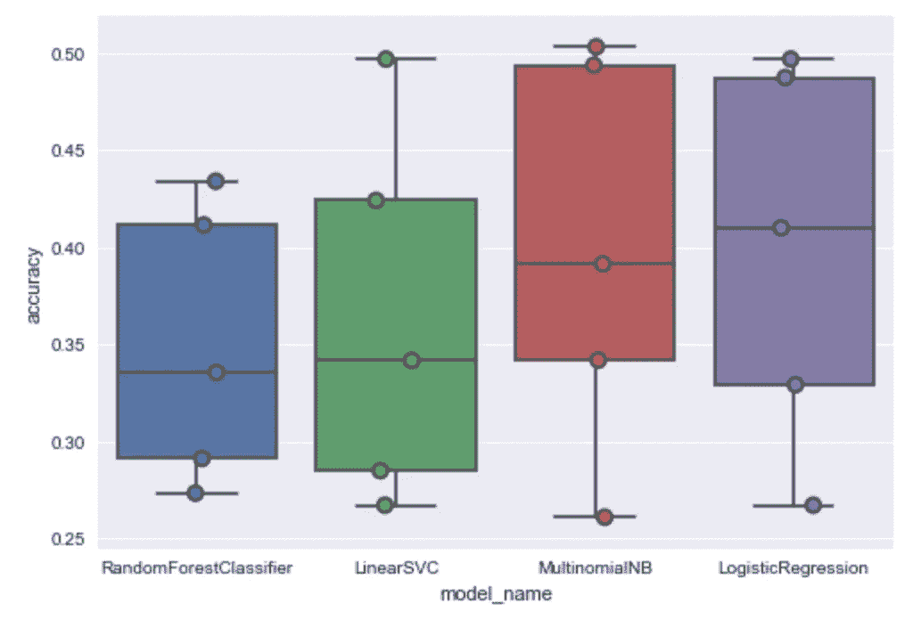
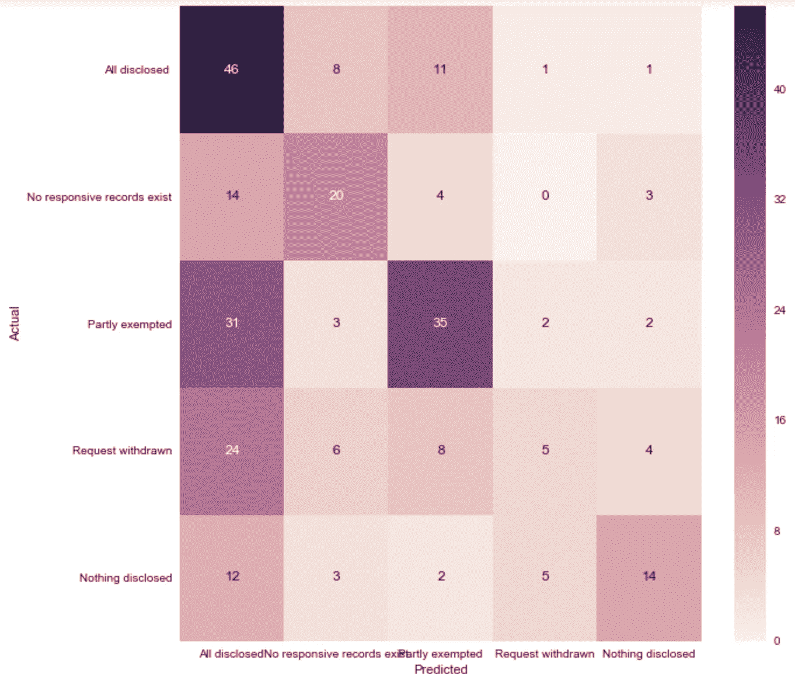

# 信息自由请求的文本分类:第一部分

> 原文：<https://towardsdatascience.com/text-classification-of-freedom-of-information-requests-part-i-8a75d1e7ea02?source=collection_archive---------23----------------------->

## 使用机器学习来预测市政当局的决策。

根据《信息自由和隐私保护法》(FIPPA)，加拿大安大略省有义务对信息请求做出回应。更具体地说,《市政信息自由和隐私保护法》允许任何年龄、任何地点的人发出这样的请求。与个人相关的信息可能包括印刷品、胶片、电子邮件、图纸、照片等。只要发布的内容不侵犯另一个人的隐私权。在本帖中，我们将尝试预测一个市政当局做出的决定，即安大略省基奇纳-滑铁卢(第一部分)和后来的多伦多(第二部分)。

所使用的数据在每个城市的开放数据门户下提供。任何识别信息都已被删除。

使用有限的 Kitchener-Waterloo 数据集将允许我们基线化一些度量标准和原型化我们的技术。这些数据通过 API 提供，涵盖 1992 年至 2016 年。

一旦所有数据都被汇总并转换成熊猫数据框架，我们需要更仔细地看看我们有什么。可能的“决定”如下:

***全部公开 238
部分免除 197
撤回 116
无记录存在 54
部分公开的信息 50
部分不存在 32
未公开 28
无记录存在 21
全部公开 16
转发出去 15
放弃 13
全部公开 13
无响应记录存在 11
更正被拒绝 3
不存在 3
已披露 2
已转移 1
未披露信息 1
已提交不同意声明 1
不存在额外记录 1
批准更正 1
请求撤销 1***

在可能的决定中，显然有一些重叠，共有 24 项。虽然可以(并且已经)在不太长的时间内手动合并这些类，但是如果有数百个这样的类，只是在空格的存在(或不存在)上有所不同呢？还是一个 s？还是以资本化的方式？SeatGeek 开发的 python 包 [fuzzywuzzy](https://chairnerd.seatgeek.com/fuzzywuzzy-fuzzy-string-matching-in-python/) 非常适合这种类型的模糊字符串匹配。

该软件包提供了四种方法来探测两个字符串的相似性。本质上，“fuzz_ratio”比较整个字符串，“fuzz_partial_ratio”在字符串中搜索部分匹配，“fuzz_token_sort_ratio”比较无序的字符串，“fuzz_token_set_ratio”将标记排序扩展到更长的字符串。每一个都返回一个相似率(越高越相似)，之后可以在可接受的截止点设置一个阈值。让我们测试一下每一个的性能。

```
from fuzzywuzzy import fuzzall_df_clean = all_df.copy()for row in all_df['Decision'].unique():
    for row2 in all_df['Decision'].unique():
        matching_result = fuzz.ratio(row, row2) # could be ratio, partial_ratio, token_set_ratio, token_sort_ratio 
        if matching_result > 80:
            #print(row, row2)
            #print(matching_results)
            #Combine if match found
            all_df_clean['Decision'][all_df_clean['Decision'] == row2] = row

print(all_df_clean['Decision'].value_counts())
print(len(all_df_clean['Decision'].unique()))
```

***全部披露 240
部分豁免 197
撤回 116
无记录存在 75
部分披露的信息 50
部分不存在 32
无信息披露 30
无披露 28
转发出去 15
放弃 13
无响应记录存在 11
不存在 3
改正被拒绝 3
改正作出 2
移交滑铁卢地区公共卫生 2
已转移 1
更正批准 1
请求撤回 1
名称:决定，dtype:int 64
20***

还不错。我们合并了四个类别(即“不存在记录”和“不存在记录”)，但“未披露信息”和“未披露任何内容”的意思显然是一样的。80%的截止值是通过反复试验确定的。让我们试试部分比率:

***全部披露 240
部分豁免 197
请求撤回 117
无响应记录存在 87
无信息披露 80
不存在 35
无披露 28
转发出去 15
放弃 13
更正拒绝 3
移交 3
更正作出 2
异议陈述归档 1
更正批准 1
名称:决定、dtt***

另外六个类合并了，但是算法并不真正知道如何处理子串‘discovered’。它将“部分披露的信息”和“未披露的信息”结合在一起，这两个词的意思不同。

***全部披露 240
部分豁免 197
撤回 116
无信息披露 80
无记录存在 75
部分不存在 32
无披露 28
转发出去 15
放弃 13
无响应记录存在 11
拒绝改正 3
不存在 3
改正作出 2
转移到滑铁卢公共卫生区 2【T55***

类似于基本比率情况。

***未披露信息 348
部分免除 197
要求撤回 117
无响应记录存在 87
不存在 35
转发出去 15
放弃 13
更正拒绝 3
移交 3
更正作出 2
异议声明存档 1
更正批准 1
名称:决定，dtype: int64
12***

迄今为止最积极的匹配案例，但我们再次被“披露”绊倒，因为现在我们不再有“全部披露”的案例，这是不可接受的。部分比率的情况似乎是一种折衷——也许我们可以进一步手动合并几个类别。我们将会看到当多伦多的数据被加入第二部分时会发生什么。

```
all_df_pr['Decision'].loc[all_df_pr['Decision'] == "Abandoned"] = "Request withdrawn"
all_df_pr['Decision'].loc[all_df_pr['Decision'] == "Non-existent"] = "No responsive records exist"
all_df_pr['Decision'].loc[all_df_pr['Decision'] == "No information disclosed "] = "Nothing disclosed"
all_df_pr['Decision'].loc[all_df_pr['Decision'] == "Transferred"] = "Forwarded out"
all_df_pr['Decision'].loc[all_df_pr['Decision'] == "Correction granted"] = "Correction made"
print(all_df_pr['Decision'].value_counts())
```

***全部公开 240
部分免除 197
请求撤回 130
无响应记录存在 122
无公开 108
转发 18
更正已做出 3
更正被拒绝 3
异议声明已归档 1
名称:决定，dtype: int64***

现在一切都变得清晰了。让我们砍掉人数下降幅度大的班级:

```
all_df_over20 = all_df_pr.groupby('Decision').filter(lambda x: len(x) > 20)
```

本文的剩余部分将大量借用 Susan Li 的[关于多类文本分类的优秀文章](/multi-class-text-classification-with-scikit-learn-12f1e60e0a9f)。我们的预期是，基于我们的数据集较小，以及文本本身相当不透明的事实，我们的结果不会很好。我们数据的快速概述:



这些阶层并不像我们想象的那样不平衡。“category_id”列是可能的决策案例的整数表示。现在，为每个请求计算一个 tf-idf 向量，去掉所有停用词。

```
from sklearn.feature_extraction.text import TfidfVectorizertfidf = TfidfVectorizer(sublinear_tf=True, min_df=5, norm='l2', 
                       encoding='latin-1', ngram_range=(1,2), stop_words='english')features = tfidf.fit_transform(all_df_over20.Request_summary).toarray()
labels = all_df_over20.category_id
features.shape
```

打印每个类的常见二元模型和二元模型。

```
from sklearn.feature_selection import chi2
import numpy as npN=2
for Decision, category_id in sorted(category_to_id.items()):
    features_chi2 = chi2(features, labels == category_id)
    indices = np.argsort(features_chi2[0])
    feature_names = np.array(tfidf.get_feature_names())[indices]
    unigrams = [v for v in feature_names if len(v.split(' ')) ==1]
    bigrams = [v for v in feature_names if len(v.split(' ')) ==2]
    print("# '{}':".format(Decision))
    print("  . Most correlated unigrams:\n. {}".format('\n.'.join(unigrams[-N:])))
    print("  . Most correlated bigrams:\n. {}".format('\n.'.join(bigrams[-N:])))
```

***#‘全部公开’:
。最相关的单字:
。协助
。个人
。最相关的二元模型:
。信息已删除
。移除竞争
#‘不存在响应记录’:
。最相关的单字:
。地点
。阶段
。最相关的二元模型:
。评估地址
。现场评估
#【未披露内容】:
。最相关的单字:
。总线
.2014
。最相关的二元模型:
。完成安大略省
。工程文件
#‘部分免除’:
。最相关的单字:
。比赛
.94
。最相关的二元模型:
。信息竞赛
。狂犬病控制
#‘请求撤回’:
。最相关的单字:
。省级
。评测
。最相关的二元模型:
。处理厂
。省级违法行为***

这就是我说的请求本身在通过视觉进行分类方面相当不透明的意思。至少在阶级之间有很好的区分。

尝试四种不同的型号:

```
import warnings
warnings.filterwarnings(action='once')
from sklearn.linear_model import LogisticRegression
from sklearn.ensemble import RandomForestClassifier
from sklearn.svm import LinearSVCfrom sklearn.model_selection import cross_val_scoremodels = [
    RandomForestClassifier(n_estimators=200, max_depth=3,
                          random_state=0), #, class_weight='balanced'),
    LinearSVC(), #class_weight='balanced'),
    MultinomialNB(),
    LogisticRegression(random_state=0)#, class_weight='balanced'),
]
CV=5
cv_df = pd.DataFrame(index=range(CV * len(models)))
entries=[]
for model in models:
    model_name = model.__class__.__name__
    accuracies = cross_val_score(model, features, labels,
                                scoring='accuracy', cv=CV)
    for fold_idx, accuracy in enumerate(accuracies):
        entries.append((model_name, fold_idx, accuracy))
cv_df = pd.DataFrame(entries, columns=['model_name', 'fold_idx', 'accuracy'])import seaborn as snssns.boxplot(x='model_name', y='accuracy', data=cv_df)
sns.stripplot(x='model_name', y='accuracy', data=cv_df,
             size=8, jitter=True, edgecolor="gray", linewidth=2)
plt.show()
cv_df.groupby('model_name').accuracy.mean()
```



***model _ Name
linear SVC 0.362882
logistic regression 0.398066
MultinomialNB 0.398152
RandomForestClassifier 0.349038
Name:accuracy，dtype: float64***

不出所料，性能非常差。我们来看看混淆矩阵。



```
precision    recall  f1-score   support

             All disclosed        0.36      0.69      0.47        67
No responsive records exist       0.50      0.49      0.49        41
            Partly exempted       0.58      0.48      0.53        73
          Request withdrawn       0.38      0.11      0.17        47
          Nothing disclosed       0.58      0.39      0.47        36

                avg / total       0.48      0.45      0.44       264
```

这个模型至少在尝试。在[后续文章](/text-classification-of-freedom-of-information-requests-part-ii-4d57b080d179)中，我们将尝试通过显著增加可用数据和在每个类上尝试一系列二元分类器来改进这一点。

GitHub 上提供的代码:[https://github.com/scjones5/foi-kw](https://github.com/scjones5/foi-kw)