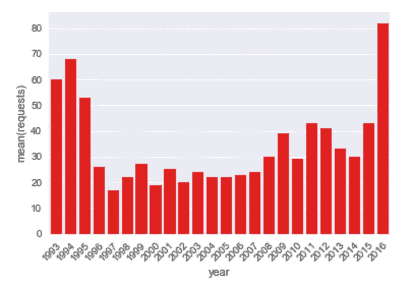
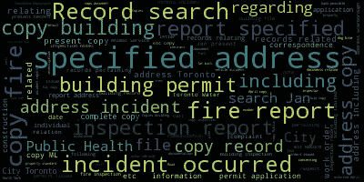
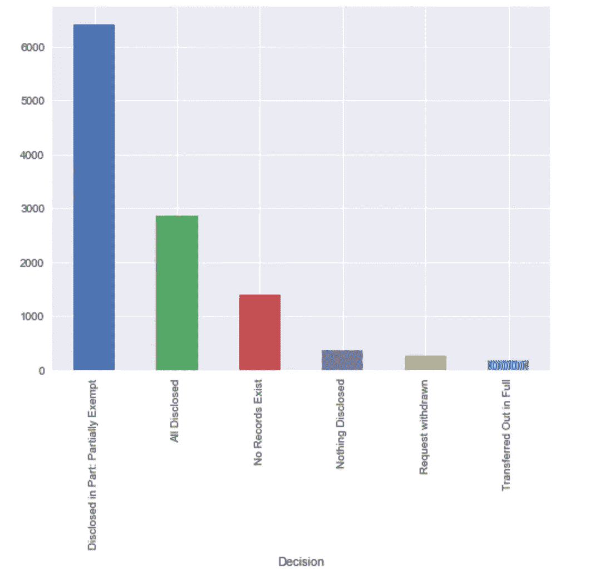

# 信息自由请求的文本分类:第二部分

> 原文：<https://towardsdatascience.com/text-classification-of-freedom-of-information-requests-part-ii-4d57b080d179?source=collection_archive---------17----------------------->

在第一部分中，我们吸收了可用的 Kitchener-Waterloo 信息自由数据，并设法使用模糊字符串匹配来聚合预测类。从那里，我们能够尝试使用四种不同的分类算法进行预测:随机森林、线性支持向量分类、多项式朴素贝叶斯和逻辑回归。结果并不令人印象深刻。

在这里，我们将通过包含多伦多市发出的请求来增加我们的数据集。我们将进行更多的探索性数据分析，看看是否有任何方法可以帮助我们的模型，然后我们将尝试更智能地使用机器学习，在第三部分中，深度学习，以实现最佳结果。

在第一部分，我们的数据集有 832 个条目；用来自大城市的数据补充这一点，使我们的总数达到 11521 个条目，这开始类似于更适合机器学习问题的东西。千瓦数据仍然涵盖了更长的时间段，从 1993 年开始，直到 2016 年结束:



FOI requests over time in KW

多伦多 2011 年至 2018 年的数据没有显示出同样的增长趋势，


Requests by year in Toronto

但是，如果我们能够想出某种模式，将请求本身的案文与所作出的决定联系起来，就一定会节省一些时间。

请求本身的内容呢？为了快速理解人们正在使用的短语，我们可以检查两个数据集的单词云:


KW requests



Toronto requests

在每一个案例中，我都删除了一些被用来保护个人隐私的二元模型，但它们本身并没有传达任何有用的信息。这些包括“地址已删除”、“名称已删除”和“位置已删除”。留给我们的是更有趣的二元结构，如“安大略工程”、“建筑许可证”和“环境网站”。像这样将数据集分开，让我们注意到 KW 的请求更倾向于环境问题，而多伦多的请求看起来更一般。重要的是在得出太多的结论之前要小心，因为这是未知的，也可能是不太可能的，这是由个人/企业提交的文本。更有可能的是，这些数据是在某个时候从网上或打印出来的。

处理任何自由格式文本的一个重要部分是预处理。在这里，每个请求通常可以很好地包含在大约 50 个单词的句子中，事情可以很容易地标记化。将每个请求提供给下面的函数:

```
import spacy
from spacy.lang.en import English
from nltk.corpus import stopwords
from sklearn.feature_extraction.stop_words import ENGLISH_STOP_WORDS
from wordcloud import WordCloud, STOPWORDS
import string
parser = English()
STOPLIST = set(stopwords.words('english') + list(ENGLISH_STOP_WORDS)+ list(STOPWORDS))
SYMBOLS = " ".join(string.punctuation).split(" ") + ["-", "...", "”", "”"]def tokenizeText(sample):
    tokens = parser(sample)
    lemmas = []
    for tok in tokens:
        #lemmatizes, converts to lowercase, omits pronouns
        lemmas.append(tok.lemma_.lower().strip() if tok.lemma_ != "-PRON-" else tok.lower_)
    tokens = lemmas
    #removes stop word tokens and symbols
    tokens = [tok for tok in tokens if tok not in STOPLIST]
    tokens = [tok for tok in tokens if tok not in SYMBOLS]
    return tokens
```

我们可以先用 SpaCy 解析文本，然后找到每个单词的引理，转换成小写。使用 nltk，我们最终可以删除任何停用词或符号。nltk 还为词汇化提供了“Morphy”方法，这是一个很大程度上重复的进一步步骤，但对我来说，仍然抓住了一些 SpaCy 遗漏的复数:

```
import nltk
nltk.download('wordnet')
from nltk.corpus import wordnet as wn
def get_lemma(word):
    #print("un-lemmad word: ", word)
    lemma = wn.morphy(word)
    #print("lemma-d word: ", lemma)
    if lemma is None:
        return word
    else:
        return lemma
```

调用这两个函数并删除任何长度小于 5 的标记:

```
def prepare_text_for_lda(text):
    # tokenizes text using spacy
    tokens = tokenizeText(text)
    # removes tokens less that five characters
    tokens = [token for token in tokens if len(token) > 4]
    # here we are lemmatizing again too; noticed that previous lemmatization doesn't handle plurals
    tokens = [get_lemma(token) for token in tokens]
    return tokens
```

将所有这些放在一起并整合结果:

```
import random
text_data = []
for request in (all_df['Summary_of_Request']):
    tokens = prepare_text_for_lda(request)
    text_data.append(tokens)
```

例如，下面是数据帧中的第一个请求及其相关的令牌:

```
Notes written by members of the Maintenance Review Committee for Clerk III, Healthy Environments.
['note', 'write', 'member', 'maintenance', 'review', 'committee', 'clerk', 'healthy', 'environment']
```

EDA 中对文本数据最感兴趣的最后一点是做一些主题建模。GenSim 包可以主要通过潜在的狄利克雷分配来识别语义相似性(因此命名为上述函数)，并从中挑选出所需数量的“主题”，显示与每个主题最相似的单词。基于一个预定义的字典(这里是前面的 ***text_data*** 列表)，方法 doc2bow 使用单词包格式返回每个单词的索引和频率。然后将其传递给 LDA 模型，直到最终能够看到与每个主题相关联的单词及其相对重要性:

```
(0, '0.078*"record" + 0.063*"permit" + 0.057*"build" + 0.055*"inspection"')
------------------------------------------------------------------------------------------
(1, '0.124*"report" + 0.092*"incident" + 0.076*"occur" + 0.032*"address"')
------------------------------------------------------------------------------------------
(2, '0.167*"specify" + 0.084*"address" + 0.027*"toronto" + 0.020*"include"')
------------------------------------------------------------------------------------------
(3, '0.044*"water" + 0.042*"record" + 0.029*"toronto" + 0.021*"sewer"')
------------------------------------------------------------------------------------------
(4, '0.071*"record" + 0.034*"property" + 0.032*"complaint" + 0.021*"investigation"')
------------------------------------------------------------------------------------------
```

我们可以看到“记录”一词与多个不同的主题相关联，但总体而言，所使用的术语是相当通用的。

在第一部分中，我们主要讨论了使用 fuzzywuzzy 包来组合相似的表面决定。随着多伦多数据的加入,“partial_ratio”方法仍然是最适用的，并允许我们将决策范围缩小到 6 个类别，如下图所示，同时列出了每组的观察数量。

```
Disclosed in Part: Partially Exempt    6406
All Disclosed                           2847
No Records Exist                        1393
Nothing Disclosed                        371
Request withdrawn                        256
Transferred Out in Full                  168
```

当我们进行预测时，我们应该记住，最常见的决策“部分披露:部分豁免”应该对我们的模型进行最严格的测试，因为这是一个介于“全部披露”和“没有披露”极端情况之间的情况。如果我们能准确预测这种情况，那么其他的应该会更容易发生。幸运的是，它拥有最多的数据。

下图更新后包括了多伦多的数据:



与第一部分相比，我们现在有更多的不平衡类问题。这可能需要更彻底地解决，特别是如果我们希望，如前所述，尝试二元“一个对其余的”分类器。这样不公平地存在正反两方面的情况是不行的。

打包的不平衡学习正是考虑到这些类型的用例而构建的。这有助于对较小的类进行过采样，或者对较大的类进行欠采样，以平衡观测值的分布。该软件包提供了几种不同的数据过采样方法。RandomOverSampler 例程通过替换对代表性不足的类进行采样，直到达到最密集类的频率。但是，这种方法容易导致大量的数据重复，可能导致模型过拟合。相反，合成少数过采样技术(SMOTE)进行插值，以生成新的样本。我们试试 SMOTE:

```
from imblearn.over_sampling import RandomOverSampler, SMOTEX_resampled, y_resampled = SMOTE().fit_resample(features, labels)from collections import Counterprint(sorted(Counter(y_resampled).items()))
```

[(0, 6406), (1, 6406), (2, 6406), (3, 6406), (4, 6406), (5, 6406)]

现在每个类都有相同数量的观察值。

作为我们预测能力的基线，我们可以简单地重复第一部分中使用的方法，这里使用额外的数据和重新采样的类。这样做已经大大提高了我们的准确性:

线性 SVC 0.858418

物流回归 0.806723

多项式 B 0.752838

随机森林分类器 0.500750

在本系列的剩余部分，[第三部分](/text-classification-of-freedom-of-information-requests-part-iii-9b34e0a9df07)，我们将通过最终引入 OneVsRest 二元分类器来深化我们的模型，并将其性能与完全成型的 GRU 递归神经网络进行比较。