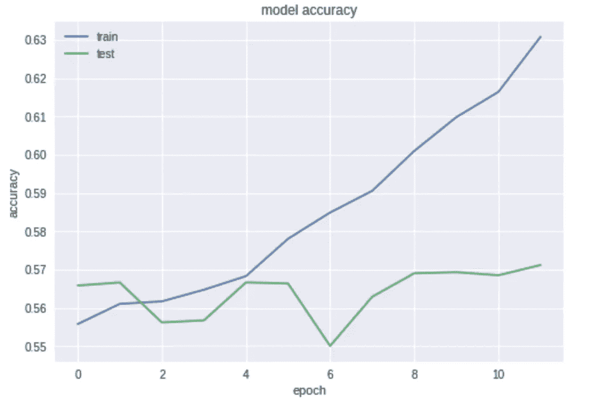
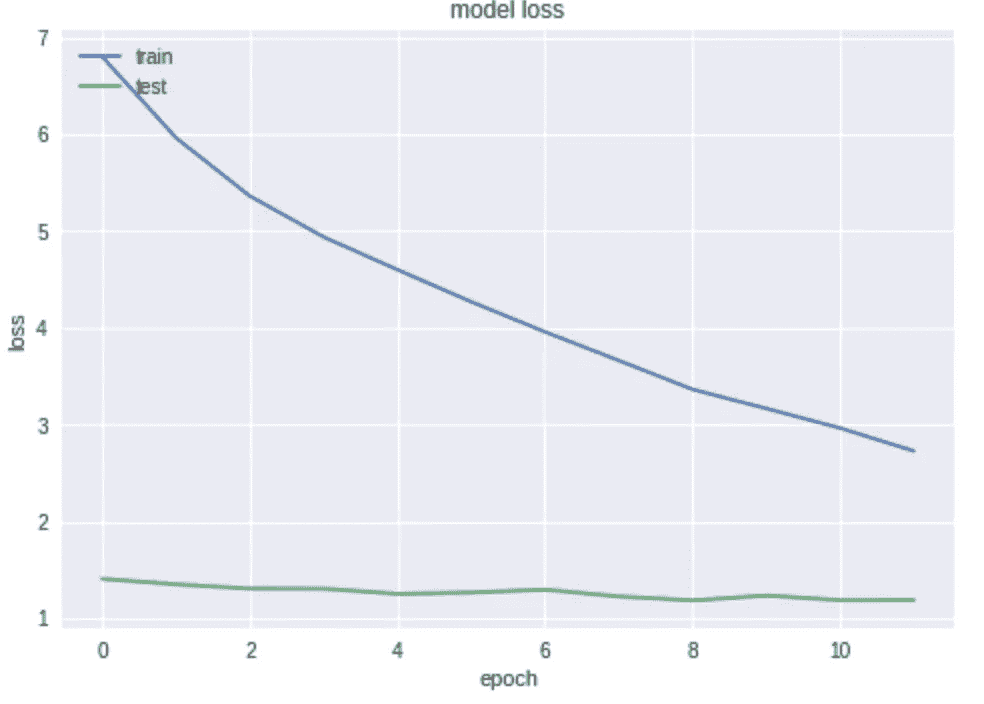

# 信息自由请求的文本分类:第三部分

> 原文：<https://towardsdatascience.com/text-classification-of-freedom-of-information-requests-part-iii-9b34e0a9df07?source=collection_archive---------38----------------------->

在本系列的第一部分中，我们针对 Kitchener-Waterloo 信息自由请求运行了一个不成熟的模型，试图预测一个响应。在第二部分中，我们通过包含多伦多市的请求扩展了我们的数据集，并通过探索性数据分析增加了一些领域知识。我们还处理了六个不同决策类别中观察值数量之间的不平等。

在第三部分中，我们将重复使用 LinearSVC、多项朴素贝叶斯、逻辑回归和随机森林中的每一个，但现在每次只针对一个类，而不是所有其他类。这是一种经常用于多标签问题的技术，在我们的例子中，每个请求都有多个决策，例如，由不同的参与方提交。需要的关键假设是，每个标签或类别(决策)是互斥的，并且独立于所有其他类别。虽然可以提出一个论点，即在这里不完全正确(“部分披露”可能最终变成“全部披露”，或者可能存在对相同请求做出不同决定的情况)，但我们将继续理解已经做出的假设。

基本代码的结构如下:

```
from sklearn.metrics import accuracy_scoreNB_pipeline = Pipeline([
                ('tfidf', TfidfVectorizer(tokenizer=tokenizeText, stop_words='english')),
                ('clf', OneVsRestClassifier(MultinomialNB())),
            ])for decision in categories:
    print(decision)
    NB_pipeline.fit(X_train, y_train_dums[decision])
    prediction = NB_pipeline.predict(X_test)    
    print('Test accuracy is {}'.format(accuracy_score(y_test_dums[decision], prediction)))Disclosed in Part: Partially Exempt Test accuracy is 0.8520182907600126 
All Disclosed Test accuracy is 0.8698360138757489 
No Responsive Records Exist Test accuracy is 0.8816619362976978 Nothing Disclosed (exemption) Test accuracy is 0.934799747713655 Request withdrawn Test accuracy is 0.9653106275622831 
Transferred Out in Full Test accuracy is 0.9943235572374646
```

其中目标变量先前已经被编码为独热码向量。LinearSVC 的结果:

***部分披露:部分豁免测试精度为 0.9100441501103753
全部披露测试精度为 0.9057079785556607
无响应记录存在测试精度为 0.9505676442762535
无披露(豁免)测试精度为 0.9874645222327342
要求撤回测试精度为 0.995***

逻辑回归:

***部分披露:部分豁免测试精度为 0.8661305581835383
全部披露测试精度为 0.8785083569851782
无响应记录存在测试精度为 0.8984547461368654
未披露(豁免)测试精度为 0.96661778618732261
请求撤回***

随机森林:

***部分披露:部分豁免测试精度为 0.826631977294229
全部披露测试精度为 0.8324660990223904
无响应记录存在测试精度为 0.8423210343740145
无披露(豁免)测试精度为 0.8342005676442763
要求撤回测试精度***

LinearSVC 方法似乎仍然表现最好，最接近“部分公开”类。一般来说，趋势是增加具有较少(上采样前)数据的类的准确性。很可能，向上采样的数据有些人为，根据定义，必须非常类似于已经存在的数据。

还尝试以同样的方式使用 XGBoost，对“部分公开”的准确率为 83.4%，尽管计算成本高得多。

# **用递归神经网络进行深度学习**

作为对这个数据集的最后努力，我们将采用递归神经网络(RNNs)形式的深度学习。rnn 保留序列中之前步骤的一些记忆，或者对于双向实现，在当前步骤之后的*和*之前。因此，它们在文档摘要和机器翻译等任务中非常有用，可以处理不同大小的输入和输出。

在我们的项目中，我们有许多输入令牌作为请求字符串的一部分，并且本质上，有一个决策类形式的输出。因此，该模型可以被认为是多对一分类器。

使用 Google 协作 GPU 功能，实现了以下模型:

```
input= Input(shape=(max_len, ), dtype = 'int32')
embedding_layer = Embedding(len(word_index) + 1, embedding_dim, embeddings_initializer=Constant(embedding_matrix), input_length=max_len, trainable=False)
embedded_sequences = embedding_layer(input)
x = Bidirectional(GRU(units=32, return_sequences=True))(embedded_sequences)
x = GlobalMaxPooling1D()(x)
x = Dense(50, activation = 'relu')(x)
x = Dropout(0.2)(x)
output = Dense(num_classes, activation='softmax')(x)
model = Model(inputs=input, outputs=output)
model.compile(loss="categorical_crossentropy", optimizer='adam', metrics=['accuracy'])metrics=['accuracy'])
print(model.summary())
```

我们使用了长度为 40 个单位的手套词嵌入，这是大多数请求遵循的最大长度:

```
embeddings_index = {}# Download this file first
f = open("/content/drive/My Drive/foi-kw/glove.6B.300d.txt", encoding="utf8")for line in f:
    values = line.split()
    word = ''.join(values[:-embedding_dim])
    coefs = np.asarray(values[-embedding_dim:], dtype="float32")
    embeddings_index[word] = coefs
f.close()tokenizer = Tokenizer(num_words = None)
tokenizer.fit_on_texts(X_train)sequences_train = tokenizer.texts_to_sequences(X_train)
X_train = pad_sequences(sequences_train, maxlen=max_len)sequences_val = tokenizer.texts_to_sequences(X_test)
X_test = pad_sequences(sequences_val, maxlen=max_len)word_index = tokenizer.word_index#create embedding layer
embedding_matrix = np.zeros((len(word_index) + 1, embedding_dim))for word, i in word_index.items():
    embedding_vector = embeddings_index.get(word)
    if embedding_vector is not None:
        embedding_matrix[i] = embedding_vectorimport matplotlib.pyplot as pltcheckpoint = ModelCheckpoint("/content/drive/My Drive/foi-kw/colab/models/model.h5", monitor='val_loss', verbose=1, save_best_only=True, mode='min')
early = EarlyStopping(monitor='val_loss', mode='min', patience=3)
callback = [checkpoint, early]history = model.fit(X_train, y_train, batch_size=batch_size, epochs=epochs, validation_data=(X_test, y_test), callbacks=callback, class_weight=class_weights)
loss, accuracy = model.evaluate(X_train, y_train, verbose=0)
print('Accuracy: %f' % (accuracy*100))
print(history.history.keys())
# Plot history for accuracy
plt.plot(history.history['acc'])
plt.plot(history.history['val_acc'])
plt.title('model accuracy')
plt.ylabel('accuracy')
plt.xlabel('epoch')
plt.legend(['train', 'test'], loc='upper left')
plt.show()
# Plot history for loss
plt.plot(history.history['loss'])
plt.plot(history.history['val_loss'])
plt.title('model loss')
plt.ylabel('loss')
plt.xlabel('epoch')
plt.legend(['train', 'test'], loc='upper left')
plt.show()
model.reset_states()
```

早期停止被用来努力避免过度拟合，就像“类权重”处理类不平衡一样。关于关键词及其含义的进一步描述，我会向读者推荐曼迪·顾的优秀文章。

如上编码的精度和损耗图得出:



Training and test accuracy over 12 epochs.



Training and test loss over 12 epochs.

奇怪的是，测试损失保持在一个相当恒定的值。在我们的模型中，我们在训练期间使用了压差正则化，这意味着网络没有满负荷运行，而在测试期间没有使用压差。另一种解释可能是，一个时期的测试损失是在该时期结束时计算的，而训练损失是每批训练数据的平均值。

# 结论

这一系列文章覆盖了很多领域，代表了作者第一次真正尝试为文本数据构建机器学习模型。多伦多数据集的增加使分析受益匪浅，因此我们可以有信心能够发现一些共同趋势。尽管如此，请求的实际文本可能没有什么变化，决定仍然是人类监督者的判断，这两个因素都可能混淆我们的结果。最后，即使通过这三篇文章，仍然有很多可以尝试的地方(不同类型的神经网络，GridSearchCV for hyperparameter tuning，AutoML)来改进我们的结果。