# 极小数据集下的文本分类

> 原文：<https://towardsdatascience.com/text-classification-with-extremely-small-datasets-333d322caee2?source=collection_archive---------0----------------------->

## 充分利用微型数据集的指南


Stop overfitting!

俗话说，在这个深度学习的时代“数据是新的石油”。然而，除非你为谷歌、脸书或其他科技巨头工作，否则获取足够的数据可能是一项艰巨的任务。这对于那些在你我可能拥有的利基领域或个人项目中运营的小公司来说尤其如此。

在这篇博客中，我们将模拟一个场景，其中我们只能访问一个非常小的数据集，并详细探讨这个概念。特别是，我们将构建一个可以检测 clickbait 标题的文本分类器，并试验不同的技术和模型来处理小数据集。

**博客概要:**

1.  什么是 Clickbait？
2.  获取数据集
3.  为什么小型数据集是 ML 中的一个难点？
4.  拆分数据
5.  简单的探索性数据分析
6.  词袋、TF-IDF 和词嵌入
7.  特征工程
8.  探索模型和超参数调整
9.  降维
10.  摘要

# 1.什么是 clickbait？

通常，您可能会遇到这样的标题:

> “我们试图用一个小数据集构建一个分类器。你不会相信接下来会发生什么！”
> 
> “我们喜欢这 11 种技术来构建文本分类器。# 7 会让你震惊。”
> 
> “智能数据科学家使用这些技术来处理小型数据集。点击了解它们是什么"

这些吸引人的标题在互联网上随处可见。但是，是什么让一个标题“吸引人”呢？维基百科将其定义为:

> **Clickbait** 是一种虚假广告，它使用超链接文本或缩略图链接，旨在吸引注意力并诱使用户点击该链接，阅读、查看或收听链接的在线内容，其显著特征是欺骗性、典型的耸人听闻或误导性。

一般来说，一个帖子是否是点击诱饵的问题似乎是相当主观的。(查看:“[为什么 BuzzFeed 不做 click bait](https://www.buzzfeed.com/bensmith/why-buzzfeed-doesnt-do-clickbait)”[1])。这意味着在查找数据集时，最好是查找由多人手动审阅的数据集。

# 2.获取数据集

经过一番搜索，我发现:[停止点击诱饵:检测和防止网络新闻媒体中的点击诱饵](https://people.mpi-sws.org/~achakrab/papers/chakraborty_clickbait_asonam16.pdf)Chakraborty 等人(2016)【2】及其附随的 Github [repo](https://github.com/bhargaviparanjape/clickbait)

该数据集包含 15，000 多篇文章标题，分别被标记为点击诱饵和非点击诱饵。非点击诱饵标题来自维基新闻，由维基新闻社区策划，而点击诱饵标题来自“BuzzFeed”、“Upworthy”等。

为了确保没有任何假阳性，标记为 clickbait 的标题由六名志愿者验证，每个标题由至少三名志愿者进一步标记。文件的第 2 部分包含更多细节。

**基准性能**:作者在随机采样的 15k 数据集(平衡)上使用了 10 倍 CV。他们取得的最好结果是 RBF-SVM 达到了 93%的准确率，0.95 的精确度，0.9 的召回率，0.93 的 F1，0.97 的 ROC-AUC

所以这是我们的挑战:

我们将用**的 50 个数据点作为我们的训练集**，用**的 10000 个数据点作为我们的测试集**。这意味着训练组**只是测试组**的 0.5%。我们不会在训练中使用测试集的任何部分，它只是作为一个省略验证集。

**评估指标:**

随着我们进行不同的实验，跟踪性能指标对于理解我们的分类器表现如何至关重要。 **F1 分数**将是我们的主要绩效指标，但我们也会跟踪**精确度**、**召回**、 **ROC-AUC** 和**精确度**。

# 3.为什么小型数据集是 ML 中的一个难点？

在我们开始之前，理解为什么小数据集难以处理是很重要的:

1.  **过拟合** : 当数据集较小时，分类器有更多的自由度来构造决策边界。为了证明这一点，我在同一个数据集(只有 8 个点的 Iris 数据集的修改版本)上训练了随机森林分类器 6 次

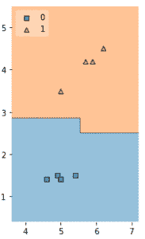

Varying Decision Boundaries for a small dataset

注意决策边界是如何剧烈变化的。这是因为分类器很难用少量数据进行归纳。从数学上来说，这意味着我们的预测会有很高的方差。

**潜在解决方案:**

正规化:我们将不得不使用大量的 L1，L2 和其他形式的正规化。

二。*更简单的模型:*像逻辑回归和支持向量机这样的低复杂度线性模型往往表现更好，因为它们的自由度更小。

**2。离群值:**

离群值对小数据集有着巨大的影响，因为它们会显著扭曲决策边界。在下面的图中，我添加了一些噪声，并改变了其中一个数据点的标签，使其成为异常值——注意这对决策边界的影响。

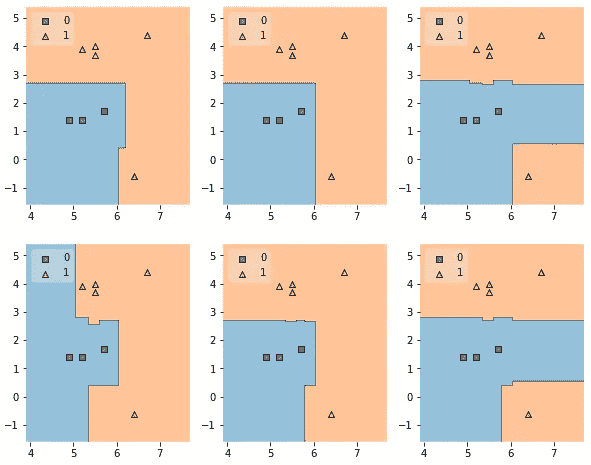

Effect of Outliers on the Decision Boundary

**潜在解决方案:**

*异常检测和去除*:我们可以使用像 DBSCAN 这样的聚类算法或者像隔离森林这样的集成方法

**3。高维度:**

随着更多特征的添加，分类器有更大的机会找到超平面来分割数据。然而，如果我们在不增加训练样本数量的情况下增加维数，特征空间会变得更加稀疏，分类器很容易过拟合。这是维度诅咒的直接结果——在这个[博客](https://www.visiondummy.com/2014/04/curse-dimensionality-affect-classification/#The_curse_of_dimensionality_and_overfitting)中有最好的解释

**潜在解决方案:**

I. *分解技术* : PCA/SVD 降低特征空间的维数

二。*特征选择*:去除预测中无用的特征。

我们将在这篇博客中深入探讨这些解决方案。

# 4.拆分数据

让我们从将数据分成训练集和测试集开始。如前所述，我们将使用 50 个数据点进行训练，10000 个数据点进行测试。

*(为了保持整洁，我删除了一些琐碎的代码:您可以查看*[*GitHub repo*](https://github.com/anirudhshenoy/text-classification-small-datasets)*中的完整代码)*

```
data = pd.DataFrame(clickbait_data)#Now lets split the datafrom sklearn.model_selection import train_test_splittrain, test = train_test_split(data, shuffle = True, stratify = data.label, train_size = 50/data.shape[0], random_state = 50)test, _ = train_test_split(test, shuffle = True, 
stratify = test.label, train_size = 10000/test.shape[0], random_state = 50)train.shape, test.shape**Output:** ((50, 2), (10000, 2))
```

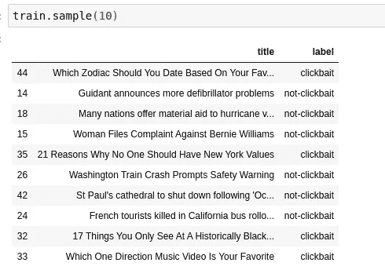

这里重要的一步是确保我们的训练集和测试集来自相同的分布，这样训练集的任何改进都会反映在测试集中。

Kagglers 使用的一个常用技术是在不同的数据集之间使用“对抗性验证”。(我见过它有很多名字，但我认为这是最常见的一个)

这个想法非常简单，我们混合两个数据集，并训练一个分类器来尝试区分它们。如果分类器不能做到这一点，我们可以得出结论，分布是相似的。可以在这里阅读更多:[https://www . kdnugges . com/2016/10/adversarial-validation-explained . html](https://www.kdnuggets.com/2016/10/adversarial-validation-explained.html)

ROC AUC 是首选指标——值约为 0.5 或更低意味着分类器与随机模型一样好，并且分布相同。

Code for Adversarial Validation

在进行对抗性验证之前，让我们使用词袋对标题进行编码

```
bow = CountVectorizer()
x_train = bow.fit_transform(train.title.values)
x_test = bow.transform(test.title.values)x_test = shuffle(x_test)adversarial_validation(x_train, x_test[:50])**Output:** Logisitic Regression AUC : 0.384
Random Forest AUC : 0.388
```

低 AUC 值表明分布是相似的。

为了看看如果发行版不同会发生什么，我在 breitbart.com 上运行了一个网络爬虫，收集了一些文章标题。

```
bow = CountVectorizer()
x_train = bow.fit_transform(breitbart.title.values)
x_test = bow.transform(test.title.values)x_train = shuffle(x_train)
x_test = shuffle(x_test)
adverserial_validation(x_train[:50], x_test[:50])**Output:** Logisitic Regression AUC : 0.720
Random Forest AUC : 0.794
```

AUC 值高得多，表明分布是不同的。

现在让我们继续，在 train 数据集上做一些基本的 EDA。

# 5.简单的探索性数据分析

让我们从检查数据集是否平衡开始:

```
print('Train Positive Class % : {:.1f}'.format((sum(train.label == 'clickbait')/train.shape[0])*100))
print('Test Positive Class % : {:.1f}'.format((sum(test.label == 'clickbait')/test.shape[0])*100))print('Train Size: {}'.format(train.shape[0]))
print('Test Size: {}'.format(test.shape[0]))**Output:** Train Positive Class % : 50.0
Test Positive Class % : 50.0
Train Size: 50
Test Size: 10000
```

接下来，让我们检查字数的影响。

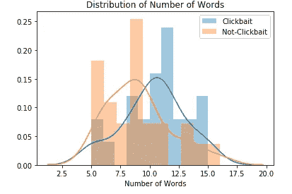

看起来 Clickbait 标题中包含的单词更多。平均单词长度呢？

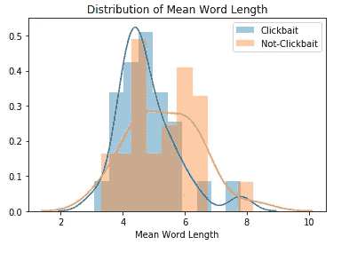

与非点击诱饵标题相比，点击诱饵标题使用较短的单词。由于 clickbait 标题通常有更简单的单词，我们可以检查标题中有百分之多少的单词是停用词

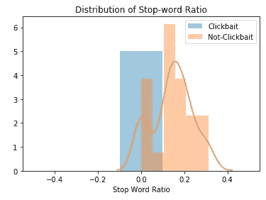

奇怪的是，clickbait 标题似乎没有 NLTK 停用词列表中的停用词。这可能是一个巧合，因为火车测试分裂或我们需要扩大我们的停用词列表。在特征工程中肯定要探索的东西。此外，停止单词删除作为预处理步骤在这里不是一个好主意。

单词云可以帮助我们识别每个类别中更突出的单词。让我们来看看:


Wordcloud for Clickbait Titles


Wordcloud for Non-Clickbait Titles

点击诱饵和非点击诱饵标题之间的单词分布非常不同。例如:非点击诱饵标题有州/国家，如“尼日利亚”、“中国”、“加利福尼亚”等，以及更多与新闻相关的词，如“暴乱”、“政府”和“破产”。非点击诱饵标题似乎有更多的通用词，如“最爱”、“关系”、“事情”等

使用单词包、TF-IDF 或 GloVe/W2V 这样的单词嵌入作为特性应该会有所帮助。与此同时，我们也可以通过简单的文本特性，如长度、单词比率等，获得大量的性能提升。

让我们试试 TSNE 对标题的单词包编码:

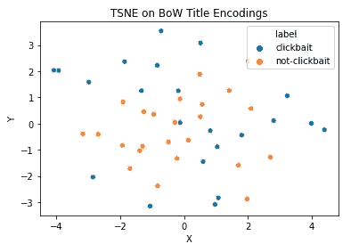

TSNE on BoW Title Encodings

这两个类似乎都用 BoW 编码聚集在一起。在下一节中，我们将探索不同的嵌入技术。

# 实用功能:

在我们开始探索嵌入之前，让我们编写几个助手函数来运行逻辑回归和计算评估指标。

因为我们想要优化 F1 分数的模型，所以对于所有的模型，我们将首先预测正类的概率。然后，我们将使用这些概率来获得精度-召回曲线，从这里我们可以选择一个具有最高 F1 分数的阈值。为了预测标签，我们可以简单地使用这个阈值。

Utility Functions to calculate F1 and run Log Reg

# 6.词袋、TF-IDF 和词嵌入

在这一节中，我们将使用 BoW、TF-IDF 和 Word 嵌入对标题进行编码，并在不添加任何其他手工制作的功能的情况下使用这些功能。

从 BoW 和 TF-IDF 开始:

```
y_train = np.where(train.label.values == 'clickbait', 1, 0)
y_test = np.where(test.label.values == 'clickbait', 1, 0)from sklearn.feature_extraction.text import CountVectorizer, TfidfVectorizerbow = CountVectorizer()
x_train = bow.fit_transform(train.title.values)
x_test = bow.transform(test.title.values)run_log_reg(x_train, x_test, y_train, y_test)from sklearn.feature_extraction.text import TfidfVectorizertfidf = TfidfVectorizer()
x_train = tfidf.fit_transform(train.title.values)
x_test = tfidf.transform(test.title.values)run_log_reg(x_train, x_test, y_train, y_test)**Output:
For BoW:** F1: 0.782 | Pr: 0.867 | Re: 0.714 | AUC: 0.837 | Accuracy: 0.801**For TF-IDF:**
F1: 0.829 | Pr: 0.872 | Re: 0.790 | AUC: 0.896 | Accuracy: 0.837
```

TFIDF 的表现略好于 BoW。一个有趣的事实是，我们只用 50 个数据点就得到 0.837 的 F1 分数。这就是为什么 Log Reg + TFIDF 是 NLP 分类任务的一个很好的基线。

接下来，让我们试试 100 维手套向量。我们将使用 PyMagnitude 库: *(PyMagnitude 是一个非常棒的库，它包含了很多优秀的特性，比如智能的声外表示。强烈推荐！)*

由于标题可以有不同的长度，我们将找到每个单词的手套表示，并将它们平均在一起，给出每个标题的单一 100-D 向量表示。

```
# We'll use Average Glove here 
from tqdm import tqdm_notebook
from nltk import word_tokenize
from pymagnitude import *glove = Magnitude("./vectors/glove.6B.100d.magnitude")def avg_glove(df):
    vectors = []
    for title in tqdm_notebook(df.title.values):
        vectors.append(np.average(glove.query(word_tokenize(title)), axis = 0))
    return np.array(vectors)x_train = avg_glove(train)
x_test = avg_glove(test)run_log_reg(x_train, x_test, y_train, y_test)**Output:**
F1: 0.929 | Pr: 0.909 | Re: 0.950 | AUC: 0.979 | Accuracy: 0.928
```

哇哦。这是 F1 分数的巨大增长，只是标题编码有一点点变化。改进的性能是合理的，因为 W2V 是包含大量上下文信息的预训练嵌入。这将有助于分类器的性能，尤其是当我们的数据集非常有限时。

如果我们不只是取每个单词的平均值，而是取一个加权平均值，特别是 IDF 加权平均值，会怎么样？

```
from sklearn.feature_extraction.text import TfidfVectorizertfidf = TfidfVectorizer()
tfidf.fit(train.title.values)# Now lets create a dict so that for every word in the corpus we have a corresponding IDF value
idf_dict = dict(zip(tfidf.get_feature_names(), tfidf.idf_))# Same as Avg Glove except instead of doing a regular average, we'll use the IDF values as weights.def tfidf_glove(df):
    vectors = []
    for title in tqdm_notebook(df.title.values):
        glove_vectors = glove.query(word_tokenize(title))
        weights = [idf_dict.get(word, 1) for word in word_tokenize(title)]
        vectors.append(np.average(glove_vectors, axis = 0, weights = weights))
    return np.array(vectors)x_train = tfidf_glove(train)
x_test = tfidf_glove(test)run_log_reg(x_train, x_test, y_train, y_test)**Output:** F1: 0.957 | Pr: 0.943 | Re: 0.971 | AUC: 0.989 | Accuracy: 0.956
```

我们的 F1 提高了大约 0.02 分。性能的提高是有意义的——经常出现的单词权重变小，而不经常出现(也许更重要)的单词在标题的向量表示中更有发言权。

既然 GloVe 工作得如此之好，让我们试试最后一种嵌入技术——脸书的下一代模型。该模型将整个句子转换成向量表示。然而，一个潜在的问题是，向量表示是 4096 维的，这可能导致我们的模型容易过度拟合。不管怎样，让我们试一试:

```
from InferSent.models import InferSent
import torchMODEL_PATH = './encoder/infersent1.pkl'
params_model = {'bsize': 64, 'word_emb_dim': 300, 'enc_lstm_dim': 2048,'pool_type': 'max', 'dpout_model': 0.0, 'version': 1}infersent = InferSent(params_model)
infersent.load_state_dict(torch.load(MODEL_PATH))infersent.set_w2v_path('GloVe/glove.840B.300d.txt')infersent.build_vocab(train.title.values, tokenize= False)x_train = infersent.encode(train.title.values, tokenize= False)
x_test = infersent.encode(test.title.values, tokenize= False)run_log_reg(x_train, x_test, y_train, y_test, alpha = 1e-4)**Output:** F1: 0.927 | Pr: 0.912 | Re: 0.946 | AUC: 0.966 | Accuracy: 0.926
```

正如预期的那样，性能下降—很可能是由于 4096 维特征的过度拟合。

在我们结束本节之前，让我们再次尝试 TSNE，这次是在 IDF 加权的手套向量上

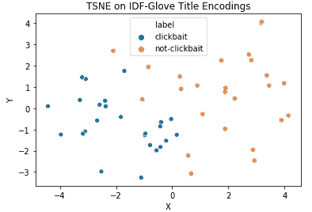

这一次，我们在 2D 投影中看到了两个类别之间的一些分离。在某种程度上，这解释了我们用简单的 Log Reg 实现的高精度。

为了进一步提高性能，我们可以添加一些手工制作的功能。让我们在下一节中尝试一下。

# 7.特征工程

创建新功能可能很棘手。在这方面领先的最好方法是深入该领域，寻找研究论文、博客、文章等。相关领域中的 Kaggle 内核也是查找有趣特性信息的好方法。

对于 clickbait 检测，我们用于数据集的论文(Chakraborthy 等人)提到了他们使用的一些特征。我还找到了 [Potthast 等人](https://webis.de/downloads/publications/papers/stein_2016b.pdf) (2016) [3]，他们在其中记录了超过 200 个特性。

我们可以实现一些简单的方法以及上一节中的手套嵌入，并检查是否有任何性能改进。以下是这些功能的简要总结:

1.  **以数字**开头:一个布尔特性，检查标题是否以数字开头。例如:“11 种不可思议的 XYZ 方式”
2.  **Clickbait 短语** : Downworthy 是一个搞笑的 chrome 扩展，它用“更真实的标题”取代了 Clickbait 标题。Github repo 列出了流行的 clickbait 短语，如“你需要知道的一切”、“这就是发生的事情”等。我们可以使用这个列表来检查我们的数据集中的标题是否包含任何这些短语。Chakraborthy 等人还提供了一系列进一步的短语。
3.  Clickbait 正则表达式 : Downworthy 也有一些正则表达式，我们可以将它们与标题进行匹配。
4.  **数字**点点**点**
5.  **可读性分数**:计算 Flesch-Kincaid 等级和 Dale-Chall 可读性分数。这些分数提供了阅读标题的难易程度。textstat python 包提供了实现这些的简单方法。一般来说，我们认为新闻标题更难阅读。
6.  **简单文本特征:**最长单词的长度，以字符为单位的平均单词长度，以字符为单位的标题长度。
7.  **标点符号的数量**
8.  **字比**:这里我们计算 6 种不同的比:(一)。简单词汇(根据戴尔·查尔简单词汇列表的定义)(ii)停止词(iii)缩写词(例如:不是、不应该等)(iv)夸张词汇(根据 Chakraborthy 等人的定义，例如:惊人的、不可思议的等)(v)点击诱饵主题(Chakraborthy 等人定义了一些在点击诱饵标题中更常见的名词/主题，如“家伙”、“狗”等)(vi)非点击诱饵主题(与上述非点击诱饵标题相同，例如:印度、伊朗、政府等)
9.  **标签数量**
10.  **情感评分**:我们可以使用 NLTK 的 Vader 情感分析仪，得到每个标题的负面、中性、正面和复合评分。
11.  **嵌入**:tfi df/手套/加重手套

实现这些之后，我们可以选择使用 sklearn 的`PolynomialFeatures()`用多项式(如 X)或交互特征(如 XY)来扩展特征空间

*注:特征缩放技术的选择对分类器的性能影响很大，我尝试了*`RobustScaler`*`StandardScaler`*`Normalizer`*`MinMaxScaler`*，发现* `MinMaxScaler` *效果最好。****

```
**from featurization import *train_features, test_features, feature_names = featurize(train, test, 'tfidf_glove')run_log_reg(train_features, test_features, y_train, y_test, alpha = 5e-2)**Output:** F1: 0.964 | Pr: 0.956 | Re: 0.972 | AUC: 0.993 | Accuracy: 0.964**
```

**不错！在简单的逻辑回归分析中，我们的 F1 值从 0.957 上升到 0.964。当我们尝试不同的模型并稍后进行超参数调整时，我们可能能够挤出更多的性能改进。**

**现在，让我们简短地探讨一下模型的可解释性，以检查我们的模型是如何做出这些预测的。我们将使用 SHAP 和 ELI5 库来理解这些特性的重要性。**

****特征权重****

**先说特征重要性。这对于 ELI5 库来说非常简单。**

```
**from sklearn.linear_model import SGDClassifier
import eli5# Train a Log Reg Classifier
log_reg = SGDClassifier(loss = 'log', n_jobs = -1, alpha = 5e-2)
log_reg.fit(train_features, y_train)#Pass the model instance along with the feature names to ELI5
eli5.show_weights(log_reg, feature_names = feature_names, top = 100)**
```

**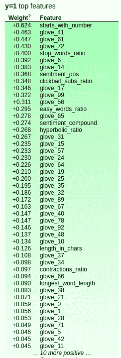****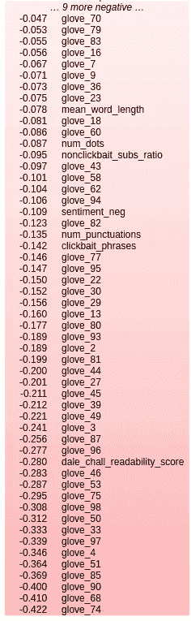**

**Feature Weights**

**除了手套的尺寸，我们可以看到许多手工制作的特点有很大的重量。特征越环保，将样本归类为“点击诱饵”就越重要。**

**例如，`starts_with_number`特征对于分类一个标题是 clickbait 是非常重要的。这很有意义，因为在数据集中，像“你应该去 XYZ 的 12 个理由”这样的标题经常是点击诱饵。**

**我们来看看`dale_chall_readability_score`这个特征，它的权重是-0.280。如果 Dale Chall 可读性分数很高，说明标题很难读。在这里，我们的模型已经知道，如果一个标题更难阅读，它可能是一个新闻标题，而不是点击诱饵。相当酷！**

**此外，还有一些功能的权重非常接近于 0。移除这些特性可能有助于减少过度拟合，我们将在特性选择部分对此进行探讨。**

****SHAP 力剧情****

**现在让我们来看看 SHAP 力图**

```
**import shaplog_reg = SGDClassifier(loss = 'log', n_jobs = -1, alpha = 5e-2)
log_reg.fit(train_features, y_train)explainer = shap.LinearExplainer(log_reg, train_features, feature_dependence = 'independent')
shap_values = explainer.shap_values(test_features)shap.initjs()
ind = 0
shap.force_plot(explainer.expected_value, shap_values[ind,:], test_features.toarray()[ind,:],
               feature_names = feature_names)**
```

****

**SHAP Force Plot**

**一个原力剧情就像是一场角色间的‘拔河’游戏。每个特征将模型的输出推到基值的左侧或右侧。基础值是模型在整个测试数据集上的平均输出。请记住，这不是一个概率值。**

**粉红色的特征有助于模型检测正面类别，即“点击诱饵”标题，而蓝色的特征检测负面类别。每个特征的宽度与其在预测中的权重成正比。**

**在上面的例子中，`starts_with_number`特征是 1，并且非常重要，因此将模型的输出推到右边。另一方面，`clickbait_subs_ratio`和`easy_words_ratio`(这些特性中的高值通常表示 clickbait，但在这种情况下，值较低)都将模型推向左侧。**

**我们可以验证，在这个特定的例子中，模型最终预测“点击诱饵”**

```
**print('Title: {}'.format(test.title.values[0]))
print('Label: {}'.format(test.label.values[0]))
print('Prediction: {}'.format(log_reg.predict(test_features.tocsr()[0,:])[0]))**Output:
Title**: 15 Highly Important Questions About Adulthood, Answered By Michael Ian Black
**Label**: clickbait
**Prediction**: 1**
```

**正如所料，模型正确地将标题标记为 clickbait。**

**让我们看另一个例子:**

**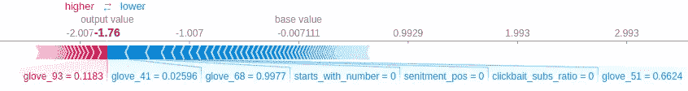**

**SHAP Force Plot for Non-Clickbait Titles**

```
**print('Title: {}'.format(test.title.values[400]))
print('Label: {}'.format(test.label.values[400]))
print('Prediction: {}'.format(log_reg.predict(test_features.tocsr()[400,:])[0]))**Output:
Title**: Europe to Buy 30,000 Tons of Surplus Butter
**Label**: not-clickbait
**Prediction**: 0**
```

**在这种情况下，模型被推到左边，因为像`sentiment_pos` (clickbait 标题通常具有正面情绪)这样的特征具有较低的值。**

**力图是一种很好的方式来观察模型是如何逐个样本地进行预测的。在下一节中，我们将尝试不同的模型，包括集成和超参数调整。**

# **8.探索模型和超参数调整**

**在本节中，我们将使用我们在上一节中创建的功能，以及 IDF 加权嵌入，并在不同的模型上进行尝试。**

**如前所述，在处理小数据集时，像逻辑回归、支持向量机和朴素贝叶斯这样的低复杂度模型将会概括得最好。我们将这些模型与非参数模型(如 KNN)和非线性模型(如 Random Forest、XGBoost 等)一起尝试。**

**我们还将尝试使用性能最佳的分类器和模型堆叠进行引导聚合或打包。我们开始吧！**

**对于我们的情况，超参数调整`GridSearchCV`是一个很好的选择，因为我们有一个小的数据集(允许它快速运行),这是一个穷举搜索。我们需要做一些修改，以使它(a)使用我们预定义的测试集，而不是交叉验证(b)使用我们的 F1 评估指标，该指标使用 PR 曲线来选择阈值。**

**GridSearchCV with PrefededfinedSplit**

****逻辑回归****

```
**from sklearn.linear_model import SGDClassifierlr = SGDClassifier(loss = 'log')
lr_params = {'alpha' : [10**(-x) for x in range(7)],
             'penalty' : ['l1', 'l2', 'elasticnet'],
             'l1_ratio' : [0.15, 0.25, 0.5, 0.75]}best_params, best_f1 = run_grid_search(lr, lr_params, X, y)print('Best Parameters : {}'.format(best_params))lr = SGDClassifier(loss = 'log', 
                   alpha = best_params['alpha'], 
                   penalty = best_params['penalty'], 
                   l1_ratio = best_params['l1_ratio'])
lr.fit(train_features, y_train)
y_test_prob = lr.predict_proba(test_features)[:,1]
print_model_metrics(y_test, y_test_prob)**Output:** Best Parameters : {'alpha': 0.1, 'l1_ratio': 0.15, 'penalty': 'elasticnet'}
F1: 0.967 | Pr: 0.955 | Re: 0.979 | AUC: 0.994 | Accuracy: 0.967**
```

**请注意，调整后的参数同时使用了高 alpha 值(表示大量的正则化)和 elasticnet。这些参数选择是因为小数据集容易过拟合。**

**我们可以对 SVM、朴素贝叶斯、KNN、随机森林和 XGBoost 进行同样的调整。下表总结了这些测试的结果(您可以参考 GitHub repo 获得完整的代码)**

**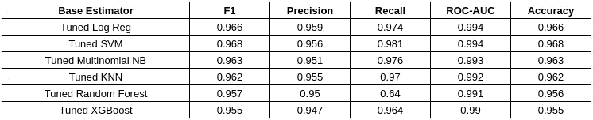**

**Summary of Hyperparameter Tuning**

****简单的 MLP****

**在 fast.ai 课程中，杰瑞米·霍华德提到深度学习已经在许多情况下相当成功地应用于表格数据。让我们看看它在我们的用例中表现如何:**

**2-Layer MLP in Keras**

**y_pred_prob = simple _ nn . predict(test _ features . to dense())
print _ model _ metrics(y _ test，y _ pred _ prob)**

```
****Output**:
F1: 0.961 | Pr: 0.952 | Re: 0.970 | AUC: 0.992 | Accuracy: 0.960**
```

**鉴于数据集较小，两层 MLP 模型的效果令人惊讶。**

****装袋分级机****

**既然 SVM 做得如此之好，我们可以通过使用 SVM 作为基本估计量来尝试一个 bagging 分类器。这将改善基础模型的方差并减少过度拟合。**

```
**from sklearn.ensemble import BaggingClassifier
from sklearn.svm import SVC
from sklearn.model_selection import RandomizedSearchCVsvm = SVC(C = 10, kernel = 'poly', degree = 2, probability = True, verbose = 0)svm_bag = BaggingClassifier(svm, n_estimators = 200, max_features = 0.9, max_samples = 1.0, bootstrap_features = False, bootstrap = True, n_jobs = 1, verbose = 0)svm_bag.fit(train_features, y_train)
y_test_prob = svm_bag.predict_proba(test_features)[:,1]
print_model_metrics(y_test, y_test_prob)**Output:** F1: 0.969 | Pr: 0.959 | Re: 0.980 | AUC: 0.995 | Accuracy: 0.969**
```

**性能提升几乎微不足道。**

**最后，我们可以尝试的最后一件事是堆叠分类器(也称为投票分类器)**

****堆积分级机****

**这是不同模型预测的加权平均值。因为我们也使用 Keras 模型，所以我们不能使用 Sklearn 的`VotingClassifier`,相反，我们将运行一个简单的循环，获得每个模型的预测，并运行一个加权平均。我们将为每个模型使用调整后的超参数。**

**Simple Stacking Classifier**

```
****Output:** Training LR
Training SVM
Training NB
Training KNN
Training RF
Training XGB
F1: 0.969 | Pr: 0.968 | Re: 0.971 | AUC: 0.995 | Accuracy: 0.969**
```

**现在，我们需要一种方法来为每个模型选择最佳权重。最好的选择是使用像 Hyperopt 这样的优化库，它可以搜索最大化 F1 分数的最佳权重组合。**

**Running Hyperopt for the stacking classifier**

**Hyperopt 找到一组给出 F1 ~ 0.971 的权重。让我们检查优化的砝码:**

```
**{'KNN': 0.7866810233035141,
 'LR': 0.8036572275670447,
 'NB': 0.9102009774357307,
 'RF': 0.1559824350958057,
 'SVM': 0.9355079606348642,
 'XGB': 0.33469066125332436,
 'simple_nn': 0.000545264707939086}**
```

**像逻辑回归、朴素贝叶斯和 SVM 这样的低复杂度模型具有高权重，而像随机森林、XGBoost 和 2 层 MLP 这样的非线性模型具有低得多的权重。这符合我们的预期，即低复杂性和简单模型将最好地概括较小的数据集。**

**最后，使用优化的权重运行堆叠分类器得到:**

```
**F1: 0.971 | Pr: 0.962 | Re: 0.980 | AUC: 0.995 | Accuracy: 0.971**
```

**在下一节中，我们将解决小数据集的另一个问题——高维特征空间。**

# **9.降维**

**正如我们在简介中所讨论的，随着我们增加小数据集的维度，特征空间变得稀疏，导致分类器很容易过拟合。**

**解决方法就是降低维度。实现这一点的两种主要方法是特征选择和分解。**

## **特征选择**

**这些技术根据特征在预测中的相关性来选择特征。**

**`**SelectKBest**`**

**我们从`SelectKBest`开始，顾名思义，它只是根据所选的统计数据(默认为 ANOVA F-Scores)选择 k-best 特征**

```
**from sklearn.feature_selection import SelectKBestselector = SelectKBest(k = 80)
train_features_selected = selector.fit_transform(train_features, y_train)
test_features_selected = selector.transform(test_features)
run_log_reg(train_features_selected, test_features_selected, y_train, y_test)**Output:** F1: 0.958 | Pr: 0.946 | Re: 0.971 | AUC: 0.989 | Accuracy: 0.957**
```

**SelectKBest 的一个小问题是，我们需要手动指定想要保留的特性的数量。一种简单的方法是运行一个循环来检查每个 k 值的 F1 分数。下面是要素数量与 F1 分数的关系图:**

**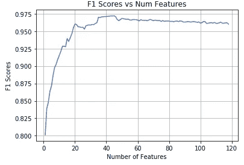**

**F1 Scores for different values of K**

**大约 45 个特征给出了最佳 F1 值。让我们用 K = 45 重新运行 SelectKBest:**

```
**selector = SelectKBest(k = 45)
train_features_selected = selector.fit_transform(train_features, y_train)
test_features_selected = selector.transform(test_features)
run_log_reg(train_features_selected, test_features_selected, y_train, y_test, alpha = 1e-2)**Output:** F1: 0.972 | Pr: 0.967 | Re: 0.978 | AUC: 0.995 | Accuracy: 0.972**
```

**另一个选择是使用 SelectPercentile，它使用我们想要保留的特性的百分比。**

**`**SelectPercentile**`**

**按照与上面相同的步骤，我们得到最佳 F1 分数的百分位数= 37。现在使用 SelectPercentile:**

```
**selector = SelectPercentile(percentile = 37)
train_features_selected = selector.fit_transform(train_features, y_train)
test_features_selected = selector.transform(test_features)
run_log_reg(train_features_selected, test_features_selected, y_train, y_test, alpha = 1e-2)**Output:** F1: 0.972 | Pr: 0.966 | Re: 0.979 | AUC: 0.995 | Accuracy: 0.972**
```

**简单的特征选择将 F1 分数从 0.966(先前调整的 Log Reg 模型)增加到 0.972。如前所述，这是因为低维特征空间减少了模型过拟合的机会。**

**对于这两种技术，我们也可以使用`selector.get_support()`来检索所选特征的名称。**

```
**np.array(feature_names)[selector.get_support()]**Output:** array(['starts_with_number', 'easy_words_ratio', 'stop_words_ratio',
       'clickbait_subs_ratio', 'dale_chall_readability_score', 'glove_3',
       'glove_4', 'glove_6', 'glove_10', 'glove_14', 'glove_15',
       'glove_17', 'glove_19', 'glove_24', 'glove_27', 'glove_31',
       'glove_32', 'glove_33', 'glove_35', 'glove_39', 'glove_41',
       'glove_44', 'glove_45', 'glove_46', 'glove_49', 'glove_50',
       'glove_51', 'glove_56', 'glove_57', 'glove_61', 'glove_65',
       'glove_68', 'glove_72', 'glove_74', 'glove_75', 'glove_77',
       'glove_80', 'glove_85', 'glove_87', 'glove_90', 'glove_92',
       'glove_96', 'glove_97', 'glove_98', 'glove_99'], dtype='<U28')**
```

**`**RFECV (Recursive Features Elimination)**`**

**RFE 是一种后向特征选择技术，它使用估计器来计算每个阶段的特征重要性。名称中的单词 recursive 意味着该技术递归地删除了对分类不重要的特征。**

**我们将使用 CV 变量，它在每个循环中使用交叉验证来确定在每个循环中要删除多少个特征。RFECV 需要一个具有`feature_importances_`属性的估计器，因此我们将使用具有 log loss 的 SGDClassifier。**

**我们还需要指定所需的交叉验证技术的类型。我们将使用在超参数优化中使用的相同的`PredefinedSplit`。**

```
**from sklearn.feature_selection import RFECVlog_reg = SGDClassifier(loss = ‘log’, alpha = 1e-3)selector = RFECV(log_reg, scoring = ‘f1’, n_jobs = -1, cv = ps, verbose = 1)
selector.fit(X, y)# Now lets select the best features and check the performance
train_features_selected = selector.transform(train_features)
test_features_selected = selector.transform(test_features)run_log_reg(train_features_selected, test_features_selected, y_train, y_test, alpha = 1e-1)**Output:** F1: 0.978 | Pr: 0.970 | Re: 0.986 | AUC: 0.997 | Accuracy: 0.978**
```

**让我们检查一下所选的功能:**

```
**print('Number of features selected:{}'.format(selector.n_features_))
np.array(feature_names)[selector.support_]**Output:** Number of features selected : 60
array(['starts_with_number', 'clickbait_phrases', 'num_dots',
       'mean_word_length', 'length_in_chars', 'easy_words_ratio',
       'stop_words_ratio', 'contractions_ratio', 'hyperbolic_ratio',
       'clickbait_subs_ratio', 'nonclickbait_subs_ratio',
       'num_punctuations', 'glove_1', 'glove_2', 'glove_4','glove_6'         
       'glove_10', 'glove_13', 'glove_14', 'glove_15', 'glove_16',
       'glove_17', 'glove_21', 'glove_25', 'glove_27', 'glove_32',
       'glove_33', 'glove_35', 'glove_39', 'glove_41', 'glove_43',
       'glove_45', 'glove_46', 'glove_47', 'glove_50', 'glove_51',
       'glove_52', 'glove_53', 'glove_54', 'glove_56', 'glove_57',
       'glove_58', 'glove_61', 'glove_65', 'glove_72', 'glove_74',
       'glove_77', 'glove_80', 'glove_84', 'glove_85', 'glove_86',
       'glove_87', 'glove_90', 'glove_93', 'glove_94', 'glove_95',
       'glove_96', 'glove_97', 'glove_98', 'glove_99'], dtype='<U28')**
```

**这一次，我们选择了一些额外的特性，使性能略有提高。由于传递了估计量和 CV 集，该算法有更好的方法来判断保留哪些特征。**

**这里的另一个优点是，我们不必提及要保留多少特性，`RFECV`会自动为我们找到。然而，我们可以提到我们希望拥有的特性的最小数量，默认情况下是 1。**

**`**SFS**` **(顺序向前选择)****

**最后，让我们试试`SFS`——它和`RFE`做同样的事情，但是依次添加特性。`SFS`从 0 个特征开始，以贪婪的方式在每个循环中逐个添加特征。一个小的区别是`SFS`只使用 CV 集上的特征集性能作为选择最佳特征的度量，不像`RFE`使用模型权重(`feature_importances_`)。**

```
**# Note: mlxtend provides the SFS Implementation
from mlxtend.feature_selection import SequentialFeatureSelectorlog_reg = SGDClassifier(loss = ‘log’, alpha = 1e-2)selector = SequentialFeatureSelector(log_reg, k_features = ‘best’, floating = True, cv = ps, scoring = ‘f1’, verbose = 1, n_jobs = -1) # k_features = ‘best’ returns the best subset of features
selector.fit(X.tocsr(), y)train_features_selected = selector.transform(train_features.tocsr())
test_features_selected = selector.transform(test_features.tocsr())run_log_reg(train_features_selected, test_features_selected, y_train, y_test, alpha = 1e-2)**Output:** F1: 0.978 | Pr: 0.976 | Re: 0.981 | AUC: 0.997 | Accuracy: 0.978**
```

**我们还可以检查选定的功能:**

```
**print('Features selected {}'.format(len(selector.k_feature_idx_)))
np.array(feature_names)[list(selector.k_feature_idx_)]**Output:** Features selected : 53array(['starts_with_number', 'clickbait_phrases','mean_word_length',
     'length_in_chars','stop_words_ratio','nonclickbait_subs_ratio',
       'flesch_kincaid_grade', 'dale_chall_readability_score',
       'num_punctuations', 'glove_0', 'glove_1', 'glove_2','glove_4' 
       'glove_8', 'glove_10', 'glove_13', 'glove_14', 'glove_15',
       'glove_16', 'glove_17', 'glove_18', 'glove_25', 'glove_30',
       'glove_32', 'glove_33', 'glove_38', 'glove_39', 'glove_40',
       'glove_41', 'glove_42', 'glove_45', 'glove_46', 'glove_47',
       'glove_48', 'glove_51', 'glove_56', 'glove_57', 'glove_61',
       'glove_65', 'glove_67', 'glove_69', 'glove_72', 'glove_73',
       'glove_76', 'glove_77', 'glove_80', 'glove_81', 'glove_84',
       'glove_85', 'glove_87', 'glove_93', 'glove_95', 'glove_96'],
      dtype='<U28')**
```

**向前和向后选择经常给出相同的结果。现在让我们来看看分解技术。**

## **分解**

**与挑选最佳特征的特征选择不同，分解技术分解特征矩阵以降低维数。由于这些技术改变了特征空间本身，一个缺点是我们失去了模型/特征的可解释性。我们不再知道分解的特征空间的每个维度代表什么。**

**让我们尝试在我们的特征矩阵上截断 VD。我们要做的第一件事是找出解释的方差是如何随着元件数量而变化的。**

```
**from sklearn.decomposition import TruncatedSVDsvd = TruncatedSVD(train_features.shape[1] - 1)
svd.fit(train_features)
plt.plot(np.cumsum(svd.explained_variance_ratio_))**
```

**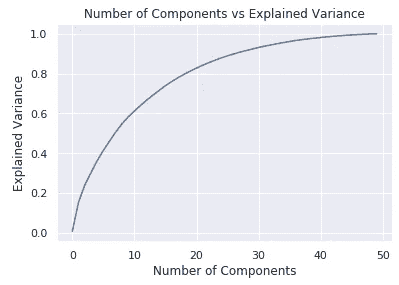**

**Plot to find out n_components for TruncatedSVD**

**看起来仅仅 50 个组件就足以解释训练集特征中 100%的差异。这意味着我们有许多从属特征(即一些特征只是其他特征的线性组合)。**

**这与我们在特征选择部分看到的一致——尽管我们有 119 个特征，但大多数技术选择了 40-70 个特征(剩余的特征可能不重要，因为它们只是其他特征的线性组合)。**

**现在我们可以将特征矩阵减少到 50 个组件。**

```
**svd = TruncatedSVD(50)
train_featurse_decomposed = svd.fit_transform(train_features)
test_featurse_decomposed = svd.transform(test_features)
run_log_reg(train_featurse_decomposed, test_featurse_decomposed, y_train, y_test, alpha = 1e-1)**Output:** F1: 0.965 | Pr: 0.955 | Re: 0.975 | AUC: 0.993 | Accuracy: 0.964**
```

**性能不如特征选择技术——为什么？**

**分解技术(如 TruncatedSVD)的主要工作是用较少的分量解释数据集中的方差。这样做时，它从不考虑每个特征在预测目标时的重要性(“点击诱饵”或“非点击诱饵”)。然而，在特征选择技术中，每次移除或添加特征时都使用特征重要性或模型权重。`RFE`和`SFS`特别选择功能以优化模型性能。(*您可能已经注意到，在特性选择技术中，我们在每个* `*fit()*` *调用中都传递了‘y’。)***

## **具有特征选择的堆叠分类器**

**最后，我们可以将上述任何技术与性能最佳的模型——堆叠分类器结合使用。我们必须将每个模型重新调整到缩减的特征矩阵，并再次运行 hyperopt 以找到堆叠分类器的最佳权重。**

**现在，在使用`RFECV`选定功能并重新调整后:**

```
**F1: 0.980 | Pr: 0.976 | Re: 0.984 | AUC: 0.997 | Accuracy: 0.980**
```

# **10.总结:**

**以下是我们迄今为止运行的所有模型和实验的总结:**

**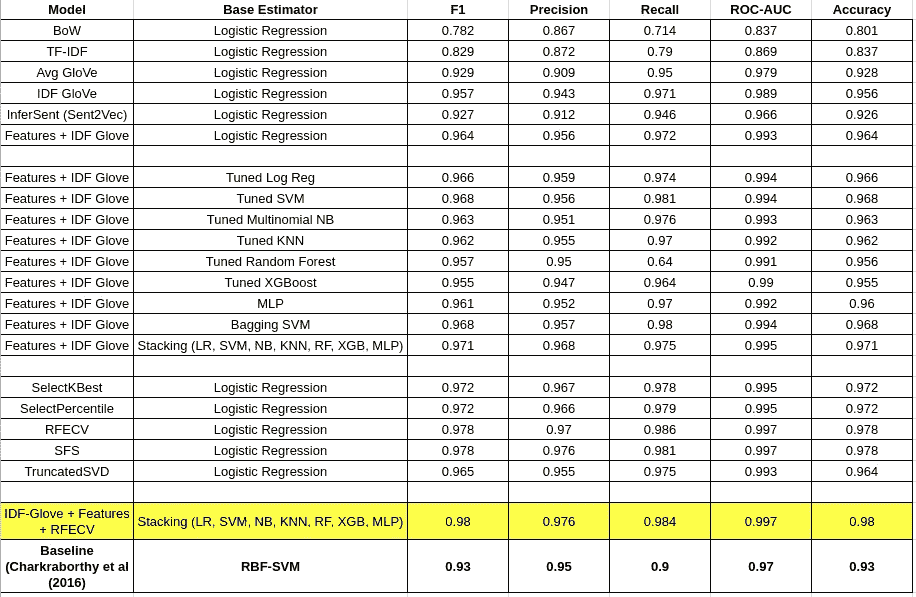**

**Summary of all experiments**

**让我们来看看堆叠分类器的混淆矩阵:**

**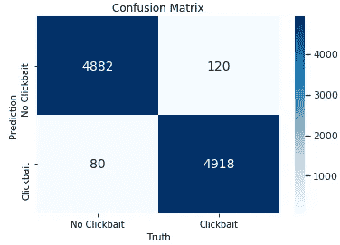**

**Stacking Classifier Confusion Matrix**

**以下是十大高可信度的错误分类书目:**

```
**Title : A Peaking Tiger Woods
Label : not-clickbait
Predicted Probability : 0.7458264596039637
----------
Title : Stress Tests Prove a Sobering Idea
Label : not-clickbait
Predicted Probability : 0.7542456646954389
----------
Title : Woods Returns as He Left: A Winner
Label : not-clickbait
Predicted Probability : 0.7566487248241188
----------
Title : In Baseball, Slow Starts May Not Have Happy Endings
Label : not-clickbait
Predicted Probability : 0.7624898001334597
----------
Title : Ainge Has Heart Attack After Celtics Say Garnett May Miss Playoffs
Label : not-clickbait
Predicted Probability : 0.7784241132465458
----------
Title : Private Jets Lose That Feel-Good Factor
Label : not-clickbait
Predicted Probability : 0.7811035856329488
----------
Title : A Little Rugby With Your Cross-Dressing?
Label : not-clickbait
Predicted Probability : 0.7856236669189782
----------
Title : Smartphone From Dell? Just Maybe
Label : not-clickbait
Predicted Probability : 0.7868008600434597
----------
Title : Cellphone Abilities That Go Untapped
Label : not-clickbait
Predicted Probability : 0.8057172770139488
----------
Title : Darwinism Must Die So That Evolution May Live
Label : not-clickbait
Predicted Probability : 0.8305944075171504
----------**
```

**所有高可信度的错误分类标题都是“非点击诱饵”,这反映在混淆矩阵中。**

**乍一看，这些标题似乎与常规的新闻标题大相径庭。以下是从测试集中随机选择的“非点击诱饵”标题的示例:**

```
**test[test.label.values == 'not-clickbait'].sample(10).title.values**Output:** array(['Insurgents Are Said to Capture Somali Town',
       'Abducted teen in Florida found',
       'As Iraq Stabilizes, China Eyes Its Oil Fields',
       'Paramilitary group calls for end to rioting in Northern Ireland',
       'Finding Your Way Through a Maze of Smartphones',
       'Thousands demand climate change action',
       'Paternity Makes Punch Line of Paraguay President',
       'Comcast and NFL Network Continue to Haggle',
       'Constant Fear and Mob Rule in South Africa Slum',
       'Sebastian Vettel wins 2010 Japanese Grand Prix'], dtype=object)**
```

**你怎么想呢?**

**我们可以尝试一些技术，如半监督伪标签，回译等，以尽量减少这些假阳性，但在博客长度的利益，我会留到另一个时间。**

**总之，通过了解过拟合在小型数据集中的工作方式以及特征选择、堆叠、调整等技术，我们能够在仅有 50 个样本的情况下将性能从 F1 = 0.801 提高到 F1 = 0.98。还不错！**

**如果你有任何问题，请随时与我联系。我希望你喜欢！**

****GitHub Repo:**[https://GitHub . com/anirudhshenoy/text-classification-small-datasets](https://github.com/anirudhshenoy/text-classification-small-datasets)**

## **参考资料:**

1.  **[https://www . BuzzFeed . com/Ben Smith/why-BuzzFeed-donts-do-click bait](https://www.buzzfeed.com/bensmith/why-buzzfeed-doesnt-do-clickbait)**
2.  **Abhijnan Chakraborty、Bhargavi Paranjape、Sourya Kakarla 和 Niloy Ganguly。“阻止点击诱饵:检测和防止在线新闻媒体中的点击诱饵”。2016 年美国旧金山 2016 年 8 月 IEEE/ACM 社交网络分析和挖掘进展国际会议(ASONAM)论文集。([https://github.com/bhargaviparanjape/clickbait](https://github.com/bhargaviparanjape/clickbait))**
3.  **米（meter 的缩写））Potthast，S . kpsel，B.Stein，M.Hagen，Clickbait Detection (2016)发表于 ECIR 2016 年[https://webis . de/downloads/publications/papers/Stein _ 2016 B . pdf](https://webis.de/downloads/publications/papers/stein_2016b.pdf)**
4.  **[https://www . kdnugges . com/2016/10/adversarial-validation-explained . html](https://www.kdnuggets.com/2016/10/adversarial-validation-explained.html)**
5.  **看淡:[https://github.com/snipe/downworthy](https://github.com/snipe/downworthy)**
6.  **dale Chall Easy word list:h[TTP://www . readability formulas . com/articles/dale-Chall-readability-word-list . PHP](http://www.readabilityformulas.com/articles/dale-chall-readability-word-list.php)**
7.  **terrier Stop word list:[https://github . com/terrier-org/terrier-desktop/blob/master/share/Stop word-list . txt](https://github.com/terrier-org/terrier-desktop/blob/master/share/stopword-list.txt)**
8.  **[https://www . vision dummy . com/2014/04/curse-dimensionality-affect-class ification/# The _ curse _ of _ dimensionality _ and _ over fitting](https://www.visiondummy.com/2014/04/curse-dimensionality-affect-classification/#The_curse_of_dimensionality_and_overfitting)**