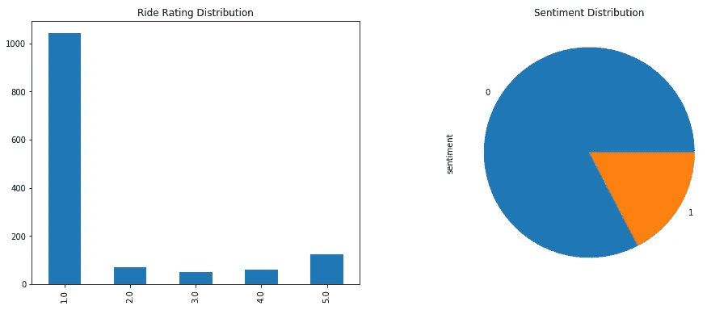
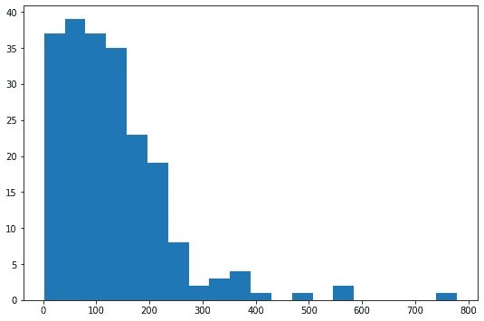
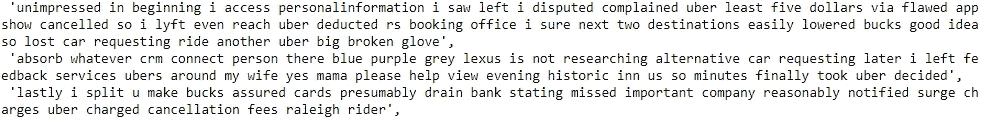
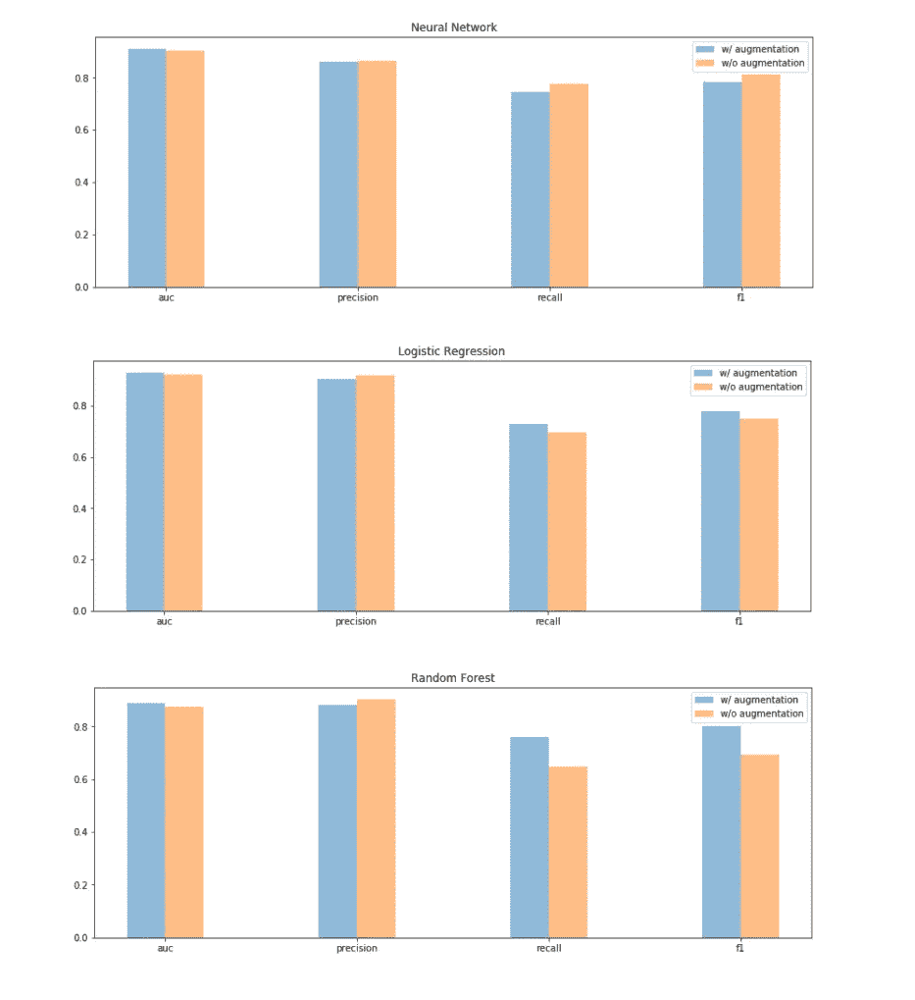
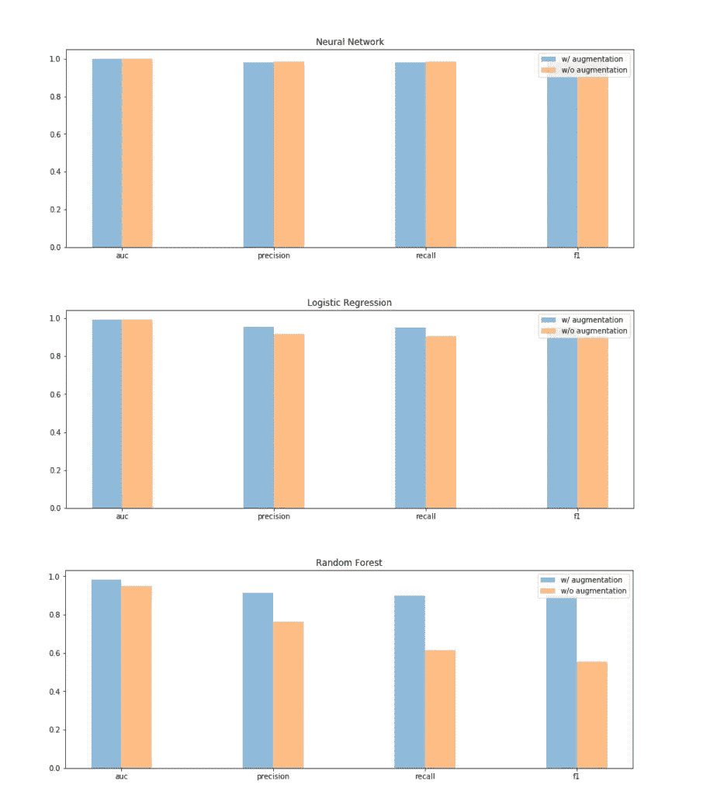

# 文本数据扩充使您的模型更强大

> 原文：<https://towardsdatascience.com/text-data-augmentation-makes-your-model-stronger-7232bd23704?source=collection_archive---------18----------------------->

## 使用马尔可夫链生成文本数据，以提高模型性能


Photo by [Julienne Erika Alviar](https://unsplash.com/@julsssy?utm_source=medium&utm_medium=referral) on [Unsplash](https://unsplash.com?utm_source=medium&utm_medium=referral)

文本分类算法对训练中存在的多样性极其敏感。一个健壮的 NLP 流水线必须考虑到低质量数据存在的可能性，并试图以最好的方式解决这个问题。

处理图像时，加强分类算法和引入多样性的标准方法是操作数据扩充。现在有很多漂亮和聪明的技术来操作自动图像增强。在自然语言处理任务中，文本数据扩充的方法并不常见，结果也不明确。

在这篇文章中，我将展示一个简单直观的技术来执行文本数据生成。使用马尔可夫链规则，我们将能够生成新的文本样本来填充我们的模型并测试其性能。

# 数据集

我从卡格尔那里得到了我们实验的数据。[优步骑行评论数据集](https://www.kaggle.com/purvank/uber-rider-reviews-dataset)是 2014-2017 年期间发布的骑行评论集，从网上搜集而来。在里面，我们可以找到原始的文字评论、用户给出的乘坐评级(1-5)和乘坐感受(如果评级高于 3:感受为 1，否则为 0)。如你所见，这是一个不平衡的分类问题，骑行评论的分布偏向于正面评价。



Label Distributions: the reviews with ‘3 stars Ride Rating’ are excluded from the analysis

首先，我们的目标是预测适合和尝试不同架构的评论的情绪。最有趣的一点发生在第二阶段，我们想给我们的模型施加压力；即我们让他们预测一些用马尔可夫链随机产生的虚假数据。我们想测试我们的模型是否足够稳定，以实现来自列车的足够的性能预测数据(在添加一些噪声之后)。如果一切正常，我们的模型应该不会有问题，在这个假数据上产生良好的结果，并有望提高测试性能，相反，我们需要重新审视训练过程。

# 文本数据扩充

在开始训练程序之前，我们必须生成我们的假数据。都开始研究火车上复习长度的分布。



Review Length Distribution

我们必须存储这些信息，因为我们的新评论将有类似的长度分布。生成过程由两个阶段组成。第一种，我们“构建链”，即，我们接收文本集合(在我们的情况下是训练语料库)作为输入，并自动为每个单词记录语料库中存在的每个可能的后续单词。在第二阶段，我们可以简单地基于之前的链创建新的评论…我们从起始语料库的整个词汇中随机选择一个词(我们评论的开始)，并随机选择下面的新词进入其链。在这个决定的最后，我们准备从新选择的单词重新开始这个过程。一般来说，我们在模拟一个马尔可夫链过程，在这个过程中，为了建立一个新的评论，一个词的选择仅仅基于前一个词。

我在一个独特的函数(*生成器*)中集合了这两个阶段。该函数接收文本评论作为输入，带有相关标签，以及要生成的新实例的期望前缀数量(针对每个类)。原始长度分布是有用的，因为我们可以从中抽取评论的合理长度。

```
def **build_chain**(texts):

    index = 1
    chain = {}

    for text in texts:

        text = text.split()
        for word in text[index:]:
            key = text[index-1]
            if key in chain:
                chain[key].append(word)
            else:
                chain[key] = [word]
            index += 1

        index = 1

    return chaindef **create_sentence**(chain, lenght):

    start = random.choice(list(chain.keys()))
    text = [start] while len(text) < lenght:
        try:
            after = random.choice(chain[start])
            start = after
            text.append(after)
        except: #end of the sentence
            #text.append('.')
            start = random.choice(list(chain.keys()))

    return ' '.join(text)def **Generator**(x_train, y_train, rep, concat=False, seed=33):

    np.random.seed(seed)

    new_corpus, new_labels = [], []

    for i,lab in enumerate(np.unique(y_train)): selected = x_train[y_train == lab]
        chain = build_chain(selected) sentences = []
        for i in range(rep):
            lenght = int(np.random.choice(lenghts, 1, p=freq))
            sentences.append(create_sentence(chain, lenght)) new_corpus.extend(sentences)
        new_labels.extend([lab]*rep)

    if concat:
        return list(x_train)+new_corpus, list(y_train)+new_labels

    return new_corpus, new_labels
```

我们需要带标签的文本作为输入，因为我们将生成过程分成不同的子过程:来自特定类的评论被选择来为同一类生成新的评论；因此，我们需要区分构建链和采样过程，以便为我们的预测模型生成真实的样本。



Example of randomly generated reviews. Don’t care about their literally meaning

# 模特们

我们在训练和测试中分割初始数据集。我们用火车作为语料库来支持我们的生成器，并创建新的评论。我们生成 200 个(每个类 100 个)评论以形成新的独立测试集，并生成 600 个(每个类 300 个)评论以加强我们的训练集。我们的模型库由一个层感知器神经网络、一个逻辑回归和一个随机森林组成。培训过程分为两个阶段。首先，我们用原始训练拟合所有模型，并分别在测试和伪测试数据上检查性能。我们期望所有的模型都优于假测试数据，因为它们是从训练中生成的。其次，我们用强化训练重复我们的模型的拟合，并在我们的测试集上检查性能。



Performace report on the true test set



Performace report on the fake test set

在第一阶段，测试数据的最佳模型是神经网络(AUC、precision、recall 和 f1 被报告为性能指标)，但令人惊讶的是，逻辑回归和随机森林在假测试中失败了！这表明我们的模型不太合适。我们再次尝试拟合模型，但这次我们使用强化训练集。在这一点上，所有模型在原始测试中的性能都有所提高，现在它们也开始在假数据上进行很好的推广。

# 摘要

在这篇文章中，我组装了一个简单的程序来生成假文本数据。当我们安装一个 NLP 分类器并想测试它的强度时，这种技术对我们很有用。如果我们的模型不能很好地分类来自训练的虚假数据，那么重新访问训练过程、调整超参数或直接在训练中添加这些数据是合适的。

[**查看我的 GITHUB 回购**](https://github.com/cerlymarco/MEDIUM_NoteBook)

保持联系: [Linkedin](https://www.linkedin.com/in/marco-cerliani-b0bba714b/)