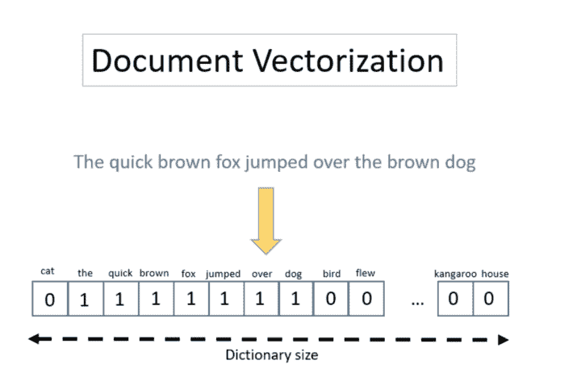
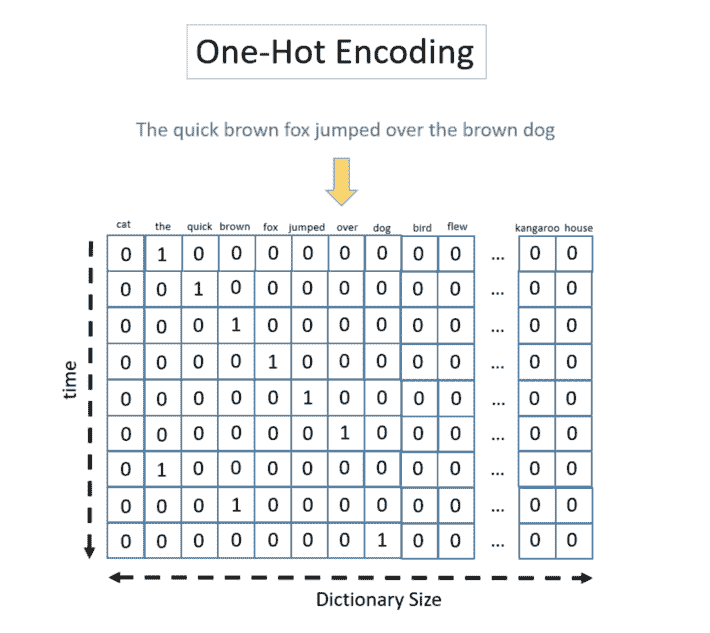
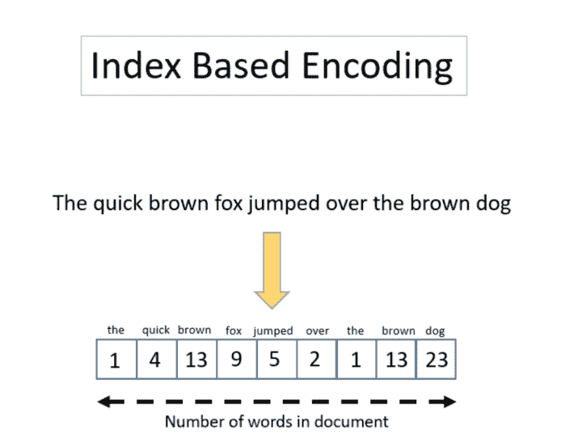
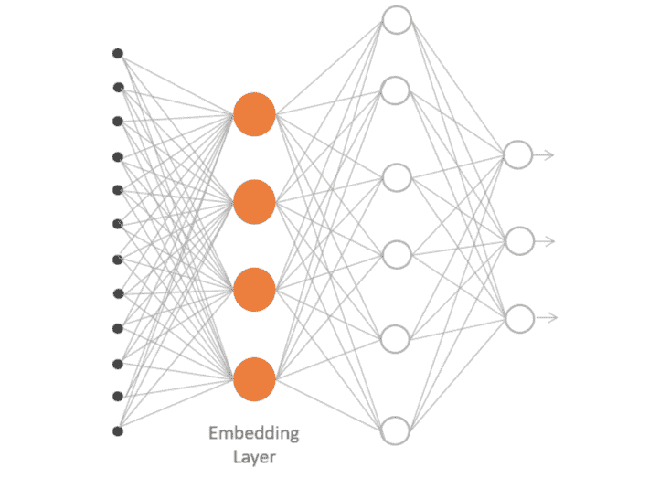

# 文本编码研究综述

> 原文：<https://towardsdatascience.com/text-encoding-a-review-7c929514cccf?source=collection_archive---------19----------------------->

*作者:* [*罗莎丽娅*](https://www.linkedin.com/in/rosaria/) *和* [*凯瑟琳·梅尔彻*](https://www.linkedin.com/in/kathrin-melcher-b44542155/)

执行任何文本挖掘操作(如主题检测或情感分析)的关键是将单词转换成数字，将单词序列转换成数字序列。一旦我们有了数字，我们就回到了众所周知的数据分析游戏中，机器学习算法可以帮助我们进行分类和聚类。

在这里，我们将重点放在将单词转换成数字和将文本转换成数字向量的分析部分:文本编码。

对于文本编码，有几种可用的技术，每一种都有自己的优缺点，并且每一种都最适合特定的任务。最简单的编码技术不保留词序，而其他编码技术可以。一些编码技术快速而直观，但是产生的文档向量的大小随着字典的大小而快速增长。其他编码技术优化了向量维度，但损失了可解释性。让我们来看看最常用的编码技术。

**1。一键或频繁文档矢量化(未订购)**

一种常用的文本编码技术是文档矢量化。这里，从文档集合中所有可用的单词构建一个字典，每个单词成为向量空间中的一列。每个文本都变成了 0 和 1 的向量。1 表示单词存在，0 表示单词不存在。文档的这种数字表示被称为一键文档矢量化。

这种一键矢量化的变体使用文档中每个单词的频率，而不仅仅是它的存在/不存在。这种变化被称为基于频率的矢量化。

虽然这种编码易于解释和生成，但它有两个主要缺点。它不保留文本中的词序，最终向量空间的维数随着词词典快速增长。

例如，在考虑否定或语法结构时，文本中单词的顺序很重要。另一方面，一些更原始的 NLP 技术和机器学习算法可能无论如何都不会利用词序。

此外，向量空间的快速增长可能只会成为大型字典的问题。并且即使在这种情况下，例如通过从文档文本中清除和/或提取关键词，也可以将字数限制到最大值。

**2。一键编码(有序)**

一些机器学习算法可以在序列中建立项目的内部表示，如句子中的有序单词。例如，递归神经网络(RNNs)和 LSTM 层可以利用序列顺序来获得更好的分类结果。

在这种情况下，我们需要从一键文档矢量化转移到一键编码，其中保留了单词顺序。这里，文档文本再次由单词存在/不存在的向量表示，但是单词被顺序地输入到模型中。

当使用独热编码技术时，每个文档由一个张量表示。每个文档张量由可能非常长的 0/1 向量序列组成，导致文档语料库的非常大且非常稀疏的表示。

**3。基于索引的编码**

另一种保留单词在句子中出现的顺序的编码是基于索引的编码。基于索引的编码背后的思想是将每个单词映射到一个索引，即一个数字。

第一步是创建一个将单词映射到索引的字典。基于这个字典，每个文档通过一系列索引(数字)来表示，每个数字编码一个单词。基于索引的编码的主要缺点是它在文本之间引入了一个实际上并不存在的数字距离。

注意，基于索引的编码允许不同长度的文档向量。事实上，索引序列的长度是可变的，而文档向量的长度是固定的。

**4。单词嵌入**

我们想探索的最后一种编码技术是单词嵌入。单词嵌入是一系列自然语言处理技术，旨在将语义映射到几何空间。1 这是通过将数字向量与字典中的每个单词相关联来实现的，因此任意两个向量之间的距离将捕获两个关联单词之间的部分语义关系。由这些向量形成的几何空间称为嵌入空间。最著名的单词嵌入技术是 Word2Vec 和 GloVe。

实际上，我们将每个单词投影到一个连续的向量空间，由一个专用的神经网络层产生。神经网络层学习关联每个单词的矢量表示，这有利于其整体任务，例如周围单词的预测。2

**辅助预处理技术**

许多机器学习算法需要固定长度的输入向量。通常，最大序列长度被定义为文档中允许的最大字数。较短的文档用零填充。较长的文档会被截断。零填充和截断是文本分析的两个有用的辅助准备步骤。

补零意味着根据需要添加尽可能多的零，以达到允许的最大字数。

截断是指在达到最大字数后切断所有单词。

**总结**

我们探讨了四种常用的文本编码技术:

*   文档矢量化
*   一键编码
*   基于索引的编码
*   单词嵌入

文档矢量化是唯一不保留输入文本中单词顺序的技术。但是，它很容易解释，也很容易生成。

一键编码是在保留序列中的单词顺序和保持结果的易解释性之间的折衷。要付出的代价是一个非常稀疏，非常大的输入张量。

基于索引的编码试图通过将每个单词映射到一个整数索引并将索引序列分组到一个集合类型列中来解决输入数据大小减小和序列顺序保持的问题。

最后，单词嵌入将基于索引的编码或一键编码投影到具有较小维度的新空间中的数值向量中。新空间由深度学习神经网络中嵌入层的数值输出来定义。这种方法的额外优点包括具有相似角色的单词的紧密映射。当然，缺点是复杂程度更高。

我们希望我们已经对当前可用的文本编码技术提供了足够全面和完整的描述，以便您选择最适合您的文本分析问题的技术。

**参考文献**

1 Chollet，Francois " [在 Keras 模型中使用预先训练的单词嵌入](https://blog.keras.io/using-pre-trained-word-embeddings-in-a-keras-model.html)"，Keras 博客，2016 年

2 Brownlee，Jason " [如何使用单词嵌入层与 Keras 进行深度学习](https://machinelearningmastery.com/use-word-embedding-layers-deep-learning-keras/)，《机器学习之谜》，2017

*首次发表于* [*数据科学中心。*](https://www.datasciencecentral.com/profiles/blogs/text-encoding-a-review)