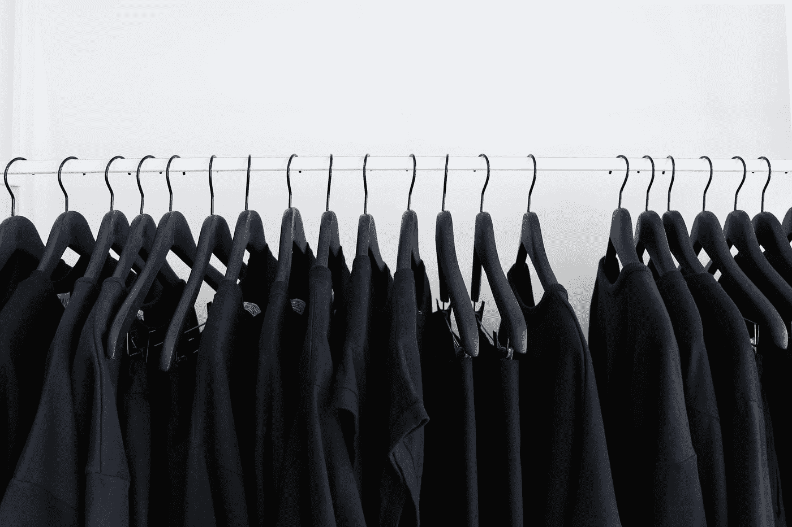

# 深度学习的文本匹配

> 原文：<https://towardsdatascience.com/text-matching-with-deep-learning-e6aa05333399?source=collection_archive---------6----------------------->

在我们的日常生活中，我们总是想知道它们是否是相似的东西。典型的例子之一是 Face ID。苹果推出了一个面部识别系统，用于解锁你的 iPhone X。你必须拍几张照片作为黄金图像。当你想解锁你的 iPhone，iPhone 计算当前照片是否匹配预定义的照片。

Photo by [Edward Ma](https://unsplash.com/@makcedward?utm_source=medium&utm_medium=referral) on [Unsplash](https://unsplash.com?utm_source=medium&utm_medium=referral)

在以前的博客中，我分享了使用[单词存在测量](/3-basic-distance-measurement-in-text-mining-5852becff1d7)和 [WMD](/word-distance-between-word-embeddings-cc3e9cf1d632) 来计算两个句子之间的差异。与以前的方法不同，我们应用神经网络来解决同样的问题。

看完这篇文章，你会明白:

*   计算句子相似度的原因
*   曼哈顿 LSTM
*   曼哈顿 LSTM 变体

# 计算句子相似度的原因

“black clothes hanged in rack” by [The Creative Exchange](https://unsplash.com/@creativeexchange?utm_source=medium&utm_medium=referral) on [Unsplash](https://unsplash.com?utm_source=medium&utm_medium=referral)

除了图像领域，我们能在自然语言处理领域应用相似性检查吗？作为 Stack Overflow 这样的论坛所有者，你不希望有很多重复的问题，因为这会损害用户体验。当从搜索引擎中搜索某个东西时，你会发现搜索结果包含一些相似的东西，但不仅仅是你输入的内容。

根据我的项目经验，我利用这种方法来比较客户名称。由于某些原因，输入是模糊的，模型必须为应用程序找到最相似的客户名称。

# 曼哈顿 LSTM

“New York street during daytime” by [Aaron Sebastian](https://unsplash.com/@jmkong?utm_source=medium&utm_medium=referral) on [Unsplash](https://unsplash.com?utm_source=medium&utm_medium=referral)

Muelle 等人在 2016 年提出了用于学习句子相似性的曼哈顿 LSTM 架构。曼哈顿 LSTM 的总体目标是比较两个句子，以确定它们是否相同。这种神经网络结构包括两个相同的神经网络。两个输入通过相同的神经网络(共享权重)。

首先，将两个句子转换为向量表示(即嵌入)，然后将其传递给神经网络。两个向量表示将进入两个子神经网络(共享权重)。与其他语言模型 RNN 架构不同，它不预测下一个单词，而是计算两个句子之间的相似度。

在实验过程中，Muelle 等人使用:

*   矢量: [word2vec](/3-silver-bullets-of-word-embedding-in-nlp-10fa8f50cc5a)
*   词向量维数:300
*   损失函数:均方误差(MSE)
*   优化器:Adadelta
*   LSTM 单位数量:50

# 曼哈顿 LSTM 变体

这个概念是，你可以建立任何简单或复杂的神经网络，只要它接受两个输入。根据我的经验，你可以尝试任何更复杂的曼哈顿 LSTM 神经网络。我还包括了[额外的单词特性](/besides-word-embedding-why-you-need-to-know-character-embedding-6096a34a3b10)和其他 RNN 架构，如 GRU 或注意力机制。

# 拿走

*   准备**大量带标签的数据**很重要
*   **总计算时间可能很长**。对于我的情况，我必须在预测时比较所有客户名称(> 5M)。因此，我不得不使用其他方法来减少记录数量，使其能够满足在线预测的要求。

# 关于我

我是湾区的数据科学家。专注于数据科学、人工智能，尤其是 NLP 和平台相关领域的最新发展。你可以通过[媒体博客](http://medium.com/@makcedward/)、 [LinkedIn](https://www.linkedin.com/in/edwardma1026) 或 [Github](https://github.com/makcedward) 联系我。

# 参考

Keras 实施:[https://github.com/likejazz/Siamese-LSTM](https://github.com/likejazz/Siamese-LSTM)

Thyagarajan muelle j ...“用于学习句子相似性的暹罗循环结构”。2016.h[TTP://www . MIT . edu/~ jonasm/info/MuellerThyagarajan _ aaai 16 . pdf](http://www.mit.edu/~jonasm/info/MuellerThyagarajan_AAAI16.pdf)

放大图片作者:Koch G ...“用于一次性图像识别的连体神经网络”。2015.[http://www.cs.cmu.edu/~rsalakhu/papers/oneshot1.pdf](http://www.cs.cmu.edu/~rsalakhu/papers/oneshot1.pdf)