# 民主辩论中的文本挖掘

> 原文：<https://towardsdatascience.com/text-mining-with-the-democratic-debates-48e3343bb489?source=collection_archive---------36----------------------->

# 用 R 分析文本的简短介绍

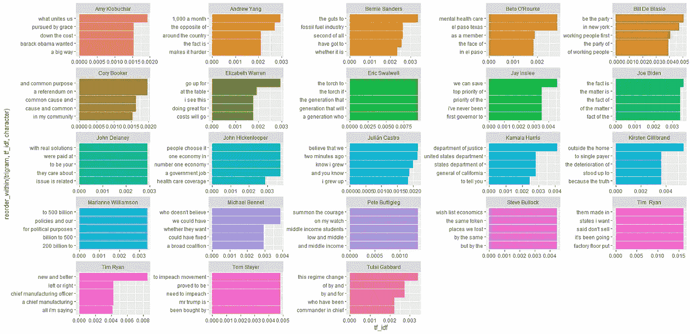

到目前为止，已经有 6 场正式的民主辩论，未来还会有更多。辩论时间很长，坦率地说非常无聊。辩论的目的是向美国介绍候选人，了解他们的政策立场。然而，美国人的注意力持续时间很短，只有 3 个小时，所以花在看电视上的时间很多。总的来说，一个人会花 **18 个小时**观看辩论。这根本不现实，必须有更好的方法来客观地总结辩论。

## 文本挖掘简介

文本挖掘是从文本中提取信息的实践。诸如 n-grams、单词包和主题建模等技术是文本挖掘中的一些基本技术。我相信文本挖掘将是一个比机器学习更重要的领域，因为社交媒体与商业的整合越来越多。我们生活在一个收集和存储数据极其容易和廉价的时代。企业现在正在探索处理和理解数据的方法，这导致了机器学习、深度学习和人工智能。然而，非结构化数据正在增长，尤其是文本数据。消费者评论、推文和电子邮件是企业希望利用的非结构化数据的例子。所有这些听起来极其复杂；非结构化数据的机器学习？理解语言的神经网络？怎么可能呢？信不信由你，从文本中提取真知灼见可以像计算字数一样简单。文本挖掘最难的部分是收集数据。

幸运的是，每次辩论后，新闻机构都会发布辩论记录。我下载了文字记录，并把它整理成一个简单的 csv 文件，可以在这里找到[。](https://drive.google.com/file/d/12Blq4wIIoa8yDZGmRAH09fvEvWOZtEzG/view?usp=sharing)R 和 Python 都有很多文本挖掘包。我将使用 TidyText，它有一本[很棒的教科书](https://www.tidytextmining.com/index.html)来学习文本的基础知识，这篇文章基本上是技术的总结。

## N-grams 和单词袋

N-grams 和词袋是大多数文本挖掘技术的基础。他们背后的想法是计算每个单词。鉴于句子“我喜欢狗。”单词袋特征将如下所示。

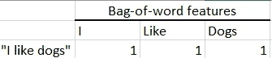

现在让我们看看有了单词袋功能的两个句子会是什么样子。

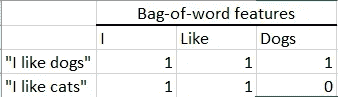

请注意，对于“我喜欢猫”，狗的功能计数为 0。单词袋功能有助于将文本数据映射成传统的数字格式。

N-grams 就像是单词袋，只不过多了一个步骤。N-grams 不是像单词袋那样计算一个单词，而是指定有多少个单词。n 是字数。所以，2-grams 或" bigrams "是两个词。让我们用前面的句子来看看一个二元模型的特征是什么样的。

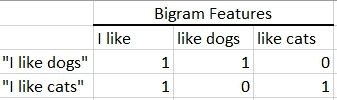

看表的时候和单词袋表看起来没什么区别。然而， **bigrams 添加了更多的上下文，**我们可以看到狗和猫像一样与**一词配对。这意味着我们可以看到，这两个句子对这两种动物都是积极的。你甚至可以进一步使用 n 元语法，如三元语法、四元语法、五元语法等。N-grams 添加上下文，但是，可以开始变得非常具体。这可能是件好事，也可能是件坏事。**

## R 中的 N-grams 和词袋特征工程

可以使用正则表达式函数生成 N-gram 和单词包，但是正则表达式看起来很乱，而且有一些包可以完成大部分的跑腿工作。Tidytext 包含一个名为**的函数 unnest_tokens。**记号在文本挖掘中被提到很多。标记是文本挖掘的输入，因此单词包和 n 元语法都将被视为标记。

首先，我们将加载包并进行一些格式化。数据集中有三列；辩论、性格和文本。我从记录中过滤掉了版主和其他不知名的人，这样数据只包含总统候选人。

```
library(tidyverse)
library(tidytext)df <- read.csv("DemDebates.csv", colClasses = c("factor","factor","character"))df <- df %>% 
  filter(!character %in% c("(Unknown)", "Announcer","Bash","Bridgewater","Burnett","Cooper","Davis","Diaz-Balart","Guthrie","Holt","Jose Diaz-Balart","Lacey","Lemon","Lester Holt", "Maddow","Muir","Protesters","Protestor","Ramos","Savannah Guthrie","Stephanopoulos","Tapper","Todd","Unknown"))
```

现在我们将使用 **unnest_tokens** 函数提取单词包。第一个输入命名令牌，第二个输入是包含文本的列，第三个输入指定令牌的类型，最后一个输入是 n 元语法的 n。因此，对于单词包，我们将指定 n = 1。

```
df %>% unnest_tokens(word, "text", token = "ngrams", n =1)
```

现在我们有了单词，我们需要计算它们。这是一个简单的计数函数，我们将按字符计数。我还将筛选出每个候选人的前 5 个单词，并按候选人和词频排序。所有这些都将在一个命令中完成，但是，您可以将单词包分配给一个变量。

```
df %>% 
  unnest_tokens(word, "text", token = "ngrams", n =1) %>% 
  count(character, word) %>% 
  group_by(character) %>% 
  top_n(n, n = 5) %>% 
  arrange(character, -n)
```

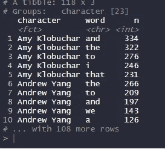

如你所见，每个候选人的前 5 个单词并不十分有用。列表中充满了几乎没有意义的单词。这些词被称为**停用词**，通常会被过滤掉。tidytext 包包含一个频繁停用词的列表，我们可以用它来过滤单词包列表。这将通过来自 **dplyr** 的 **anti_join** 来完成，尽管您也可以使用**过滤器**功能。Tidytext 将它的许多功能与 tidyverse 集成在一起，使它非常直观。

```
df %>% 
  unnest_tokens(word, "text", token = "ngrams", n =1) %>% 
  anti_join(stop_words) %>% 
  count(character, word) %>% 
  group_by(character) %>% 
  top_n(n, n = 5) %>% 
  arrange(character, -n)
```

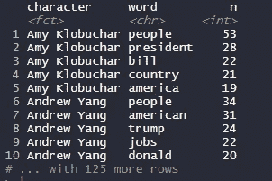

现在一些有趣的事情正在发生。这些词看起来有些相关，可以给每个候选人一些见解。让我们和候选人一起画单词。我们将使用 **ggplot** 并制作一个简单的条形图，显示每个候选人的前 5 个单词及其频率。我还将使用 **facet_wrap** ，为一列中的每个值创建一个单独的图。这将为每个候选人创建单独的图表。绘制单词或分类变量的一个常见问题是排列它们，但是 tidytext 提供了帮助这个过程的函数。 **reorder_within** 排列单词，并在使用 **facet_wrap 时帮助保持排序。**此外**scale _ x _ recordered**需要与它一起使用来格式化 x 轴。

```
df %>% 
  unnest_tokens(word, "text", token = "ngrams", n =1) %>% 
  anti_join(stop_words) %>% 
  count(character, word) %>% 
  group_by(character) %>% 
  top_n(n, n = 5) %>% 
  arrange(character, -n) %>% 
  ggplot(aes(x = reorder_within(word, n, character),#Reorders word by freq
             y  = n,
             fill = character)) + 
  geom_col() + 
  scale_x_reordered() + #Reorders the words 
  facet_wrap(~character, scales ="free") + #Creates individual graphs
  coord_flip() + 
  theme(legend.position = "None")
```

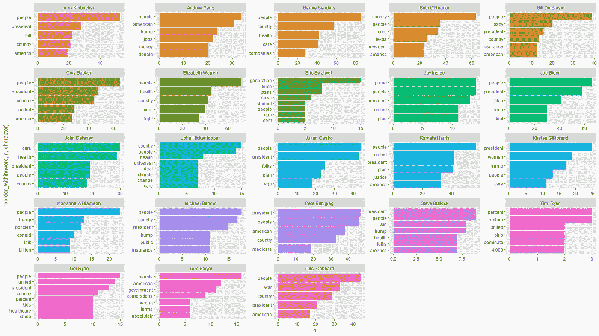

这个图表非常好，揭示了当前候选人的很多情况。民主党人在谈论人民、总统、特朗普、美国、政府、医疗保健、气候等。所有这些都是有道理的，但是，所有的候选人都使用相同的单词，并且没有解释每个候选人的细节。让我们看看每个候选人的二元模型。

虽然您应该将令牌重命名为 bigram，但是我们可以将 n = 1 改为 n = 2。看到用 tidytext 看 n 元图有多简单了吧？

```
df %>% 
  unnest_tokens(word, "text", token = "ngrams", n =2) %>% 
  anti_join(stop_words) %>% 
  count(character, word) %>% 
  group_by(character) %>% 
  top_n(n, n = 5) %>% 
  arrange(character, -n) %>% 
  ggplot(aes(x = reorder_within(word, n, character),#Reorders the words by freq
             y  = n,
             fill = character)) + 
  geom_col() + 
  scale_x_reordered() + #Reorders the words 
  facet_wrap(~character, scales ="free") + #Creates individual graphs
  coord_flip() + 
  theme(legend.position = "None")
```

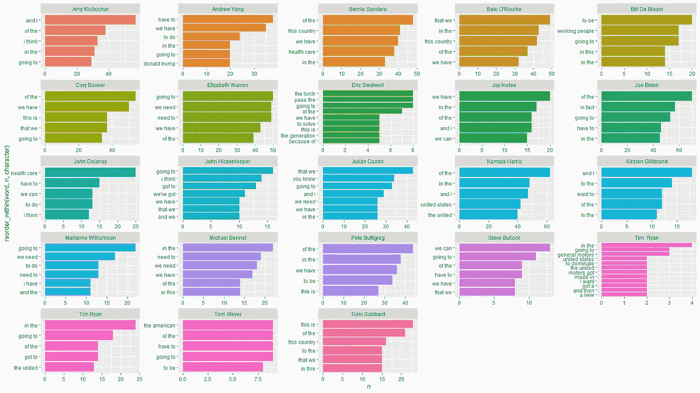

好吧，也许没那么简单。anti_join 命令正在寻找单字或单词，而不是双字。我们可以通过使用**分离**和**联合**功能进行过滤。我们只是创建两列，包含二元模型的单词 1 和单词 2，如果其中一个单词包含停用词，就过滤掉二元模型。

```
df %>% 
  unnest_tokens(word, "text", token = "ngrams", n =2) %>% 
  separate(word, c("word1","word2"), sep = " ") %>% 
  filter(!word1 %in% stop_words$word | !word2 %in% stop_words$word) %>% 
  unite("bigram", c(word1, word2), sep = " ") %>% 
  count(character,bigram) %>% 
  group_by(character) %>% 
  top_n(n, n = 5) %>% 
  arrange(character, -n) %>% 
  ggplot(aes(x = reorder_within(bigram, n, character),#Reorders the words by freq
             y  = n,
             fill = character)) + 
  geom_col() + 
  scale_x_reordered() + #Reorders the words 
  facet_wrap(~character, scales ="free") + #Creates individual graphs
  coord_flip() + 
  theme(legend.position = "None")
```

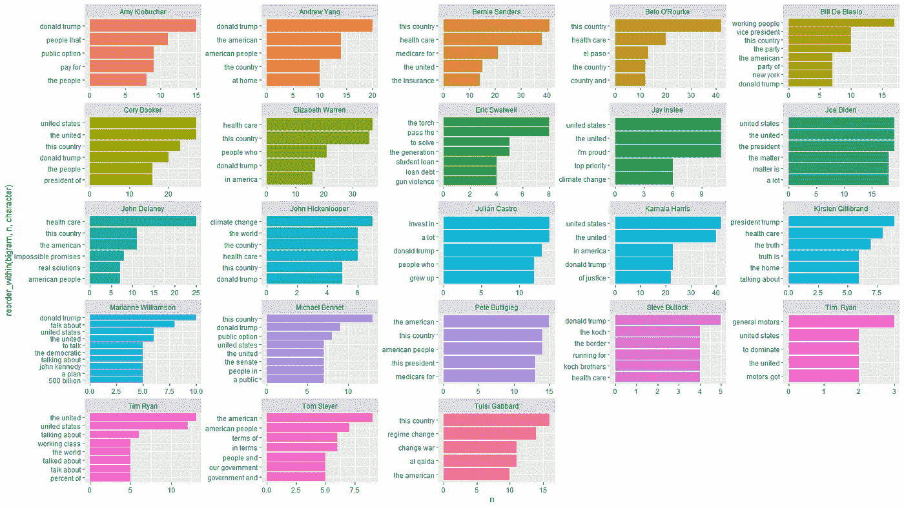

正如你所看到的，二元模型对每个候选人来说信息更丰富。贝托谈论埃尔帕索，桑德斯谈论全民医疗保险。我们还可以评估这些辩论，看看它们之间是否有什么主题。

```
df %>% 
  unnest_tokens(bigram, "text", token = "ngrams", n =2) %>% 
  separate(bigram, c("word1","word2"), sep = " ") %>% 
  filter(!word1 %in% stop_words$word | !word2 %in% stop_words$word) %>% 
  unite("bigram", c("word1", "word2"), sep = " ") %>% 
count(debate, bigram) %>% 
  group_by(debate) %>% 
  top_n(n, n =5) %>% 
  ggplot(aes(x = reorder_within(bigram, n, debate), 
             y = n, 
             fill = debate)) + 
  geom_col() + 
  scale_x_reordered() +
  facet_wrap(~debate, scales = "free") + 
  coord_flip() +
  theme(legend.position = "None")
```

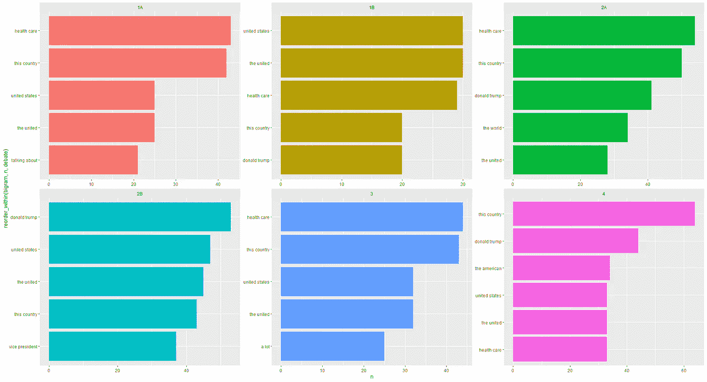

起初，图表显示没有差异，事实上，二元模型和排名非常相似。**这是简单计算 n-grams 或词袋的缺点之一。**没有考虑到流行词。你可以为每个文档创建一个单独的流行词列表，然后把它们过滤掉，但这要花很多时间。这里是 TF-IDF 大放异彩的地方。

## 术语频率和反向文档频率(TF-IDF)

术语频率和逆文档频率是我在组内计算 n-grams 或词袋的首选方法。TF-IDF 通过将一个组的单词与整个文档集进行比较，为每个组找到唯一的单词。数学也很简单。


[https://skymind.ai/wiki/bagofwords-tf-idf](https://skymind.ai/wiki/bagofwords-tf-idf)

Tidytext 包含一个 Tf-idf 函数，因此您不需要手动创建公式。Tf-idf 的伟大之处在于，从技术上讲，您不需要删除停用词，因为停用词将在所有文档中共享。让我们看看它的实际效果。

```
df %>% 
  unnest_tokens(word, "text", token = "ngrams", n =1) %>% 
  count(debate, word) %>% 
  bind_tf_idf(word, debate, n) %>% 
  group_by(debate) %>% 
  top_n(tf_idf, n = 5) %>% 
  ggplot(aes(x = reorder_within(word, tf_idf, debate), y = tf_idf, fill = debate)) + 
  geom_col() + 
  scale_x_reordered() + 
  facet_wrap(~debate, scales = "free") + 
  coord_flip() + 
  theme(legend.position = "none")
```

**Bind_tf_idf** 跟随计数函数。 **Bind_tf_idf** 然后将一个术语、文档和 n


所以，图表显示了许多不同的单词，有些单词没有任何意义。Tf-idf 确实有所帮助，但是有些词根本没有增加任何价值，比如在辩论 4 和 2a 中。为什么有个“h”？可能是因为在可能有不需要的空间的地方清理了数据。但是我们仍然可以看到非常清晰的文字。**虽然 Tf-idf 确实去掉了很多停用词，但还是去掉比较好。**让我们来看看 tf-idf 为我们展示了每一位候选人。

```
df %>% 
  unnest_tokens(word, "text", token = "ngrams", n =1) %>% 
  count(character, word) %>% 
  bind_tf_idf(word, character, n) %>% 
  group_by(character) %>% 
  top_n(tf_idf, n = 5) %>% 
  ggplot(aes(x = reorder_within(word, tf_idf, character), y = tf_idf, fill = character)) + 
  geom_col() + 
  scale_x_reordered() + 
  facet_wrap(~character, scales = "free") + 
  coord_flip() + 
  theme(legend.position = "none")
```

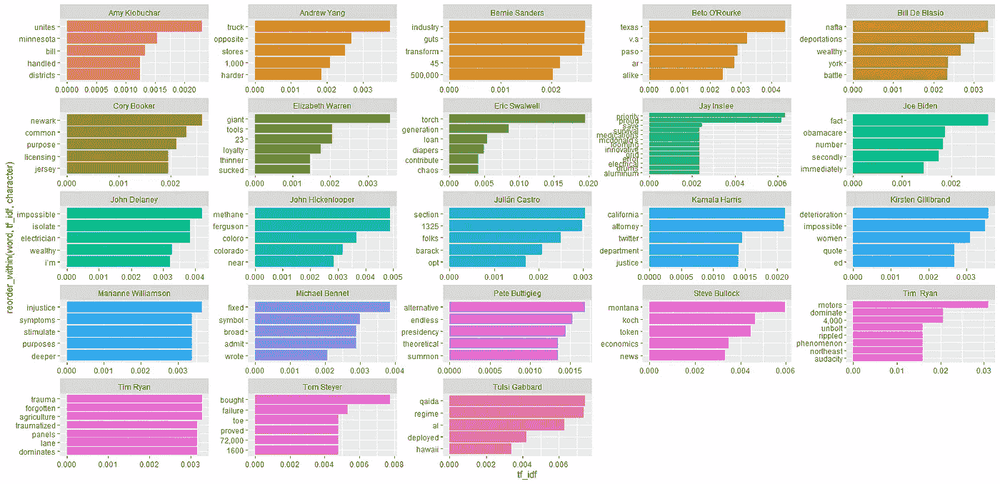

这很有趣。前 5 个 tf-idf 单词确实揭示了每个候选人的很多信息。杨谈 1000 指的是他的自由红利。贝托谈到了德克萨斯和帕索，这很有道理，因为那是他的家乡。Eric Swallwell 用 Torch 来形容他是最容易辨认的，这个词指的是臭名昭著的“传递火炬”演讲。即使看着 x 轴火炬也有最高值，这表明它能很好地识别候选人。Tf-idf 也可以应用于任何 n 元文法。您可能已经注意到，第一个图表显示了每个候选人的前 5 个三元模型。

```
df %>% 
  unnest_tokens(trigram, "text", token = "ngrams", n = 3) %>% 
  count(character, trigram) %>% 
  bind_tf_idf(trigram, character,n) %>% 
  group_by(character) %>% 
  top_n(tf_idf, n = 5) %>% 
  mutate(rank = rank(tf_idf, ties.method = "random")) %>% 
  arrange(character, rank) %>% 
  filter(rank <=5) %>% 
  ggplot(aes(x = reorder_within(trigram, tf_idf, character), 
             y = tf_idf, 
             color = character, 
             fill = character)) + 
  geom_col() +
  scale_x_reordered() +
  facet_wrap(~character, scales = "free") +
  coord_flip() + 
  theme(legend.position = "None")
```


## 结论

词袋和 n 元语法是文本挖掘和其他 NLP 主题的基础。这是将文本转换成数字特征的一种非常简单而优雅的方式。此外，tf-idf 是另一个可以增加单词袋和 n 元语法有效性的工具。这些基本概念可以带你深入文本挖掘的世界。考虑使用词袋和 n-grams 创建一个模型，尝试 tf-idf 如何改变模型的准确性，使用词典将情感值应用于词袋，或者使用二元模型进行否定。与数据挖掘中的其他领域相比，文本挖掘是一个相对未开发的领域。然而，随着智能手机、在线业务和社交媒体的兴起，将需要文本挖掘来处理每天发布、共享和转发的数百万条文本。