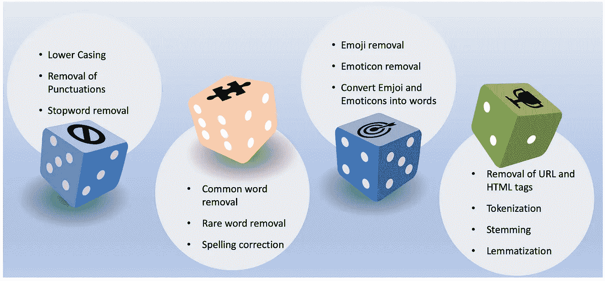
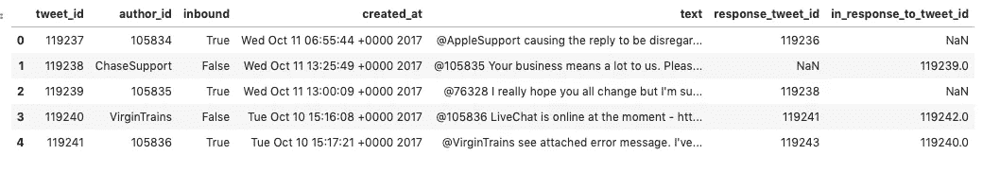
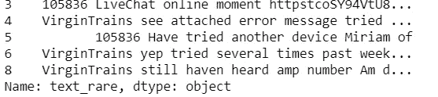
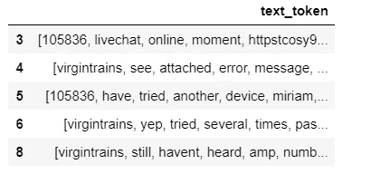
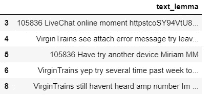

# 数据科学家的文本预处理

> 原文：<https://towardsdatascience.com/text-preprocessing-for-data-scientist-3d2419c8199d?source=collection_archive---------12----------------------->

## 文本预处理的简便指南


Image by [Devanath](https://pixabay.com/users/Devanath-1785462/?utm_source=link-attribution&utm_medium=referral&utm_campaign=image&utm_content=1248088) from [Pixabay](https://pixabay.com/?utm_source=link-attribution&utm_medium=referral&utm_campaign=image&utm_content=1248088)

## 文本预处理

文本预处理是文本分析和自然语言处理的重要任务和关键步骤。它将文本转换为可预测和可分析的形式，以便机器学习算法可以更好地执行。这是一个方便的文本预处理指南，是我之前关于文本挖掘的博客的延续。在这篇博客中，我使用了来自 Kaggle 的 twitter 数据集。

有不同的方法来预处理文本。这里有一些你应该知道的常用方法，我会试着强调每种方法的重要性。



Image by the author

## 密码

```
**#Importing necessary libraries**import numpy as np
import pandas as pd
import re
import nltk
import spacy
import string**# Reading the dataset**df = pd.read_csv("sample.csv")
df.head()
```

## 输出



# 下部外壳

这是最常见和最简单的文本预处理技术。适用于大多数文本挖掘和 NLP 问题。主要目标是将文本转换为小写，以便“apple”、“APPLE”和“Apple”得到相同的处理。

## 密码

```
**# Lower Casing --> creating new column called text_lower**df['text_lower']  = df['text'].str.lower()
df['text_lower'].head()
```

## 输出

```
0    @applesupport causing the reply to be disregar...
1    @105835 your business means a lot to us. pleas...
2    @76328 i really hope you all change but i'm su...
3    @105836 livechat is online at the moment - htt...
4    @virgintrains see attached error message. i've...
Name: text_lower, dtype: object
```

# 删除标点符号

## 密码

```
**#removing punctuation, creating a new column called 'text_punct]'**
df['text_punct'] = df['text'].str.replace('[^\w\s]','')
df['text_punct'].head()
```

## 输出

```
0    applesupport causing the reply to be disregard...
1    105835 your business means a lot to us please ...
2    76328 I really hope you all change but im sure...
3    105836 LiveChat is online at the moment  https...
4    virginTrains see attached error message Ive tr...
Name: text_punct, dtype: object
```

# 停用词删除

停用词是一种语言中的一组常用词。英语中停用词的例子有“a”、“we”、“the”、“is”、“are”等。使用停用词背后的想法是，通过从文本中删除低信息量的词，我们可以专注于重要的词。我们可以自己创建一个自定义的停用词列表(基于用例)，也可以使用预定义的库。

## 密码

```
**#Importing stopwords from nltk library**
from nltk.corpus import stopwords
STOPWORDS = set(stopwords.words('english'))**# Function to remove the stopwords**
def stopwords(text):
    return " ".join([word for word in str(text).split() if word not in STOPWORDS])**# Applying the stopwords to 'text_punct' and store into 'text_stop'**
df["text_stop"] = df["text_punct"].apply(stopwords)
df["text_stop"].head()
```

## **输出**

```
0    appleSupport causing reply disregarded tapped ...
1    105835 your business means lot us please DM na...
2    76328 I really hope change Im sure wont becaus...
3    105836 LiveChat online moment httpstcoSY94VtU8...
4    virgintrains see attached error message Ive tr...
Name: text_stop, dtype: object
```

# 常用词去除

我们还可以从文本数据中删除常见的单词。首先，让我们检查一下文本数据中最常出现的 10 个单词。

## 密码

```
**# Checking the first 10 most frequent words**
from collections import Counter
cnt = Counter()
for text in df["text_stop"].values:
    for word in text.split():
        cnt[word] += 1

cnt.most_common(10)
```

## 输出

```
[('I', 34),
 ('us', 25),
 ('DM', 19),
 ('help', 17),
 ('httpstcoGDrqU22YpT', 12),
 ('AppleSupport', 11),
 ('Thanks', 11),
 ('phone', 9),
 ('Ive', 8),
 ('Hi', 8)]
```

现在，我们可以删除给定语料库中的常用词。如果我们使用 tf-idf，这可以自动处理

## 密码

```
**# Removing the frequent words**
freq = set([w for (w, wc) in cnt.most_common(10)])**# function to remove the frequent words**
def freqwords(text):
    return " ".join([word for word in str(text).split() if word not 
in freq])**# Passing the function freqwords**
df["text_common"] = df["text_stop"].apply(freqwords)
df["text_common"].head()
```

## 输出

```
0    causing reply disregarded tapped notification ...
1    105835 Your business means lot please name zip...
2    76328 really hope change Im sure wont because ...
3    105836 LiveChat online moment httpstcoSY94VtU8...
4    virgintrains see attached error message tried ...
Name: text_common, dtype: object
```

# 去除生僻字

这是非常直观的，因为对于不同的 NLP 任务，一些本质上非常独特的词，如名称、品牌、产品名称，以及一些干扰字符，如 html 省略，也需要被删除。我们还使用单词的长度作为标准来删除非常短或非常长的单词

## 密码

```
**# Removal of 10 rare words and store into new column called** 'text_rare'
freq = pd.Series(' '.join(df['text_common']).split()).value_counts()[-10:] # 10 rare words
freq = list(freq.index)
df['text_rare'] = df['text_common'].apply(lambda x: " ".join(x for x in x.split() if x not in freq))
df['text_rare'].head()
```

## 输出

```
0    causing reply disregarded tapped notification ...
1    105835 Your business means lot please name zip...
2    76328 really hope change Im sure wont because ...
3    105836 liveChat online moment httpstcoSY94VtU8...
4    virgintrains see attached error message tried ...
Name: text_rare, dtype: object
```

# 拼写纠正

社交媒体数据总是杂乱的数据，而且有拼写错误。因此，拼写纠正是一个有用的预处理步骤，因为这将帮助我们避免多个单词。例如，“text”和“txt”将被视为不同的单词，即使它们在相同的意义上使用。这可以通过 textblob 库来完成

## **代号**

```
**# Spell check using text blob for the first 5 records**
from textblob import TextBlob
df['text_rare'][:5].apply(lambda x: str(TextBlob(x).correct()))
```

## 输出



# 表情符号移除

表情符号是我们生活的一部分。社交媒体文字有很多表情符号。我们需要在文本分析中删除相同的内容

## 密码

代码参考: [Github](https://gist.github.com/slowkow/7a7f61f495e3dbb7e3d767f97bd7304b)

```
**# Function to remove emoji.**
def emoji(string):
    emoji_pattern = re.compile("["
                           u"\U0001F600-\U0001F64F"  # emoticons
                           u"\U0001F300-\U0001F5FF"  # symbols & pictographs
                           u"\U0001F680-\U0001F6FF"  # transport & map symbols
                           u"\U0001F1E0-\U0001F1FF"  # flags (iOS)
                           u"\U00002702-\U000027B0"
                           u"\U000024C2-\U0001F251"
                           "]+", flags=re.UNICODE)
    return emoji_pattern.sub(r'', string)emoji("Hi, I am Emoji  😜")
**#passing the emoji function to 'text_rare'**
df['text_rare'] = df['text_rare'].apply(remove_emoji)
```

## 输出

```
'Hi, I am Emoji  '
```

# 表情移除

在前面的步骤中，我们已经删除了表情符号。现在，我要移除表情符号。表情符号和表情符号有什么区别？:-)是一个表情符号😜→表情符号。

使用 emot 库。请参考更多关于[表情](https://github.com/NeelShah18/emot/blob/master/emot/emo_unicode.py)

## 密码

```
from emot.emo_unicode import UNICODE_EMO, EMOTICONS**# Function for removing emoticons**
def remove_emoticons(text):
    emoticon_pattern = re.compile(u'(' + u'|'.join(k for k in EMOTICONS) + u')')
    return emoticon_pattern.sub(r'', text)remove_emoticons("Hello :-)")
**# applying remove_emoticons to 'text_rare'**
df['text_rare'] = df['text_rare'].apply(remove_emoticons)
```

## 输出

```
'Hello '
```

# 将表情符号和表情符号转换为文字

在情感分析中，表情符号和表情符号表达了一种情感。因此，删除它们可能不是一个好的解决方案。

## 密码

```
from emot.emo_unicode import UNICODE_EMO, EMOTICONS**# Converting emojis to words**
def convert_emojis(text):
    for emot in UNICODE_EMO:
        text = text.replace(emot, "_".join(UNICODE_EMO[emot].replace(",","").replace(":","").split()))
        return text**# Converting emoticons to words **   
def convert_emoticons(text):
    for emot in EMOTICONS:
        text = re.sub(u'('+emot+')', "_".join(EMOTICONS[emot].replace(",","").split()), text)
        return text**# Example**
text = "Hello :-) :-)"
convert_emoticons(text)text1 = "Hilarious 😂"
convert_emojis(text1)**# Passing both functions to 'text_rare'**
df['text_rare'] = df['text_rare'].apply(convert_emoticons)
df['text_rare'] = df['text_rare'].apply(convert_emojis)
```

## **输出**

```
'Hello happy smiley face happy smiley face:-)'
'Hilarious face_with_tears_of_joy'
```

# 移除 URL

删除文本中的 URL。我们可以使用漂亮的汤库

## 密码

```
**# Function for url's**
def remove_urls(text):
    url_pattern = re.compile(r'https?://\S+|www\.\S+')
    return url_pattern.sub(r'', text)**# Examples**
text = "This is my website, [https://www.abc.com](https://www.abc.com)"
remove_urls(text)**#Passing the function to 'text_rare'**
df['text_rare'] = df['text_rare'].apply(remove_urls)
```

## 输出

```
'This is my website, '
```

# 移除 HTML 标签

另一种常见的预处理技术是删除 HTML 标签。通常出现在抓取数据中的 HTML 标签。

## 密码

```
from bs4 import BeautifulSoup**#Function for removing html**
def html(text):
    return BeautifulSoup(text, "lxml").text
**# Examples**
text = """<div>
<h1> This</h1>
<p> is</p>
<a href="[https://www.abc.com/](https://www.abc.com/)"> ABCD</a>
</div>
"""
print(html(text))
**# Passing the function to 'text_rare'**
df['text_rare'] = df['text_rare'].apply(html)
```

## 输出

```
This
 is
 ABCD
```

# 标记化

标记化是指将文本分成一系列单词或句子。

## 密码

```
**#Creating function for tokenization**
def tokenization(text):
    text = re.split('\W+', text)
    return text
**# Passing the function to 'text_rare' and store into'text_token'**
df['text_token'] = df['text_rare'].apply(lambda x: tokenization(x.lower()))
df[['text_token']].head()
```

## 输出



# 词干化和词汇化

词汇化是将一个词转换成它的基本形式的过程。词干化和词元化的区别在于，词元化考虑上下文并将单词转换为其有意义的基本形式，而词干化只是删除最后几个字符，通常会导致不正确的意思和拼写错误。这里，仅执行了术语化。我们需要为 NLTK 中的 lemmatizer 提供单词的 POS 标签。根据位置的不同，lemmatizer 可能会返回不同的结果。

## 密码

```
from nltk.corpus import wordnet
from nltk.stem import WordNetLemmatizerlemmatizer = WordNetLemmatizer()
wordnet_map = {"N":wordnet.NOUN, "V":wordnet.VERB, "J":wordnet.ADJ, "R":wordnet.ADV} # Pos tag, used Noun, Verb, Adjective and Adverb**# Function for lemmatization using POS tag**
def lemmatize_words(text):
    pos_tagged_text = nltk.pos_tag(text.split())
    return " ".join([lemmatizer.lemmatize(word, wordnet_map.get(pos[0], wordnet.NOUN)) for word, pos in pos_tagged_text])**# Passing the function to 'text_rare' and store in 'text_lemma'**
df["text_lemma"] = df["text_rare"].apply(lemmatize_words)
```

## 输出



以上方法是常见的文本预处理步骤。

感谢阅读。请继续学习，并关注更多内容！

# 参考:

1.  【https://www.nltk.org 
2.  [https://www.edureka.co](https://www.geeksforgeeks.org/nlp-chunk-tree-to-text-and-chaining-chunk-transformation/)
3.  [https://www . geeks forgeeks . org/part-speech-tagging-stop-words-using-nltk-python/](https://www.learntek.org/blog/categorizing-pos-tagging-nltk-python/)