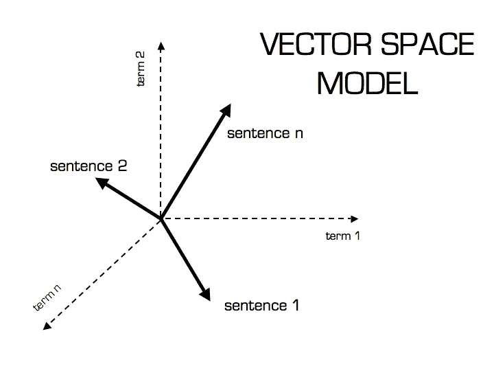

# 自然语言处理中的文本预处理

> 原文：<https://towardsdatascience.com/text-preprocessing-in-natural-language-processing-using-python-6113ff5decd8?source=collection_archive---------1----------------------->

## 文本预处理在模型性能中的意义。

数据预处理是建立机器学习模型的必要步骤，取决于数据预处理的好坏；结果是看到的。

在自然语言处理中，文本预处理是建立模型的第一步。

各种文本预处理步骤是:

1.  标记化
2.  下部外壳
3.  停止单词删除
4.  堵塞物
5.  词汇化

这些不同的文本预处理步骤被广泛用于降维。

在向量空间模型中，每个单词/术语是一个轴/维度。文本/文档被表示为多维空间中的向量。
唯一字的数量就是维度的数量。



安装:我将用来实现文本预处理任务的 python 库是 **nltk**

```
pip install nltk==3.4.5
```

**标记化**:将句子拆分成单词。

```
**Output:** ['Books', 'are', 'on', 'the', 'table'] 
```

**小写:**将单词转换成小写(NLP - > nlp)。
像 *Book* 和 *book* 这样的单词意思相同，但是当不转换成小写时，这两个单词在向量空间模型中表示为两个不同的单词(导致更多的维度)。

```
**Output:** books are on the table.
```

**停用词去除:**停用词是非常常用的词(a、an、the 等。)在文档中。这些词实际上并不表示任何重要性，因为它们无助于区分两个文档。

```
**Output**: ['Machine', 'Learning', 'cool', '!']
**Explanation**: Stop word ‘is’ has been removed
```

**词干化**:是将一个单词转化为其词根形式的过程。

```
**Output**: machin, learn, is, cool
**Explanation**: The word 'machine' has its suffix 'e' chopped off. The stem does not make sense as it is not a word in English. This is a disadvantage of stemming.
```

**词汇化**:与词干化不同，词汇化将单词简化为语言中存在的单词。

词干化或词汇化都可以使用。像 **nltk** 和 **spaCy** 这样的库已经实现了词干分析器和词条分类器。这些都是基于基于规则的方法构建的。

> 斯特梅尔比词条解释器更容易构建，因为后者在构建词典时需要深厚的语言学知识来查找单词的词条。

对于将单词解析为其词条的词条化，需要单词的词性。这有助于将单词转换成合适的词根形式。然而，要做到这一点，它需要额外的计算语言学能力，如词性标注器。

有关 python 中词汇化的更多示例，请查看这个[博客](https://www.machinelearningplus.com/nlp/lemmatization-examples-python/)，有关词干化和词汇化之间差异的详细解释，请查看这个[博客](https://blog.bitext.com/what-is-the-difference-between-stemming-and-lemmatization/)

> 变元化优于词干化，因为变元化对单词进行词法分析。

```
**Output**: machine, care
**Explanation**: The word Machine transforms to lowercase and retains the same word unlike Stemming. Also, the word caring is transformed to its lemma 'care' as the parts of speech variable (pos) is verb(v)
```

总之，这些是自然语言处理中的文本预处理步骤。可以使用各种 python 库，如 [nltk](https://www.nltk.org/) 、 [spaCy](https://spacy.io/) 和 [TextBlob](https://textblob.readthedocs.io/en/dev/) 。请参考他们的文档并试用它们。

**关于我**
我对位于湾区的数据科学充满热情。我的重点是学习自然语言处理的最新技术。请随时在 LinkedIn 上与我联系

参考资料:

[1][https://www . coursera . org/lecture/language-processing/text-预处理-SCd4G](https://www.coursera.org/lecture/language-processing/text-preprocessing-SCd4G)
【2】[https://www.nltk.org/](https://www.nltk.org/)