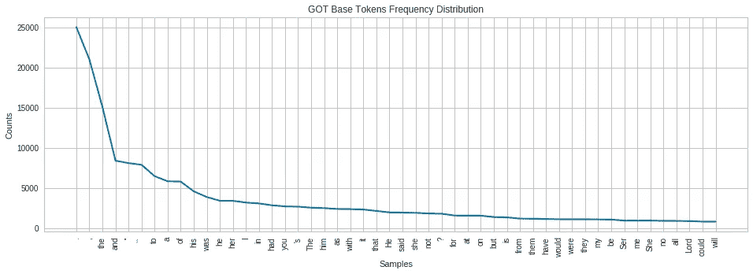
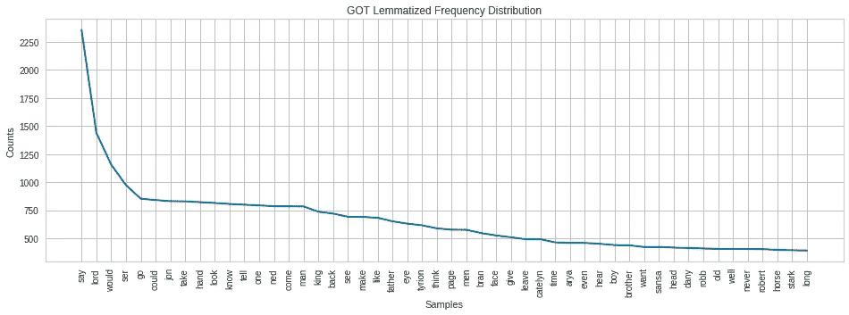
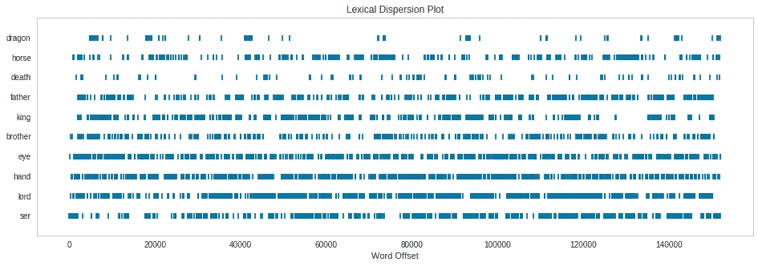

# 文本处理即将到来

> 原文：<https://towardsdatascience.com/text-processing-is-coming-c13a0e2ee15c?source=collection_archive---------14----------------------->

## 如何在*权力的游戏第一部*中使用正则表达式(Regex)和自然语言工具包(NLTK)


Photo by [Bharat Patil](https://unsplash.com/@bharat_patil_photography?utm_source=medium&utm_medium=referral) on [Unsplash](https://unsplash.com?utm_source=medium&utm_medium=referral)

如果你和我一样，看过的《权力的游戏》(GOT)的迷因比剧集本身还多，你可能会奇怪为什么每个人都对它如此着迷。由于我没有时间看节目或看书，我将使用基本的文本处理来大致了解我错过了什么。在本文中，我将使用 Python 中的正则表达式和自然语言工具包来探索、清理、标记和可视化文本。如果你对矢量化、词性标注或情感分析更感兴趣，这里有我写的另一篇文章。

所有 5 本书的文本都可以在 Kaggle 上找到[这里](https://www.kaggle.com/khulasasndh/game-of-thrones-books#005ssb.txt)。我将使用第一本书的文本(*《权力的游戏》，1996)* ，它有 571 页，包含 20，168 行文本。我将解释这些概念，以便清理文本:

*   正则表达式语法
*   正则表达式函数
*   标记化
*   词干化/词汇化
*   结合 NLTK 和 Regex
*   可视化词频

# **什么是 Regex？**

正则表达式是一种不同符号和语法的语言，可用于在更大的字符串中搜索一段字符串。它可以在几乎任何编码语言中使用，并且在试图搜索一般的*字符串模式*时非常有用。最常见的是，它用于 web 抓取、输入验证和简单的解析。在 Python 中，可以使用`import re`导入[正则表达式包](https://docs.python.org/3/library/re.html)。这给了你许多不同的函数和字符串序列，允许你搜索任何你想要的东西。

一个 **regex 字符串**指的是告诉 regex 要查找什么的字母、符号或数字的字符串。例如，如果您想要查找“Daenerys”的所有实例，regex 字符串应该类似于**r“daene rys”**。然而，如果您想要查找所有以' D '开头的单词，正则表达式字符串应该看起来像 **r'D[a-z]+'** 。字符串开头的 D 必须匹配，方括号表示选择一个，而+表示您必须从括号中选择 1 次或更多次来完成单词。我将介绍一些 regex 字符串的基本形式，它们在搜索文本时会很有用。

> ***r'A*'*** 匹配一个 0 次或多次('、' A '、' AA '、' AAA '、' AAAA '等)。)
> ***r'A+'*** 匹配 A 1 次或多次(' A '，' AA '，' AAA '，' AAAA '等)。)
> ***r '[a-z]****匹配任意小写字母 0 次或更多次('、' ajrk '、' bor '、' q '等。)
> ***r '[0–9]+'***匹配任意数字 1 次或多次(' 1 '，' 254 '，' 1029345 '等)。)
> ***r'ing$'*** 匹配以-ing 结尾的单词(“奔跑”、“攀爬”、“ing”等)。)
> ***r'^st'*** 匹配以 st- ('string '、' stir '、'奋斗'等)开头的单词。)
> ***r'[^a]'*** 将匹配任何不带 a 的字符串(' surprise '，' d4nfo)。，有意思！”等。)
> ***r’。{4}'*** 匹配任何不带换行符的 4 个字符的字符串(' 9？rf '、'(hi)'等。)

regex 中有几个特殊序列**由一个反斜杠后跟一个字母组成。反斜杠(\)是一个转义字符，它可以否定跟在它后面的任何内容的传统含义。“w”通常会匹配“w”，但 **r'\w+'** 会匹配一个或多个字母数字字符。如果字母是小写的，那么它匹配特殊序列定义的所有内容，但是如果字母是大写的，那么 regex 字符串匹配除了它定义的之外的所有内容。特殊序列字母列表可在找到。除了我简单介绍的*和*之外，还有很多技术，你可以点击[这里](https://docs.python.org/3/howto/regex.html)，这里[这里](https://www.datacamp.com/community/tutorials/python-regular-expression-tutorial)，这里[这里](https://www.w3schools.com/python/python_regex.asp)，或者这里[这里](https://developers.google.com/edu/python/regular-expressions)查看更多信息！**

# **使用正则表达式搜索文本**

re 包有几个内置函数，可以用来将 regex 字符串应用于文本主体，以及查找匹配等。我将介绍一些，并解释它们之间的区别。所有这些函数至少有两个参数:要匹配的模式(regex 字符串)和要搜索的文本。以下三个函数返回一个 match 对象，该对象由匹配的字符串的索引(开始和停止)以及函数匹配的字符串组成。它们也被限制为每个查询只能找到一个匹配。

*   `re.search`:查找匹配模式的第一个实例，返回匹配对象或无
*   `re.match`:仅在字符串的开头查找模式的实例，返回匹配对象或无
*   `re.fullmatch`:查找整个字符串是否匹配给定的模式，返回一个匹配对象或无

```
print(**re.search**(r'q[a-zA-Z]+', 'There is a queen in the castle.'))
# <_sre.SRE_Match object; span=(11, 16), match=’queen’>print(**re.match**(r'[a-zA-Z]+', 'There is a queen in the castle.'))
# <_sre.SRE_Match object; span=(0, 5), match=’There’>print(**re.fullmatch**(r'.*', 'There is a queen in the castle.'))
# <_sre.SRE_Match object; span=(0, 31), match=’There is a queen in the castle.’>
```

接下来的两个函数查找模式字符串中的所有匹配。这里，re.findall 返回所有匹配的列表，而 re.finditer 允许您使用一个循环提取每个匹配的特定信息。

*   `re.findall`:查找模式的所有非重叠匹配，返回所有匹配的列表
*   `re.finditer`:查找模式的所有非重叠匹配，返回一个迭代器对象，告诉你匹配的开始/停止/内容

```
print(**re.findall**(r'\w+ \w+', 'There is a queen in the castle.'))
# [‘There is’, ‘a queen’, ‘in the’]print(**re.finditer**(r'dragon', got))
# <callable_iterator object at 0x7f062e51a400>for m in **re.finditer**(r'\w+ \w+', 'There is a queen in the castle.'):
  print('Start:', m.start(), 'End:', m.end(), 'Text:', m.group())
# Start: 0 End: 8 Text: There is 
# Start: 9 End: 16 Text: a queen 
# Start: 17 End: 23 Text: in the
```

以下两个函数是在搜索模式后分割或修改字符串的方法。它们都返回修改后的字符串。

*   `re.sub(pattern, replacement, string)`:用替换字符串替换模式，返回修改后的字符串
*   `re.split`:根据模式分割字符串，返回字符串列表

```
print(**re.sub**(r'\w+', 'word', 'There is a queen in the castle.'))
# word word word word word word word.print(**re.split**(r'[^a-zA-Z\']+',"This is the queen's castle. So exciting!"))
# ['This', 'is', 'the', "queen's", 'castle', 'So', 'exciting', '']
```

既然我们已经介绍了 Regex 的基础知识，让我们继续预处理得到的文本。

# **标记化**

为了分析一个文本，必须把它的词抽出来分析。一种方法是用空格分割每个文本，以便返回单个单词。然而，这并没有考虑标点符号或其他可能要删除的符号。这种将句子、段落或章节分解成单个单词的过程被称为**标记化**，是执行任何类型的文本分析之前的重要步骤。幸运的是，Python 中有一个名为自然语言工具包的包，它有大量有用的操作文本的函数。可以使用`import nltk`导入。这个包包括一个单词分词器和一个句子分词器，分别将文本分解成单词和句子。单词标记器将文本分成单词、标点符号和任何其他字符。这意味着标点符号从单词中分离出来，成为列表中自己的元素。句子标记器通过传统的句子标点符号(。, ?, !等。)，并保持标点符号附在句子上。以下是每种方法的示例:

```
from nltk.tokenize import word_tokenize, sent_tokenize
print(**word_tokenize**("This is the queen's castle. Yay!"))
# ['This', 'is', 'the', 'queen', "'s", 'castle', '.', 'Yay', '!']print(**sent_tokenize**(got)[1:3])
# ['"The wildlings are \ndead."', '"Do the dead frighten you?"']
```

现在你已经有了文本中所有单词和标点符号的列表，接下来做什么呢？令牌列表可以通过循环运行，停用词列表中的所有内容都可以删除。**停用词**是指出现频率太高或意义不大的词，应该去掉。这可以被认为是一种降维，因为你去掉了那些不允许你收集文本信息的单词。删除不常出现的单词也很有用。

```
from nltk.corpus import stopwords
stop_words=**stopwords.words**("english")
print(random.sample(stop_words, 8))
print('There are', len(stop_words), 'English stopwords.')
**# *[‘now’, ‘about’, ‘to’, ‘too’, ‘himself’, ‘were’, ‘some’, “you’ll”]*** ***# There are 179 English stopwords.***import string
punct = list(**string.punctuation**)
print(punct[0:13])
print('There are', len(punct), 'punctuation marks.')
**# *[‘!’, ‘“‘, ‘#’, ‘$’, ‘%’, ‘&’, “‘“, ‘(‘, ‘)’, ‘*’, ‘+’, ‘,’, ‘-’]*** ***# There are 32 punctuation marks.*****stops** = stop_words + punct + ["''", 'r.', '``', "'s", "n't"]filtered_words=[]
for w in got_words:
    if w.lower() not in stops:
        filtered_words.append(w.lower())
print(filtered_words[0:8])
**# *[‘game’, ‘thrones’, ‘book’, ‘one’, ‘song’, ‘ice’, ‘fire’, ‘george’]***
```

对于该文本，书的每个页码被指定为“第 X 页”。在我当前的清理单词列表中，每个实例都显示为['page '，' #']，我将在下一篇文章中做进一步的文本分析时处理这个问题。

# **词干化和词汇化**

如果这两个词中的任何一个听起来像一种奇怪的园艺形式，我完全理解。然而，这实际上是两种用于将单词的所有变体组合成其父形式的技术。例如，如果一个文本有“running”、“runs”和“run”，这些都是母词“run”的形式，应该转换并作为同一个词计算，因为它们具有相同的含义。逐行检查文本并试图找出每个单词是否应该转换成它的基本形式是计算密集型的，并且浪费时间。幸运的是，上一节中介绍的 nltk 包有一些功能可以帮您做到这一点！

**词干**删除单词的结尾(-ing，-ed，-s，或另一个常见的结尾)，希望它能找到单词的“基本”形式。这种方法对于像' running'-'run '，' climbing'-'climb '和' pouring ' = ' pour '这样的词很管用，但是对于其他的词就不管用了，比如' leaves'-'leav '。下面是一个简单的例子:

```
from nltk.stem.porter import PorterStemmer
ps = **PorterStemmer()**
stemmed_words=[]
for w in filtered_words:
    stemmed_words.append(ps.stem(w))print('Original:', filtered_words[7], filtered_words[13], filtered_words[15], filtered_words[26])
**# Original: george urged began asked**print('Stemmed:', stemmed_words[7], stemmed_words[13], stemmed_words[15], stemmed_words[26])
**# Stemmed: georg urg began ask**
```

这种方法不能完全正确地转换所有的单词，因此 george 被改为 georg。为了解决这个问题，可以使用**词条化**来代替词干化，这可以达到相同的效果，但是使用一个由**词条**(单词的基本形式)组成的字典来判断截断单词的结尾是否有意义。它还考虑了单词的类型(名词、动词、形容词)，以便更好地猜测父单词。此方法允许“leaves”转换为“leaf”，而不是“leav”。

```
from nltk.stem.wordnet import WordNetLemmatizer
lem = **WordNetLemmatizer()**
lemm_words=[]
for w in filtered_words:
    lemm_words.append(lem.lemmatize(w, 'v'))print('Original:', filtered_words[7], filtered_words[13], filtered_words[15], filtered_words[26])
**# Original: george urged began asked**print('Lemmatized:', lemm_words[7], lemm_words[13], lemm_words[15],lemm_words[26])
**# Lemmatized: george urge begin ask**
```

请注意词汇化是如何正确地将敦促、开始和要求转换为敦促、开始和要求的，因为它将所有的标记视为一个动词并搜索基本形式。它还忽略了所有不需要转换的单词。关于如何在 Python 中进行词干化和词汇化的有用指南可以在这里找到。

# **结合 NLTK 和 Regex**

既然您已经对 Regex 和 NLTK 提供的东西有了一些了解，我将解释这两者的交集。当标记一个文本时，除了 nltk 中的缺省值之外，还可以进行拆分。这是通过使用 `nltk.tokenize.RegexpTokenizer(pattern).tokenize(text)`来完成的，并且您可以指定分割哪个正则表达式字符串。这类似于`re.split(pattern, text)`，但是 NLTK 函数中指定的模式是您希望它返回的令牌的*模式，而不是将被移除和拆分的内容。NLTK 中还内置了许多其他的记号赋予器，您可以[在这里](https://www.geeksforgeeks.org/python-nltk-tokenize-regexp/)阅读。下面是一些`nltk.tokenize.RegexpTokenizer()`的例子:*

```
from nltk.tokenize import RegexpTokenizer 
print(**RegexpTokenizer**(r'\w+').tokenize("This is the queen's castle. So exciting!"))
**# ['This', 'is', 'the', 'queen', 's', 'castle', 'So', 'exciting']**
```

还有一种简单的方法来实现前面提到的一些功能，尤其是搜索。这可以用来再次检查词干化/词干化是否达到了预期的效果。在这种情况下，我们可以看到以-ing 结尾的动词在词汇化过程中被从单词列表中删除了。

```
words_ending_with_ing = [w for w in **got_words** if re.search("ing$", w)]
print('Tokens:', words_ending_with_ing[3:8])
**# Tokens: ['falling', 'being', 'something', 'rushing', 'Something']**words_ending_with_ing2 = [w for w in **lemm_words** if re.search("ing$", w)]
print('Lemmatized:', words_ending_with_ing2[3:7])
**# Lemmatized: ['something', 'something', 'wildling', 'something']**
```

在标记列表中查找短语实例的另一种有用方法是，首先使用`nltk.Text(list)`将列表转换为文本对象，然后使用`text.findall(r‘<>’)`对该对象进行子集化，其中每个< >保存正则表达式字符串以匹配序列中的一个标记。我将通过下面的一些例子，这里有一个有用的[参考](https://python.gotrained.com/nltk-regex/)供进一步探讨。

```
got_text = **nltk.Text**(lemm_words)
print(got_text)
**# <Text: game throne book one song ice fire george...>**print(**got_text.findall**(r'<.*><daenerys><.*>'))
*# hide daenerys brother; usurper daenerys quicken; day daenerys want; hot daenerys flinch; archer daenerys say; princess daenerys magister; hand daenerys find; help daenerys collar; sister daenerys stormborn;...drogo daenerys targaryen*
```

这是一个很酷的方法来找出你的文本可能隐藏了什么小短语，并且是开始分析文本的好地方。特别是，跟随丹妮莉丝贯穿整本书给了她一个非常快速的性格曲线的总结。接下来，我将介绍不同的方法来可视化单词在单词列表中的出现频率。

# **可视化词频**

在实际分析文章之前，一个简单的方法是看看哪些词出现得最频繁。这也是一个好主意，以确保您已经删除了所有必要的停用词。可视化单词及其相对频率的一个基本方法是单词云，一个很好的演示可以在这里找到。这种方法仅显示每个单词与其他单词相比的相对频率，并且由于其抽象的性质，可能难以解释。为了补救这一点，我将探索 nltk 包中包含的[不同的可视化方法](https://www.mien.in/2017/10/02/visual-text-analytics-with-python/)，包括词汇分散图、频率分布图和 n 元语法频率分布图。

一个 [**频率分布图**](https://python.gotrained.com/frequency-distribution-in-nltk/) 根据频率绘制单词。剧情转折，我知道。这很有用，因为它显示了文本中有多少是由不同的主题或思想组成的。一个单词越常见，它就越是文章主题的中心。

```
freqdist = nltk.FreqDist(got_words)
plt.figure(figsize=(16,5))
plt.title('GOT Base Tokens Frequency Distribution')
freqdist.plot(50)
```



Original Token Frequency Distribution



Lemmatized Frequency distribution

我在一个发行版中包含了原始的标记，在另一个发行版中包含了经过过滤、词条化的单词，以强调删除停用词和其他非必要符号的重要性。第一版没有告诉我任何关于这本书的内容，而第二版给了我几个抓住了乔治·R·R·马丁精髓和写作风格的单词和角色名。基于词汇化分布的发现，我选择了 10 个词来绘制词汇离差图。

[**词汇分布图**](https://www.scikit-yb.org/en/latest/api/text/dispersion.html) 显示了单词在文本中出现时的分布(偏移量)。例如，如果感兴趣的单词是“狐狸”，句子是“快速的棕色狐狸跳过懒惰的狗”，则该单词的**偏移量**将是 4，因为它是句子中的第四个单词。这种绘制单词及其偏移量的技术显示了主题随时间的变化。这也是一个非常可定制的情节，因为你可以选择可视化的话。

```
from yellowbrick.text import DispersionPlot
topics ['dragon', 'horse', 'death', 'father', 'king', 'brother', 'eye', 'hand', 'lord', 'ser']
plt.figure(figsize=(16,5))
visualizer = DispersionPlot(topics)
visualizer.fit([lemm_words])
visualizer.poof()
```



Lexical Dispersion Plot

正如你所看到的，在不同的时期，书中有不同的主题。进一步分析不同的关键词会发现不同的含义，但这是一个好的开始，可以看出哪些概念在书中是重要的。

# **结论**

在本文中，我们介绍了 Regex 和不同的文本搜索方法，然后浏览了 NLTK 包中的基本工具，并了解了 Regex 如何与 NLTK 结合。最后，我们从书中提取了广泛的总结，并为进一步的分析准备了文本。我希望你喜欢这个旅程，你可以在这里查看更多的文本处理概念！

我的代码副本，有更多的例子和解释，可以在 github 上找到[！请随意获取和使用代码。](https://github.com/madelinemccombe/LaunchDS/blob/master/Regex_NLTK_GoT1.ipynb)

# 更多资源

[https://www . data camp . com/community/tutorials/text-analytics-初学者-nltk](https://www.datacamp.com/community/tutorials/text-analytics-beginners-nltk) (通用文本处理的绝佳资源)
[https://www . data camp . com/courses/natural-language-processing-fundamentals-in-python](https://www.datacamp.com/courses/natural-language-processing-fundamentals-in-python)(NLP 的一门课程)