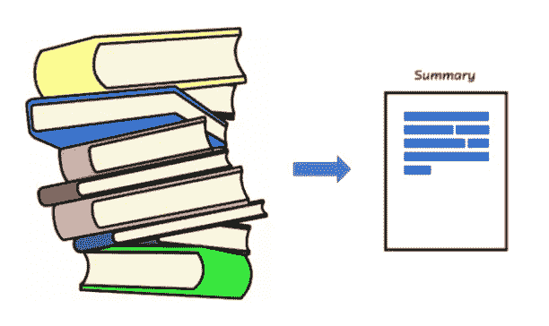
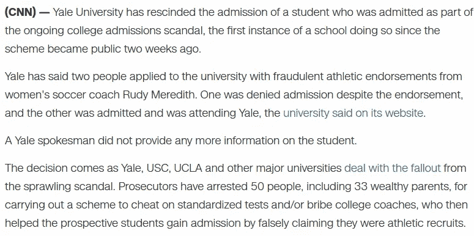
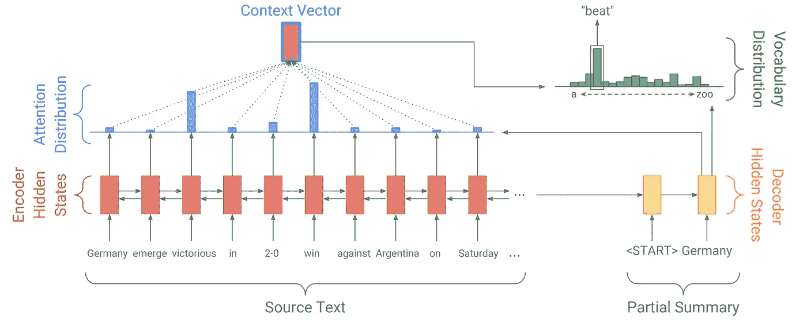

# 使用深度学习的文本摘要

> 原文：<https://towardsdatascience.com/text-summarization-using-deep-learning-6e379ed2e89c?source=collection_archive---------6----------------------->

## 用数据做很酷的事情！

Text Summarization

# 介绍

随着互联网的兴起，我们现在可以随时获取信息。我们从许多来源被它轰炸——新闻、社交媒体、办公室邮件等等。要是有人能为我们总结出最重要的信息就好了！深度学习正在实现。通过序列到序列模型的最新进展，我们现在可以开发良好的文本摘要模型。

文本摘要有两种类型:

1.摘录摘要—这种方法从源文本中选择段落，然后对其进行排列以形成摘要。思考这个问题的一种方式是用荧光笔在重要的部分下划线。主要思想是摘要文本是源文本的子部分。

2.抽象总结——相反，抽象方法包括理解意图，并用自己的话写总结。我认为这类似于一支笔。

自然，抽象概括在这里是更具挑战性的问题。这是机器学习进展缓慢的一个领域。这是一个困难的问题，因为创建抽象的摘要需要很好地掌握主题和自然语言，这对于机器来说都是困难的任务。此外，从历史上看，我们没有一个好的大数据集来解决这个问题。这里的数据集指的是带有摘要的源文本。因为人类需要写摘要，所以获取大量摘要是一个问题，除了一个领域——新闻！

在呈现新闻文章时，专业作家不断总结信息，如下面 CNN 新闻的片段所示:

News snippet

商店亮点是为更大的文章创建的摘要。收集来自 CNN 和每日邮报的新闻数据，以创建用于文本摘要的[CNN/每日邮报数据集](https://github.com/abisee/cnn-dailymail)，这是用于训练抽象摘要模型的关键数据集。使用这个数据集作为基准，研究人员一直在尝试深度学习模型设计。

我喜欢的一个这样的模型是 Abigail See 的[指针生成器网络](https://arxiv.org/abs/1704.04368)。我想用这个模型来强调深度学习摘要模型的关键组件。

在我们进入模型之前，让我们讨论一下文本摘要的评估指标 [— Rouge Score](https://en.wikipedia.org/wiki/ROUGE_(metric)) 。Rouge score 突出显示了摘要文本和源文本之间的单词重叠。Rouge 1-测量源和摘要文本之间的单个单词重叠，而 Rouge 2 测量源和摘要之间的双字母重叠。因为 rouge 得分度量只考虑单词重叠而不考虑文本的可读性，所以它不是一个完美的度量，因为具有高 rouge 得分的文本可能是一个糟糕的摘要。

# 通过深度学习的文本摘要

做文本摘要的标准方法是注意使用 seq2seq 模型。参见下面来自[指针生成器博客](http://www.abigailsee.com/2017/04/16/taming-rnns-for-better-summarization.html)的模型结构。

Encoder-Decoder model architecture

序列到序列模型有三个主要方面:

1.编码器—从原始文本中提取信息的双向 LSTM 层。这在上面用红色显示。双向 LSTM 一次读取一个单词，因为它是 LSTM，所以它基于当前单词和它之前已经读取的单词来更新它的隐藏状态。

2.解码器—单向 LSTM 层，一次生成一个单词的摘要。解码器 LSTM 开始工作，一旦它得到的信号比完整的源文本已经阅读。它使用来自编码器的信息以及之前写入的信息来创建下一个单词的概率分布。解码器在上面以黄色显示，概率分布以绿色显示。

3.注意力机制——编码器和解码器是这里的构建模块，但历史上，没有注意力的编码器和解码器架构本身并不太成功。如果不注意，解码器的输入是来自编码器的最终隐藏状态，它可以是 256 或 512 维向量，如果我们想象这个小向量不可能包含所有信息，那么它就成为了信息瓶颈。通过注意机制，解码器可以访问编码器中的中间隐藏状态，并使用所有这些信息来决定下一个单词。注意力在上面以蓝色显示。注意力是一个非常棘手的概念，所以如果我在这里的简短描述令人困惑，请不要担心。你可以通过我的博客[在这里](/nlp-building-a-question-answering-model-ed0529a68c54)阅读更多关于注意力的内容。

正如指针生成器论文所示，上面的体系结构足够好，可以开始使用，但是它创建的摘要有两个问题:

1.概要有时会不准确地再现事实细节(例如德国队以 3 比 2 击败阿根廷队)。这对于像 2–0 这样的罕见或不在词汇表中的单词尤其常见。

2.摘要经常重复出现。(例如德国打败德国打败德国…)

指针生成器模型通过创建一种指针机制来解决这些问题，这种机制允许它在生成文本和从源代码原样复制之间切换。把指针想象成一个介于 0 和 1 之间的概率标量。如果为 1，则模型抽象生成单词，如果为 0，则提取复制单词。

与序列到注意序列系统相比，指针生成器网络有几个优点:

*   指针生成器网络使得从源文本复制单词变得容易。
*   指针生成器模型甚至能够从源文本中复制词汇以外的单词。这是一个主要的好处，使我们能够处理看不见的单词，同时还允许我们使用更小的词汇(这需要更少的计算和存储空间)。
*   指针生成器模型训练起来更快，需要更少的训练迭代来实现与序列间注意系统相同的性能。

# 结果

我们已经在 Tensorflow 中实现了这个模型，并在 CNN/Daily Mail 数据集上对其进行了训练。该模型获得了 0.38 的 Rouge-1 分数，这是最先进的。我们的观察是，该模型在根据新闻文章(即它所训练的数据)创建摘要方面做得非常好。然而，如果呈现的文本不是新闻，它仍然可以创建良好的摘要，但这些摘要本质上更具提取性。

我希望你喜欢这个博客。要测试指针生成器模型，请在[链接](https://github.com/abisee/pointer-generator)处提取它们的代码。或者与我联系，检查我们的这种模式的版本。

我有自己的深度学习咨询公司，喜欢研究有趣的问题。我已经帮助许多初创公司部署了基于人工智能的创新解决方案。在 http://deeplearninganalytics.org/的[入住我们酒店。](http://deeplearninganalytics.org/)

你也可以在 https://medium.com/@priya.dwivedi[的](https://medium.com/@priya.dwivedi)看到我的其他作品

如果你有一个我们可以合作的项目，请通过我的网站或 info@deeplearninganalytics.org 联系我

# 参考资料:

[关于指针生成器模型的博客](http://www.abigailsee.com/2017/04/16/taming-rnns-for-better-summarization.html)

[下载 CNN 每日邮报数据集](https://machinelearningmastery.com/prepare-news-articles-text-summarization/)