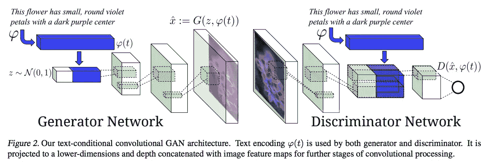
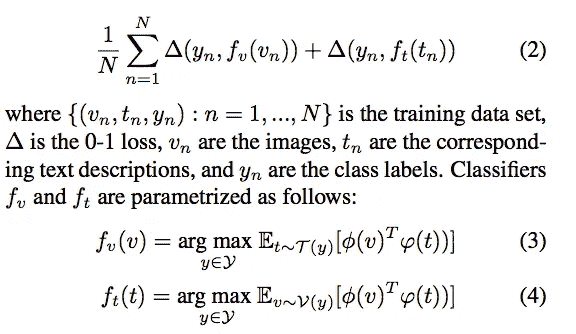
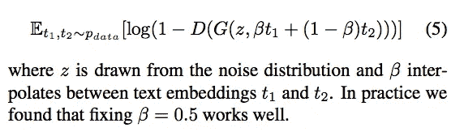
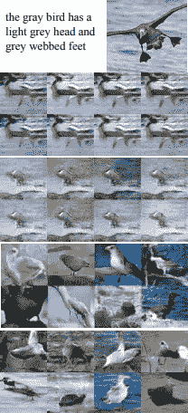
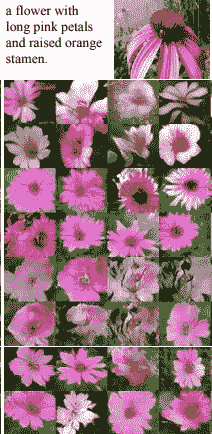
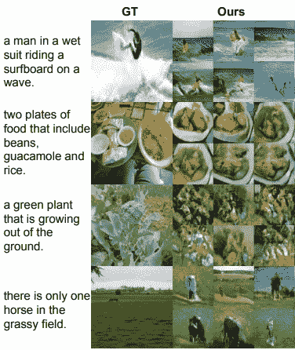

# 文本到图像

> 原文：<https://towardsdatascience.com/text-to-image-a3b201b003ae?source=collection_archive---------4----------------------->

本文将解释一篇有趣的论文背后的实验和理论，该论文将自然语言文本描述(如“一只小鸟有一个短而尖的橙色喙和白色腹部”)转换为 64x64 RGB 图像。以下是 Reed 等人的论文“生成性对立文本到图像合成”的链接。

 [## 生成对立文本到图像合成

### 从文本中自动合成真实的图像将会是有趣和有用的，但是目前的人工智能系统还远远不能…

arxiv.org](https://arxiv.org/abs/1605.05396) 

# 文章大纲

1.  介绍
2.  使用的架构
3.  为可视属性构造文本嵌入
4.  流形插值
5.  结果/结论

# 介绍

将自然语言文本描述转换为图像是深度学习的一个惊人演示。诸如情感分析的文本分类任务已经通过深度递归神经网络获得成功，该深度递归神经网络能够从文本中学习有区别的向量表示。在另一个领域，深度卷积 GANs 能够根据从正态分布采样的随机噪声向量来合成图像，例如卧室的内部。Reed 等人[1]的重点是将深度 RNN 文本嵌入和图像合成的进展与 DCGANs 联系起来，这是受条件 GANs 思想的启发。

除了随机采样的噪声向量之外，条件 gan 还通过输入一个独热类标签向量作为生成器和鉴别器的输入来工作。这导致更高的训练稳定性，更具视觉吸引力的结果，以及可控的发电机输出。传统的条件-GANs 和文本-图像模型的区别在于条件输入。不是试图构造稀疏的视觉属性描述符来调节 GANs，而是基于通过深度神经网络学习的文本嵌入来调节 GANs。一个稀疏的视觉属性描述符可能会将“一只长着橙色喙的小鸟”描述为:

```
 [ 0 0 0 1 . . . 0 0 . . . 1 . . . 0 0 0 . . . 0 0 1 . . .0 0 0]
```

向量中的数字代表属性问题，如橙色(1/0)？小(1/0)？鸟(1/0)？这种描述很难收集，在实践中也不太管用。

通过使用 Word2Vec 等概念，单词嵌入已经成为自然语言处理的英雄。Word2Vec 通过学习预测给定单词的上下文来形成嵌入。不幸的是，Word2Vec 并不能完全翻译成文本到图像，因为单词的上下文并不能像一个明确训练的嵌入那样捕捉视觉属性。Reed 等人[1]提出了一种新颖的图像和文本描述的对称结构化联合嵌入，以克服这一挑战，本文稍后将对此进行详细介绍。

除了构建良好的文本嵌入，从文本到图像的翻译是高度多模态的。“多模态”这个术语是深度学习研究中需要熟悉的一个重要术语。这是指这样一个事实，即有许多不同的鸟的图像与文本描述“鸟”相对应。另一个例子是在演讲中有许多不同的口音，等等。这将导致对应于文本“鸟”的不同声音。多模态学习也存在于图像字幕(图像到文本)中。然而，由于文本的顺序结构，使得该模型可以预测以图像为条件的下一个单词以及先前预测的单词，这非常方便。多模态学习传统上非常困难，但随着 GANs(生成对抗网络)的发展，这种框架创建了一种自适应损失函数，非常适合于多模态任务，如文本到图像。

# 使用的架构



上图显示了 Reed 等人用于训练这种文本到图像 GAN 模型的架构。从这个图中最值得注意的是文本嵌入如何适应模型的顺序处理的可视化。在生成器网络中，文本嵌入通过全连接层过滤，并与随机噪声向量 z 连接。在这种情况下，文本嵌入从 1024x1 向量转换为 128x1 向量，并与 100x1 随机噪声向量 z 连接。在鉴别器网络侧，文本嵌入也通过全连接层压缩为 128x1 向量，然后整形为 4x4 矩阵，并与图像表示深度连接。该图像表示是在输入图像经过多次卷积、降低空间分辨率和提取信息之后得到的。鉴别器的这种嵌入策略不同于条件 GAN 模型，在条件 GAN 模型中，嵌入被级联到原始图像矩阵中，然后被卷积。

关于架构图，有一点需要注意，那就是直观地了解 DCGAN 如何对矢量或低分辨率图像进行上采样，以产生高分辨率图像。你可以看到每个反卷积层都提高了图像的空间分辨率。此外，特征图的深度每层都减少。最后，您可以看到鉴别器网络中的卷积层在处理图像时如何降低空间分辨率并增加特征图的深度。

关于这个训练过程的一个有趣的事情是，很难区分基于生成的图像看起来不真实的损失或者基于生成的图像与文本描述不匹配的损失。该论文的作者描述了训练动态，即最初鉴别器不注意任何文本嵌入，因为由生成器创建的图像看起来根本不真实。一旦 G 可以生成至少通过真假标准的图像，那么文本嵌入也会被考虑在内。

作者通过添加带有被标记为“假”的不正确文本描述的真实图像对来平滑这种训练动态。鉴别器只关注真实与虚假的二元任务，而不是将图像与文本分开考虑。这与诸如具有独热编码分类标签的 AC-GAN 的方法形成对比。AC-GAN 鉴别器输出真实与虚假，并使用共享中间特征的辅助分类器来分类图像的类别标签。

# 为可视属性构造文本嵌入

这篇论文最有趣的部分是他们如何构造一个独特的文本嵌入，其中包含要表示的图像的视觉属性。该载体通过以下过程构建:



记为等式(2)的损失函数表示文本分类器的总体目标，其优化两个损失函数之间的选通损失。这些损失函数如等式 3 和等式 4 所示。该论文将这一过程的直觉描述为“与任何其他类别相比，文本编码应该与相应类别的图像具有更高的兼容性得分，反之亦然”。这两个术语分别代表图像编码器和文本编码器。图像编码器取自 GoogLeNet 图像分类模型。该分类器降低了图像的维数，直到它被压缩成 1024×1 的向量。因此，目标函数旨在最小化来自 GoogLeNet 的图像表示和来自字符级 CNN 或 LSTM 的文本表示之间的距离。本质上，用于图像分类的矢量编码用于基于与相似图像的相似性来指导文本编码。

这方面的细节将在 Reed 等人的论文“学习细粒度可视化描述的深度表示”中详细阐述。

 [## 学习细粒度可视化描述的深层表示

### 零镜头视觉识别的最新方法将学习公式化为图像和图像的联合嵌入问题

arxiv.org](https://arxiv.org/abs/1605.05395) 

请注意“细粒度”这个术语，它用于将不同类型的鸟和花等任务与完全不同的对象(如猫、飞机、船、山、狗等)进行区分。就像在 ImageNet 挑战赛中使用的一样。

# 流形插值

生成对抗网络的一个有趣的特征是潜在向量 z 可以用来插入新的实例。这通常被称为“潜在空间添加”。一个例子是做“戴眼镜的男人”——“不戴眼镜的男人”+“不戴眼镜的女人”，实现一个戴眼镜的女人。在本文中，作者的目的是在文本嵌入之间进行插值。这是通过以下等式实现的:



鉴别器已经被训练来预测图像和文本对是否匹配。因此，来自内插文本嵌入的图像可以填充在训练期间出现的数据流形中的间隙。使用这种方法作为训练数据空间的正则化方法，对于本文提出的模型的成功结果是至关重要的。这是数据扩充的一种形式，因为内插的文本嵌入可以扩展用于训练文本到图像 GAN 的数据集。

# 结果/结论

实验使用三个数据集进行，包含来自 200 个类别的 11，788 幅鸟类图像的 CUB 数据集，包含来自 102 个不同类别的 8，189 幅图像的 Oxford-102 花卉数据集，以及 MS-COCO 数据集，以展示所提出算法的可推广性。

来自 CUB 和 Oxford-102 的每张图片都包含 5 个文字说明。



Results on CUB Birds Dataset



Results on Oxford-102



Results on MS-COCO

上面给出的所有结果都是关于零射击学习任务的，这意味着该模型以前在训练期间从未见过该文本描述。上面的每张图片分辨率都很低，为 64x64x3。然而，看到这种算法在文本到图像的非常困难的多模态任务上取得一些成功是非常令人鼓舞的。感谢您阅读这篇文章，我强烈推荐您查看这篇文章以了解更多信息！

# 参考

[1] Scott Reed，Zeynep Akata，，Yan，Lajanugen Logeswaran，Bernt Schiele，Honglak Lee .生成对立文本到图像合成。2016.

[2]斯科特·里德、泽内普·阿卡塔、伯恩特·谢勒、洪拉克·李。学习细粒度可视化描述的深层表示。2016.