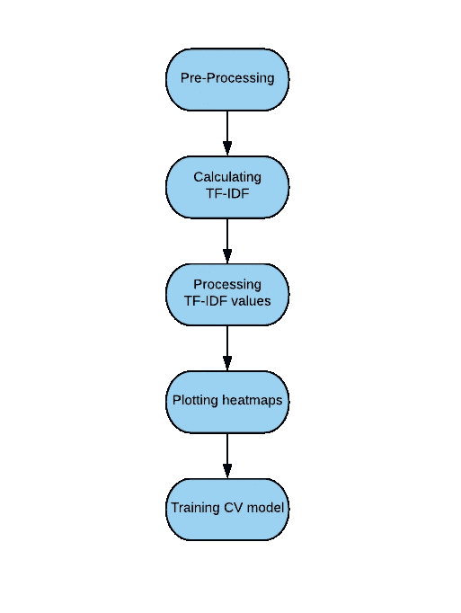
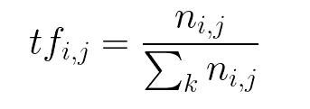
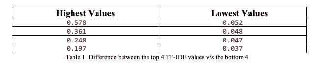
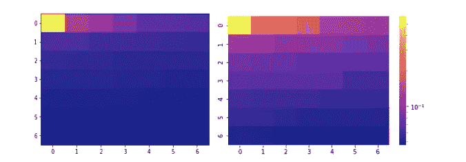
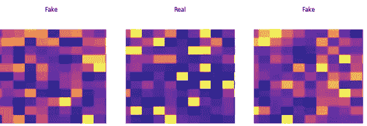
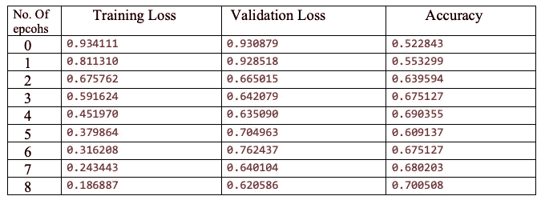

# text 2 image:NLP 的新途径？

> 原文：<https://towardsdatascience.com/text2image-a-new-way-to-nlp-cbf63376aa0d?source=collection_archive---------8----------------------->

# 问题是

自然语言处理(NLP)一直被认为是一个棘手的问题，至少与计算机视觉相比是如此。NLP 模型运行时间更长，通常更难以实现，并且需要高得多的计算资源。另一方面，图像识别模型已经变得更容易实现，对 GPU 的负担也更轻。这让我想到，我们能不能把一个文本集转换成一张图片？我们能把文字解释成图像吗？事实证明，是的，而且结果出人意料地有希望！我们用这种方法来解决真假新闻的分类问题。

在本文中，我们将详细探讨这种方法、结果、结论和进一步的改进。大家系好安全带！

# 介绍

## 灵感

将文本转换成图像的想法最初是受到 Gleb Esman 关于欺诈检测的这篇文章的启发。在这种方法中，他们转换了各种数据点，如鼠标移动的速度、方向、加速度等。变成彩色图像。然后对这些图像运行图像识别模型，产生高度准确的结果。

## 数据

所有实验使用的数据都是乔治·麦克林泰尔的[假新闻数据集的子集。它包含大约 1000 篇虚假和真实的新闻，加在一起。](https://github.com/cabhijith/Fake-News/blob/master/fake_or_real_news.csv.zip)

# feet 从 20，000 英尺的高度拍摄的图像

让我们首先在高层次上讨论 Text2Image。基本的想法是将文本转换成我们可以绘制成热图的东西。等等，那是什么东西？每个单词的 TF-IDF 值。术语频率—逆文档频率(TF-IDF)是一种统计方法，用于确定一个单词相对于文档中其他单词的重要性。在基本的预处理和计算 tf-idf 值之后，我们使用一定量的高斯平滑滤波将它们绘制成对数标度的热图。一旦绘制了热图，我们就使用 CNN 的 fast.ai 实现，并尝试区分真实和虚假的热图。我们最终获得了大约 71%的稳定准确率，这是这种新方法的良好开端。这是我们方法的一个简短流程图

Text2Image

还不太清楚？请继续阅读。

# text 2 来自地面的图像

## 预处理

数据是小写的，所有特殊字符被删除，文本和标题被连接。出现在超过 85%的文档中的单词也被删除。此外，明确避免单词列表(停用词)。使用的是一个标准的停用词列表，大部分是无意义的重复词。修改专门用于假新闻的停用词可以是未来探索的一个领域，尤其是展现假新闻特有的写作风格。

## 计算 TF-IDF

为了对关键词进行评分和提取，使用了平滑术语频率逆文档(tf-idf)的 scikit-learn 实现。虚假和真实新闻语料的 IDF 是分别计算的。与整个语料库的单一 IDF 分数相比，计算单独的 IDF 分数导致了准确性的巨大飞跃。然后为每个文档迭代计算 tf-idf 分数。在这里，标题和正文不是分开评分的，而是一起评分的。

Calculating the Term Frequency

Calculating the IDF

将它们相乘，我们得到 tf-idf。我们为每个文档迭代地这样做。

## 处理 TF-IDF 值

对于每个文档，提取具有最高 TF-IDF 值的 121 个单词。然后这些字被用来创建一个 11×11 的数组。在这里，选择的字数可以作为一个超参数。对于更短、更简单的文本，可以使用更少的单词，而使用更多的单词来表示更长、更复杂的文本。根据经验，11x11 是该数据集的理想大小。TF-IDF 值不是按大小降序排列，而是根据它们在文本中的位置进行映射。TF-IDF 值以这种方式映射，因为它更能代表文本，并为模型提供更丰富的训练特征。因为一个单词可以在一段文本中出现多次，所以它的第一次出现被考虑在内。

不是按原样绘制 TF-IDF 值，而是以对数标度绘制所有值。这样做是为了减小上限值和下限值之间的巨大差异

在绘图时，由于这种差异，热图的大部分不会显示任何颜色差异。因此，它们以对数标度绘制，以更好地显示差异。

Figure 1 (left) shows the TF-IDF values plotted as is. Figure 2 (right) shows the same values plotted on a log scale

其中一个缺点是在训练模型时大量过拟合。这可以归因于缺乏任何数据扩充，因为目前，没有任何数据扩充的方法对于该用例是可行的。因此，在整个数据集上使用高斯滤波来平滑曲线。虽然它确实降低了一点准确性，但是过度拟合显著降低，尤其是在训练的初始阶段。

## 最终图

最终的热图尺寸为 11 x 11，由 seaborn 绘制。由于 x 轴和 y 轴以及颜色条在训练时不传递任何信息，因此我们将其移除。使用的热图类型是“等离子体”,因为它显示出理想的颜色变化。尝试不同的颜色组合可以是未来探索的一个领域。这里有一个例子，展示了最终的情节。

Final Plots

## 训练我们的模型

使用 fast.ai 在 resnet34 上训练该模型，总共使用了 489 篇假文章和 511 篇真文章。在没有数据扩充的情况下，在训练集和测试集之间使用标准的 80:20 分割。所有使用的代码都可以在这里找到。

## 结果

# 结论

经过 9 个时期后，模型的准确率达到 70%以上。尽管离这个数据集的最先进水平还很远，但这种新方法看起来确实很有前途。这是在训练过程中观察到的一些现象—

*   这个模型过度拟合了很多。与我们的预期相反，增加数据对过度拟合没有任何影响。进一步的训练或改变学习率没有任何效果。
*   在 11x11 之前，增加地块大小是有帮助的，在此之后，增加地块大小会导致精度下降。
*   在图上使用一定量的高斯滤波有助于提高精确度

## 未来的工作

目前，我们正致力于可视化词性(POS)标签和手套词嵌入。我们也在研究修改停用词，调整情节的大小和颜色模式。将保持你将张贴的进展！

如果您有兴趣探索 Text2Image 的更多可能性，或者想就此展开讨论，您可以在 Twitter @ [Abhijithhere_](https://twitter.com/Abhijithhere_) 上找到我，或者访问我的[个人页面](http://cabhijith.github.io)