# 理解 Python 关键字提取的 TextRank

> 原文：<https://towardsdatascience.com/textrank-for-keyword-extraction-by-python-c0bae21bcec0?source=collection_archive---------1----------------------->

## Python 和 spaCy 的一个 scratch 实现，帮助你理解用于关键词提取的 PageRank 和 TextRank。


image from www.adaringadventure.com

# 介绍

TextRank 是一种基于 PageRank 的算法，常用于关键词抽取和文本摘要。在本文中，我将帮助您理解 TextRank 如何使用关键字提取示例，并展示 Python 的实现。

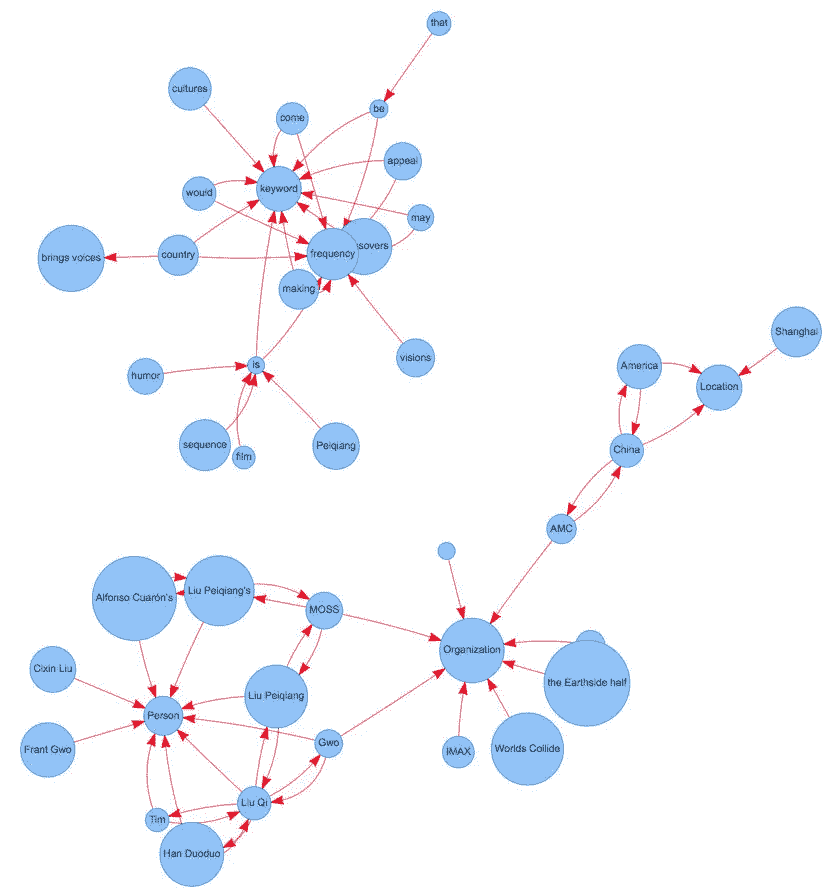

Keywords Extraction with TextRank, NER, etc

# 目录

*   了解 PageRank
*   PageRank 的实现
*   通过 TextRank 提取关键词
*   关键词提取的实现

# 了解 PageRank

关于 PageRank 的文章数不胜数，我就简单介绍一下 PageRank。这有助于我们后面理解 TextRank，因为它是基于 PageRank 的。

PageRank (PR)是一种用于计算网页权重的算法。我们可以把所有的网页看作一个大的有向图。在此图中，节点是一个网页。如果网页 A 具有到网页 B 的链接，它可以被表示为从 A 到 B 的有向边。

在我们构建了整个图之后，我们可以通过下面的公式为网页分配权重。

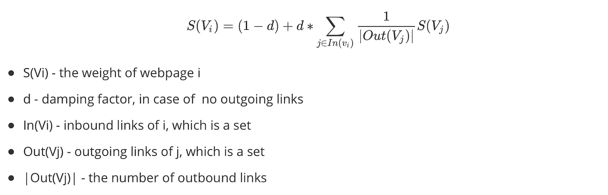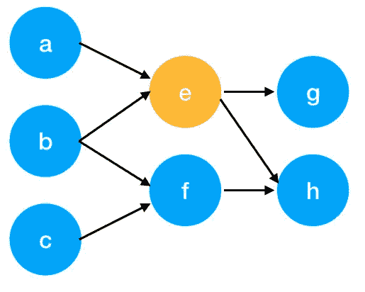

这里有一个例子可以更好地理解上面的符号。我们有一个图表来表示网页之间的链接。每个节点代表一个网页，箭头代表边。我们想得到网页`e`的权重。

我们可以把上面函数中的求和部分改写成一个更简单的版本。

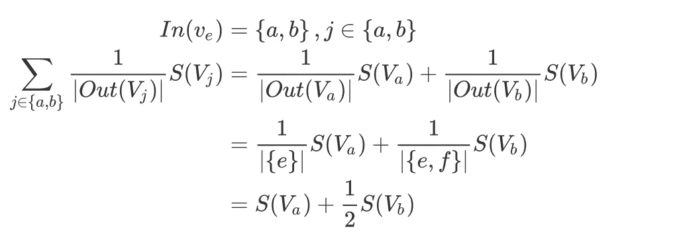

我们可以通过下面的函数得到网页`e`的权重。

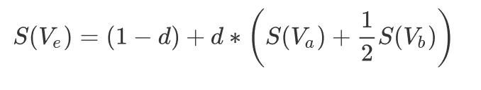

我们可以看到网页`e`的权重依赖于其入站页面的权重。我们需要运行这个迭代很多次来得到最终的权重。在初始化时，每个网页的重要性为 1。

# PageRank 的实现


我们可以用一个矩阵来表示图中 a、b、e、f 之间的入站和出站链路。

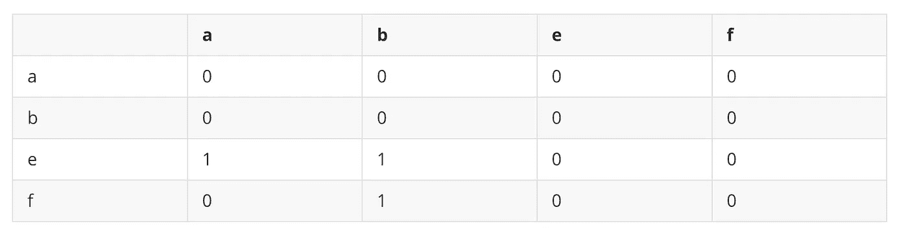

一行中的每个节点表示来自其他节点的入站链接。例如，对于`e`行，节点`a`和`b`具有到节点`e`的出站链接。此演示将简化更新权重的计算。

根据函数中的`1/|Out(Vi)|`，我们应该归一化每一列。

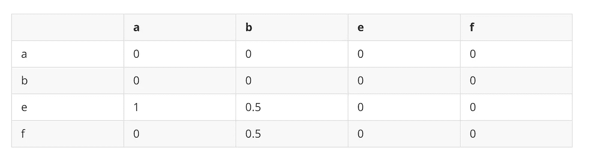

我们用这个矩阵乘以所有节点的权重。

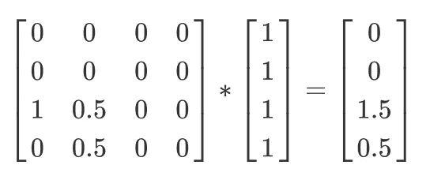

这只是一个没有转储因子`d`的迭代。

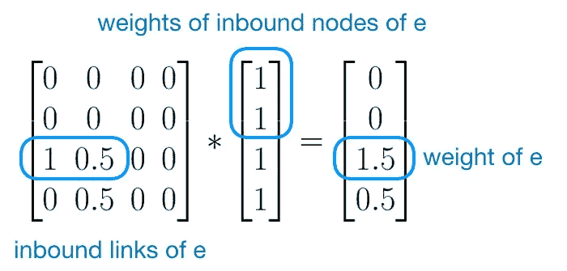

我们可以用 Python 多次迭代。

```
import numpy as npg = [[0, 0, 0, 0],
     [0, 0, 0, 0],
     [1, 0.5, 0, 0],
     [0, 0.5, 0, 0]]g = np.array(g)
pr = np.array([1, 1, 1, 1]) # initialization for a, b, e, f is 1
d = 0.85for iter in range(10):
    pr = 0.15 + 0.85 * np.dot(g, pr)
    print(iter)
    print(pr)
```

输出

```
0
[0.15  0.15  1.425 0.575]
1
[0.15    0.15    0.34125 0.21375]
2
[0.15    0.15    0.34125 0.21375]
3
[0.15    0.15    0.34125 0.21375]
4
[0.15    0.15    0.34125 0.21375]
5
[0.15    0.15    0.34125 0.21375]
6
[0.15    0.15    0.34125 0.21375]
7
[0.15    0.15    0.34125 0.21375]
8
[0.15    0.15    0.34125 0.21375]
9
[0.15    0.15    0.34125 0.21375]
10
[0.15    0.15    0.34125 0.21375]
```

所以 e 的权重(PageRank 值)是 0.34125。

如果我们把有向边改为无向边，我们可以相应地改变矩阵。

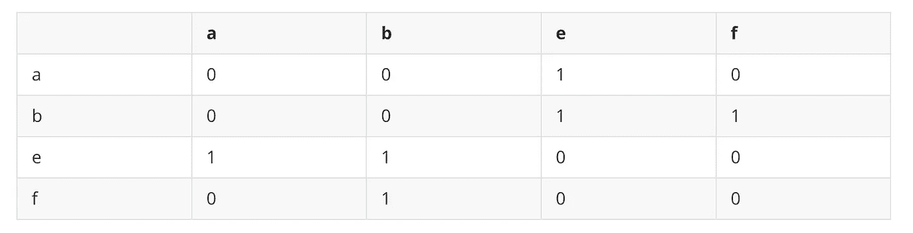

正常化。

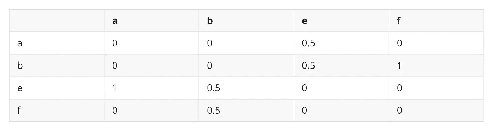

我们应该相应地改变代码。

```
import numpy as npg = [[0, 0, 0.5, 0],
     [0, 0, 0.5, 1],
     [1, 0.5, 0, 0],
     [0, 0.5, 0, 0]]g = np.array(g)
pr = np.array([1, 1, 1, 1]) # initialization for a, b, e, f is 1
d = 0.85for iter in range(10):
    pr = 0.15 + 0.85 * np.dot(g, pr)
    print(iter)
    print(pr)
```

输出

```
0
[0.575 1.425 1.425 0.575]
1
[0.755625 1.244375 1.244375 0.755625]
2
[0.67885937 1.32114062 1.32114062 0.67885937]
3
[0.71148477 1.28851523 1.28851523 0.71148477]
4
[0.69761897 1.30238103 1.30238103 0.69761897]
5
[0.70351194 1.29648806 1.29648806 0.70351194]
6
[0.70100743 1.29899257 1.29899257 0.70100743]
7
[0.70207184 1.29792816 1.29792816 0.70207184]
8
[0.70161947 1.29838053 1.29838053 0.70161947]
9
[0.70181173 1.29818827 1.29818827 0.70181173]
```

所以 e 的权重(PageRank 值)是 1.29818827。

# 通过 TextRank 提取关键词

TextRank 和 PageTank 有什么区别？

简单的回答就是 PageRank 是网页排名，TextRank 是文字排名。PageRank 中的网页就是 TextRank 中的文本，所以基本思路是一样的。

这里我们有一些文字，摘自[这里](https://www.theverge.com/2019/2/9/18218479/the-wandering-earth-review-film-china-first-science-fiction-blockbuster-cixin-liu-gravity-the-core)。我会用空间

我们将一个文档拆分成几个句子，我们只存储那些带有特定 POS 标签的单词。我们使用空间进行词性标注。

```
import spacy
nlp = spacy.load('en_core_web_sm')content = '''
The Wandering Earth, described as China’s first big-budget science fiction thriller, quietly made it onto screens at AMC theaters in North America this weekend, and it shows a new side of Chinese filmmaking — one focused toward futuristic spectacles rather than China’s traditionally grand, massive historical epics. At the same time, The Wandering Earth feels like a throwback to a few familiar eras of American filmmaking. While the film’s cast, setting, and tone are all Chinese, longtime science fiction fans are going to see a lot on the screen that reminds them of other movies, for better or worse.
'''doc = nlp(content)
for sents in doc.sents:
    print(sents.text)
```

我们把这一段分成三句话。

```
The Wandering Earth, described as China’s first big-budget science fiction thriller, quietly made it onto screens at AMC theaters in North America this weekend, and it shows a new side of Chinese filmmaking — one focused toward futuristic spectacles rather than China’s traditionally grand, massive historical epics.At the same time, The Wandering Earth feels like a throwback to a few familiar eras of American filmmaking.While the film’s cast, setting, and tone are all Chinese, longtime science fiction fans are going to see a lot on the screen that reminds them of other movies, for better or worse.
```

因为句子中的大多数单词对确定重要性没有用，所以我们只考虑带名词、定语、动词词性标签的单词。这是可选的，你也可以使用所有单词。

```
candidate_pos = ['NOUN', 'PROPN', 'VERB']
sentences = []
​
for sent in doc.sents:
    selected_words = []
    for token in sent:
        if token.pos_ in candidate_pos and token.is_stop is False:
            selected_words.append(token)
    sentences.append(selected_words)
​
print(sentences)
```

输出

```
[[Wandering, Earth, described, China, budget, science, fiction, thriller, screens, AMC, theaters, North, America, weekend, shows, filmmaking, focused, spectacles, China, epics], [time, Wandering, Earth, feels, throwback, eras, filmmaking], [film, cast, setting, tone, science, fiction, fans, going, lot, screen, reminds, movies]]
```

每个单词都是 PageRank 中的一个*节点*。我们将窗口大小设置为 k。

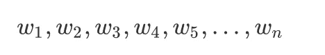

`[w1, w2, …, w_k], [w2, w3, …, w_{k+1}], [w3, w4, …, w_{k+2}]`是窗户。窗口中的任何两个单词对都被认为具有无向边。

我们以`[time, Wandering, Earth, feels, throwback, eras, filmmaking]`为例，设置窗口大小 k=4，那么得到 4 个窗口，`[time, Wandering, Earth, feels]`，`[Wandering, Earth, feels, throwback]`，`[Earth, feels, throwback, eras]`，`[feels, throwback, eras, filmmaking]`。

对于窗口`[time, Wandering, Earth, feels]`，任何两个单词对都有一条无向边。所以我们得到了`(time, Wandering), (time, Earth), (time, feels), (Wandering, Earth), (Wandering, feels), (Earth, feels)`。

基于这个图，我们可以计算每个节点(单词)的权重。最重要的词可以作为关键词。

# 关键词提取的实现

这里我用 Python 实现了一个完整的例子，我们使用 spaCy 来获取单词的 POS 标签。

这个`TextRank4Keyword`实现了我在上一节描述的所有功能。我们可以看到一个段落的输出。

```
text = '''
The Wandering Earth, described as China’s first big-budget science fiction thriller, quietly made it onto screens at AMC theaters in North America this weekend, and it shows a new side of Chinese filmmaking — one focused toward futuristic spectacles rather than China’s traditionally grand, massive historical epics. At the same time, The Wandering Earth feels like a throwback to a few familiar eras of American filmmaking. While the film’s cast, setting, and tone are all Chinese, longtime science fiction fans are going to see a lot on the screen that reminds them of other movies, for better or worse.
'''
​
tr4w = TextRank4Keyword()
tr4w.analyze(text, candidate_pos = ['NOUN', 'PROPN'], window_size=4, lower=False)
tr4w.get_keywords(10)
```

输出

```
science - 1.717603106506989
fiction - 1.6952610926181002
filmmaking - 1.4388798751402918
China - 1.4259793786986021
Earth - 1.3088154732297723
tone - 1.1145002295684114
Chinese - 1.0996896235078055
Wandering - 1.0071059904601571
weekend - 1.002449354657688
America - 0.9976329264870932
budget - 0.9857269586649321
North - 0.9711240881032547
```

> 查看我在[媒体](https://medium.com/@bramblexu)上的其他帖子，有更好的[目录列表视图](https://bramblexu.org/2019/12/01/bramblexu-published-articles-in-medium/)！
> **GitHub:**[**https://github.com/BrambleXu**](https://github.com/BrambleXu) **LinkedIn:**[**www.linkedin.com/in/xu-liang**](https://www.linkedin.com/in/xu-liang-99356891/) **博客:**[**https://bramblexu.org**](https://bramblexu.org/)

# 新闻图表

我还实现了 TextRank，用于从新闻中提取关键字并将其可视化。欢迎检查。

[](https://github.com/BrambleXu/news-graph) [## 树莓徐/新闻图

### 从文本和图形可视化中提取关键信息- BrambleXu/news-graph

github.com](https://github.com/BrambleXu/news-graph) 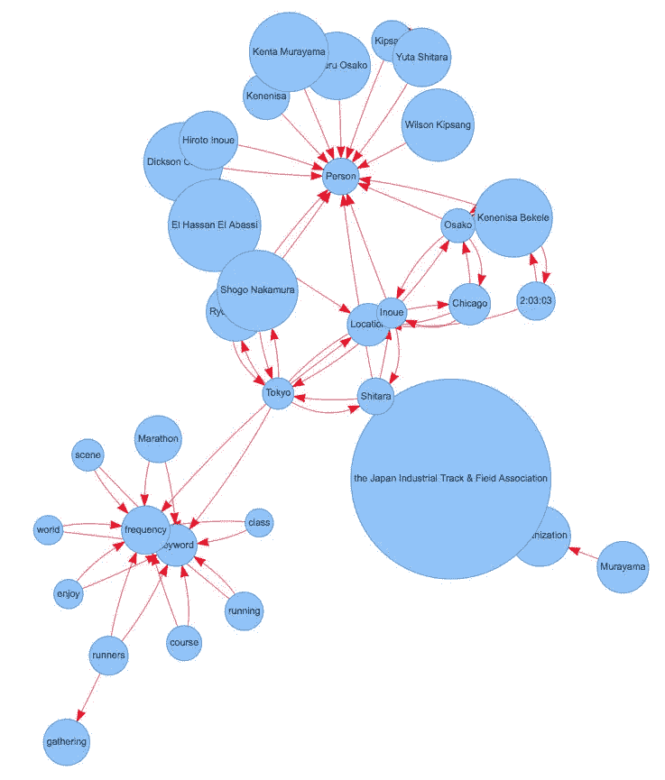

Demo of News Graph

> ***查看我的其他帖子*** [***中等***](https://medium.com/@bramblexu) ***同*** [***一个分类查看***](https://bramblexu.com/posts/eb7bd472/) ***！
> GitHub:***[***bramble Xu***](https://github.com/BrambleXu) ***LinkedIn:***[***徐亮***](https://www.linkedin.com/in/xu-liang-99356891/) ***博客:***[***bramble Xu***](https://bramblexu.com)