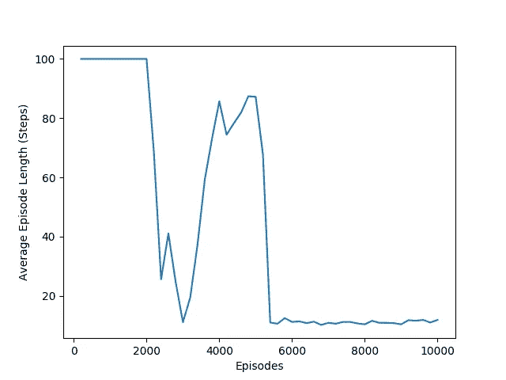

# TF 特工入门教程

> 原文：<https://towardsdatascience.com/tf-agents-tutorial-a63399218309?source=collection_archive---------9----------------------->

在几个月内为我的强化学习管道中的另一个定制环境第三次实现了贪婪动作选择功能之后，我意识到我必须构建一个通用的强化学习框架，我可以在其中插入我的定制环境。幸运的是 Tensorflow 已经在上面了。

本教程将介绍我遇到的一些关于如何将所有 TF-Agents 组合在一起的问题。它是从单个 Collab 笔记本中收集来的，经过反复试验和钻研代码库后建立起来的。

这是给谁的？任何从事强化学习的人，厌倦了每次遇到新问题都要不断构建学习框架。

我要构建的环境是一个网格世界。它将是 6×6 的正方形，代理将从(0，0)开始，在(5，5)结束。代理的目标是找到从起点到终点的路径。代理可以选择的动作有上、下、左、右，用 0 到 3 的整数表示。

在奖励方面，如果代理人在终点着陆，则获得 100 的奖励，否则奖励为 0。如果代理到那时还没有到达终点，游戏将在 100 步处终止。

因此，让我们开始创建自定义网格世界环境，这需要对 PyEnvironment 类进行子类化，如下所示。

Initialization

__init__ 函数必须包含 _action_spec 和 _observation_spec 的定义。由于动作是从 0 → 3 的单个整数，所以形状是一个空元组，它的最小值是 0，最大值是 3。观察值为 4 个整数，最大值和最小值分别为 0 和 5。前两个整数是指玩家的行和列，后两个整数是指赢方的行和列。

Reset

_reset 函数处理游戏结束时发生的事情——状态被重置，episode_ended 被设置为 False。

Step

_step 函数通过采取一个动作并将其应用到当前状态以获得一个新状态来处理状态转换。它测试新状态是否是游戏结束状态，然后返回转换或终止。它还将中间奖励和最终奖励应用于每个州。

Move

move 函数不是强制函数，但用于执行边界检查，然后根据动作更新状态。

Game over

game_over 函数通过比较玩家和获胜方块的行和列来检查游戏是否结束。

既然已经实现了这些定义，我们可以使用以下内置函数测试环境，以确保它符合规范:

Validation

只要没有抛出错误，那么就可以了！

接下来，我们将看看如何设置代理、学习模型、重放缓冲区、驱动程序以及它们如何相互连接。

首先，我们将 Gridworld 环境加载到一个限时包装器中，如果达到 100 步，该包装器将终止游戏。然后，结果被包装在 TF 环境处理程序中。

然后，我们将创建网络、优化器和深度 Q 网络(DQN)代理。在这里，我们决定创建一个具有 100 个隐藏节点的单一隐藏层的网络。对于这种简单的问题，这个设置应该足够了。我使用 Adam 优化器，因为一般来说，这是超越普通随机梯度下降(SGD)的最先进技术。尽管对于这个例子，我认为 SGD 也可以。请随意测试，并在评论中告诉我。

接下来，我们创建重放缓冲区和重放观察器。重放缓冲区用于包含观察和动作对，因此它们可用于训练。这里的参数是:

*   data_spec 是缓冲区中包含的行的形状
*   batch_size，表示保存在重放缓冲区中的批处理的大小
*   max_length 表示在用最新的条目覆盖最旧的条目之前，缓冲区可以容纳多少条记录。

这里需要注意的是，我们使用的 train_env.batch_size 在我们的例子中默认为 1，因为它不是由用户指定的。([第 148 行](https://github.com/tensorflow/agents/blob/master/tf_agents/environments/tf_py_environment.py#L148))

然后，我们从重放缓冲区中创建一个数据集，我们可以遍历该数据集并训练代理。这里使用的参数是:

*   num_parallel_calls 是并行处理的项目数
*   sample_batch_size 是传递给神经网络进行训练的项目数
*   num_steps，指定在返回的批次中作为子批次返回的连续项目数。这对于情节游戏来说非常重要，在这种游戏中，打乱所有数据会导致数据损坏。此处的最小值是 2，因为这样我们将接收子批次的[观察-动作，新观察-动作]进行训练。这是另一个可以调整的变量。

然后，我们希望创建一个驱动程序来模拟游戏中的代理，并将状态、动作、奖励对存储在重放缓冲区中，并跟踪一些指标。

最后，我们进入培训循环，在此循环中，驾驶员正在运行，经验从数据集中提取并用于培训代理。在特定的时间间隔，计算和打印损失和平均回报，并打印每集长度。情节长度应随时间减少，稳定在 10 步。

在这里找到 GridWorld 环境的完整代码[，在这里](https://github.com/sachag678/Reinforcement_learning/blob/master/tf-agents-example/gridworld.py)找到训练设置[的完整代码。](https://github.com/sachag678/Reinforcement_learning/blob/master/tf-agents-example/simulate.py)

下面的图显示，在大约 6000 集之后，代理能够稳定地走 10 步到达获胜的方块。这里要注意的是，因为到达最后的方块是基于代理的随机行为，所以可能在 10000 集里它永远不会到达它，因此永远不知道它在哪里。

Plot of Average Episode Length vs Time

要进一步阅读 TF-Agents，请查看他们的[文档](https://github.com/tensorflow/agents)。

感谢阅读！