# TF-IDF 在真实数据集上用 python 从头开始。

> 原文：<https://towardsdatascience.com/tf-idf-for-document-ranking-from-scratch-in-python-on-real-world-dataset-796d339a4089?source=collection_archive---------0----------------------->

# 目录:

*   什么是 TF-IDF？
*   预处理数据。
*   标题和正文的权重。
*   使用 TF-IDF **匹配分数的文档检索。**
*   利用 TF-IDF **余弦相似度进行文档检索。**


Photo by [Sanwal Deen](https://unsplash.com/@sanwaldeen_sink?utm_source=medium&utm_medium=referral) on [Unsplash](https://unsplash.com?utm_source=medium&utm_medium=referral)

# 简介:TF-IDF

TF-IDF 代表**“词频—逆文档频率”**。这是一种量化一组文档中的单词的技术。我们通常为每个单词计算一个分数，以表示它在文档和语料库中的重要性。该方法是信息检索和文本挖掘中广泛使用的技术。

如果我给你一个句子，比如“这栋楼好高”。我们知道单词和句子的语义，就很容易理解这个句子。但是任何程序(比如:python)如何解读这句话呢？任何编程语言都更容易理解数值形式的文本数据。因此，出于这个原因，我们需要对所有文本进行矢量化，以便更好地表示。

通过对文档进行矢量化，我们可以进一步执行多项任务，例如查找相关文档、排序、聚类等。当您执行 google 搜索时，使用的正是这种技术(现在它们被更新为更新的 transformer 技术)。网页称为文档，用来搜索的文本称为查询。搜索引擎维护所有文档的固定表示。当您使用查询进行搜索时，搜索引擎将找到该查询与所有文档的相关性，按照相关性的顺序对它们进行排序，并向您显示前 k 个文档。所有这些过程都是使用查询和文档的矢量化形式来完成的。

现在回到我们的 TF-IDF，

TF-IDF =术语频率(TF) *逆文档频率(IDF)

## 术语

*   t —术语(单词)
*   d-文档(一组单词)
*   N —语料库的计数
*   语料库—整个文档集

## **词频**

这衡量一个单词在文档中的出现频率。这在很大程度上取决于文档的长度和单词的一般性，例如，一个非常常见的单词如“was”**可以在一个文档中出现多次。但是，如果我们取两个分别具有 100 个单词和 10，000 个单词的文档，则在 10，000 个单词的文档中，常见单词“was”出现的概率较高。但是我们不能说较长的文件比较短的文件更重要。正是因为这个原因，我们对频率值进行了归一化，我们用频率除以文档中的总字数。**

**回想一下，我们需要最终对文档进行矢量化。当我们计划对文档进行矢量化时，我们不能只考虑特定文档中出现的单词。如果我们这样做，那么两个文档的向量长度将会不同，并且计算相似性是不可行的。因此，我们所做的是将 **vocab** 上的文档矢量化。Vocab 是语料库中所有可能世界的列表。**

**我们需要所有词汇的字数和文档的长度来计算 TF。如果某个特定文档中不存在该术语，则该特定文档的特定 TF 值将为 0。在一个极端的情况下，如果文档中的所有单词都相同，那么 TF 将为 1。归一化的 TF 值的最终值将在[0 到 1]的范围内。0，1 包括在内。**

**TF 对于每个文档和单词都是独立的，因此我们可以将 TF 表述如下:**

> **tf(t，d)= d 中 t 的计数/d 中的字数**

**如果我们已经计算了 TF 值，并且如果这产生了文档的矢量化形式，为什么不仅仅使用 TF 来寻找文档之间的相关性呢？我们为什么需要英特尔信息技术峰会？**

**让我解释一下，像“是”、“是”这样最常见的词会有很高的值，赋予这些词很高的重要性。但是用这些词来计算相关性会产生不好的结果。这类常用词被称为停用词。虽然我们将在稍后的预处理步骤中删除停用词，但是更理想的是在文档中找到该词的存在，并以某种方式减少它们的权重。**

## ****文档频率****

**这个衡量文档在一整套语料库中的重要性。这与 TF 非常相似，但唯一的区别是 TF 是文档 d 中术语 t 的频率计数器，而 DF 是术语 t 在文档集 n 中出现**次**的计数。换句话说，DF 是该单词出现在其中的文档的数量。如果该术语在文档中至少出现一次，我们就认为出现了一次，我们不需要知道该术语出现的次数。**

> **df(t)= t 在 N 个文档中的出现次数**

**为了保持这也在一个范围内，我们通过除以文档总数来标准化。我们的主要目标是知道一个术语的信息量，DF 是它的精确逆。这就是我们反转 DF 的原因**

## ****逆文档频率****

**IDF 是衡量术语 t 的信息量的文档频率的倒数。当我们计算 IDF 时，对于最常出现的单词(如停用词)来说，IDF 将非常低(因为它们出现在几乎所有的文档中，并且 N/df 将给予该单词非常低的值)。这最终给出了我们想要的相对权重。**

> **idf(t) = N/df**

**现在 IDF 有一些其他问题，当我们有一个大的语料库规模，比如 N=10000，IDF 值会爆炸。因此，为了抑制这种影响，我们采用了 IDF 的日志。**

**在查询时，当单词不在 vocab 中时，它将被忽略。但是在少数情况下，我们使用固定的 vocab，并且 vocab 中的一些单词可能在文档中不存在，在这种情况下，df 将是 0。因为我们不能被 0 整除，所以我们通过在分母上加 1 来平滑这个值。**

> **idf(t) = log(N/(df + 1))**

**最后，通过取 TF 和 IDF 的乘积值，我们得到 TF-IDF 分数。TF-IDF 有许多不同的版本，但是现在，让我们集中在这个基本版本上。**

> **tf-idf(t，d) = tf(t，d) * log(N/(df + 1))**

# **关于我:**

**我是 NLP 和 DL 领域的高级数据科学家和 AI 研究员。
联系我: [Twitter](https://twitter.com/PWilliamScott) ， [LinkedIn](https://www.linkedin.com/in/williamscottp/) 。**

# **在真实数据集上实现**

**现在我们已经了解了什么是 TF-IDF，让我们来计算数据集的相似性得分。**

**我们将要使用的数据集是几个故事的存档，这个数据集有许多不同格式的文档。下载数据集，打开你们的笔记本，我指的是 Jupyter 笔记本😜。**

**数据集链接:[http://archives.textfiles.com/stories.zip](http://archives.textfiles.com/stories.zip)**

## **步骤 1:分析数据集**

**任何机器学习任务的第一步都是分析数据。因此，如果我们查看数据集，乍一看，我们会看到所有包含英文单词的文档。每个文档都有不同的名称，其中有两个文件夹。**

**现在一个重要的任务是识别正文中的标题，如果我们分析文档，有不同的标题排列模式。但是大多数标题都是居中对齐的。现在我们需要想办法提取标题。但是在我们全力以赴开始编码之前，让我们稍微深入分析一下数据集。**

**花几分钟时间自己分析数据集。尝试探索…**

**经过进一步检查，我们可以注意到每个文件夹(包括根目录)中都有一个 index.html，其中包含所有的文档名及其标题。因此，让我们认为自己是幸运的，因为标题是给我们的，而不是穷尽地从每个文件中提取标题。**

## **步骤 2:提取标题和正文:**

**没有具体的方法来做到这一点，这完全取决于手头的问题陈述和我们对数据集所做的分析。**

**因为我们已经发现标题和文档名在 index.html 中，所以我们需要提取这些名称和标题。我们很幸运，index.html 有标签，我们可以使用模式提取我们需要的内容。**

**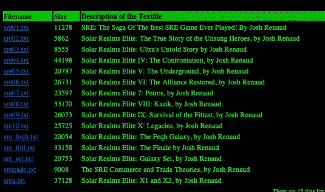**

**在我们开始提取标题和文件名之前，因为我们有不同的文件夹，首先让我们抓取文件夹，以便稍后一次性读取所有 index.html 文件。**

```
[x[0] for x in os.walk(str(os.getcwd())+’/stories/’)]
```

**os.walk 提供了目录中的文件，os.getcwd 提供了当前目录和标题，我们将在当前目录+ stories 文件夹中进行搜索，因为我们的数据文件位于 stories 文件夹中。**

> **总是**假设**你正在处理一个巨大的数据集，这有助于自动化代码。**

**现在我们可以发现，**文件夹**给了根文件夹额外的 **/** ，所以我们要删除它。**

```
folders[0] = folders[0][:len(folders[0])-1]
```

**上面的代码删除了文件夹中第 0 个索引的最后一个字符，这是根文件夹**

**现在，让我们遍历所有的 index.html，提取它们的标题。要做到这一点，我们需要找到一种模式来去掉标题。由于这是在 html 中，我们的工作会简单一点。**

**让我想想…**

**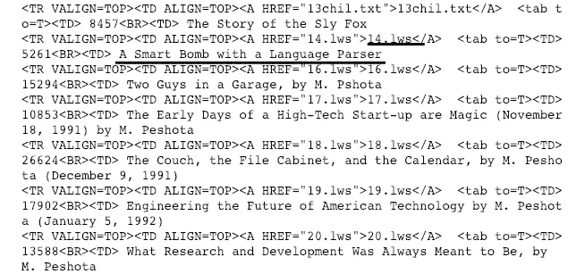**

**我们可以清楚地观察到，每个文件名都被括在( **> <)和( **"** ) 之间，每个标题都在**(**<BR><TD>**)和( **\n** )之间******

**我们将使用简单的正则表达式来检索名称和标题。以下代码给出了与该模式匹配的所有值的列表。因此 names 和 titles 变量包含了所有名字和头衔的列表。**

```
names = re.findall(‘><A HREF=”(.*)”>’, text)
titles = re.findall(‘<BR><TD> (.*)\n’, text)
```

**现在我们已经有了从索引中检索值的代码，我们只需要迭代所有的文件夹，并从所有 index.html 文件中获取标题和文件名**

> **-从索引文件中读取文件**
> 
> **-提取标题和名称**
> 
> **-迭代到下一个文件夹**

```
dataset = []for i in folders:
    file = open(i+"/index.html", 'r')
    text = file.read().strip()
    file.close() file_name = re.findall('><A HREF="(.*)">', text)
    file_title = re.findall('<BR><TD> (.*)\n', text)

    for j in range(len(file_name)):
        dataset.append((str(i) + str(file_name[j]), file_title[j]))
```

**这将准备数据集的索引，数据集是文件位置及其标题的元组。有一个小问题，根文件夹 index.html 也有文件夹及其链接，我们需要删除这些。**

**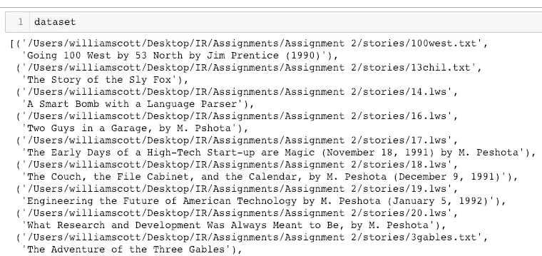**

**只需使用条件检查器来删除它。**

```
if c == False:
    file_name = file_name[2:]
    c = True
```

# **第三步:预处理**

**预处理是我们处理任何文本模型的主要步骤之一。在此阶段，我们必须查看数据的分布情况，需要什么技术以及应该清理多深。**

**这一步从来没有一个统一的规则，完全取决于问题陈述。几个强制性的预处理是:转换成小写，删除标点符号，删除停用词和词干。在我们的问题陈述中，基本的预处理步骤似乎就足够了。**

## **小写字母**

**在文本处理过程中，每个句子被拆分成单词，每个单词被视为预处理后的一个标记。编程语言认为文本数据是敏感的，这意味着**与**不同。**我们人类知道这两者属于同一个标记，但是由于字符编码，它们被认为是不同的标记。转换成小写是一个非常强制性的预处理步骤。因为我们的所有数据都在列表中，所以 numpy 有一个方法可以立刻将列表转换成小写。****

```
np.char.lower(data)
```

## **停止言语**

**停用词是最常见的不会给文档向量带来任何附加值的词。事实上，删除这些将增加计算和空间效率。nltk 库有一个下载停用词的方法，所以我们可以直接使用 nltk 库，遍历所有的词并删除停用词，而不是自己显式地提到所有的停用词。有许多有效的方法可以做到这一点，但我只给出一个简单的方法。**

**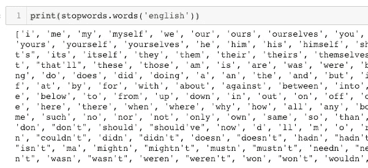**

**我们将遍历所有的停用词，如果是停用词，就不把它们追加到列表中**

```
new_text = ""
for word in words:
    if word not in stop_words:
        new_text = new_text + " " + word
```

## **标点**

**标点符号是语料库文档中不必要的符号集。我们应该对我们所做的事情小心一点，可能会有一些问题，比如预处理后 us-us“United Stated”被转换为“us”。连字符和通常应小心处理。但是对于这个问题陈述，我们将删除它们**

```
symbols = "!\"#$%&()*+-./:;<=>?@[\]^_`{|}~\n"
for i in symbols:
    data = np.char.replace(data, i, ' ')
```

**我们将所有的符号存储在一个变量中，并迭代该变量，删除整个数据集中的特定符号。我们在这里使用 numpy，因为我们的数据存储在一个列表列表中，numpy 是我们的最佳选择。**

## **撇号**

**注意标点符号中没有撇号。因为当我们首先删除标点符号时，它会将 don't 转换为 dont，并且它是一个不会被删除的停用词。我们要做的是，首先删除停用词，然后是符号，最后重复停用词删除，因为少数词可能仍然有撇号，而不是停用词。**

```
return np.char.replace(data, "'", "")
```

## **单个字符**

**单个字符在了解文档的重要性方面没有太大用处，并且少数最后的单个字符可能是不相关的符号，所以删除单个字符总是好的。**

```
new_text = ""
for w in words:
    if len(w) > 1:
       new_text = new_text + " " + w
```

**我们只需要迭代所有的单词，如果长度不大于 1，就不追加单词。**

## **堵塞物**

**这是预处理的最后也是最重要的部分。词干处理将单词转换成词干。**

**例如， **playing 和 played** 是同一类型的词，基本上表示一个动作 **play。**斯特梅尔正是这样做的，它将单词简化为词干。我们将使用一个名为 porter-stemmer 的库，它是一个基于规则的词干分析器。波特-斯特梅尔识别并移除单词的后缀或词缀。词干分析器给出的单词不需要有几次是有意义的，但是它将被识别为模型的单个标记。**

**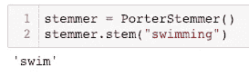**

## **引理满足**

**引理化是一种将单词简化为单词的根同义词的方法。与词干提取不同，词汇匹配确保缩减后的单词再次成为词典中的单词(同一种语言中的单词)。WordNetLemmatizer 可用于对任何单词进行词汇化。**

## **词干化与词汇化**

**词干-不必是字典中的单词，根据一些规则删除前缀和词缀**

**词汇化——将成为词典中的一个词。简化为词根同义词。**

**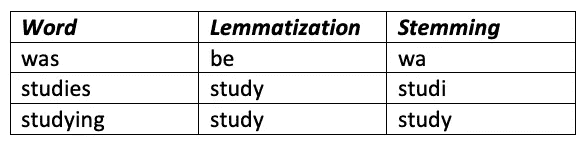**

**一个更有效的方法是先用引理，然后用词干，但是对于一些问题语句，单独用词干也可以，这里我们不使用引理。**

## **转换数字**

**当用户给出诸如 **100 美元**或**100 美元的查询时。**对于用户来说，这两个搜索词是相同的。但是我们的 IR 模型将它们分开处理，因为我们将 100 美元、100 元作为不同的代币存储。因此，为了使我们的红外模式更好一点，我们需要将 100 转换为 100。为了实现这一点，我们将使用一个名为 **num2word** 的库。**

**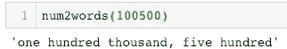**

**如果我们看一下上面的输出，它给出了一些符号和句子，如“一百个 ***和*** 两个”，但是该死的我们刚刚清理了我们的数据，那么我们该如何处理呢？不用担心，我们将在将数字转换为单词后再次运行标点和停止单词。**

## **预处理**

**最后，我们将把所有这些预处理方法放入另一个方法中，我们称之为预处理方法。**

```
def preprocess(data):
    data = convert_lower_case(data)
    data = remove_punctuation(data)
    data = remove_apostrophe(data)
    data = remove_single_characters(data)
    data = convert_numbers(data)
    data = remove_stop_words(data)
    data = stemming(data)
    data = remove_punctuation(data)
    data = convert_numbers(data)
```

**如果仔细观察，一些预处理方法会再次重复。正如所讨论的，这只是帮助清理数据的一点点深度。现在我们需要阅读文档，并将它们的标题和正文分开存储，因为我们以后会用到它们。在我们的问题陈述中，我们有非常不同类型的文档，由于编码兼容性，这可能会导致阅读文档时出现一些错误。要解决这个问题，只需在 open()方法中使用 encoding="utf8 "，errors='ignore'。**

## **步骤 3:计算 TF-IDF**

**回想一下，我们需要给标题和正文不同的权重。现在我们该如何处理这个问题呢？在这种情况下，TF-IDF 的计算将如何进行？**

**给标题和正文不同的权重是一种非常常见的方法。我们只需要把文档看作 body + title，使用它我们可以找到 vocab。并且我们需要给标题中的单词不同的权重，给正文中的单词不同的权重。为了更好地解释这一点，让我们考虑一个例子。**

**title = "这是一篇小说论文"**

**body = "本文由许多论文的综述组成"**

**现在，我们需要计算身体和标题的 TF-IDF。暂时让我们只考虑单词 **paper** ，而忘记删除停用词。**

**题目中 word **paper** 的 TF 是多少？1/4?**

**不，是 3/13。怎么会？word paper 在标题和正文中出现 3 次，标题和正文的总字数为 13。正如我之前提到的，我们只是**认为**标题中的单词具有不同的权重，但是在计算 TF-IDF 时，我们仍然考虑整个文档。**

**那么**论文**无论是标题还是正文的 TF 都是一样的？对，是一样的！这只是我们要给出的重量差。如果这个词同时出现在标题和正文中，那么 TF-IDF 值不会有任何减少。如果这个单词只出现在标题中，那么这个特定单词的正文的权重就不会加到这个单词的 TF 中，反之亦然。**

> **文档=正文+标题**
> 
> **TF-IDF(文档)= TF-IDF(标题)* alpha + TF-IDF(正文)* (1-alpha)**

## **计算 DF**

**让我们聪明点，事先算算 DF。我们需要遍历所有文档中的所有单词，并存储每个单词的文档 id。为此，我们将使用字典，因为我们可以将单词用作键，将一组文档用作值。我提到 set 是因为，即使我们试图多次添加文档，set 也不会只接受重复的值。**

```
DF = {}
for i in range(len(processed_text)):
    tokens = processed_text[i]
    for w in tokens:
        try:
            DF[w].add(i)
        except:
            DF[w] = {i}
```

**如果单词还没有集合，我们将创建一个集合，否则将它添加到集合中。try 块检查这种情况。这里 processed_text 是文档的主体，我们将对标题重复同样的操作，因为我们需要考虑整个文档的 DF。**

> **len(DF)将给出独特的单词**

**DF 将单词作为键，文档 id 列表作为值。但是对于 DF，我们实际上不需要文档列表，我们只需要计数。所以我们要用它的计数来替换这个列表。**

**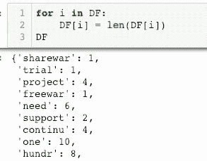**

**这就是我们需要的所有单词的数量。为了在我们的词汇表中找到全部的唯一单词，我们需要使用 DF 的所有关键字。**

**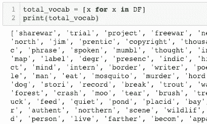**

## **计算 TF-IDF**

**回想一下，我们需要为标题和正文保持不同的权重。为了计算正文或标题的 TF-IDF，我们需要同时考虑标题和正文。为了使我们的工作简单一点，让我们使用一个字典，将*(文档，令牌)*对作为键，将任何 TF-IDF 分数作为值。我们只需要迭代所有文档，我们可以使用 Coutner，它可以给出令牌的频率，计算 tf 和 idf，最后作为(doc，token)对存储在 tf_idf 中。tf_idf 字典是针对正文的，我们将使用相同的逻辑为标题中的单词构建一个字典 tf_idf_title。**

```
tf_idf = {}
for i in range(N):
    tokens = processed_text[i]
    counter = Counter(tokens + processed_title[i])
    for token in np.unique(tokens):
        tf = counter[token]/words_count
        df = doc_freq(token)
        idf = np.log(N/(df+1))
        tf_idf[doc, token] = tf*idf
```

**来计算不同的权重。首先，我们需要维护一个值 alpha，它是主体的权重，那么显然 1-alpha 将是标题的权重。现在让我们深入研究一下数学，我们讨论过，如果一个单词同时出现在正文和标题中，那么这个单词的 TF-IDF 值将是相同的。我们将维护两个不同的 tf-idf 字典，一个用于正文，一个用于标题。**

**我们要做的是聪明一点，我们会为身体计算 TF-IDF；全身 TF-IDF 值乘以α；迭代标题中的标记；替换(文档，令牌)对的正文 TF-IDF 值中的标题 TF-IDF 值。花些时间来处理这个:P**

> **流量:**
> 
> **-计算所有文档正文的 TF-IDF**
> 
> **-计算所有文档标题的 TF-IDF**
> 
> **-将主体 TF-IDF 乘以α**
> 
> **-Iterate Title IF-IDF for every(doc，token)**
> 
> **—如果标记在正文中，请将正文(文档，标记)值替换为标题(文档，标记)中的值**

**我知道这一开始并不容易理解，但还是让我解释一下为什么上面的流程有效，因为我们知道如果标记在两个地方，那么主体和标题的 tf-idf 将是相同的，我们对主体和标题使用的权重总和为 1**

**TF-IDF = body _ TF-IDF * body _ weight+title _ TF-IDF * title _ weight**

**body_weight + title_weight = 1**

**当一个令牌同时出现在这两个地方时，那么最终的 TF-IDF 将与获取 body 或 title tf_idf 相同。这正是我们在上面的流程中所做的。最后，我们有一个字典 tf_idf，它的值是(doc，token)对。**

# **步骤 4:使用匹配分数排名**

**匹配分数是计算相似性的最简单的方法，在这种方法中，我们为每个文档添加查询中标记的 tf_idf 值。例如，对于查询“hello world ”,我们需要检查每个文档中是否存在这些单词，如果存在，那么 tf_idf 值将被添加到特定 doc_id 的匹配分数中。最后，我们将排序并取前 k 个文档。**

**上面提到的是理论概念，但由于我们使用字典来保存数据集，我们要做的是迭代字典中的所有值，并检查该值是否存在于令牌中。因为我们的字典是一个(document，token)键，所以当我们在查询中找到一个 token 时，我们会将文档 id 和 tf-idf 值一起添加到另一个字典中。最后，我们将只取前 k 个文档。**

```
def matching_score(query):
    query_weights = {}
    for key in tf_idf: 
        if key[1] in tokens:
            query_weights[key[0]] += tf_idf[key]
```

**密钥[0]是文档 id，密钥[1]是令牌。**

# **步骤 5:使用余弦相似度排序**

**当我们有一个完美工作的**匹配分数**时，为什么我们还需要余弦相似度？虽然**匹配分数**给出了相关的文档，但是当我们给出长的查询时，它很失败，它将不能正确地对它们进行排序。余弦类似地做的是，它将所有文档标记为 tf-idf 令牌的向量，并测量余弦空间中的相似性(向量之间的角度。少数情况下，查询长度会很短，但它可能与文档密切相关。在这种情况下，余弦相似性是找到相关性的最佳方法。**

**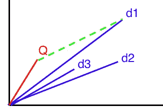**

**观察上面的图，蓝色向量是文档，红色向量是查询，我们可以清楚地看到，尽管文档 d1 的曼哈顿距离(绿线)非常高，但查询仍然接近文档 d1。在这种情况下，余弦相似度会更好，因为它考虑了这两个向量之间的角度。但是匹配分数将返回文档 d3，但是这不是非常密切相关的。**

> **匹配分数计算曼哈顿距离(从尖端开始的直线)
> 余弦分数考虑向量的角度。**

## **…向量化…**

**要计算上述任何一项，最简单的方法是将所有内容转换为矢量，然后计算余弦相似度。因此，让我们将查询和文档转换成向量。我们将使用 total_vocab 变量来为每个标记生成一个索引，该变量包含所有唯一标记的列表，我们将使用 numpy of shape (docs，total_vocab)来存储文档向量。**

```
# Document Vectorization
D = np.zeros((N, total_vocab_size))
for i in tf_idf:
    ind = total_vocab.index(i[1])
    D[i[0]][ind] = tf_idf[i]
```

**对于 vector，我们需要计算 TF-IDF 值，我们可以从查询本身计算 TF，并且我们可以利用我们为文档频率创建的 DF。最后，我们将在一个(1，vocab_size) numpy 数组中存储 tf-idf 值，令牌的索引将从 total_voab 列表中决定**

```
Q = np.zeros((len(total_vocab)))
counter = Counter(tokens)
words_count = len(tokens)
query_weights = {}
for token in np.unique(tokens):
    tf = counter[token]/words_count
    df = doc_freq(token)
    idf = math.log((N+1)/(df+1))
```

**现在，我们要做的就是计算所有文档的余弦相似度，并返回最大的 k 个文档。余弦相似度定义如下。**

> **np.dot(a，b)/(norm(a)*norm(b))**

# **分析**

**我从 doc_id **200** (对我来说)中取了文本，在匹配得分和余弦相似度两方面粘贴了一些长查询和短查询的内容。**

## **简短查询**

**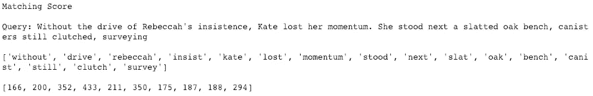****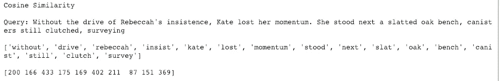**

## **长查询**

**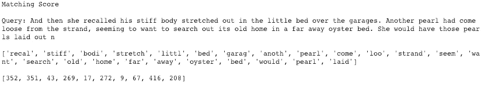****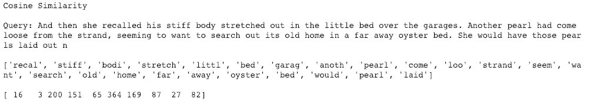**

**正如我们可以从上面的文档中看到的，余弦方法总是比匹配方法得到更高的评价，这是因为余弦相似性学习了更多的上下文。**

## **关于我:**

**我是 NLP 和 DL 领域的高级数据科学家和 AI 研究员。
愿意联系: [Twitter](https://twitter.com/PWilliamScott) ， [LinkedIn](https://www.linkedin.com/in/williamscottp/) 。**

## **自己试试。[点击此处](https://github.com/williamscott701/Information-Retrieval/blob/master/2.%20TF-IDF%20Ranking%20-%20Cosine%20Similarity%2C%20Matching%20Score/TF-IDF.ipynb)进行 git 回购。**

## **使用的库**

*   **nltk，numpy，re，mat，num2words**

# **信息检索系列:**

*   **[1。简介](https://medium.com/@williamscott701/introduction-to-information-retrieval-series-436082826197)**
*   **[2。单字索引&位置索引](https://medium.com/@williamscott701/information-retrieval-unigram-postings-and-positional-postings-a28b907c4e8)**
*   **3.TF-IDF**
*   **更多即将推出…**